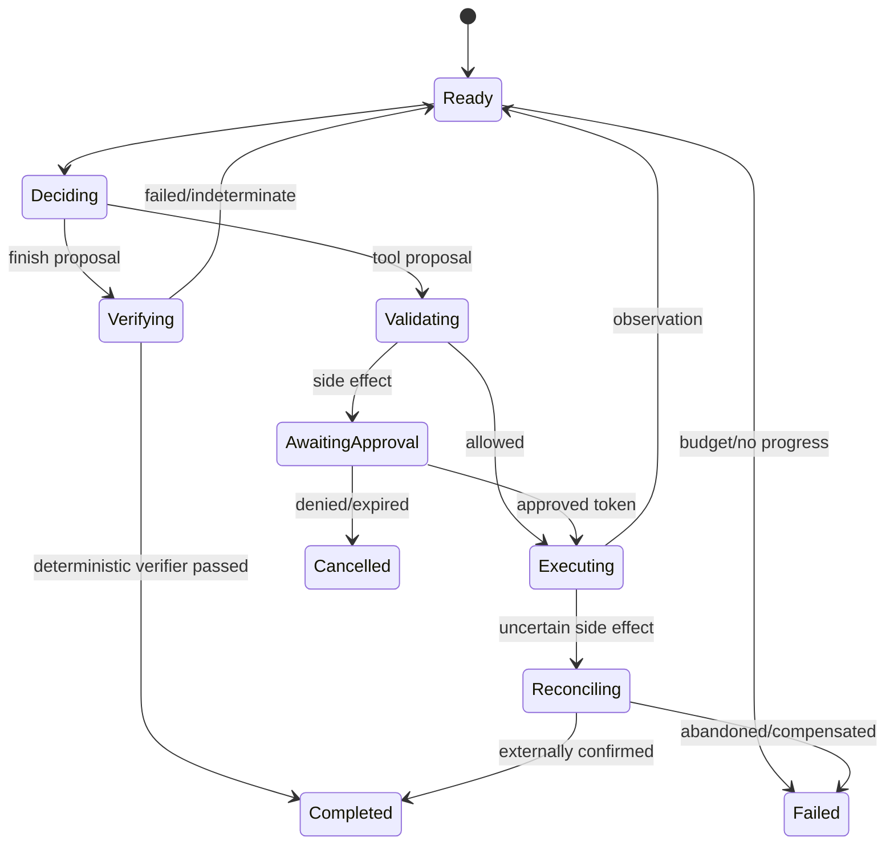

# Agent 架构、规划与记忆

<!-- learning-contract -->

**学习导航**

- **适合读者**：Agent 架构、平台和状态管理工程师。
- **先修**：[Agent 总览](agents.md)和基本状态机；无框架前置要求。
- **首次阅读**：Agent/Workflow → 控制循环 → 状态与记忆 → 停止 → verifier。
- **完成信号**：能画 typed state machine，并写可测试的完成判定。
- **卡住时**：先用[Safe Agent 最小路径](../practice/projects/safe-agent.md#run)观察 trace。

Agent 的核心不是更长的 prompt，而是一个把不确定决策放进确定性控制面的系统。语言模型可以建议下一步，runtime 决定是否允许、如何执行、何时停止以及如何恢复。先把工作流画成状态机，再决定哪些状态转换真的需要模型。

## Agent、Workflow 与普通程序

用三个维度判断是否需要 Agent：

- 路径是否开放：步骤能否预先枚举？
- 输入是否非结构化：是否需要理解自然语言、页面或文件？
- 错误是否可承受：错误动作能否检测、撤销或审批？

固定报表 ETL 应用普通代码；有限分支的客服流用 workflow/router；开放研究、代码修改或跨工具调查才可能需要 agent loop。Agent 增加模型调用、不可重复性和攻击面，不是默认架构。

## 控制循环

一个可恢复循环包含：

1. Observe：读取已验证状态和最新工具结果。
2. Decide：模型输出结构化 `action | finish | escalate`。
3. Validate：schema、权限、预算、前置条件和政策。
4. Execute：通过幂等执行层调用工具。
5. Record：持久化输入、决策、结果和版本。
6. Stop check：完成、失败、超时、无进展或需人工。

模型不应直接持有数据库/云 SDK。即使 provider 支持 function calling，它也只产生 ToolCall proposal。

## 规划模式

### ReAct

模型交替输出 reasoning/action，适合步骤未知、反馈频繁的任务。缺点是每步重新解释上下文，容易循环、受恶意 observation 影响。生产中只存必要的结构化 rationale，不依赖不可见 chain-of-thought 作为审计依据。

### Plan-and-execute

先产出任务图或步骤列表，再由 executor 执行。优势是可预览、并行和估算成本；缺点是环境变化会使计划过时。每步后检查前置条件，允许局部 replan，不把原计划当授权。

### Router 与有限状态机

模型只选择预定义 intent/branch，业务代码控制顺序。它通常比开放 loop 更可靠，是高风险流程的首选。路由输出要有 `unknown/escalate`，不能强迫每个输入进入某类。

### Tree/Graph search

生成多个候选思路、评分、展开或回溯，适合搜索空间可模拟且有 verifier 的数学、代码或规划任务。分支数乘深度会迅速增加成本；评分模型可能与生成器共享偏差。必须设置 node/token/time budget 和 transposition 去重。

### 多 Agent

只有当工具/权限隔离、上下文隔离、真正并行或独立评审有价值时才拆分。多个使用同一模型和 prompt 的“角色”并不独立；它们可能相关地犯错。定义通信 schema、所有权、最大 handoff、冲突解决和最终责任者。

## 任务与状态模型

不要只把 chat history 当状态。持久状态可包括：

~~~text
Task {
  task_id, user_id, objective, constraints,
  status, step, budgets, policy_version,
  observations[], artifacts[], pending_calls[],
  created_at, updated_at, version
}
~~~

用 optimistic concurrency 或单 writer 防止并发 agent 覆盖状态。大工具结果放对象存储，context 只保留摘要、schema 和 artifact reference；摘要必须回链原始结果。

### Event sourcing

将 `TaskCreated / DecisionProposed / ToolApproved / ToolCompleted / StateUpdated` 作为追加事件，便于审计和重放。当前状态由事件折叠得到。敏感内容仍需加密和删除策略；“不可变日志”不能成为逃避隐私删除的理由。

## 记忆系统

### Working memory

当前任务的短期状态。上下文超长时按 relevance、recency、authority 和任务阶段选择，不是简单保留最近 N 条。

### Episodic memory

过去事件：“用户上次选择了方案 A”。保留时间、主体和来源。一次失败推断不能自动升级为长期事实。

### Semantic memory

从多次交互抽取的稳定偏好/事实。写入前可要求用户确认；记录 confidence、source events、过期时间和适用 scope。

### Procedural memory

技能、操作手册和成功轨迹。它本质上是版本化知识库/策略，不应由单次模型输出未经评审地自我修改。

记忆读取执行 tenant/user ACL；写入有 schema、去重、冲突和删除。评测既测 recall，也测“是否不该记住”和跨用户隔离。

## Context engineering

Agent context 通常包括 system policy、工具 schema、任务状态、相关记忆、最近 observation 和 artifact 摘要。每一类有独立 token budget。工具描述过多会降低选择精度，可先确定性筛选或由低风险 router 选择 tool subset。

工具输出作为不可信数据包裹，包含 tool name、call id、status、provenance 和 payload。对网页/文档中的指令做数据标记；不要将整个 HTML、终端日志或数据库 dump 无界塞回模型。

## 停止条件

至少包含最大步骤、模型 token、工具调用、wall time、费用和外部资源预算。更关键的是无进展：

- 连续产生同一 fingerprint 的动作；
- 状态/已解决子目标没有变化；
- 在两个状态间循环；
- 连续工具错误属于同一原因；
- verifier 分数多轮无提升。

停止后返回已完成内容、未完成原因、待用户选择和可恢复 task id。不能用“继续尝试”无限消耗预算。

预算的计数边界必须可审计。step 计 planner decision，不等于 handler attempt；cache、policy 拒绝和审批暂停仍消耗一次 decision。模型 token/费用通常只能在一次模型响应返回后取得，因此某次响应可能让累计值越过上限：控制面应记录这次 supplied/provider usage，但拒绝执行随响应产生的 action。wall-time 是本地 monotonic deadline；同步 provider/tool 已经开始后通常不能保证硬抢占，返回后仍要检查 deadline，远端副作用则按 pending/reconciliation 协议处理。

循环检测也不是一个布尔量：连续相同 action fingerprint、最近四步的 `A/B/A/B`、以及相同 error key 连续出现是不同终止原因。相同失败动作同时满足多个条件时，本仓库 reference 先报告 repeated action；它只检查有限窗口和字节级 fingerprint，不能发现任意长周期、状态无进展或语义等价但写法不同的动作。

## Verifier 与完成判定

模型说“完成”不是完成。根据任务使用确定性 verifier：测试通过、文件存在、JSON Schema、数据库状态、引用覆盖。开放任务可用 rubric judge，但要在人工集校准。完成条件在执行前定义，并与用户目标绑定。

代码 Agent 的证据链例如：改动 diff → 静态检查 → 目标测试 → 全量相关测试 → 尚未验证项。测试下载成功不等于功能正确，生成文件存在不等于内容符合要求。

本仓库 typed loop 把 `finish` 视为 proposal：只有 `CompletionVerifier` 返回 `PASSED` 才产生 `completed=true` 和 `final_answer`；`FAILED/INDETERMINATE` 回到 planner，verifier 异常或错误返回类型则 fail closed。`escalated`、预算耗尽、循环停止、runtime error 和 `needs_approval` 都不是任务成功。

审批暂停会生成严格 JSON checkpoint，绑定 task/subject/tenant、原 loop 预算、累计 model token/cost/active wall time、handler/runtime 计数与原 `max_tool_calls`、历史 action、pending decision 与 execution fingerprint。恢复先用当前 capability/policy 重新授权并执行原 pending decision，不再次请求 planner，也不重复累计该 decision 的 token/cost；旧 subject/task/tenant、未恢复/扩大的 runtime counter 或 cap、过期或漂移的 approval 都 fail closed。恢复后的状态把同一步 `needs_approval` 转为实际 outcome，而不是把一次 decision 伪计为两步。

这仍不是持久化工作流服务：checkpoint 的 SHA-256 只检测 canonical 内容漂移，不提供签名/MAC；JSON 文件与 SQLite ledger 没有原子事务；CLI 将等待审批的 downtime 排除在 active monotonic wall time 之外；未来 planner/provider 会话状态、一次性审批消费、并发 lease、checkpoint 机密性和 retention 仍需外部控制面负责。生产系统还应有独立的绝对 task deadline，不能靠 active-time budget 限制用户等待时间。

### 副作用投递与 workflow 恢复不是同一层

Checkpoint 回答“planner 恢复到哪一步”，transactional outbox 回答“已在本地批准的 effect 怎样可靠投递”。生产设计通常先在一个业务事务中写 task state 与 outbox row，再由独立 worker 用 lease 投递；worker restart 不应重新调用 planner。provider 成功但本地 ack 前崩溃会导致 at-least-once redelivery，因此稳定 `effect_id` 必须穿透为 provider idempotency key。lease 防并发领取，不提供远端 exactly-once；provider receipt 也是 supplied artifact，不自动等于 effect verifier。dead letter 必须进入 operator/runbook，而不是让模型决定无限重试。

仓库 SQLite reference 可验证单机事务、并发 claim、lease expiry、stale ack 拒绝和模拟幂等 provider 去重；不验证分布式 broker、跨数据库原子性、真实网络/provider 或跨区域恢复。

可运行的 `ScriptedPlanner` 只读取冻结 JSONL decision，不调用模型；精确 verifier 只验证答案、evidence call id 与本地 completed/cached observation：

~~~powershell
python -m about_llm.agents.cli loop `
  --cases projects/safe-agent/loop.example.jsonl
~~~

fixture 覆盖 verified completion、重复 cached action、`A/B/A/B`、不同动作的重复 policy error 与 approval pause。decision 中的 token/cost 是 supplied fixture 数字，不是 provider usage 或账单；固定 monotonic clock 也不是线上延迟测量。本地 exact rule 证明控制流按该规则运行，不证明开放任务语义正确。

仓库另提供 `StrictJSONModelPlanner`，把 normalized model text 转成 `ToolProposal / FinishProposal / EscalationProposal`。Request identity 绑定 prompt revision、task/剩余预算、tool schema/schema revision/validator revision、最近完整 event 和预期 model revision；response 必须带精确 model revision、provider request id、usage/cost 与允许的 finish reason。Closed parser 拒绝 duplicate key、non-finite number、Markdown fence、未知字段/工具，响应声明的 output usage 也不能越过 request cap。接受后 decision id 同时绑定 request、完整 response metadata/raw text 与 typed action。

`JSONSchemaToolContract` 可从同一冻结 Draft 2020-12 schema 派生 Planner contract 和 runtime Tool。当前 profile 要求 closed root object，只解析 local reference，限制 schema/instance bytes，并把 format enforcement mode 与 `jsonschema` 版本写进 validator identity；schema violation 不回显 rejected value。它不 coercion、不填 default，也不替代 resource resolver、policy、approval 或 handler semantic check。手写 Planner contract 与 callback 没有自动一致性保证。

~~~powershell
python projects/safe-agent/model_planner_control.py
~~~

这个 control 真正执行上述 parser、标准 Draft validator、typed loop、runtime policy、只读 handler 和 completion verifier；另证明一个 parser 可接受但违反 `const` 的参数在 resolver/policy/handler 前停止。固定恶意 tool observation 仍只是下一轮 prompt 中的不可信数据。输入的两条“provider response”、request id、token 与 cost 全是 authored recorded fixture，没有网络或模型调用。因此它证明严格边界在固定字节上按设计运行，不证明目标模型遵循率、真实 provider usage/账单、生产 IAM、安全性或开放语义完成。

审批恢复实验用同一 SQLite ledger 和新 runtime 分两条命令运行，checkpoint 文件拒绝覆盖：

~~~powershell
python -m about_llm.agents.cli pause-loop `
  --cases projects/safe-agent/loop.example.jsonl `
  --case-id approval-pause `
  --ledger artifacts/agent/loop-001.db `
  --checkpoint artifacts/agent/loop-001.checkpoint.json

python -m about_llm.agents.cli resume-loop `
  --cases projects/safe-agent/loop.example.jsonl `
  --case-id approval-pause `
  --ledger artifacts/agent/loop-001.db `
  --checkpoint artifacts/agent/loop-001.checkpoint.json
~~~

第二条命令只构造标记为 unsigned 的离线 grant，并执行模拟发送；它不是审批服务或真实外部动作。

## Human-in-the-loop

人工节点分为：

- approval：授权一个具体副作用；
- clarification：目标/参数缺失；
- review：质量或政策需要判断；
- takeover：系统无法安全继续。

确认卡片展示动作、资源、参数差异、影响、费用、可撤销性和过期时间。approval token 绑定用户、task、call id、tool/policy/resource revision、execution fingerprint、scope 和 expiry；参数、主体或版本变化后旧审批失效。Cache replay 也要先按当前身份和 policy 重新授权。

## 设计练习

为“分析仓库、修改代码、运行测试并发起 PR”设计状态图：读取操作可自动；修改只在工作区；发起 PR 是外部写入，需要用户初始请求或显式审批；测试失败进入 diagnosis 而非重复提交；同一 commit 的 PR 创建使用幂等 key；任务重启先查询远端是否已创建。

## 面试追问

**什么时候多 Agent 优于单 Agent？** 当子任务可并行且共享状态少、需要不同权限/上下文，或独立 verifier 能减少相关错误。仅给同一模型不同角色名通常只增加成本。

**如何防止无限循环？** 预算只是最后防线；还要动作 fingerprint、状态进展、错误分类、循环检测、verifier 改善和明确终止/升级状态。

**长期记忆最大的风险是什么？** 错误推断持久化、跨用户泄漏和无法删除。写入应比读取更严格，事实带 provenance/scope/TTL，并提供用户查看、纠正和删除。
