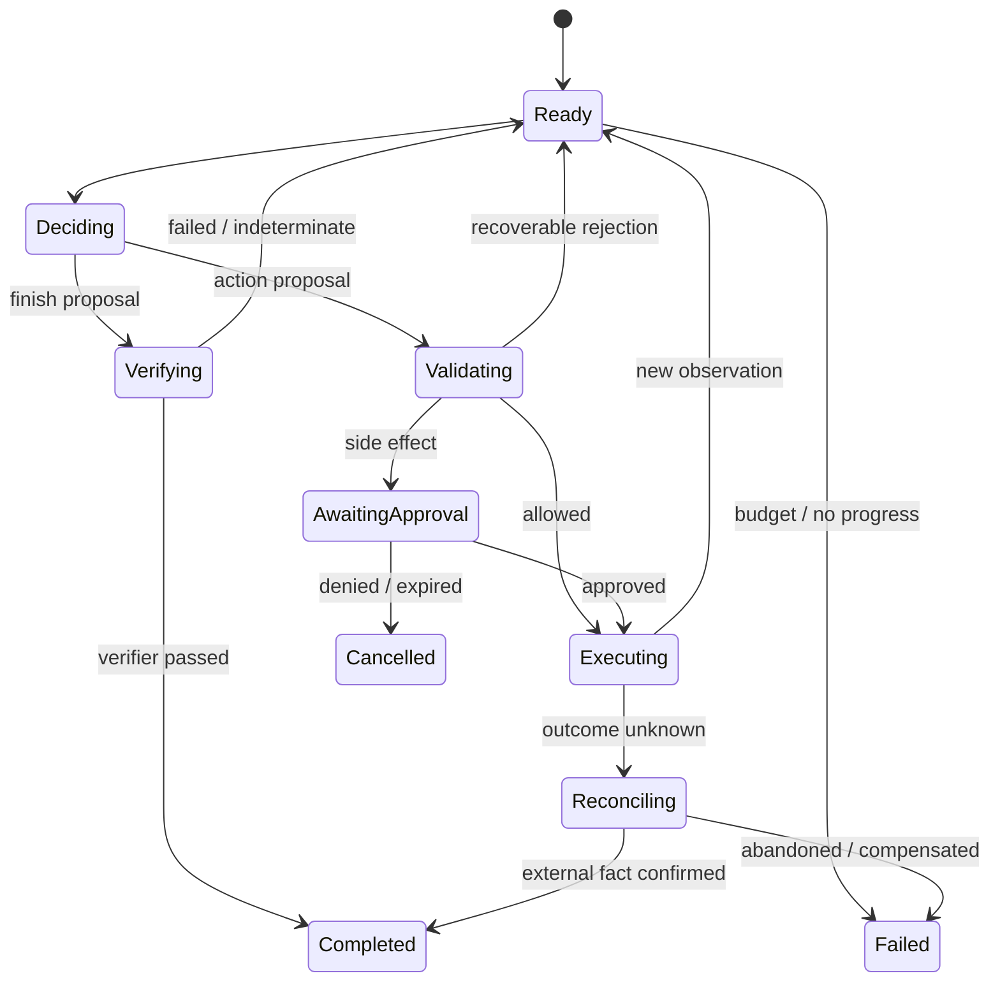

# Agent 架构、规划与记忆

<!-- learning-contract -->
<div class="learning-contract" markdown="1">

**学习导航**

- **适合读者**：正在设计 Agent loop、任务状态或记忆系统的应用与平台工程师。
- **先修**：[Agent 总览](agents.md)；最好先跟完[一次退款任务](agent-task-lifecycle.md)。
- **首次阅读**：先看控制循环，再区分 task state、memory、context、stop 和 verifier。
- **完成信号**：能把一个开放任务画成 typed state machine，并写出可测试的完成条件。
- **卡住时**：把 Planner 当成固定 JSON 生成器，只追踪确定性代码怎样改变状态。

</div>

在退款案例中，模型只提出了一次 `request_refund`，后面的 schema、ACL、审批、执行和恢复都由控制面完成。
真实 Agent 往往还要反复做决定：先查订单，再读政策，发现信息不足后询问用户，最后才提出退款。

最容易写出的版本是：

```python
while True:
    response = model.invoke(history)
    if response.is_final:
        return response.text
    history.append(call_tool(response.tool, response.arguments))
```

这段代码隐藏了所有困难：谁保存可信状态，工具是否有权限，超时后能不能重试，什么时候算“没有进展”，
进程重启后从哪一步恢复，以及模型说完成时谁来验收。

Agent 架构的工作，就是把这些问题从 Prompt 中拿出来，变成有类型、有边界、可测试的状态转换。

## 什么时候需要 Agent loop

先判断路径是否真的开放：

| 情况 | 更合适的控制方式 | 例子 |
|---|---|---|
| 步骤固定、输入结构化 | 普通程序 | 定时 ETL、固定报表 |
| 分支有限，可以枚举 | Workflow / router | 身份验证后的客服流程 |
| 下一步依赖非结构化观察 | Agent loop | 调查未知代码故障、跨工具研究 |

Agent 的价值来自“无法在运行前枚举所有合理下一步”，而不是因为任务名称听起来智能。
它会增加模型调用、非确定性、状态和攻击面。高风险流程可以保留模型理解输入，
但让业务路径停留在有限状态机中。

用三个问题快速判断：

1. 步骤能否预先枚举？
2. 下一步是否必须理解自然语言、页面或文件？
3. 错误动作能否在执行前挡住，或在执行后验证与恢复？

第三个问题如果没有答案，开放 loop 通常不是合适的起点。

## 一轮控制循环发生了什么

退款助手当前知道“用户要求退货”，但还不知道订单是否可退。一次完整迭代是：

1. **Observe**：读取可信任务状态和上一条工具结果；
2. **Decide**：Planner 提出 `query_order`、`ask_user`、`finish` 或 `escalate`；
3. **Validate**：检查结构、权限、预算、前置条件和 policy；
4. **Execute**：执行允许的动作，副作用进入审批与幂等层；
5. **Record**：持久化 proposal、结果、版本和新状态；
6. **Stop check**：判断完成、失败、暂停、超时或无进展。



模型出现在 `Deciding`，不会直接拿到数据库或云 SDK。Provider function calling 也只是帮它生成 ToolCall proposal，
`Validating` 和 `Executing` 仍属于可信 runtime。

Observe 读取的是 observation，不是完整世界状态。网页、tool result 和 provider receipt 都可能过期、带噪或不可信。
控制面要区分哪些字段来自认证服务与业务 source of truth，哪些只是供模型参考的信号。

当多个动作都可行时，Planner 可以比较预期收益，也可以先获取信息。Allowed action set、hard constraint、
belief update 和 value of information 的形式化讨论见[Agent 决策理论](agent-decision-theory.md)。

## 规划模式是控制权的不同分配

### Router / 有限状态机

模型只选择预定义 intent 或 branch，业务代码决定后续顺序。它最容易测试和审计，适合退款、开户或审批等高风险流程。
Router 必须有 `unknown` 或 `escalate`，否则陌生输入也会被强塞进一个错误分支。

### ReAct

Planner 在每一步观察结果后再选择动作，适合路径未知且反馈频繁的任务。每轮都重新解释 context，
因此容易循环，也更容易受恶意 observation 影响。审计应保存 typed action、输入来源和结果，
不能依赖不可见 chain-of-thought。

### Plan-and-execute

Planner 先产生步骤或任务图，executor 再执行。计划可以预览、并行和估算成本，
但环境变化会让旧步骤失效。每一步仍要重查前置条件和权限，原计划本身不是授权凭证。

### Tree / graph search

系统展开多个候选、评分并回溯，适合可以模拟并拥有 verifier 的数学、代码和规划任务。
分支数乘深度会很快耗尽预算；node、token、time 和去重规则必须在搜索前固定。

### 多 Agent

拆分的理由应该是权限或 context 隔离、真实并行、不同工具所有权，或独立评审。
给同一模型贴上多个角色名不会自然产生独立错误。系统还要定义通信 schema、handoff 上限、冲突处理和最终责任者。

选择规划模式时，先使用控制权最少的方案。只有有限状态机无法表达下一步时，再逐渐开放 loop 或 search。

## Chat history 不是任务状态

退款任务可以用结构化状态表示：

```text
Task {
  task_id, subject_id, objective, constraints,
  status, step, budgets, policy_version,
  observations[], artifacts[], pending_calls[],
  created_at, updated_at, version
}
```

这里的 `status` 和 `pending_calls` 影响恢复与执行，必须由 runtime 维护。Chat history 只是模型看到过的消息，
它可能被截断、总结或包含错误陈述，不能成为订单和权限的 source of truth。

并发更新使用 optimistic concurrency、lease 或 single writer，避免两个 worker 覆盖 task version。
大工具结果放入对象存储，状态中保存 artifact identity 与必要摘要；摘要必须能回到原始结果。

### Event sourcing 何时有帮助

追加记录 `TaskCreated`、`DecisionProposed`、`ToolApproved`、`ToolCompleted` 和 `StateUpdated`，
可以从事件折叠当前状态，也便于重放和审计。事件格式与 reducer 都要版本化。

追加日志仍受加密、访问、保留和删除要求约束。“不可变”描述的是更新方式，
不是无限保存敏感内容的许可。

## Memory 与 state 解决不同问题

Task state 回答“这次退款进行到哪里”；memory 帮助未来决策使用过去信息。常见四类是：

| 类型 | 例子 | 主要风险 |
|---|---|---|
| Working memory | 当前订单、步骤和最近观察 | 截断后丢掉关键约束 |
| Episodic memory | 用户上次选择了原路退款 | 一次错误推断被长期保存 |
| Semantic memory | 用户确认的稳定语言偏好 | scope、过期和跨用户泄漏 |
| Procedural memory | 退款操作手册与成功轨迹 | 未评审输出自我修改系统策略 |

写入通常应比读取严格。长期事实保存 subject、source events、confidence、scope、TTL 与确认状态；
程序性记忆则作为版本化知识库或策略发布，不能由单次模型回答直接改写。

Memory 的权限边界和业务数据一致：按 tenant / user 执行 ACL，并支持冲突、纠正与删除。
评测除了 recall，还要测“不该记住时是否没有写入”以及跨用户隔离。

## Context 是任务状态给模型的一次投影

一次 Planner 调用通常包含 system policy、tool schema、任务状态、相关 memory、最近 observation 和 artifact 摘要。
这些内容各自拥有 token budget 和可信度标签。

Context engineering 的目标不是把能找到的内容全塞进窗口，而是构造当前决策所需的最小视图：

- 认证身份、capability 和 policy decision 由控制面持有，不让模型改写；
- tool observation 带 tool name、call ID、status、provenance 和 payload；
- 网页与文档中的指令作为不可信数据标记；
- 大型 HTML、terminal log 和 database dump 先切片并保存 artifact reference；
- tool 太多时由确定性规则或低风险 router 先筛选候选集合。

同一个 task state 可以投影成不同 context。例如审批界面需要人类可读动作摘要，
Planner 只需要当前允许的工具和最近观察，verifier 则需要目标状态与独立业务证据。

## Stop 条件要识别“继续也不会更好”

最大 step、模型 token、tool calls、wall time 和费用是最外层护栏。更有用的是无进展信号：

- 连续产生相同 action fingerprint；
- 最近动作形成 `A/B/A/B` 短周期；
- 同一 error key 反复出现；
- 已解决子目标和 task state 没有变化；
- verifier 多轮没有改善。

这些是不同停止原因，trace 应分别记录。字节级 fingerprint 能发现完全相同动作，
却看不见换一种表述的语义重复；有限窗口也看不见任意长周期，所以仍需要 task progress 的领域定义。

预算的分母也要清楚。一个 step 通常计一次 Planner decision，不等于一次 handler attempt；
cache hit、policy denial 和 approval pause 仍可能消耗 decision。Model token 和 provider cost 常在响应返回后才能取得，
因此最后一轮可能越过预算：系统记录实际 usage，但不再执行这轮提出的新动作。

Wall-time 使用本地 monotonic deadline。同步工具已经开始后未必能硬抢占；调用返回时要再次检查 deadline。
远端副作用超时后进入 pending / reconciliation，不能把“停止 Agent loop”误写成“外部工作已经停止”。

停止时返回已完成内容、未完成原因、需要用户决定的事项和可恢复 task ID，而不是只说“达到最大轮数”。

## Finish 也是 proposal

Planner 说“退款已完成”，只表达它希望结束。Completion verifier 根据任务目标读取独立证据：

- 代码任务检查 diff、静态分析和目标测试；
- 文件任务检查内容与 schema，而不只检查路径存在；
- RAG 检查 claim、citation 和 evidence；
- 退款检查 provider receipt 与订单、金额和业务状态。

Verifier 返回 `passed`、`failed` 或 `indeterminate`。只有 `passed` 可以把 task 变成 completed；
`failed` 将明确错误交回 Planner，`indeterminate` 则继续取证、等待或升级人工。

开放任务可以使用 rubric judge，但要在人工集上校准。可执行测试和业务 source of truth 可用时，
优先使用这些更直接的判定方式。完成条件应该在执行前定义，并绑定用户目标。

## 审批暂停后，恢复的是原动作

人工节点通常有四种含义：

- **approval**：授权一个具体副作用；
- **clarification**：目标或参数缺失；
- **review**：质量或 policy 需要判断；
- **takeover**：系统无法安全继续。

Approval 卡片展示动作、资源、参数、影响、费用、可撤销性与过期时间。
Grant 绑定 subject、task、call、execution fingerprint、resource/policy revision、scope 和 expiry；
金额、订单、主体或 policy 漂移后，旧 grant 失效。

等待期间可以保存 checkpoint。恢复时先验证 checkpoint identity、当前 subject/capability/policy 和旧预算，
再执行原 pending decision；不能重新问 Planner 后把新 proposal 当成用户批准的动作。

Checkpoint 回答“loop 从哪一步继续”，outbox 回答“已批准的 effect 怎样可靠投递”。
业务事务可以同时写 task state 与 outbox row，再由 worker 用 lease 发送。Provider 成功而本地 ack 丢失时会发生 at-least-once redelivery，
所以稳定 effect ID 要穿透 provider idempotency contract，并通过 receipt 与 verifier 对账。

这些机制仍不能凭空获得 exactly-once。Lease 只防止当前并发领取，dead letter 也必须进入 operator runbook，
不能交给模型无限重试。

## 在仓库中动手观察

推荐按三层阅读：

1. [一次退款任务](agent-task-lifecycle.md)：先观察 proposal 到 recovery 的完整时间线；
2. [实验 6](../practice/labs/lab-6-agent-lifecycle.md)：运行同一个固定样例并预测状态；
3. [Safe Agent 项目](../practice/projects/safe-agent.md)：进入 loop、checkpoint、outbox 与经过结构校验的 planner 边界。

最小控制循环：

~~~powershell
python -m about_llm.agents.cli loop `
  --cases projects/safe-agent/loop.example.jsonl
~~~

这里的 `ScriptedPlanner` 读取冻结 JSONL，不调用真实模型。固定样例覆盖 verifier completion、重复 action、
短周期、重复错误和 approval pause，适合先观察 state transition。

随后运行模型边界的完整记录示例：

~~~powershell
python projects/safe-agent/model_planner_control.py
~~~

这个程序会检查 model revision、request/response metadata、closed JSON、tool schema、预算与 runtime policy，
并把每一步结果写入报告。
输入仍是作者构造的 recorded response，因此它验证协议和失败路径，不代表目标模型的真实遵循率或 provider 账单。

暂停、恢复、SQLite ledger、checkpoint 限制和精确证据边界集中在 [Safe Agent 项目](../practice/projects/safe-agent.md)，
避免在架构主线中把每个 artifact 字段重复展开。

## 设计练习

为“读取仓库、修改代码、运行测试并发起 PR”画一张状态图：

- 读取操作可以自动执行；
- 修改只发生在工作区；
- 测试失败进入 diagnosis，不重复提交；
- 创建 PR 使用稳定 effect ID，并在重启后先查询远端状态；
- Planner 提出 finish 后，由 diff 与测试 verifier 决定是否完成。

然后回答三个问题：task state 中有哪些字段不能只留在 chat history？哪一步需要人工 approval？
如果远端 PR 已创建但本地超时，系统怎样进入 reconciliation？

## 面试追问

**什么时候多 Agent 优于单 Agent？** 当子任务真正可并行、共享状态少，或需要不同权限、context 和独立 verifier。
给同一模型不同角色名通常只增加调用和协调成本。

**如何防止无限循环？** 预算是最后护栏；更早的信号包括动作 fingerprint、状态进展、重复错误、短周期和 verifier 改善。

**长期记忆最大的风险是什么？** 错误推断持久化、跨用户泄漏和无法删除。写入要带 provenance、scope、TTL 与确认，
并允许用户查看、纠正和删除。
