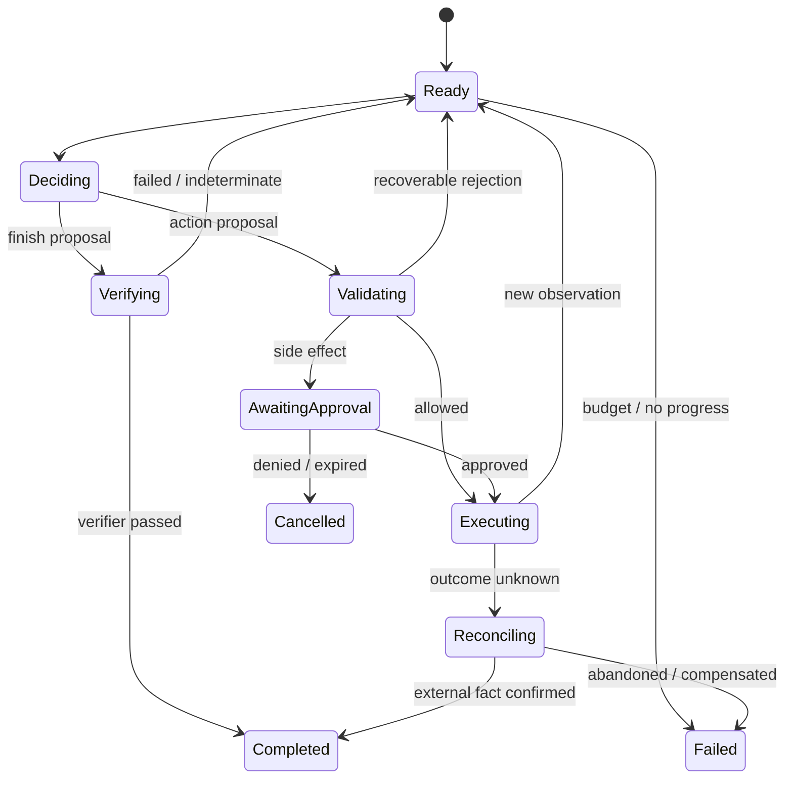

# Agent 架构、规划与记忆

<!-- learning-contract -->
<div class="learning-contract" markdown="1">

**学习导航**

- **适合读者**：正在设计 Agent 控制循环、任务状态或记忆系统的应用与平台工程师。
- **先修**：[Agent 总览](agents.md)；最好先跟完[一次退款任务](agent-task-lifecycle.md)。
- **首次阅读**：先看控制循环，再区分任务状态、记忆、模型上下文、停止条件和完成验证。
- **完成信号**：能把一个开放任务画成状态明确的状态机，并写出可以执行的完成检查。
- **卡住时**：先把规划器当成固定的 JSON 生成器，只追踪确定性代码怎样改变状态。

</div>

在前面的退款案例中，模型只提出了一次 `request_refund`。参数检查、访问控制、审批、执行和恢复都由控制面完成。

更开放的任务需要模型反复选择下一步。例如，退款助手可能先查订单，再读退款政策；如果原因不清楚，它还要询问用户，
最后才提出退款动作。

最容易写出的版本是：

```python
while True:
    response = model.invoke(history)
    if response.is_final:
        return response.text
    history.append(call_tool(response.tool, response.arguments))
```

这段代码隐藏了所有困难：谁保存可信状态，工具是否有权限，超时后能不能重试，什么时候算“没有进展”，
进程重启后从哪一步恢复，以及模型说完成时谁来验收。

Agent 架构的工作，就是把这些问题从 Prompt 中拿出来，变成有类型、有边界、可测试的状态转换。

## 什么时候需要 Agent loop

先判断路径是否真的开放：

| 情况 | 更合适的控制方式 | 例子 |
|---|---|---|
| 步骤固定、输入结构化 | 普通程序 | 定时 ETL、固定报表 |
| 分支有限，可以枚举 | Workflow / router | 身份验证后的客服流程 |
| 下一步依赖非结构化观察 | Agent loop | 调查未知代码故障、跨工具研究 |

Agent 的价值来自“无法在运行前枚举所有合理下一步”，而不是因为任务名称听起来智能。
它会增加模型调用、非确定性、状态和攻击面。高风险流程可以保留模型理解输入，
但让业务路径停留在有限状态机中。

用三个问题快速判断：

1. 步骤能否预先枚举？
2. 下一步是否必须理解自然语言、页面或文件？
3. 错误动作能否在执行前挡住，或在执行后验证与恢复？

第三个问题如果没有答案，开放 loop 通常不是合适的起点。

## 一轮控制循环发生了什么 { #_1 }

退款助手当前知道“用户要求退货”，但还不知道订单是否可退。一次完整迭代是：

1. **观察（Observe）**：读取可信任务状态和上一条工具结果；
2. **决策（Decide）**：规划器提出 `query_order`、`ask_user`、`finish` 或 `escalate`；
3. **校验（Validate）**：检查参数结构、权限、预算、前置条件和当前规则；
4. **执行（Execute）**：执行允许的动作；退款等副作用还要经过审批和幂等保护；
5. **记录（Record）**：保存动作提议、执行结果、版本和新状态；
6. **停止检查（Stop check）**：判断任务是否完成、失败、暂停、超时或不再有进展。



模型只出现在 `Deciding` 状态，不会直接拿到数据库或云服务凭证。模型服务提供的 function calling 功能，
也只是帮助它生成结构化的工具调用提议。校验和执行仍由可信的运行时负责。

观察步骤得到的是局部证据，不是完整世界。网页可能过期，工具结果可能带噪，支付服务的回执也可能被伪造。
因此，控制面必须标明数据来源：用户身份和订单状态来自可信业务系统；网页内容只作为供模型参考的不可信信号。

当多个动作都可行时，规划器既可以选择预期收益更高的动作，也可以先查询信息、降低不确定性。
允许动作集合、硬约束、信念更新和信息价值的形式化讨论见[Agent 决策理论](agent-decision-theory.md)。

## 规划模式是控制权的不同分配 { #_2 }

### 路由器与有限状态机 { #router }

模型只选择预先定义的意图或分支，业务代码决定后续顺序。这种方式最容易测试和审计，适合退款、开户和审批等高风险流程。
路由器必须保留 `unknown` 或 `escalate` 分支，否则陌生输入也会被硬塞进某个错误流程。

### ReAct

ReAct 让规划器在每次观察新结果后再选择动作，适合路径未知、反馈频繁的任务。
代价是模型每轮都要重新理解上下文，因此更容易循环，也更容易被工具返回的恶意内容误导。
审计记录应保存结构化动作、输入来源和结果，不应依赖不可见的思维链。

### Plan-and-execute

规划器先产生步骤或任务图，执行器再逐步处理。计划可以供人预览，也便于并行和估算成本。
环境变化可能让旧计划失效，所以每一步仍要重新检查前置条件和权限。计划本身不是授权凭证。

### Tree / graph search

系统展开多个候选，经过评分后继续搜索或回溯。这种方式适合能够模拟结果、并且有验证器的数学、代码和规划任务。
分支数乘以搜索深度会很快耗尽预算，因此开始前要限制候选节点数、token、运行时间，并明确怎样合并重复状态。

### 多 Agent

只有确实需要隔离权限或上下文时，才值得拆成多个 Agent。真实的并行工作、不同的工具所有权和独立评审，
也是合理的拆分原因。

给同一个模型贴上多个角色名，并不会让错误自动独立。拆分以后，系统还要定义消息格式和交接次数上限，
并说明发生冲突时怎样处理、最终由谁负责。

选择规划模式时，应先把控制权留给普通程序。只有有限状态机无法表达合理的下一步时，再逐渐开放控制循环或搜索。

## 对话历史不是任务状态 { #chat-history }

退款任务可以用结构化状态表示：

```text
Task {
  task_id, subject_id, objective, constraints,
  status, step, budgets, policy_version,
  observations[], artifacts[], pending_calls[],
  created_at, updated_at, version
}
```

这里的 `status` 和 `pending_calls` 会决定恢复与执行，因此必须由运行时维护。对话历史只是模型曾经看到的消息，
可能被截断、总结，也可能包含错误陈述。订单状态和用户权限不能以它为准。

多个工作进程同时更新任务时，可以使用乐观并发控制、租约或单写入者，避免旧版本覆盖新版本。
大型工具结果放入对象存储；任务状态只保存文件身份和必要摘要，但必须能够由摘要追溯到原始结果。

### 什么时候值得保存事件日志 { #event-sourcing }

事件溯源（event sourcing）不直接覆盖任务状态，而是依次追加 `TaskCreated`、`DecisionProposed`、
`ToolApproved`、`ToolCompleted` 和 `StateUpdated` 等事件。程序可以重放这些事件来恢复当前状态，也便于审计。
事件格式和负责归并状态的代码都要记录版本。

追加日志仍受加密、访问、保留和删除要求约束。“不可变”描述的是更新方式，
不是无限保存敏感内容的许可。

## 记忆与任务状态解决不同问题 { #memory-state }

任务状态回答“这次退款进行到哪里”；记忆帮助未来决策使用过去信息。常见四类是：

| 类型 | 例子 | 主要风险 |
|---|---|---|
| 工作记忆（working memory） | 当前订单、步骤和最近观察 | 截断后丢掉关键约束 |
| 情景记忆（episodic memory） | 用户上次选择了原路退款 | 一次错误推断被长期保存 |
| 语义记忆（semantic memory） | 用户确认的稳定语言偏好 | 适用范围错误、过期和跨用户泄漏 |
| 程序性记忆（procedural memory） | 退款操作手册与成功轨迹 | 未经评审的输出修改系统策略 |

写入记忆通常应比读取更严格。每条长期事实都要记录它属于谁、来自哪些事件、可信度、适用范围、
有效期和用户是否确认。程序性记忆应作为版本化知识库或策略发布，不能被一次模型回答直接改写。

记忆与业务数据使用相同的权限边界：按租户和用户检查访问权，并允许处理冲突、纠正和删除。
评测除了检查需要的信息能否被找回，还要检查系统在不该记忆时是否写入，以及不同用户的记忆是否真正隔离。

## 上下文是任务状态给模型的一次投影 { #context }

一次规划器调用通常包含系统规则、工具参数说明、任务状态、相关记忆、最近观察和大型结果的摘要。
系统要分别限制这些内容占用的 token，并标明它们是否可信。

上下文工程（context engineering）的目标不是把能找到的内容全塞进窗口，而是构造当前决策所需的最小视图：

- 认证身份、用户能力和权限决定由控制面持有，不让模型改写；
- 工具观察记录工具名、调用 ID、状态、数据来源和返回内容；
- 网页与文档中的指令作为不可信数据标记；
- 大型 HTML、终端日志和数据库导出先切片，原始文件另行保存并留下引用；
- 工具太多时，先由确定性规则或低风险路由器筛选候选集合。

同一个任务状态可以为不同角色生成不同上下文。审批人需要易读的动作摘要；
规划器只需要当前允许的工具和最近观察；验证器则需要目标状态与独立业务证据。

## 停止条件要识别“继续也不会更好” { #stop }

最大决策轮数、模型 token、工具调用次数、总运行时间和费用是最外层护栏。更早暴露问题的是“没有进展”的信号：

- 连续产生相同的动作标识；
- 最近动作形成 `A/B/A/B` 短周期；
- 同一种错误反复出现；
- 已解决的子目标和任务状态没有变化；
- 验证器结论连续多轮没有改善。

这些是不同的停止原因，轨迹中应分别记录。由动作参数计算的 fingerprint 可以发现完全相同的调用，
却发现不了换一种说法的语义重复。有限窗口也看不到任意长的循环，因此每类任务仍要定义“取得进展”具体指什么。

各种预算计算的对象并不相同。一次决策轮次通常表示规划器作出一次选择，不等于工具处理器（Handler）尝试了一次调用。
命中缓存、权限拒绝和等待审批也会消耗决策轮次。

模型实际使用的 token 和服务费用通常要等响应返回后才能知道，因此最后一轮可能让统计值超过预算。
此时系统仍应记录真实用量，但不能继续执行这一轮新提出的动作。

总运行时间应使用本机单调时钟计算截止时间。同步工具一旦开始，未必能够立刻中断，所以调用返回后要再次检查截止时间。
远端副作用超时后进入待确认状态，再通过对账判断结果。停止 Agent 控制循环，不代表外部工作也已经停止。

停止时应返回已经完成的内容、未完成原因、需要用户决定的事项和可恢复的任务 ID，而不是只说“达到最大轮数”。

## “完成”也只是一个动作提议 { #finish-proposal }

规划器说“退款已完成”，只表达它希望结束。完成验证器要根据任务目标读取独立证据：

- 代码任务检查 diff、静态分析和目标测试；
- 文件任务检查内容和格式，而不只检查路径存在；
- RAG 检查回答中的主张、引用和证据是否对应；
- 退款检查支付服务回执中的订单、金额和业务状态。

验证器返回 `passed`、`failed` 或 `indeterminate`。只有 `passed` 可以把任务标记为完成。
`failed` 会把明确错误交回规划器；`indeterminate` 表示证据还不足，系统应继续取证、等待或升级人工。

开放任务可以使用按评分标准工作的模型评审器，但要先用人工标注集校准。
如果已有可执行测试或权威业务状态，就优先使用这些更直接的判断方式。完成条件应在执行前定义，并绑定用户目标。

## 审批暂停后，恢复的是原动作 { #_3 }

等待人工处理通常有四种含义：

- **审批（approval）**：授权一个具体副作用；
- **澄清（clarification）**：目标或参数缺失；
- **复核（review）**：需要人判断质量或规则；
- **接管（takeover）**：系统无法安全继续。

审批卡片首先要让人看清楚：系统准备对哪个资源执行什么动作，使用哪些参数，会产生什么影响和费用。
界面还要说明动作能否撤销，以及这次批准何时过期。

后台的批准记录要绑定当前用户、任务、调用和动作参数的 fingerprint。资源版本、规则版本、授权范围和有效期也属于批准内容。
只要退款金额、订单、用户或规则发生变化，旧批准就失效。

等待期间可以保存 checkpoint，也就是任务恢复点。恢复时先核对恢复点身份、当前用户、用户能力、规则和原有预算，
再执行原来等待批准的动作。系统不能重新询问规划器，然后把一个新动作冒充成人已经批准的动作。

恢复点回答“控制循环从哪一步继续”，发件箱（outbox）回答“已批准的业务动作怎样可靠投递”。
业务事务可以同时写入任务状态和一条发件箱记录，再由工作进程领取并发送。

支付服务已经成功、但本地确认丢失时，发件箱会再次投递同一请求。为避免重复退款，重投必须继续使用稳定的业务效果 ID，
并让支付服务把它作为幂等键。系统最后还要查询回执，由验证器对账。

这些机制不能凭空保证业务动作“恰好一次”。租约只能避免多个工作进程同时领取当前记录；
多次失败后进入死信队列的请求，也必须交给运维流程处理，不能让模型无限重试。

## 在仓库中动手观察 { #_4 }

推荐按三层阅读：

1. [一次退款任务](agent-task-lifecycle.md)：先观察从动作提议到故障恢复的完整时间线；
2. [实验 6](../practice/labs/lab-6-agent-lifecycle.md)：运行同一个固定样例，并在每一步发生前预测状态；
3. [Safe Agent 项目](../practice/projects/safe-agent.md)：继续学习控制循环、恢复点、发件箱和规划器的参数校验边界。

最小控制循环：

~~~powershell
python -m about_llm.agents.cli loop `
  --cases projects/safe-agent/loop.example.jsonl
~~~

这里的 `ScriptedPlanner` 按顺序读取仓库提供的 JSONL，不调用真实模型。
固定样例覆盖验证后完成、重复动作、短周期、重复错误和等待审批，适合先观察每一步状态怎样变化。

随后运行模型边界的完整记录示例：

~~~powershell
python projects/safe-agent/model_planner_control.py
~~~

这个程序先核对模型版本和请求、响应信息，再检查未知 JSON 字段是否被拒绝、工具参数是否符合格式，
以及预算和运行时规则是否生效。每一步结果都会写入报告。

程序使用仓库提供的固定响应，适合观察协议和失败路径。若要知道目标模型在真实请求中有多大概率遵循协议，
还需要改用真实模型重复运行。模型服务的实际账单也要从服务商侧核对。

暂停、恢复、SQLite 调用账本和恢复点限制集中在 [Safe Agent 项目](../practice/projects/safe-agent.md)。
本页只解释它们在架构中的作用，不重复展开报告里的每个字段。

## 设计练习 { #_5 }

为“读取仓库、修改代码、运行测试并发起 PR”画一张状态图：

- 读取操作可以自动执行；
- 修改只发生在工作区；
- 测试失败后先诊断原因，不重复提交；
- 创建 PR 使用稳定的业务效果 ID，并在重启后先查询远端状态；
- 规划器提出完成后，由代码差异和测试验证器决定任务是否真的结束。

然后回答三个问题：任务状态中的哪些字段不能只留在对话历史里？哪一步需要人工审批？
如果远端 PR 已创建但本地超时，系统怎样进入对账状态？

## 面试追问 { #_6 }

**什么时候多 Agent 优于单 Agent？** 当子任务真正可并行、共享状态少，或需要隔离权限、上下文和验证过程。
给同一模型不同角色名通常只增加调用和协调成本。

**如何防止无限循环？** 预算是最后护栏；更早的信号包括重复动作、状态是否前进、重复错误、短周期和验证结果是否改善。

**长期记忆最大的风险是什么？** 错误推断被永久保存、跨用户泄漏和无法删除。
写入时要记录来源、适用范围、有效期和确认状态，并允许用户查看、纠正和删除。
