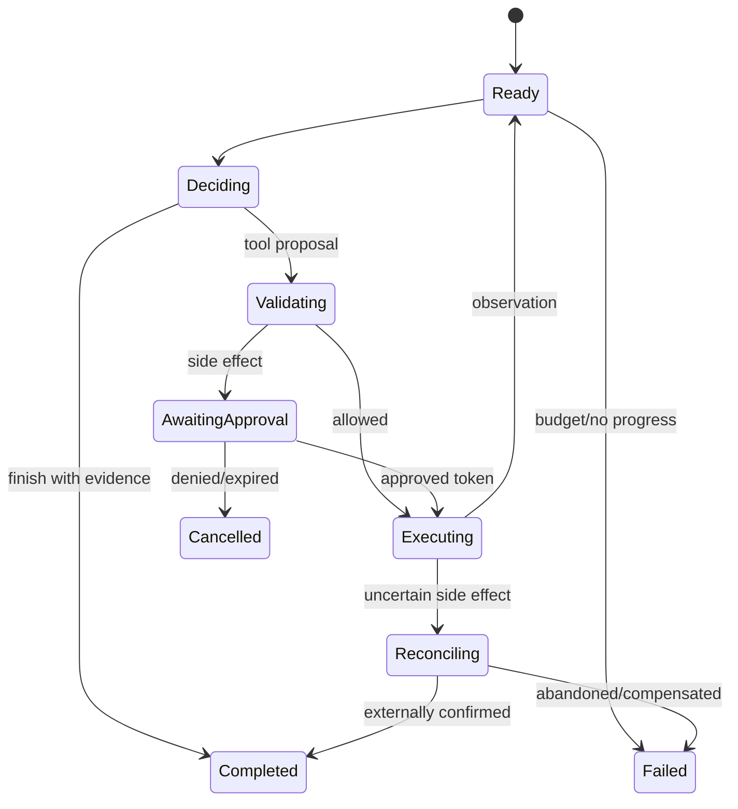

# Agent 架构、规划与记忆

Agent 的核心不是更长的 prompt，而是一个把不确定决策放进确定性控制面的系统。语言模型可以建议下一步，runtime 决定是否允许、如何执行、何时停止以及如何恢复。先把工作流画成状态机，再决定哪些状态转换真的需要模型。

## Agent、Workflow 与普通程序

用三个维度判断是否需要 Agent：

- 路径是否开放：步骤能否预先枚举？
- 输入是否非结构化：是否需要理解自然语言、页面或文件？
- 错误是否可承受：错误动作能否检测、撤销或审批？

固定报表 ETL 应用普通代码；有限分支的客服流用 workflow/router；开放研究、代码修改或跨工具调查才可能需要 agent loop。Agent 增加模型调用、不可重复性和攻击面，不是默认架构。

## 控制循环

一个可恢复循环包含：

1. Observe：读取已验证状态和最新工具结果。
2. Decide：模型输出结构化 `action | finish | escalate`。
3. Validate：schema、权限、预算、前置条件和政策。
4. Execute：通过幂等执行层调用工具。
5. Record：持久化输入、决策、结果和版本。
6. Stop check：完成、失败、超时、无进展或需人工。

模型不应直接持有数据库/云 SDK。即使 provider 支持 function calling，它也只产生 ToolCall proposal。

## 规划模式

### ReAct

模型交替输出 reasoning/action，适合步骤未知、反馈频繁的任务。缺点是每步重新解释上下文，容易循环、受恶意 observation 影响。生产中只存必要的结构化 rationale，不依赖不可见 chain-of-thought 作为审计依据。

### Plan-and-execute

先产出任务图或步骤列表，再由 executor 执行。优势是可预览、并行和估算成本；缺点是环境变化会使计划过时。每步后检查前置条件，允许局部 replan，不把原计划当授权。

### Router 与有限状态机

模型只选择预定义 intent/branch，业务代码控制顺序。它通常比开放 loop 更可靠，是高风险流程的首选。路由输出要有 `unknown/escalate`，不能强迫每个输入进入某类。

### Tree/Graph search

生成多个候选思路、评分、展开或回溯，适合搜索空间可模拟且有 verifier 的数学、代码或规划任务。分支数乘深度会迅速增加成本；评分模型可能与生成器共享偏差。必须设置 node/token/time budget 和 transposition 去重。

### 多 Agent

只有当工具/权限隔离、上下文隔离、真正并行或独立评审有价值时才拆分。多个使用同一模型和 prompt 的“角色”并不独立；它们可能相关地犯错。定义通信 schema、所有权、最大 handoff、冲突解决和最终责任者。

## 任务与状态模型

不要只把 chat history 当状态。持久状态可包括：

~~~text
Task {
  task_id, user_id, objective, constraints,
  status, step, budgets, policy_version,
  observations[], artifacts[], pending_calls[],
  created_at, updated_at, version
}
~~~

用 optimistic concurrency 或单 writer 防止并发 agent 覆盖状态。大工具结果放对象存储，context 只保留摘要、schema 和 artifact reference；摘要必须回链原始结果。

### Event sourcing

将 `TaskCreated / DecisionProposed / ToolApproved / ToolCompleted / StateUpdated` 作为追加事件，便于审计和重放。当前状态由事件折叠得到。敏感内容仍需加密和删除策略；“不可变日志”不能成为逃避隐私删除的理由。

## 记忆系统

### Working memory

当前任务的短期状态。上下文超长时按 relevance、recency、authority 和任务阶段选择，不是简单保留最近 N 条。

### Episodic memory

过去事件：“用户上次选择了方案 A”。保留时间、主体和来源。一次失败推断不能自动升级为长期事实。

### Semantic memory

从多次交互抽取的稳定偏好/事实。写入前可要求用户确认；记录 confidence、source events、过期时间和适用 scope。

### Procedural memory

技能、操作手册和成功轨迹。它本质上是版本化知识库/策略，不应由单次模型输出未经评审地自我修改。

记忆读取执行 tenant/user ACL；写入有 schema、去重、冲突和删除。评测既测 recall，也测“是否不该记住”和跨用户隔离。

## Context engineering

Agent context 通常包括 system policy、工具 schema、任务状态、相关记忆、最近 observation 和 artifact 摘要。每一类有独立 token budget。工具描述过多会降低选择精度，可先确定性筛选或由低风险 router 选择 tool subset。

工具输出作为不可信数据包裹，包含 tool name、call id、status、provenance 和 payload。对网页/文档中的指令做数据标记；不要将整个 HTML、终端日志或数据库 dump 无界塞回模型。

## 停止条件

至少包含最大步骤、模型 token、工具调用、wall time、费用和外部资源预算。更关键的是无进展：

- 连续产生同一 fingerprint 的动作；
- 状态/已解决子目标没有变化；
- 在两个状态间循环；
- 连续工具错误属于同一原因；
- verifier 分数多轮无提升。

停止后返回已完成内容、未完成原因、待用户选择和可恢复 task id。不能用“继续尝试”无限消耗预算。

## Verifier 与完成判定

模型说“完成”不是完成。根据任务使用确定性 verifier：测试通过、文件存在、JSON Schema、数据库状态、引用覆盖。开放任务可用 rubric judge，但要在人工集校准。完成条件在执行前定义，并与用户目标绑定。

代码 Agent 的证据链例如：改动 diff → 静态检查 → 目标测试 → 全量相关测试 → 尚未验证项。测试下载成功不等于功能正确，生成文件存在不等于内容符合要求。

## Human-in-the-loop

人工节点分为：

- approval：授权一个具体副作用；
- clarification：目标/参数缺失；
- review：质量或政策需要判断；
- takeover：系统无法安全继续。

确认卡片展示动作、资源、参数差异、影响、费用、可撤销性和过期时间。approval token 绑定用户、task、call id、fingerprint、scope 和 expiry；参数变化后旧审批失效。

## 设计练习

为“分析仓库、修改代码、运行测试并发起 PR”设计状态图：读取操作可自动；修改只在工作区；发起 PR 是外部写入，需要用户初始请求或显式审批；测试失败进入 diagnosis 而非重复提交；同一 commit 的 PR 创建使用幂等 key；任务重启先查询远端是否已创建。

## 面试追问

**什么时候多 Agent 优于单 Agent？** 当子任务可并行且共享状态少、需要不同权限/上下文，或独立 verifier 能减少相关错误。仅给同一模型不同角色名通常只增加成本。

**如何防止无限循环？** 预算只是最后防线；还要动作 fingerprint、状态进展、错误分类、循环检测、verifier 改善和明确终止/升级状态。

**长期记忆最大的风险是什么？** 错误推断持久化、跨用户泄漏和无法删除。写入应比读取更严格，事实带 provenance/scope/TTL，并提供用户查看、纠正和删除。
