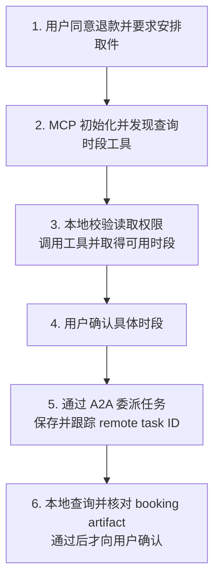
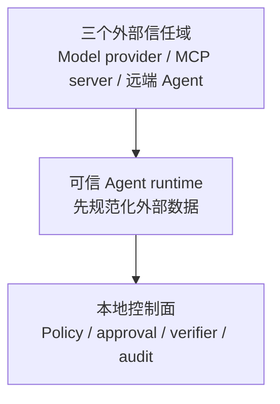

# Agent 互操作：MCP 与 A2A

<!-- learning-contract -->
<div class="learning-contract" markdown="1">

**学习导航**

- **适合读者**：需要把 Agent 接到工具、数据源或远端 Agent 的应用与平台工程师。
- **先修**：[一次 Agent 退款任务](agent-task-lifecycle.md)中的 proposal、ACL、审批和 verifier。
- **首次阅读**：先跟一次取件委派走完 MCP 与 A2A，再看 transport、版本和本地验证程序。
- **完成信号**：能解释协议状态、业务授权和任务完成为什么必须分别验证。
- **卡住时**：先把远端系统当成会超时、会返回错误内容的普通 API。

</div>

退款申请被支付服务受理后，售后助手还要安排上门取件。它需要两个外部能力：

- 从仓储系统读取可用时间段；
- 把“安排取件”委派给物流 Agent，并等待它返回预约凭证。

仓储系统只提供一个能力：查询当前订单可以选择哪些时段。它适合通过 Model Context Protocol（MCP）接入售后
Agent。

物流 Agent 会接收任务、持续更新状态并返回预约凭证，更适合通过 Agent2Agent（A2A）委派。

无论使用哪种协议，当前 Agent 仍然负责本地权限、审批和完成判定。
远端说 `completed`，只能说明远端协议状态，不能直接替用户确认“取件已经预约成功”。

取件任务是贯穿本章的业务示意，不是仓库录制的真实物流操作。仓库末尾的可执行控制把业务替换为确定性加法：
MCP 路径计算 `2 + 3 = 5`，A2A 路径计算 `7 + 5 = 12`。它们分别验证局部协议路径，没有把两种协议串成一次真实取件。

## 一次跨系统任务怎样移动



图中有两个容易被误判为“业务已经成功”的时刻：MCP 返回可用时段，A2A task 进入 `completed`。前者只是一条
observation，后者只带回一份待验收 artifact。售后 Agent 必须完成本地核对，才能向用户确认预约。

## 先区分三层契约

| 层次 | 常见对象 | 它主要解决什么 | 仍由业务系统负责什么 |
|---|---|---|---|
| Provider API | messages、content blocks、stream events | 怎样调用模型或托管 Agent API | 跨 provider 语义、租户与业务权限 |
| MCP | tools、resources、prompts | AI 应用怎样发现和访问外部能力 | 工具可信度、资源授权、审批与副作用 |
| A2A | Agent Card、message、task、artifact | 独立 Agent 怎样发现、委派和跟踪任务 | 对端正确性、产物验收和最终业务授权 |

内部系统最好保留自己的 `ToolProposal`、`TaskState`、`ArtifactRef`、`ApprovalGrant` 和 `AuditEvent`。
Adapter 把外部协议转换成这些规范化类型。外部 JSON 不能直接变成授权对象，
否则一次 SDK 升级或恶意字段就可能改写控制面语义。

## MCP 把能力带到当前 Agent

MCP 用 host、client 和 server 划分责任：

- **Server** 暴露 tools、resources 与 prompts；
- **Client** 与一个具体 server 建立协议会话；
- **Host** 组织模型体验、用户身份、策略和多个 client。

在取件案例中，仓储 MCP server 可以暴露 `lookup_pickup_slots`。它的 tool schema 告诉模型需要哪些参数。

建立连接时，host 还要记录 server identity、协议版本和双方协商出的能力。工具定义本身也要有 schema revision，
这样后续任务才能绑定到当时实际看到的输入契约。

一次典型生命周期是：

```text
transport connected
-> initialize request / version + capability negotiation
-> initialized notification
-> tools/list
-> tools/call
-> cancel or close
```

初始化完成后，client 才能根据协商结果启用 tools 或其他可选能力。Discovery 只表示 server 声明自己拥有该工具。

Host 仍要验证参数和资源身份，并执行 tenant ACL、最小权限、审批、预算、幂等与业务结果核对。

MCP 返回的资源、工具结果和 Prompt 都可能携带间接 Prompt injection。协议只规定结构和传输；远端文字仍是不可信
输入，不能直接变成 system instruction。

## Tool discovery 后，业务授权才开始

仓储 MCP server 声明自己提供 `lookup_pickup_slots`。假设 `tools/list` 返回：

```json
{
  "name": "lookup_pickup_slots",
  "inputSchema": {
    "type": "object",
    "properties": {
      "order_id": {"type": "string"}
    },
    "required": ["order_id"],
    "additionalProperties": false
  }
}
```

模型可以提出查询 `order-1001` 的可用时段。本地 runtime 随后要回答：

1. 订单由哪个 tenant 和 subject 拥有？
2. 当前 capability 是否允许读取这笔订单的取件信息？
3. 当前 server identity 与 schema revision 是否在允许范围内？
4. 缓存或重放会不会绕过已经撤销的权限？
5. 返回的 slot ID 是否仍属于这笔订单，并且可以安全展示给用户？

这些问题不属于 MCP input schema。Schema 可以拒绝未知字段或错误类型，却无法凭自身证明资源归属、当前授权和
返回内容可信。

官方 SDK 负责协议交互和已知工具的 schema 检查，不会替业务系统决定 allowlist。

仓库的固定实验还调用了未在 discovery 中出现的 `fixture.missing`。在当前锁定的 SDK 路径中，这次调用会到达
application handler，再由应用层拒绝。这个结果只适用于被测版本和调用路径；接入其他 SDK 或 transport 时要重新
验证错误究竟在哪一层停止。

## A2A 把任务交给另一个状态机

A2A 面向可以独立部署、由不同团队或厂商控制的 Agent。Agent Card 用于声明发现地址、能力和协议 binding。

一次委派由 message 发起，随后通过 task、状态更新和 artifact 跟踪结果。这种结构可以表达长任务和 streaming。

取件请求不再只是调用一个函数。物流 Agent 可能经历 `submitted → working → input-required → completed`，
也可能在断线后继续工作。调用方需要保存远端 task identity、deadline、费用上限和最后观察到的状态。

在发送 `SendMessage` 前，本地任务先形成一份委派记录：

| 本地记录 | 取件示例中的值 | 用途 |
|---|---|---|
| 业务对象 | `order-1001` 与 `friday-1400` | 约束远端产物必须对应同一订单和时段 |
| 用户批准 | approval ID 与 policy revision | 证明这次副作用落在批准范围内 |
| 对端身份 | Agent Card revision、endpoint 与认证主体 | 防止把任务发给错误 Agent |
| 业务 effect ID | `pickup:order-1001:friday-1400` | 超时后查询与幂等处理 |
| 协议状态 | remote task ID、最后状态与更新时间 | 继续轮询或恢复本地任务 |

这条链上有三种不同的 ID：

- A2A message ID 识别一条协议消息；
- remote task ID 跟踪对端任务状态；
- 业务 effect ID 识别“安排这一次取件”。

三者不能互相替代。A2A 不会自动生成业务 effect ID；双方需要在业务 payload 和幂等契约中明确约定它。

委派之前先确认：

- 怎样认证对端，Agent Card、endpoint 与 capability 怎样绑定；
- 哪些数据可以发送，tenant 和地域怎样隔离；
- 哪些状态只是进度，哪个 artifact 才能进入本地 verifier；
- 超时、取消或断线后，远端 outcome 是否已知；
- 对端若进一步提出 tool 或副作用，由谁重新授权和审批。

Agent Card 是一份声明，不是对方能力或安全性的证明。远端 `completed` 也只是一项协议事实。
本地 verifier 仍要核对 booking artifact 的订单、时间、provider ID 与业务查询结果。

如果 `SendMessage` 超时，调用方不能立刻创建第二个取件任务。它先保留 pending 状态，再用 remote task ID 或业务
effect ID 查询对端。只有完成 reconciliation（对账）后，本地任务才能进入成功、失败或安全重试。

### A2A 1.0 的版本边界

截至本仓库核对日 2026-08-13，A2A 最新协议发布版是 1.0.0。当前 JSON 结构直接用成员名区分 union 分支，不再沿用
0.3 样例中的 `kind` discriminator。

Agent Card 通过 `supportedInterfaces` 分别声明 URL、binding 与协议版本。

JSON-RPC binding 在 HTTP(S) 上使用 JSON-RPC 2.0，并约定 `application/json`、PascalCase 方法名和
`A2A-Version` header。

HTTP+JSON/REST 与 gRPC 是另外两种 binding。底层都可能经过 HTTP，但请求格式、方法名和错误语义并不兼容。

Adapter 应固定 major/minor、官方 schema 与具体 binding。0.3 与 1.0 样例分开保存，升级时让旧结构明确失败，
比静默接受后猜测字段含义更安全。

## MCP 与 A2A 可以组合，但信任域不会合并



模型 provider、MCP server 和远端 Agent 分别属于三个外部信任域。本地策略、审批与结果核对是共同入口，任何
adapter 都不能绕过。

例如，远端 Agent 通过自己的 MCP server 创建取件，只能说明它在自己的域中执行了动作。当前系统仍要核对这项业务
effect 是否对应本地用户批准的订单和时段。

同样的原则也适用于远端 Agent 自己调用 MCP：它在自己的信任域中执行成功，并不自动完成本地任务。本地系统只接收
规范化 artifact，再使用先前保存的订单、时段、批准和 effect ID 完成对账。

## 先翻译外部协议，再进入内部 runtime

一个较稳妥的 adapter 顺序是：

```text
parse protocol and validate schema
-> protocol version / capability check
-> external identity and schema lookup
-> normalize into internal typed proposal or artifact
-> canonical policy / approval / runtime
-> local verifier
-> protocol-specific response projection
```

遇到未知字段、状态或 capability 时，adapter 应停止处理，或把原始协议 artifact 放入受控审计存储。业务逻辑只读取
已经规范化的内部对象。这样更换 SDK 或 transport 时，权限与任务状态不会跟着外部 payload 的形状漂移。

升级 adapter 时至少回放以下场景：

- discovery 或 Agent Card 变化；
- schema 与 capability 变化；
- stream、取消、deadline 和 session/auth；
- 错误、未知字段和不兼容版本。

Conformance test 检查实现是否符合协议，真实网络 smoke test 检查部署路径是否可用。两者需要分别运行。

## 传输方式会改变哪些故障

业务主线明确以后，再看 MCP `2025-11-25` 的两种常见 transport。它们承载同一种协议对象，却留下不同的进程和
网络故障。

### stdio：一个本地子进程

Client 启动 server 子进程，双方通过 stdin/stdout 交换逐行 JSON-RPC object。Stdout 是协议通道，普通日志写入其中
会破坏消息边界。

进程退出、EOF、字符编码和 supervisor 的重启策略也属于这条路径的运行契约。

### Streamable HTTP：一个可能持续存在的网络会话

同一个 MCP endpoint 可以处理几种交互：

- Client 使用 POST 发送请求；
- Client 使用 GET 打开 SSE stream；
- POST 返回一份 `application/json`，或返回 `text/event-stream`；
- notification 被接受时，server 可以返回空 `202`。

需要保留状态的会话还要携带 session 与协议版本 header。

网络断开只说明 client 没有收到后续结果。若要终止正在执行的请求，client 还要发送取消通知，server 再把取消传给
handler 或下游依赖。HTTP `504` 同样无法回答副作用是否已经发生。

旧版 HTTP+SSE 示例不符合 `2025-11-25` Streamable HTTP 的完整契约。接入时要固定协议版本、SDK 和传输方式。
运行记录还要保存协商能力、session ID、请求与响应 identity、超时和取消结果。

## 亲手运行六个局部实验

先把取件故事与仓库代码对应起来：

| 教学故事中的动作 | 仓库真正运行的替代任务 | 能支持的结论 |
|---|---|---|
| MCP 查询可用时段 | 发现 `fixture.add`，提交 2 和 3，得到 5 | 初始化、discovery、schema 与 tool call 路径可执行 |
| A2A 委派取件 | 发送 7 和 5，获取 completed task 与 sum=12 artifact | Agent Card、`SendMessage`、`GetTask` 与本地 artifact 验证可执行 |
| 核对订单、审批和预约 | 没有对应的端到端业务实现 | 仍需在真实业务系统验证 |

先安装 Agent 依赖：

~~~powershell
python -m pip install -c constraints/ci.txt -e ".[agents]"
~~~

然后按需要运行：

~~~powershell
python projects/safe-agent/mcp_sdk_memory_control.py
python projects/safe-agent/mcp_sdk_stdio_control.py
python projects/safe-agent/mcp_sdk_streamable_http_control.py
python projects/safe-agent/mcp_stdio_control.py
python projects/safe-agent/mcp_streamable_http_control.py
python projects/safe-agent/a2a_loopback_control.py --verify-official-schema
~~~

| 示例 | 真正执行了什么 | 还需要在哪些环境验证 |
|---|---|---|
| MCP official SDK memory | `mcp==1.29.0` client/server/types 与 memory streams | OS transport、网络、认证和 conformance |
| MCP official SDK stdio | 独立 subprocess 与真实 stdin/stdout pipe | 畸形 framing、取消、远端互操作 |
| MCP official SDK HTTP | 独立 subprocess、loopback HTTP 与 stateful POST/GET/DELETE | MCP auth、TLS、resumption 与 conformance |
| 手写 stdio parser | 固定 framing、schema 和错误负例 | 官方 SDK 完整行为与远端兼容 |
| 手写 HTTP server | Origin/Bearer/session/version、SSE、cancel 与 DELETE | OAuth、TLS、event store 与跨厂商互操作 |
| A2A official SDK loopback | Agent Card、`SendMessage`、`GetTask` 与 v1.0 schema | TCK、其他 binding、签名 card 与远端 Agent |

六个程序故意覆盖不同代码路径：

- 手写 stdio parser 负责畸形 framing 负例，没有经过官方 SDK transport；
- 官方 SDK 程序验证 SDK 自己的路径，不代表手写 parser 与它完全一致；
- 手写 HTTP 程序中的本地 Bearer token 只检查固定实验的入口，不是 OAuth、tenant 或业务授权实现。

精确请求数、状态码、fingerprint projection 和每条负例集中在
[Safe Agent 项目](../practice/projects/safe-agent.md#mcp-a2a)，避免主线被 transport 台账淹没。

## 真实接入至少要故意破坏六次

至少覆盖六组失败：

1. discovery / Agent Card / schema 漂移和 capability 缺失；
2. 未认证、跨 tenant、撤权后 cache replay 与 secret 泄漏；
3. 恶意 resource、tool result 或 remote message 的间接 Prompt injection；
4. 超时、取消、断线、重复 update、乱序与未知 terminal state；
5. Artifact 来源漂移、远端虚假完成和本地 verifier 拒绝；
6. 同一副作用重复委派、idempotency key 冲突与人工 reconciliation。

每个 case 不只检查返回错误，还要检查高风险 handler 是否运行、task 是否留下 pending，
以及 cache 或重放有没有绕过当前授权。

## 这些实验还没有做到什么

| 已经在本机执行 | 仍需在目标环境验证 |
|---|---|
| MCP `2025-11-25` 官方 SDK 的 memory、stdio 和 Streamable HTTP | 跨厂商、跨语言的远端互操作 |
| 两套手写 transport 实验 | 完整 conformance suite 或 TCK |
| A2A 1.0 官方 SDK loopback | 生产 TLS、OAuth、IAM 与签名 Agent Card |
| 加法 artifact 的本地 verifier | 多 worker、跨区域恢复与真实业务副作用 |

这些实验只能支持表格左侧的局部协议行为。Loopback 成功、schema-valid 或远端 `completed` 都不足以证明业务正确、
身份可信和生产可用。

## 自测

1. MCP discovery 返回 `schedule_pickup` 后，本地 runtime 还要验证哪些业务条件？
2. A2A task 显示 completed 时，为什么仍要查询或验证 booking artifact？
3. stdio EOF、HTTP disconnect 和业务取消分别可能留下什么状态？
4. 为什么 A2A 0.3 的 `kind` 样例不能直接用来验证 1.0 adapter？
5. 同一个远端 Agent 同时使用 MCP 时，本地系统中形成了几个信任域？
6. Official SDK 示例与手写 parser 为什么不能共享测试结论？

## 官方资料

- Model Context Protocol：[Introduction](https://modelcontextprotocol.io/docs/getting-started/intro)、
  [2025-11-25 Transports](https://modelcontextprotocol.io/specification/2025-11-25/basic/transports)、
  [Lifecycle](https://modelcontextprotocol.io/specification/2025-11-25/basic/lifecycle)、
  [Cancellation](https://modelcontextprotocol.io/specification/2025-11-25/basic/utilities/cancellation) 和
  [Tools](https://modelcontextprotocol.io/specification/2025-11-25/server/tools)。
- A2A Protocol：[Specification](https://a2a-protocol.org/latest/specification/)、
  [v1.0.0 JSON Schema](https://a2a-protocol.org/v1.0.0/spec/a2a.json) 和
  [Python SDK](https://github.com/a2aproject/a2a-python)。

协议细节核对日期为 2026-08-13；本仓库示例使用 A2A protocol 1.0.0 与 Python SDK 1.1.2。
