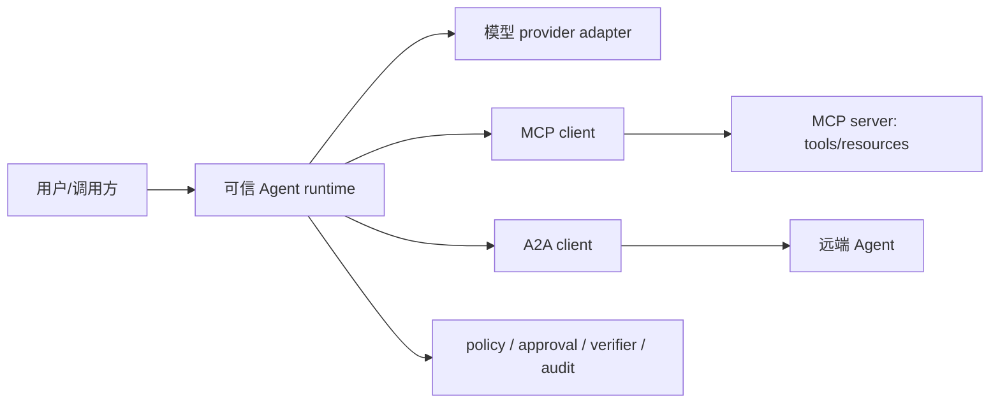

# Agent 互操作：MCP、A2A 与内部契约

Agent 系统不仅要调用模型，还要连接工具、数据源和其他 Agent。MCP 与 A2A 解决不同层次的互操作问题：前者主要连接 AI 应用与外部能力，后者主要描述独立 Agent 之间如何发现、委派和跟踪任务。它们可以互补，但都不替代业务授权、运行时状态机和审计。

## 先区分三层契约

| 层次 | 典型对象 | 主要问题 | 不能自动解决 |
|---|---|---|---|
| Provider API | messages、content blocks、stream events | 如何调用某个模型或托管 Agent API | 跨 provider 等价、业务权限 |
| Tool/context protocol | MCP tools、resources、prompts | 应用如何发现并访问外部能力 | 工具是否可信、用户是否有权执行 |
| Agent-to-Agent protocol | Agent Card、task、message、artifact | 独立 Agent 如何发现、委派和跟踪协作 | 对方是否正确、最终副作用是否获批 |

内部系统仍应保留自己的 typed contract，例如 `ToolCall`、`TaskState`、`ArtifactRef`、`ApprovalGrant` 和 `AuditEvent`。Provider/MCP/A2A adapter 把外部版本化协议转换到内部类型，不要让外部 payload 直接成为授权对象。

## MCP：连接上下文与工具

MCP 采用 host、client、server 的边界组织能力。Server 可以暴露 tools、resources 和 prompts；client 与具体 server 建立会话；host 负责用户体验、模型编排和安全策略。具体 transport、认证扩展和 capability negotiation 应按所使用的协议版本实现。

接入 MCP 时至少记录：

- server identity、协议版本、transport 和协商出的 capabilities；
- tool/resource/prompt 的 schema revision 与来源；
- authenticated subject、tenant、允许访问的资源和 secret 注入位置；
- request/response identity、超时、取消、费用和审计事件；
- server 返回内容如何被标记为不可信 observation。

Tool discovery 不等于 tool authorization。Server 宣告一个工具，只证明它声称提供该能力；host/runtime 仍要验证参数、资源归属、最小权限、审批、预算和幂等。远程 resource、tool result 和 prompt 都可能包含间接提示注入，不能因为来自协议连接就提升信任等级。

## A2A：连接独立 Agent

A2A 面向可独立部署、可能由不同团队或厂商控制的 Agent。Agent Card 用于描述发现信息和能力；协作围绕 message、task、状态更新与 artifact 展开，并可支持长任务和流式更新。实现时应把 Agent Card 当作可验证的声明，而不是可信证明。

委派任务前要确认：

1. 如何认证对端，以及 card、endpoint 和 capability 是否绑定；
2. task identity、租户、数据分类、deadline 和费用上限；
3. 哪些状态是中间进度，哪些 artifact 才可进入 verifier；
4. 取消、超时或断线时远端 outcome 是否确定；
5. 对端提出的工具调用或副作用由谁重新授权和审批。

远端返回 `completed` 只代表协议状态。它不能替代本地 verifier，也不能证明 artifact 真实、任务语义满足或外部副作用符合政策。跨 Agent 调用同样存在超时后结果未知、重复投递和 reconciliation 问题。

## MCP 与 A2A 如何组合

一个 Agent 可以通过 MCP 使用本地/远程工具，同时通过 A2A 把子任务委派给另一个 Agent。推荐保持边界清晰：

`V` 不能被任一外部 adapter 绕过。MCP server、远端 Agent 和模型 provider 都属于独立信任域；它们的身份、协议状态和业务授权需要分别建模。

## 版本与兼容策略

- 固定协议版本和官方 schema，不以“支持 MCP/A2A”代替版本声明；
- capability negotiation 后再启用可选功能，未知字段和未知状态 fail closed；
- 保存原始协议 artifact 的受控审计副本，同时把业务逻辑绑定到规范化内部对象；
- adapter conformance test 与真实网络 smoke test 分开；
- 升级时回放 discovery、schema、stream、取消、认证、错误和未知字段 fixture；
- 不假设不同 SDK、transport 或托管平台对同一协议版本有相同扩展行为。

## 最小评测矩阵

- discovery/card/schema 漂移与 capability 缺失；
- 未认证、跨 tenant、撤权后 cache replay 和 secret 泄漏；
- 恶意 resource/tool result/remote message 的间接提示注入；
- task 超时、取消、断线、重复 update、乱序和未知 terminal state；
- artifact hash/来源漂移、远端虚假完成和本地 verifier 拒绝；
- 同一副作用重复委派、幂等键复用和人工 reconciliation。

本仓库目前只给出协议建模与测试路线，没有实现 MCP/A2A client/server，也没有执行真实跨 Agent 网络互操作。因此本章不能作为 conformance、兼容性、安全性或生产可用性证明。

## 官方资料

- Model Context Protocol，[Introduction](https://modelcontextprotocol.io/docs/getting-started/intro) 与 [Specification](https://modelcontextprotocol.io/specification/)；核对日期 2026-08-11。
- A2A Protocol，[Specification](https://a2a-protocol.org/latest/specification/)；核对日期 2026-08-11。
