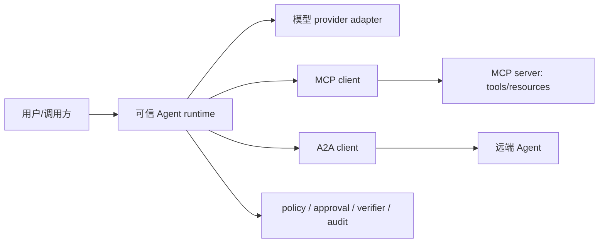

# Agent 互操作：MCP、A2A 与内部契约

<!-- learning-contract -->

**学习导航**

- **适合读者**：MCP、A2A 和跨 Agent adapter 工程师。
- **先修**：[Agent 总览](agents.md)和[Runtime](agent-runtime.md)的授权、幂等与 verifier。
- **首次阅读**：三层契约 → MCP → A2A → adapter → 版本与兼容。
- **完成信号**：能运行 MCP official-SDK memory、official-SDK stdio、official-SDK Streamable HTTP、自写 strict stdio、自写 Streamable HTTP 与 A2A loopback 六个 control，解释 SDK、transport、binding、错误分层、内部规范化类型和 conformance 边界。
- **卡住时**：不要从协议 SDK 开始；先完成[实验 6](../practice/labs/lab-6-agent-lifecycle.md)的本地状态机。

Agent 系统不仅要调用模型，还要连接工具、数据源和其他 Agent。MCP 与 A2A 解决不同层次的互操作问题：前者主要连接 AI 应用与外部能力，后者主要描述独立 Agent 之间如何发现、委派和跟踪任务。它们可以互补，但都不替代业务授权、运行时状态机和审计。

## 先区分三层契约

| 层次 | 典型对象 | 主要问题 | 不能自动解决 |
|---|---|---|---|
| Provider API | messages、content blocks、stream events | 如何调用某个模型或托管 Agent API | 跨 provider 等价、业务权限 |
| Tool/context protocol | MCP tools、resources、prompts | 应用如何发现并访问外部能力 | 工具是否可信、用户是否有权执行 |
| Agent-to-Agent protocol | Agent Card、task、message、artifact | 独立 Agent 如何发现、委派和跟踪协作 | 对方是否正确、最终副作用是否获批 |

内部系统仍应保留自己的 typed contract，例如 `ToolCall`、`TaskState`、`ArtifactRef`、`ApprovalGrant` 和 `AuditEvent`。Provider/MCP/A2A adapter 把外部版本化协议转换到内部类型，不要让外部 payload 直接成为授权对象。

## MCP：连接上下文与工具

MCP 采用 host、client、server 的边界组织能力。Server 可以暴露 tools、resources 和 prompts；client 与具体 server 建立会话；host 负责用户体验、模型编排和安全策略。具体 transport、认证扩展和 capability negotiation 应按所使用的协议版本实现。

本仓库的五个 MCP control 都固定协议 `2025-11-25`，但刻意覆盖不同证据层：官方 SDK memory、官方 SDK real stdio、官方 SDK real Streamable HTTP、自写严格子集 real stdio，以及自写严格子集 Streamable HTTP loopback。两个 official-SDK network/pipe control 把 SDK 与具体 transport 放进同一次运行，但不能替代自写 controls 的畸形 framing、header/session、cancel 等负例；反过来，自写 parser/endpoint 的负例也不能借给官方 SDK。stdio 中 client 启动 server 子进程，双方在 stdin/stdout 交换逐行 JSON-RPC object；Streamable HTTP 则使用同一 POST/GET endpoint、session header 与可选 SSE。初始化必须是第一次交互，client 检查版本和 `tools` capability、发送 initialized notification 后才 list/call。具体 framing、shutdown 和错误行为仍要按所用 SDK/实现与固定协议版本验证，不应从旧 HTTP+SSE 示例或其他版本猜测。

接入 MCP 时至少记录：

- server identity、协议版本、transport 和协商出的 capabilities；
- tool/resource/prompt 的 schema revision 与来源；
- authenticated subject、tenant、允许访问的资源和 secret 注入位置；
- request/response identity、超时、取消、费用和审计事件；
- server 返回内容如何被标记为不可信 observation。

Tool discovery 不等于 tool authorization。Server 宣告一个工具，只证明它声称提供该能力；host/runtime 仍要验证参数、资源归属、最小权限、审批、预算和幂等。远程 resource、tool result 和 prompt 都可能包含间接提示注入，不能因为来自协议连接就提升信任等级。

### 可运行的官方 MCP SDK memory control { #mcp-sdk-memory-control }

~~~powershell
python -m pip install -c constraints/ci.txt -e ".[agents]"
python projects/safe-agent/mcp_sdk_memory_control.py
python -m pytest tests/test_mcp_sdk_memory.py -q
~~~

control 固定并核验官方 Python `mcp==1.29.0`，在 AnyIO in-memory object streams 两端真实运行 `ClientSession`、low-level `Server` 与 SDK generated types，协商 MCP `2025-11-25` 和 `tools` capability。`fixture.add` 发布显式 closed `inputSchema`/`outputSchema`；成功调用得到 `structuredContent={"sum": 5}`。带额外字段的参数由 SDK schema validation 在应用 handler 前拒绝，`invalid_schema_handler_delta=0`。

这里有一个容易误答的边界：client 调用未在当前 discovery 中列出的名字时，没有可用的 cached input schema 可先行拒绝；low-level server SDK 仍会把该名字交给注册的应用 `call_tool` handler。因此 control 观测到 `unknown_tool_handler_delta=1`，并由应用层 allowlist 返回 error。不能把“用了官方 SDK”误写成“unknown tool 必然在业务 handler 前被 SDK 拦截”，也不能用 schema-valid 推导出资源归属、tenant ACL、授权或审批已完成。

公开报告不发布 SDK 原始 error content，因为其文本可能包含 validation detail；只发布 closed 结构、显式 scope 与无密钥 fingerprint。这个 control 没有创建 subprocess、OS pipe、socket、HTTP、SSE 或 session，也没有执行 OAuth/TLS、官方 conformance suite、远程/跨厂商 server、授权、审批或副作用。它补的是“官方 SDK in-process 路径”证据；下一节把同一 SDK fixture 接到真实 stdio，但两者都不是生产安全证据。

### 可运行的官方 MCP SDK stdio control { #mcp-sdk-stdio-control }

~~~powershell
python -m pip install -c constraints/ci.txt -e ".[agents]"
python projects/safe-agent/mcp_sdk_stdio_control.py
python -m pytest tests/test_mcp_sdk_stdio.py -q
~~~

control 同样固定 `mcp==1.29.0`，但由官方 `mcp.client.stdio.stdio_client` 启动一个独立 Python subprocess；子进程使用官方 `mcp.server.stdio.stdio_server`，双方通过真实 OS stdin/stdout pipe 运行 `ClientSession`/low-level `Server`。encoding profile 不是“两端 strict”：client 显式使用 UTF-8 strict，当前官方 server 对 stdin 使用 UTF-8 `errors="replace"`。它协商 2025-11-25、ping、发现 closed schema，并执行成功、schema-invalid 与 unknown-tool 三次调用。父进程不读取 raw transcript；子进程在协议循环收到 EOF 并退出后，以 exclusive create 写一份最小 canonical receipt。

临时本地 receipt 记录 handler 名序列、计数、完成状态和 server PID，不记录参数、结果或 error text。固定序列为 `fixture.add → fixture.missing`：因此 schema-invalid 没进入 handler，unknown tool 进入应用 gate；server run 正常收到 EOF 后结束，stderr 为空。PID 只用于验证 server 与 client 不是同一进程，随临时目录删除且不进入公开报告或 receipt fingerprint。receipt projection fingerprint 与最终 report fingerprint 都没有密钥，只能检测所列字段漂移，不能认证进程或执行来源。

这条 control 同时建立“reviewed official SDK + real local stdio subprocess/pipe”的局部证据，但没有独立注入 missing LF、duplicate key、invalid UTF-8、超 byte cap 或 stdout 污染，也没有强制触发 terminate/kill、取消和 deadline 路径；这些不能从 SDK 源码存在相应分支就写成已测试。它也没有 HTTP/SSE、TLS/OAuth、远程/跨厂商 server、conformance suite、业务授权/审批、副作用或生产 supervisor 证据。

### 可运行的官方 MCP SDK Streamable HTTP control { #mcp-sdk-streamable-http-control }

~~~powershell
python -m pip install -c constraints/ci.txt -e ".[agents]"
python projects/safe-agent/mcp_sdk_streamable_http_control.py
python -m pytest tests/test_mcp_sdk_streamable_http.py -q
~~~

这个 control 仍固定 `mcp==1.29.0`，父进程以官方 `mcp.client.streamable_http.streamable_http_client` 和 `ClientSession` 连接独立 Python server subprocess；子进程以官方 low-level `Server`、`StreamableHTTPSessionManager` 与 SDK ASGI adapter 监听真实 `127.0.0.1` TCP/HTTP。它使用 stateful session 和 SSE POST response mode，完成 initialize/ping/discovery、成功、schema-invalid 与 unknown-tool 三类调用。SDK client 在 initialized 后另开 GET SSE，并在 client transport 关闭时以 DELETE 终止 MCP session。

固定 HTTP profile 是 7 次 POST、1 次 GET 与 1 次 DELETE：8 个 200、1 个 notification 202，7 个 `text/event-stream` 与 2 个 `application/json` response。它只记录 method/status/media-type 的计数，不发布 URL、header、body 或 session id。临时 canonical receipt 同样固定 handler events 为 `fixture.add → fixture.missing`，证明 schema-invalid 未进入 handler、unknown tool 进入应用 gate；内部 PID 只用于 distinct-process 判断，不进入公开报告或 receipt fingerprint。

服务另有随机 token 保护的私有 readiness/shutdown control endpoint，并真实要求缺失 token 返回 401；它只用于测试编排和 graceful Uvicorn/session-manager shutdown，不是 MCP auth、OAuth、用户身份或业务授权证据。control 没有注入 malformed/duplicate/invalid-UTF-8/oversize body，没有执行 MCP endpoint 的 Host/Origin failure、网络故障、cancel、deadline、reconnect/resumption、TLS、远程/跨厂商 server 或 conformance suite，也没有多 worker、授权/审批、副作用与生产 supervisor 证据。loopback port 先选后 bind 仍有竞争窗口；本地 receipt 与无密钥 fingerprint 不认证进程、来源或真实执行。

| MCP control | 实际执行 | 不能借来的证据 |
|---|---|---|
| official-SDK memory | 官方 client/server/types/schema validation + memory stream | stdio、HTTP、远程网络、认证、授权、conformance |
| official-SDK stdio | 官方 client/server/stdio transports + subprocess + OS pipe | 畸形 raw framing、HTTP、认证、远程互操作、conformance |
| official-SDK Streamable HTTP | 官方 client/server/session manager + subprocess + loopback TCP/HTTP + POST/GET SSE + DELETE | 畸形 body/header 负例、resumption、TLS/OAuth、远程互操作、conformance |
| authored stdio | 自写固定子集 + subprocess + OS pipe | 官方 SDK/schema suite、HTTP、认证、远程互操作 |
| authored Streamable HTTP | 自写固定子集 + loopback TCP/HTTP/SSE/session/cancel | 官方 SDK/schema suite、TLS/OAuth、远程/跨厂商互操作 |

### 可运行的自写 strict MCP stdio control { #mcp-stdio-control }

~~~powershell
python -m pip install -c constraints/ci.txt -e ".[agents]"
python projects/safe-agent/mcp_stdio_control.py
python -m pytest tests/test_mcp_stdio.py -q
~~~

control 真实创建本地 client/server 子进程和 OS pipe，执行 11 条 client/server 消息：版本协商、initialized notification、`tools/list`、一次成功 `tools/call`、一次 schema-invalid tool result 与一次 unknown-tool protocol error。`fixture.add` 同时发布显式 Draft 2020-12 `inputSchema`/`outputSchema`；成功结果同时返回 text 与 `structuredContent`，输入类型错误按 tool execution error 返回 `isError: true`，未知工具按 JSON-RPC error 返回。错误只含稳定 keyword 与 JSON Pointer，不回显被拒绝值。

报告不发布原始 transcript，只对 direction、JSON-RPC version、request id、method、response kind、tool-error flag 与 error code 的 allowlist projection 做 canonical fingerprint。这个 fingerprint 不绑定参数、result content 或其他被排除字段，只能检测投影内漂移，更不能认证 server、client 或真实执行来源；生产日志仍需单独做 secret/PII 分类、加密、权限和 retention。这个 strict fixture 只接受它实现的 JSON-RPC/MCP 子集，未知 envelope 字段 fail closed；“本地测试通过”不能外推为任意 SDK 都兼容。

### 可运行的 MCP Streamable HTTP control { #mcp-streamable-http-control }

MCP `2025-11-25` 的 Streamable HTTP 不是旧版 `2024-11-05` HTTP+SSE：当前 transport 要求一个同时支持 POST 与 GET 的 MCP endpoint。每条 client JSON-RPC message 都使用新的 POST；POST request 的响应可以是单个 `application/json` object，也可以是 `text/event-stream`。notification 或 client response 被接受时返回空 body 的 `202 Accepted`。GET 可单独打开 SSE；断线本身不是取消，取消 in-flight request 要另发 `notifications/cancelled`。

~~~powershell
python -m pip install -c constraints/ci.txt -e ".[agents]"
python projects/safe-agent/mcp_streamable_http_control.py
python -m pytest tests/test_mcp_streamable_http.py -q
~~~

control 启动只绑定 `127.0.0.1` 的 server subprocess，并在真实 TCP/HTTP 上使用同一个 `/mcp` endpoint。所有 endpoint 请求先执行 Origin allowlist 与 fixture Bearer header gate；错误 Origin、缺失/错误 token 分别固定为 403、401。初始化返回由 `secrets.token_urlsafe` 生成且满足 visible-ASCII 形状约束的 opaque `MCP-Session-Id`，后续 POST/GET/DELETE 均携带该 session 和协商后的 `MCP-Protocol-Version: 2025-11-25`；缺 session、缺/错版本与 DELETE 后重用分别要求 400、400、404。

同一 lifecycle 先以 JSON 完成 `tools/list`，再以 POST SSE 完成 `fixture.add`。SSE 首事件带唯一 event id 和空 data，下一事件才承载 JSON-RPC response；另一个 GET SSE 只产生 priming event。取消控制并发保持 `fixture.wait` 的 POST SSE，收到 priming event 后另发 `notifications/cancelled`：notification 是空 202，被取消 stream 关闭且不得再发 JSON-RPC response。最后 DELETE 得到空 204。公开报告不保存 token、session、event id、raw HTTP、参数或 result，只保留 transport/status/verifier 的 closed projection；固定指纹 `sha256:5a5cc3be…c8915` 不绑定被省略值，也不认证执行来源。

这里的 Bearer 只是随机本地 shared-secret header gate，不是 MCP Authorization/OAuth flow，不证明 subject、tenant、scope、token audience、issuer、revocation 或 protected-resource metadata。control 也没有 TLS、官方 MCP SDK/完整 Schema/conformance suite、远程 server、SSE event store/resumption/redelivery、server-to-client JSON-RPC request、跨 stream non-broadcast、业务授权/审批或跨厂商互操作；它证明的是固定版本、固定子集的一次本机 transport 控制。

## A2A：连接独立 Agent

A2A 面向可独立部署、可能由不同团队或厂商控制的 Agent。Agent Card 用于描述发现信息和能力；协作围绕 message、task、状态更新与 artifact 展开，并可支持长任务和流式更新。实现时应把 Agent Card 当作可验证的声明，而不是可信证明。

截至 2026-08-13，官方最新发布版为 A2A 1.0.0。1.0 的当前 JSON 结构使用成员名表达 union 分支，不再使用旧版 `kind` discriminator；Agent Card 通过 `supportedInterfaces` 声明 URL、protocol binding 与 protocol version，扩展卡能力位于 `capabilities.extendedAgentCard`。0.3 fixture 不能直接当作 1.0 conformance fixture，adapter 必须固定 major/minor、规范 schema 和具体 binding。JSON-RPC binding 是 JSON-RPC 2.0 over HTTP(S)，使用 `application/json`、PascalCase 方法名与 `A2A-Version` HTTP header；它与 HTTP+JSON/REST、gRPC 是不同 binding，不能只写“用了 HTTP”便混为一谈。

委派任务前要确认：

1. 如何认证对端，以及 card、endpoint 和 capability 是否绑定；
2. task identity、租户、数据分类、deadline 和费用上限；
3. 哪些状态是中间进度，哪些 artifact 才可进入 verifier；
4. 取消、超时或断线时远端 outcome 是否确定；
5. 对端提出的工具调用或副作用由谁重新授权和审批。

远端返回 `completed` 只代表协议状态。它不能替代本地 verifier，也不能证明 artifact 真实、任务语义满足或外部副作用符合政策。跨 Agent 调用同样存在超时后结果未知、重复投递和 reconciliation 问题。

### 可运行的 A2A 1.0 loopback control { #a2a-loopback-control }

~~~powershell
python -m pip install -c constraints/ci.txt -e ".[agents]"
python projects/safe-agent/a2a_loopback_control.py
python projects/safe-agent/a2a_loopback_control.py --verify-official-schema
python -m pytest tests/test_a2a_loopback.py -q
~~~

control 用官方 `a2a-sdk==1.1.2` 同时构建 server 与 client：父进程启动一个只绑定 `127.0.0.1` 的 server subprocess，client 通过真实 IPv4 loopback TCP/HTTP 从 `/.well-known/agent-card.json` 解析 Agent Card，按其 `JSONRPC`/`1.0` interface 调用 `SendMessage`，再用返回的 task identity 调用 `GetTask`。固定任务返回 `TASK_STATE_COMPLETED` 与一个结构化 artifact；报告把远端状态和独立本地 verifier 结果分开，不能用前者代替后者。

官方 SDK 的生成 protobuf 类型和 required-field gate 会参与 request/card/response 解析。两个负向控制另以 raw HTTP 发送 0.3 风格 `kind` 字段与 `A2A-Version: 9.9`，分别要求 `-32602 InvalidParamsError` 与 `-32009 VersionNotSupportedError`。默认运行不访问外网；加 `--verify-official-schema` 后才下载冻结的 A2A 1.0.0 `a2a.json`，要求 SHA-256 为 `6b6560c7…b8d62`，把生成式相对 `$ref` 重写成本地 JSON Pointer，再以 Draft 2020-12 验证 `Agent Card`、`Send Message Request` 和 `Task`。该 hash pin 用于检测内容漂移，不是发布者签名或来源认证。

公开报告不包含 raw message、request 参数、task/context id 或 artifact 值，只 fingerprint 一份固定 allowlist projection。离线默认报告指纹为 `sha256:f1ad7ae1…b099e`；执行官方 Schema 的联网报告因 `official_schema_validated` 进入投影而得到 `sha256:df78d8b7…3704e`。两者只约束投影内元数据，不认证进程、对端或真实业务执行。

## MCP 与 A2A 如何组合

一个 Agent 可以通过 MCP 使用本地/远程工具，同时通过 A2A 把子任务委派给另一个 Agent。推荐保持边界清晰：

`V` 不能被任一外部 adapter 绕过。MCP server、远端 Agent 和模型 provider 都属于独立信任域；它们的身份、协议状态和业务授权需要分别建模。

## 版本与兼容策略

- 固定协议版本和官方 schema，不以“支持 MCP/A2A”代替版本声明；
- A2A 迁移时分别保存 0.3 与 1.0 fixture，显式测试 `kind`、Agent Card 和 protocol binding 的结构变化；
- capability negotiation 后再启用可选功能，未知字段和未知状态 fail closed；
- 保存原始协议 artifact 的受控审计副本，同时把业务逻辑绑定到规范化内部对象；
- adapter conformance test 与真实网络 smoke test 分开；
- 升级时回放 discovery、schema、stream、取消、认证、错误和未知字段 fixture；
- 不假设不同 SDK、transport 或托管平台对同一协议版本有相同扩展行为。

## 最小评测矩阵

- discovery/card/schema 漂移与 capability 缺失；
- 未认证、跨 tenant、撤权后 cache replay 和 secret 泄漏；
- 恶意 resource/tool result/remote message 的间接提示注入；
- task 超时、取消、断线、重复 update、乱序和未知 terminal state；
- artifact hash/来源漂移、远端虚假完成和本地 verifier 拒绝；
- 同一副作用重复委派、幂等键复用和人工 reconciliation。

本仓库已经实现 MCP 2025-11-25 的官方 SDK in-memory、官方 SDK stdio、官方 SDK Streamable HTTP、自写 strict stdio、自写 Streamable HTTP loopback，以及 A2A 1.0 的官方 SDK loopback control。两个 official-SDK transport controls 分别把 SDK 与真实 pipe、loopback HTTP 放进同一次运行，但没有借到另一 transport 或自写 negative-control matrix；官方 HTTP control 的私有 readiness/shutdown token 也不是 MCP auth。自写 stdio 覆盖严格 framing 子集却不是官方 SDK；自写 HTTP 另覆盖 Origin/Bearer/session/cancel，但本地 Bearer gate 不是 OAuth。所有 MCP controls 都没有远程/跨厂商、业务授权或生产身份的证据。A2A 虽真实执行官方 SDK client/server、TCP/HTTP、Agent Card、两个 JSON-RPC 方法、两个错误控制与可选官方 Schema 校验，但只有单一 Python SDK、单进程本机 HTTP、固定非流式 fixture。它没有执行 A2A TCK/完整 operation matrix、SSE、HTTP+JSON/REST、gRPC、TLS、签名 Agent Card、认证、授权/审批、远程 Agent 或跨语言/厂商互操作；该局部证据不等于完整 A2A conformance。因此本章也不等于完整 MCP conformance、安全性或生产可用性证明。

## 官方资料

- Model Context Protocol，[Introduction](https://modelcontextprotocol.io/docs/getting-started/intro)、[2025-11-25 Transports](https://modelcontextprotocol.io/specification/2025-11-25/basic/transports)、[Lifecycle](https://modelcontextprotocol.io/specification/2025-11-25/basic/lifecycle)、[Cancellation](https://modelcontextprotocol.io/specification/2025-11-25/basic/utilities/cancellation) 与 [Tools](https://modelcontextprotocol.io/specification/2025-11-25/server/tools)；stdio/HTTP/lifecycle/cancellation/tools 细节核对日期 2026-08-13。
- A2A Protocol，[Specification](https://a2a-protocol.org/latest/specification/)、冻结的 [v1.0.0 JSON Schema](https://a2a-protocol.org/v1.0.0/spec/a2a.json) 与官方 [Python SDK](https://github.com/a2aproject/a2a-python)；核对日期 2026-08-13，最新协议发布版 1.0.0，control 固定 SDK 1.1.2。
