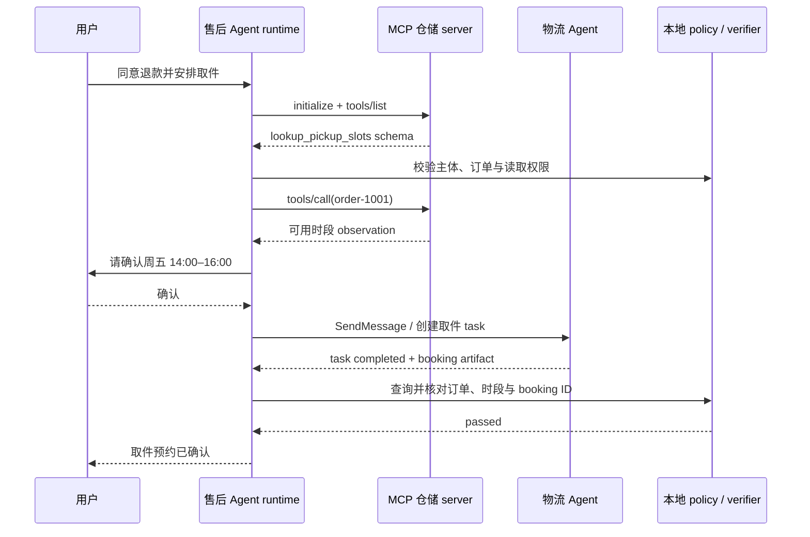
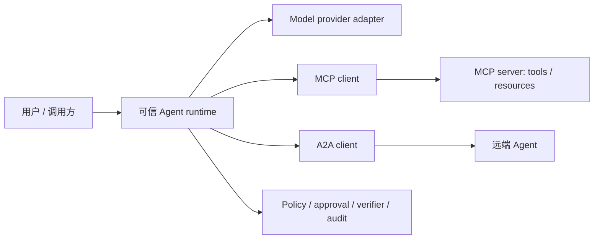

# Agent 互操作：MCP、A2A 与内部契约

<!-- learning-contract -->
<div class="learning-contract" markdown="1">

**学习导航**

- **适合读者**：需要把 Agent 接到工具、数据源或远端 Agent 的应用与平台工程师。
- **先修**：[一次 Agent 退款任务](agent-task-lifecycle.md)中的 proposal、ACL、审批和 verifier。
- **首次阅读**：先跟一次取件委派走完 MCP 与 A2A，再看 transport、版本和本地 controls。
- **完成信号**：能解释协议状态、业务授权和任务完成为什么必须分别验证。
- **卡住时**：先把远端系统当成会超时、会返回错误内容的普通 API。

</div>

退款申请被支付服务受理后，售后助手还要安排上门取件。它需要两个外部能力：

- 从仓储系统读取可用时间段；
- 把“安排取件”委派给物流 Agent，并等待它返回预约凭证。

这两个动作看起来都像 tool call，系统边界却不同。仓储系统只是向当前 Agent 暴露资源和工具，
适合通过 Model Context Protocol（MCP）连接；物流 Agent 有自己的任务状态、生命周期和产物，
更适合通过 Agent2Agent（A2A）委派。

无论使用哪种协议，当前 Agent 仍然负责本地权限、审批和完成判定。
远端说 `completed`，只能说明远端协议状态，不能直接替用户确认“取件已经预约成功”。

## 一次跨系统任务怎样移动



图中有两个“看起来成功”的时刻：MCP tool 返回结果，以及 A2A task 进入 completed。
本地 runtime 只把它们当作 observation 和 supplied artifact。最后一条用户答复要等本地 verifier 通过。

## 先区分三层契约

| 层次 | 常见对象 | 它主要解决什么 | 仍由业务系统负责什么 |
|---|---|---|---|
| Provider API | messages、content blocks、stream events | 怎样调用模型或托管 Agent API | 跨 provider 语义、租户与业务权限 |
| MCP | tools、resources、prompts | AI 应用怎样发现和访问外部能力 | 工具可信度、资源授权、审批与副作用 |
| A2A | Agent Card、message、task、artifact | 独立 Agent 怎样发现、委派和跟踪任务 | 对端正确性、产物验收和最终业务授权 |

内部系统最好保留自己的 `ToolProposal`、`TaskState`、`ArtifactRef`、`ApprovalGrant` 和 `AuditEvent`。
Adapter 把外部协议转换成这些规范化类型。外部 JSON 不能直接变成授权对象，
否则一次 SDK 升级或恶意字段就可能改写控制面语义。

## MCP 把能力带到当前 Agent

MCP 用 host、client 和 server 划分责任：

- **Server** 暴露 tools、resources 与 prompts；
- **Client** 与一个具体 server 建立协议会话；
- **Host** 组织模型体验、用户身份、策略和多个 client。

在取件案例中，仓储 MCP server 可以暴露 `lookup_pickup_slots`。Tool schema 告诉模型需要哪些参数；
server identity、协议版本、capability negotiation 和 schema revision 则告诉 host 当前连接提供了什么。

一次典型生命周期是：

```text
transport connected
-> initialize request / version + capability negotiation
-> initialized notification
-> tools/list
-> tools/call
-> cancel or close
```

初始化必须先完成，client 再根据协商结果启用 tools 或其他可选能力。Discovery 只表示 server 声称拥有该工具。
Host 仍要做参数验证、服务端资源解析、tenant ACL、最小权限、审批、预算、幂等和业务 verifier。

MCP resource、tool result 和 prompt 都可能携带间接 Prompt injection。协议连接提供了结构和传输，
没有把远端内容提升成可信 system instruction。

## stdio 与 Streamable HTTP 改变的是传输边界

本仓库 controls 固定 MCP `2025-11-25`。在这个版本下，两种常见 transport 是：

### stdio

Client 启动 server subprocess，双方通过 stdin/stdout 交换逐行 JSON-RPC object。
Stdout 是协议通道，普通日志写入其中会破坏 framing；进程退出、EOF、编码和 supervisor 行为也属于契约。

### Streamable HTTP

Client 向同一个 MCP endpoint 发送 POST，也可以用 GET 打开 SSE stream。POST 响应可能是单个
`application/json` object，也可能是 `text/event-stream`；notification 被接受时可以返回空 `202`。
Stateful 会话还要携带 session 与协议版本 header。

网络断开本身不等于取消正在执行的请求。需要终止 in-flight work 时，client 另发取消通知，
server 还要把取消传到 handler 或远程依赖。一次 HTTP `504` 也不能说明副作用没有发生。

旧版 HTTP+SSE 示例不能直接当成 `2025-11-25` Streamable HTTP 实现。接入时固定协议版本、SDK 和 transport，
并保存 capability、session、request/response identity、超时与取消结果。

## Tool discovery 后，业务授权才开始

假设 `tools/list` 返回：

```json
{
  "name": "schedule_pickup",
  "inputSchema": {
    "type": "object",
    "properties": {
      "order_id": {"type": "string"},
      "slot_id": {"type": "string"}
    },
    "required": ["order_id", "slot_id"],
    "additionalProperties": false
  }
}
```

模型可以提出 `order-1001 / friday-1400`。本地 runtime 随后要回答：

1. 订单由哪个 tenant 和 subject 拥有？
2. 当前 capability 是否允许安排取件？
3. 该时段是否仍属于这笔订单和当前版本？
4. 用户批准的是不是同一订单、时段和 policy identity？
5. 超时重试使用哪个 effect ID，怎样查询远端状态？

这些问题不属于 MCP input schema。Schema 可以拒绝未知字段或错误类型，无法凭自身证明资源归属和用户授权。

官方 SDK 也不等于业务 allowlist。仓库固定 control 特意展示：一个未在 discovery 中出现的 tool name，
可能仍到达 low-level application handler，再由应用 gate 拒绝。接入 SDK 时要测试实际调用路径，
不能把“框架中存在 schema validation”外推成所有错误都在业务 handler 前停止。

## A2A 把任务交给另一个状态机

A2A 面向可独立部署、由不同团队或厂商控制的 Agent。Agent Card 描述发现信息、能力和 protocol binding；
协作围绕 message、task、状态更新和 artifact 展开，也可以支持长任务和 streaming。

取件请求不再只是调用一个函数。物流 Agent 可能经历 `submitted → working → input-required → completed`，
也可能在断线后继续工作。调用方需要保存远端 task identity、deadline、费用上限和最后观察到的状态。

委派之前先确认：

- 怎样认证对端，Agent Card、endpoint 与 capability 怎样绑定；
- 哪些数据可以发送，tenant 和地域怎样隔离；
- 哪些状态只是进度，哪个 artifact 才能进入本地 verifier；
- 超时、取消或断线后，远端 outcome 是否已知；
- 对端若进一步提出 tool 或副作用，由谁重新授权和审批。

Agent Card 是一份声明，不是对方能力或安全性的证明。远端 `completed` 也只是一项协议事实。
本地 verifier 仍要核对 booking artifact 的订单、时间、provider ID 与业务查询结果。

### A2A 1.0 的版本边界

截至本仓库核对日 2026-08-13，A2A 最新协议发布版是 1.0.0。当前 JSON 结构用成员名表达 union 分支，
不再沿用 0.3 fixture 中的 `kind` discriminator。Agent Card 通过 `supportedInterfaces` 声明 URL、binding 与 protocol version。

JSON-RPC binding 是 JSON-RPC 2.0 over HTTP(S)，使用 `application/json`、PascalCase 方法名和 `A2A-Version` header。
它与 HTTP+JSON/REST、gRPC 是不同 binding。“都走 HTTP”不意味着 payload、方法和错误协议兼容。

Adapter 应固定 major/minor、官方 schema 与具体 binding。0.3 与 1.0 fixture 分开保存，升级时让旧结构明确失败，
比静默接受后猜测字段含义更安全。

## MCP 与 A2A 可以组合，但信任域不会合并



Model provider、MCP server 和远端 Agent 是三个外部信任域。`V` 不能被任一 adapter 绕过。
例如远端 Agent 通过自己的 MCP server 创建取件，只说明它在自己的域中执行了动作；
当前系统仍要验证这项业务 effect 是否对应本地用户批准的订单。

超时后的处理也相同：停止自动重试，保存 pending remote task 或 effect identity，查询对端状态，
再通过 reconciliation 更新本地任务。A2A message ID、MCP request ID 和业务 idempotency key 各有不同作用，不能混用。

## Adapter 先规范化，再交给核心 runtime

一个较稳妥的 adapter 顺序是：

```text
strict protocol parse
-> protocol version / capability check
-> external identity and schema lookup
-> normalize into internal typed proposal or artifact
-> canonical policy / approval / runtime
-> local verifier
-> protocol-specific response projection
```

未知字段、状态和 capability 采用 fail-closed 策略。原始协议 artifact 可以进入受控审计存储，
业务逻辑则只读取规范化对象。这样更换 SDK 或 transport 时，权限和 task state 不随外部 payload 漂移。

升级 adapter 时至少回放：discovery/card、schema、stream、cancel、deadline、session/auth、错误、未知字段和版本不兼容。
Conformance test 检查协议实现，真实网络 smoke test 检查部署路径；两者回答不同问题。

## 在仓库中运行六条局部证据

先安装 Agent 依赖：

~~~powershell
python -m pip install -c constraints/ci.txt -e ".[agents]"
~~~

然后按需要运行：

~~~powershell
python projects/safe-agent/mcp_sdk_memory_control.py
python projects/safe-agent/mcp_sdk_stdio_control.py
python projects/safe-agent/mcp_sdk_streamable_http_control.py
python projects/safe-agent/mcp_stdio_control.py
python projects/safe-agent/mcp_streamable_http_control.py
python projects/safe-agent/a2a_loopback_control.py --verify-official-schema
~~~

| Control | 真正执行了什么 | 它特意没有声称什么 |
|---|---|---|
| MCP official SDK memory | `mcp==1.29.0` client/server/types 与 memory streams | OS transport、网络、认证和 conformance |
| MCP official SDK stdio | 独立 subprocess 与真实 stdin/stdout pipe | 畸形 framing、取消、远端互操作 |
| MCP official SDK HTTP | 独立 subprocess、loopback HTTP 与 stateful POST/GET/DELETE | MCP auth、TLS、resumption 与 conformance |
| Authored strict stdio | 固定 framing、schema 和错误负例 | 官方 SDK 完整行为与远端兼容 |
| Authored HTTP | Origin/Bearer/session/version、SSE、cancel 与 DELETE | OAuth、TLS、event store 与跨厂商互操作 |
| A2A official SDK loopback | Agent Card、`SendMessage`、`GetTask` 与 v1.0 schema | TCK、其他 binding、签名 card 与远端 Agent |

这些 control 不能互相借证据。自写 stdio 的 malformed framing 负例没有运行在官方 SDK transport 上；
官方 SDK control 的身份也不能贴到 authored parser。测试中的本地 Bearer token 只用于 fixture gate，不是 OAuth、tenant 或业务授权。

精确请求数、状态码、fingerprint projection 和每条负例集中在
[Safe Agent 项目](../practice/projects/safe-agent.md#mcp-a2a)，避免主线被 transport 台账淹没。

## 怎样设计最小互操作评测

至少覆盖六组失败：

1. discovery / Agent Card / schema 漂移和 capability 缺失；
2. 未认证、跨 tenant、撤权后 cache replay 与 secret 泄漏；
3. 恶意 resource、tool result 或 remote message 的间接 Prompt injection；
4. 超时、取消、断线、重复 update、乱序与未知 terminal state；
5. Artifact 来源漂移、远端虚假完成和本地 verifier 拒绝；
6. 同一副作用重复委派、idempotency key 冲突与人工 reconciliation。

每个 case 不只检查返回错误，还要检查高风险 handler 是否运行、task 是否留下 pending，
以及 cache 或重放有没有绕过当前授权。

## 当前证据边界

仓库已经执行 MCP `2025-11-25` 的官方 SDK memory、stdio、Streamable HTTP，
两套 authored strict transport controls，以及 A2A 1.0 official-SDK loopback。

它们都是固定版本、本机 fixture。仓库没有完成跨厂商或跨语言远端互操作、完整 conformance/TCK、
生产 TLS/OAuth/IAM、签名 Agent Card、多 worker、跨区域恢复或真实副作用。
Loopback 成功、schema-valid、远端 completed 和无密钥 fingerprint 都不能代替业务正确性、身份认证和生产可用性证据。

## 自测

1. MCP discovery 返回 `schedule_pickup` 后，本地 runtime 还要验证哪些业务条件？
2. A2A task 显示 completed 时，为什么仍要查询或验证 booking artifact？
3. stdio EOF、HTTP disconnect 和业务取消分别可能留下什么状态？
4. 为什么 A2A 0.3 的 `kind` fixture 不能直接用来验证 1.0 adapter？
5. 同一个远端 Agent 同时使用 MCP 时，本地系统中形成了几个信任域？
6. Official SDK control 与 authored strict control 为什么不能共享测试结论？

## 官方资料

- Model Context Protocol：[Introduction](https://modelcontextprotocol.io/docs/getting-started/intro)、
  [2025-11-25 Transports](https://modelcontextprotocol.io/specification/2025-11-25/basic/transports)、
  [Lifecycle](https://modelcontextprotocol.io/specification/2025-11-25/basic/lifecycle)、
  [Cancellation](https://modelcontextprotocol.io/specification/2025-11-25/basic/utilities/cancellation) 和
  [Tools](https://modelcontextprotocol.io/specification/2025-11-25/server/tools)。
- A2A Protocol：[Specification](https://a2a-protocol.org/latest/specification/)、
  [v1.0.0 JSON Schema](https://a2a-protocol.org/v1.0.0/spec/a2a.json) 和
  [Python SDK](https://github.com/a2aproject/a2a-python)。

协议细节核对日期为 2026-08-13；本仓库 control 固定 A2A protocol 1.0.0 与 Python SDK 1.1.2。
