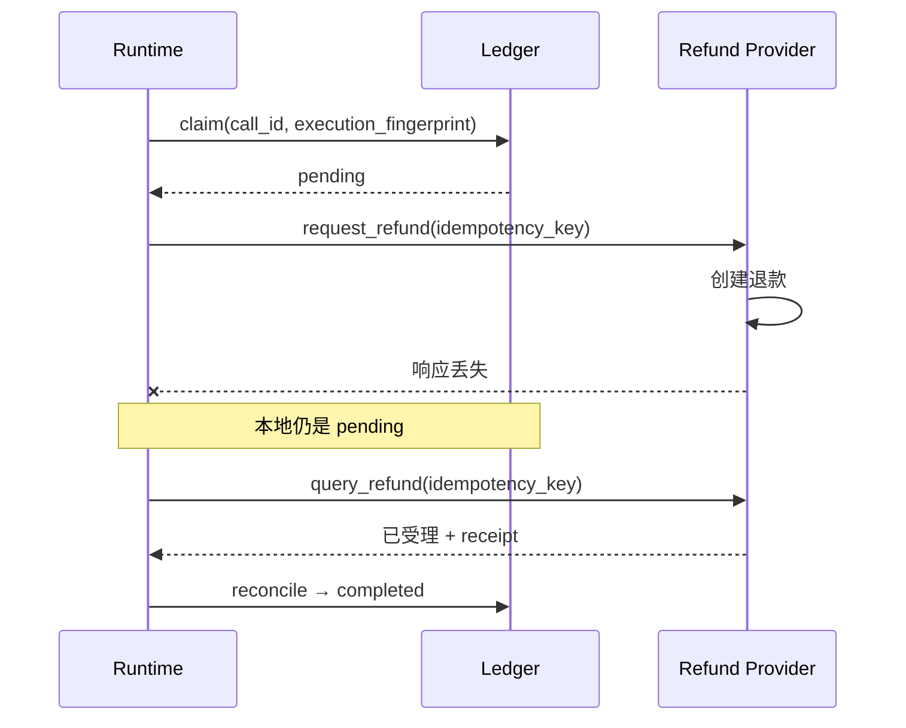

# Agent Runtime：一笔退款怎样只执行一次并安全收尾

<!-- learning-contract -->
<div class="learning-contract" markdown="1">

**学习导航**

- **适合读者**：需要实现工具调用、授权、审批与故障恢复的 Agent 工程师。
- **先修**：先读[一次 Agent 退款任务](agent-task-lifecycle.md)，理解动作提议、审批和完成验证。
- **首次阅读**：先运行退款实验，再依次理解 `pending`、执行身份、对账和事务发件箱。
- **完成信号**：面对工具超时，能判断何时可重试、何时必须查询远端状态。
- **卡住时**：运行[实验 6](../practice/labs/lab-6-agent-lifecycle.md)，只观察一次状态怎样变化。

</div>

**Agent 导航**：[总览](agents.md) · [任务主线](agent-task-lifecycle.md) · [架构](agent-architecture.md) · [Safe Agent 项目](../practice/projects/safe-agent.md)
{ .doc-nav }

上一章跟踪了这样一笔请求：

> “商品坏了，帮我退 300 元。”

模型正确提出了 `request_refund`，Schema、订单归属、权限与用户审批也都通过。退款服务随后受理了请求，
但响应在回程中丢失。本地只看到 timeout，远端却已经产生一笔退款。

这正是 Runtime 必须处理的情况。难点不在于让模型选对工具，而在于回答三个工程问题：

1. 模型提出的动作，怎样变成一个被授权且不会漂移的具体执行？
2. 本地不知道远端结果时，怎样避免第二笔退款？
3. 进程重启以后，系统从哪里继续，最后又凭什么告诉用户“退款成功”？

## 先运行：看失败怎样变成已确认 { #run }

从仓库根目录运行：

```powershell
python projects/safe-agent/refund_lifecycle.py
```

这是一个离线模拟，不会调用真实模型或支付服务。第一次阅读不必逐字段看完整 JSON，先找到下面五个阶段：

| 阶段 | 本地看到什么 | 远端退款次数 |
|---|---|---:|
| 跨租户反例 | 权限拒绝，Handler 没有执行 | 0 |
| 合法退款执行 | Handler 收到超时，本地账本保持 `pending` | 1 |
| 立即重放 | 账本阻止 Handler 再次执行，要求先对账 | 1 |
| 独立查询 | 回执中的订单、金额、原因和状态全部匹配 | 1 |
| 对账后重放 | 命中已确认结果，返回退款单号 | 1 |

输出中的 `execution.status` 是 `failed`，表示这次本地 Handler 调用没有拿到成功响应；
它不表示退款没有发生。与此同时，`local_ledger_state` 是 `pending`，而模拟支付服务的 `provider_effect_count` 已经是 1。

随后，验证器按同一个幂等键查询支付服务。回执匹配后，账本才进入完成状态，最终回答是：

> 退款已由支付服务确认受理，退款单号 refund-provider-7001。

接下来的章节都在解释：为什么这五个阶段能够保证 Handler 只尝试一次，并让未知结果最终得到确认。

## 先看事故发生在哪个窗口



`pending` 不是“失败”的别名。它表示执行权已经被领取，但系统还没有足够证据把业务结果写成成功或失败。
这个中间状态是恢复协议的起点。

## 工具契约不只是一张函数说明 { #tool-contract }

一个可执行工具至少要回答下面这些问题：

| 契约部分 | 退款例子 | 运行时为什么需要它 |
|---|---|---|
| 参数格式 | `order_id`、`amount_cents`、`reason` | 在接触业务系统前拒绝畸形动作提议 |
| 资源解析 | `order-1001 → tenant-shop-a/order@7` | 权限判断必须依赖服务端事实 |
| 所需能力 | `refund:request` | 模型不能给自己增加权限 |
| 副作用等级 | 不可逆 | 决定是否暂停等待审批 |
| 幂等协议 | 支付服务接受稳定幂等键并可查询 | 决定超时后能否安全恢复 |
| 返回与错误 | 回执、是否可重试、稳定错误码 | 让控制循环根据明确状态继续，而不是猜文本 |
| 预算 | 超时时间、速率、费用 | 防止一个任务无限消耗资源 |

参数应使用窄类型、枚举和 closed object。`options: object`、任意 URL、SQL 或 shell 字符串会把关键语义推迟到
handler 内部，审计者也无法知道审批时用户究竟同意了什么。

返回值同样要经过边界检查。Handler 可能返回一个仍可修改的 Python 对象，运行时会先把它编码成严格 JSON，
再保存一份独立快照。这样，调用方后来修改原对象时，缓存和调用账本不会跟着变化。

长文本、文件和模型工件更适合写入受控文件存储。工具结果只返回文件引用、哈希和必要摘要。

## 模型只提交动作提议 { #proposal }

Planner 可以根据对话生成：

```json
{
  "tool_name": "request_refund",
  "arguments": {
    "order_id": "order-1001",
    "amount_cents": 30000,
    "reason": "item_damaged"
  }
}
```

其中没有可信的 `subject_id`、`tenant_id`、capability、`call_id` 或 approval。它们来自认证网关、任务控制面
和审批服务。即使 Provider 声称输出符合 JSON Schema，Runtime 仍要在本地重新验证同一份契约。

“解析成功”只说明文本变成了 typed proposal。它没有授权调用，更没有证明订单存在、属于当前租户或仍处于
可退款状态。Prompt injection 防线也遵循同一原则：网页、邮件和工具结果都作为不可信 observation，权限决策
留在模型外。

仓库的 `JSONSchemaToolContract` 按 JSON Schema Draft 2020-12 校验参数。
规划器看到的工具说明和运行时使用的验证器，都从同一份固定 Schema 生成。

完整关键字、`format`、`$ref` 和大小限制见 [Safe Agent 项目页](../practice/projects/safe-agent.md)。
第一次阅读只需记住三个要求：两端来自同一份 Schema；Schema 有版本；执行前必须再次验证。

## 一次执行怎样通过运行时 { #runtime }

退款 proposal 进入 Runtime 后依次经过：

1. 找到 tool contract，验证 closed Schema。
2. 规范化参数，计算 proposal fingerprint。
3. 用可信 context 解析订单及其当前版本。
4. 执行 ACL/policy；不确定结果按 deny 处理。
5. 计算包含主体、资源和 policy 的 execution fingerprint。
6. 对高影响动作验证 approval 是否绑定这次 execution。
7. 检查工具次数、token、时间和费用预算。
8. 在持久 ledger 中原子 claim。
9. 调用 handler，随后验证并持久化结果。

这个顺序有意把副作用放在最后。跨租户订单、过期审批或耗尽预算的任务，都应在 provider attempt 仍为 0 时停止。

Cache replay 也要重新通过当前 ACL。用户被撤权以后，同一个 `call_id` 不应借旧 cache 取回敏感 payload。

## 四种身份分别解决什么问题

Runtime 中最容易混淆的不是状态，而是 identity：

| 标识 | 绑定内容 | 用途 |
|---|---|---|
| `call_id` | 一次逻辑动作 | 把重放认作同一次尝试 |
| 动作提议 fingerprint | 工具和规范化参数 | 判断模型提案是否改变 |
| 执行 fingerprint | 动作提议、任务、用户、租户，以及工具、资源和规则版本 | 绑定真正获授权的执行 |
| 远端幂等键 | 远端业务动作请求 | 让远端识别重复提交 |

只有 `call_id` 和 execution fingerprint 都相同，Runtime 才能考虑复用旧结果。若订单从 `order@7` 变成
`order@8`，或者 tool/policy 已升级，旧 approval 即使参数文本没变也必须失效。

Fingerprint 是稳定比较手段，不是授权或加密。低熵订单号的 hash 仍可能被猜中，敏感 payload 仍要最小化、
加密并限制访问。

## 审批批准的是执行，不是一句自然语言 { #approval }

用户看到“确认退款”时，审批服务至少要绑定：

```text
subject + task + call_id + execution_fingerprint + expiry
```

审批界面应显示订单、金额、原因、接收方和不可逆后果。

真正执行前，运行时会重新计算执行 fingerprint。参数、订单版本、用户、工具或权限规则只要有一项变化，
旧批准记录就会失效。

Checkpoint 与 approval 是两件工件。Checkpoint 说明任务暂停在哪里、已经花了多少预算；approval 说明谁在什么
时间授权了哪一个 execution。恢复 checkpoint 不能顺便把审批变成永久布尔值。

仓库的 `ApprovalGrant` 是进程内教学契约，不包含生产签名、approver 权限验证或跨服务 bearer token 设计。
项目页会把离线 grant 标成 `simulated_unsigned_fixture`，直白说明它只是未签名的模拟数据。

## Exactly-once 幻觉 { #exactly-once }

退款事故中的危险窗口很短：

```text
ledger = pending
→ provider 创建退款
→ Runtime 尚未写 completed 就崩溃
```

本地唯一约束只能阻止两个 worker 同时拥有同一 claim，无法把本地数据库与远端退款服务变成一个原子事务。
此时直接重试可能重复退款；永远不重试又可能让任务永久悬空。

可选协议取决于远端能力：

| 远端能力 | 恢复方法 |
|---|---|
| 接受幂等键且可查询 | 用原 key 查询 receipt，确认后 reconcile |
| 只接受幂等键 | 可按 provider 契约重放，但仍要保存 request identity |
| 支持 prepare/confirm | 先创建可确认意图，再显式提交 |
| 有可靠补偿动作 | 用 Saga 记录正向与补偿结果 |
| 无幂等、无查询、无补偿 | 停止自动化，交给人工核对 |

工程上更诚实的目标通常是 `at-least-once delivery + idempotent effect`，或者
`at-most-once attempt + reconciliation`。不要用“有 SQLite/Redis 锁”推出通用 exactly-once。

## 调用账本怎样保存不确定性 { #ledger }

一条调用至少需要区分：

| 状态 | 已知事实 | 下一步 |
|---|---|---|
| 未 claim | handler 尚未获得执行权 | 可尝试 claim |
| `pending` | 可能已经触达远端，结果未确认 | 查询或人工 reconciliation |
| `completed` | 结果已验证并持久化 | 重新授权后可返回 cache |
| `abandoned` | 操作者确认旧动作不再继续 | 新意图使用新 `call_id` |
| `compensated` | 原 effect 发生，随后执行了补偿 | 保留两次业务动作的记录 |

超时后保持 `pending`，可以阻止重启进程再次进入 Handler。验证器使用可信的幂等键查询退款服务，
再逐项核对订单、金额、原因和支付服务状态。

只有回执全部匹配，账本才写成 `completed`。此后的重复调用会读取已确认结果；远端退款次数仍然是 1。

`abandoned` 和 `compensated` 都不是删除历史。补偿本身是一次新业务动作，可能失败、收费，也可能无法撤回已经
传播的信息。

## 事务发件箱解决哪一段问题 { #transactional-outbox }

当“修改本地业务状态”和“稍后向远端发送 effect”必须一起成立时，可把业务行与 outbox row 写进同一个数据库事务：

```text
pending --claim lease--> claimed --ack receipt--> delivered
   ^                         |
   +---- lease expired ------+--retryable--> pending
                             +--terminal----> dead_letter
```

发件箱保证本地事务提交后，待发送记录仍然存在，但远端服务并没有加入这个本地事务。
如果工作进程在远端成功、本地确认前崩溃，租约到期后，同一条记录会被重新投递。
因此，每次投递都要复用稳定的 `effect_id`，远端服务也必须按照这个值执行幂等处理。

Dead letter 不是“多试几次”的队列。操作者要根据 runbook 判断是修正后产生新事件、执行补偿，还是保留失败终态。

## 超时、取消和重试怎样决定 { #timeout }

| 观察 | 能否自动重试 | 原因 |
|---|---|---|
| Schema 或权限拒绝 | 否 | 请求本身不合法，重试不会改变事实 |
| 明确未发送的连接失败 | 视契约而定 | 可以确定远端未看到 effect 时风险较低 |
| 发送后的读取 timeout | 先查询 | 远端 outcome 未知 |
| 429 | 遵守 `Retry-After` 与总 deadline | 防止 retry storm 和预算失控 |
| 用户取消本地协程 | 不能据此重试 | 取消不证明远端动作停止 |
| Provider 返回稳定 terminal error | 否 | 保存错误码并结束或转人工 |

重试策略还要包含最大次数、指数退避、jitter 和总 deadline。Provider request ID 应进入 trace，方便查询远端状态。

## 并发、版本与重新规划

多个只读工具可以并行，写工具则要声明冲突域，例如 `order:1001` 或 `account:42`。可用数据库锁、队列单写或
optimistic version 控制并发；模型输出的步骤顺序本身不提供互斥。

工具读取资源时返回 version/ETag，后续更新携带 `if_match`。发生冲突时重新 observation 和 replan。
由于 execution identity 已改变，旧 approval 也随之失效。

## 沙箱、秘密与审计 { #sandbox }

Runtime 的安全边界还包括：

- 代码、shell 和浏览器工具限制文件根、网络域、CPU、内存、时间与输出大小；
- secret 由工具代理注入，不进入 prompt 或普通 observation；
- 高敏工具使用独立 worker 与凭据；
- 轨迹记录任务与调用 ID、用户、工具与规则版本、动作提议、授权、审批、领取结果、远端请求 ID 和状态变化；
- 敏感 payload 单独加密并按 retention 删除，高基数 call ID 留在 trace 而非指标 label。

这些措施各自解决不同问题。输出扫描用于发现可能的泄漏，最小权限负责限制数据和能力；
沙箱约束代码能够做什么，退款授权则由身份、资源和审批规则判断。

## 在仓库里运行两种恢复

前面的退款主线执行了封闭参数校验、资源级权限检查、审批绑定、SQLite 调用领取，以及支付服务回执查询。
规划器和支付服务都是进程内模拟器，因此适合观察控制流和状态变化。

修改这条链路后，运行对应测试：

```powershell
python -m pytest tests/test_agent_refund_lifecycle.py -q
```

真实支付系统还要继续验证服务身份、网络错误、签名、账务和对账流程。

再运行 outbox 的 ack-before-crash 场景：

```powershell
python projects/safe-agent/outbox_demo.py `
  --database artifacts/agent/outbox-demo-001.db
```

预期会看到两次远端请求继续使用同一个幂等键。模拟服务只产生一个业务效果，最终投递状态为 `delivered`。
完整测试矩阵、SQLite 固定故障样例以及每个字段适用于哪些结论，见
[Safe Agent 项目页](../practice/projects/safe-agent.md)和[项目控制台账](../evidence/project-controls.md)。

## 自测

1. 为什么本地唯一 `call_id` 仍不能阻止远端重复退款？
2. Proposal fingerprint 相同、订单 version 改变时，旧 approval 为什么必须失效？
3. Runtime 收到读取 timeout 后，哪项证据才能把 `pending` 改成 `completed`？
4. Outbox worker 的 lease 为什么不能证明另一个 request 没有到达 provider？
5. 用户撤权以后，为什么 cache replay 仍要重新执行 ACL？
6. “取消本地 task”“远端停止工作”“停止计费”为什么是三个不同事实？
