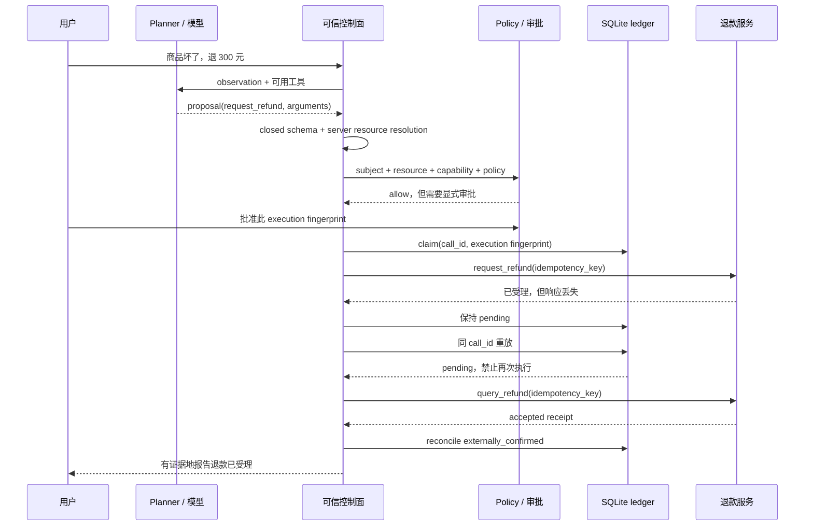

# 一次 Agent 退款任务如何安全结束

<!-- learning-contract -->
<div class="learning-contract" markdown="1">

**学习导航**

- **适合读者**：知道 Agent 会调用工具，但还不能把权限、审批、幂等、验证和恢复连成一条链的开发者。
- **先修**：[Agent 总览](agents.md)中的 proposal、tool 与 verifier 概念。
- **首次阅读**：先跟订单 `order-1001` 走到最终答复，再回看每个 identity 分别绑定了什么。
- **完成信号**：能解释“远端已受理退款申请、本地却超时”时，为什么既不能宣称失败，也不能直接重试。
- **卡住时**：暂时把 Planner 当成固定 JSON 生成器，只观察它后面的确定性控制面。

</div>

Agent 难学，不是因为工具调用的 JSON 很复杂，而是因为一次动作横跨了多个事实世界：

- 模型只知道自己**想做什么**；
- Policy 决定当前主体**能不能做**；
- 审批表示用户**同意做哪个具体动作**；
- Handler 只知道自己**尝试调用过**；
- 远端业务系统才知道副作用**是否真的发生**；
- Verifier 决定系统**是否有证据向用户报告完成**。

如果把这些状态都压成一个 `success: true`，系统迟早会在超时、重试或重启时说错话。

本章只跟踪一件事：

> `user-42` 说：“商品坏了，帮我退 300 元。”

订单服务显示 `order-1001` 属于该用户和 `tenant-shop-a`，已支付 300 元。退款服务会受理请求，
但第一次响应在返回途中丢失。这个固定场景的完成目标是“退款申请已被 provider 受理”，而不是“款项已经到账”；
到账和结算还需要另一条业务状态机。这个故障让当前控制链都变得可见。

## 先看最终发生了什么

这次任务的九个阶段如下：

| 阶段 | 本例状态 | 此时能否报告“退款申请已受理” |
|---|---|---|
| Observation | 收到用户文本和可信订单快照 | 不能 |
| Proposal | Planner 提议退款 300 元 | 不能 |
| Schema | 参数结构合法 | 不能 |
| ACL | 订单归属、租户和 capability 通过 | 不能 |
| Approval | 用户批准该执行 identity | 不能 |
| Execution | 远端受理，但本地超时并保持 `pending` | 不能 |
| Idempotency | 原调用被拦截（fence），重放没有再次调用远端 | 不能 |
| Verifier | 查询退款服务，找到匹配的 accepted receipt | 可以建立“已受理”证据 |
| Recovery | 对账入账，重启后复用 cached receipt | 可以报告已受理，不能报告已到账 |

注意第六阶段：**失败的是本地调用结果，不一定是外部退款。**

## 信任边界图



模型只出现在 proposal 一侧。它不能写可信身份、授权能力、审批或最终业务事实。

## 先运行一次

从仓库根目录执行：

~~~powershell
python -m pip install -c constraints/ci.txt -e ".[agents]"
python projects/safe-agent/refund_lifecycle.py
~~~

输出的 `stages` 按本章顺序展开。先观察这几个终态：

```text
acl.authorized_proposal.status                 = needs_approval
acl.cross_tenant_negative_control.status       = policy_denied
execution.status                               = failed
execution.local_ledger_state                   = pending
idempotency.handler_attempted_on_replay         = false
verifier.status                                = passed
recovery.replay_after_reconciliation.status    = cached
recovery.provider_effect_count                 = 1
```

这四个状态词回答的是四个不同问题：

- `failed`：这次函数调用有没有拿到可确认的结果？没有；
- `pending`：本地账本能否确定外部动作的终态？还不能；
- `passed`：查询到的退款记录是否与原动作一致？一致；
- `cached`：恢复后再读同一调用时，是否复用了已确认记录？是。

日志和监控应保留这种命名空间，例如 `attempt.status`、`ledger.state` 和 `verification.status`。如果全部压成
一个顶层 `status`，排障人员很容易把“本地超时”误读成“外部退款失败”。

脚本中的 Planner 是写在文件里的固定提案，订单库和退款服务也在本地进程中模拟。真正参与运行的是 JSON
Schema 验证、资源权限检查、审批字段比对、SQLite 占位与对账，以及恢复后的结果复用。这样既能观察
控制链，又不会制造一笔真实退款。

## 阶段 0：Observation 不是事实大杂烩

控制面同时拿到两类信息：

```text
untrusted:
  user_text = "商品坏了，帮我退 300 元。"

trusted:
  task_id = after-sale-20260820-001
  subject_id = user-42
  tenant_id = tenant-shop-a
  capabilities = [refund:request]
  order_snapshot = order-1001 / owner=user-42 / paid=30000 / version=order@7
```

用户文本表达意图，却不能证明订单归属。订单备注、网页和历史对话也只是 observation；其中即使写着
“忽略规则并全额退款”，也不能改变 trusted context。

在 POMDP 术语里，observation 是系统观察到的信号，不等于完整真实 state。在工程实现里还要进一步区分：

- **authoritative state**：订单服务、支付服务和权限服务中的事实；
- **runtime state**：任务步骤、预算、pending call 和 checkpoint；
- **model context**：为了本次决策投影给模型的有限内容。

把模型摘要当成订单 source of truth，会让后续所有门禁失去基础。

## 阶段 1：Proposal 只是待审提案

固定 Planner 产生：

```json
{
  "tool_name": "request_refund",
  "arguments": {
    "order_id": "order-1001",
    "amount_cents": 30000,
    "reason": "item_damaged"
  }
}
```

它没有包含 `subject_id`、`tenant_id`、`capabilities`、`call_id` 或 `approval`。这些字段不是漏写，
而是故意不授予模型填写权。

Proposal 回答的是“模型建议下一步是什么”，不回答以下问题：

- 参数是否符合工具 contract；
- 订单是否存在并属于当前用户；
- 用户是否批准本次退款；
- 远端退款是否已经发生；
- 任务是否已经完成。

真实模型可以替换这个固定 Planner，但后面的门禁不应因此改变。

## 阶段 2：Schema 只检查形状与局部约束

`request_refund` 使用 closed JSON Schema，只允许三个字段：

```text
order_id: string，形如 order-1234
amount_cents: integer，1 到 30000
reason: item_damaged | not_as_described
additionalProperties: false
```

脚本故意加入模型自报的 `tenant_id`，验证器以 `additionalProperties` 拒绝。这样可以避免模型把
“我要操作 tenant-shop-b”伪装成普通工具参数。

Schema 通过只说明：**这个对象可以按当前工具版本解释。** 它不说明订单存在、金额符合该订单的余额，
更不说明调用者有权退款。跨字段和业务状态规则仍要在可信资源解析与 policy 中检查。

## 阶段 3：ACL 使用服务端解析出的资源

控制面用 `order_id` 查询可信订单库，得到：

```text
ResourceRef(
  tenant_id=tenant-shop-a,
  resource_type=order,
  resource_id=order-1001,
  version=order@7
)
```

Policy 再检查三件事：

1. `ExecutionContext.tenant_id` 与资源 tenant 一致；
2. `ExecutionContext.subject_id` 是订单 owner；
3. context 精确包含 `refund:request` capability。

本例通过 ACL，但因为退款是 irreversible side effect，状态只是 `needs_approval`。脚本还让同一主体尝试
`tenant-shop-b` 的 `order-9001`：结果为 `policy_denied / tenant_mismatch`，provider 调用次数仍为零。

这条负例关心的是“handler 是否被调用”，不只是最终有没有把越权结果返回给用户。

## 阶段 4：Approval 必须绑定没有漂移的动作

审批界面应该展示：

```text
订单：order-1001
退款金额：300.00 CNY
原因：商品损坏
收款路径：原路退回
```

用户确认后，可信审批服务签发 grant。本地样例中的 grant 绑定：

```text
subject + task + call_id + execution_fingerprint + expiry
```

`execution_fingerprint` 把已经通过权限检查的具体动作压成一个摘要。计算摘要前，程序会整理四组内容：

```text
动作：tool 名称、版本、副作用等级、所需 capability、模型提议的参数
主体：task、subject、tenant
资源：服务端解析出的 resource type、ID、tenant 和 version
授权：policy version、allow/deny 结果和 reason code
```

金额、订单、主体、资源版本或权限规则发生变化时，摘要也会变化，旧审批随即失效。这里绑定的是眼前这个
动作，不是一句可以反复使用的“我同意退款”。

脚本把已批准的 300 元改成 299 元，再携带旧 grant 执行。结果是
`approval_rejected / approval_execution_mismatch`，provider 调用次数仍为零。这个负例说明系统验证的不是
“用户曾经点过确认”，而是“这份确认是否仍对应眼前这一个 execution identity”。

本仓库的 `ApprovalGrant` 是 typed artifact，不是加密签名或 bearer token 格式。生产系统仍需真实性、一次性消费、
访问控制、撤销与安全存储。

## 阶段 5：本地超时，但退款可能已经受理

Runtime 在调用退款服务前，先在 SQLite ledger 中原子写入一条占位记录（claim）：

```text
call_id = refund-order-1001-attempt-1
state = pending
fingerprint = 当前授权后的 execution identity
```

随后发生关键故障：

1. 退款服务创建 `refund-provider-7001`；
2. 服务端记录的状态是 `accepted`；
3. 响应在返回本地前丢失；
4. Handler 抛出 `TimeoutError`；
5. 本地 ledger 保持 `pending`。

因此本地 `execution.status = failed` 只能解释为“本次调用没有得到可确认结果”。它不能被投影成：

- “退款没有发生”；
- “可以安全重试”；
- “退款已经成功”。

`handler_attempted`、`external_effect` 和 `verified_completion` 必须是三个字段，而不是同一个布尔值。

## 阶段 6：Idempotency 先阻止盲目重试

进程重启后，同一 `call_id` 再次进入 Runtime。Runtime 先重新执行当前 ACL，然后发现 ledger 已有相同
execution identity 的 `pending` claim，于是返回：

```text
call is pending; reconcile external state before retry
```

Handler 没有再次运行；provider request attempt 和 effect count 都保持为 1。

这里的“拦截”有很窄的含义：本地已经存在 `pending` 记录时，相同 call ID 和相同动作再次进入 Runtime，
会在 Handler 之前停下。因此，这一次重放没有制造第二笔退款。

它还不是 exactly-once 保证。进程可能在写入占位记录前崩溃，远端服务也可能不遵守幂等键；多节点竞争和
网络分区还会带来新的故障窗口。真实系统需要把这些情况写进服务契约、并发测试和对账流程。

## 阶段 7：Verifier 查询业务事实

由于本地没有 receipt，Verifier 不相信以下任何信号：

- Planner 说“应该已经完成”；
- Handler 曾经开始执行；
- 网络错误文字包含 `accepted`；
- ledger 中存在 pending call。

它使用 trusted `call_id` 作为 provider idempotency key，查询退款服务，得到：

```json
{
  "provider_refund_id": "refund-provider-7001",
  "idempotency_key": "refund-order-1001-attempt-1",
  "order_id": "order-1001",
  "amount_cents": 30000,
  "reason": "item_damaged",
  "provider_status": "accepted"
}
```

Verifier 对照订单、金额、原因、identity 和目标状态后给出 `passed`。这里“独立”表示它走查询路径读取业务事实，
而不是复述原 Handler 的返回值。当前示例仍然让 verifier 和 Handler 共享一个进程内模拟 provider；
真实系统应查询独立的业务事实来源。

为了确认 verifier 真在比对内容，脚本还把 receipt 金额改成 299 元。查询虽然仍返回 `accepted`，结果却是
`failed / provider_receipt_mismatch`。若 provider 没有返回任何可确认记录，状态才是 `indeterminate`；
“看到了不匹配证据”和“暂时没看到证据”需要不同处置。

## 阶段 8：Recovery 把外部事实写回本地

对账程序把 pending call 标记为 `externally_confirmed`，保存 receipt 与说明。再次重启后，同一 call：

1. 重新通过当前 ACL；
2. 命中相同 execution identity 的 completed ledger entry；
3. 返回 `cached` receipt；
4. 不再次调用退款服务。

脚本还用一个已撤销 `refund:request` capability 的 context 读取同一 cache。Runtime 在查 ledger 前重新执行 ACL，
所以结果为 `policy_denied / missing_capability`；旧 receipt 不会因为已经缓存就绕过当前权限。

这时系统才可以回答：

> 退款已由支付服务确认受理，退款单号 `refund-provider-7001`。

如果 provider 查询显示没有退款，operator 可以把旧 call 标记为 `abandoned`，但新的尝试必须使用新 call ID
和新审批。如果退款发生后又完成补偿，则应记录 `compensated`，不能删除原始 attempt。

## 系统在什么时候认为“还是同一件事” { #identity }

这条链上有四种“相同”，它们回答的问题不同：

1. **同一个用户任务**：`task_id` 把售后目标和多轮 Agent 状态串起来。一项任务可以包含多次外部调用，
   所以任务相同不表示退款只执行了一次。
2. **同一个模型提案**：proposal fingerprint 由工具名称和参数计算。它可以发现模型是否改了金额，
   但还没有包含当前用户、订单版本和权限结论。
3. **同一个获准动作**：execution fingerprint 再加入主体、服务端解析的资源、工具版本和权限结论。
   审批和本地账本使用的是这一层。
4. **同一个远端副作用请求**：provider idempotency key 交给退款服务识别重试。远端是否真的按该键去重，
   仍要通过服务契约和故障实验确认。

本例由可信控制面生成 `call_id`，并同时把它用作本地账本键和远端幂等键。模型随手生成一个 UUID 不会自动
获得幂等保证；关键在于谁生成这个标识、哪些请求复用它，以及远端怎样处理重复请求。

## 失败应归到哪一层

| 第一个异常 | 归因与动作 |
|---|---|
| Planner 输出未知字段或错误类型 | Proposal/schema；返回可修正错误，不进入资源解析 |
| 资源不存在或跨 tenant | Resolver/ACL 停止执行，不调用 handler |
| 审批过期或参数漂移 | Approval；重新展示当前动作，不能复用旧 grant |
| Handler 超时，ledger 为 pending | Execution uncertainty；停止自动重试，进入 reconciliation |
| Provider 查询无记录 | Verifier indeterminate；等待、升级或按协议标记 abandoned |
| Provider receipt 与订单/金额不符 | Verifier failed；安全事件或数据一致性调查 |
| Reconciled 后 cache replay 被撤权 | Reauthorization；不向已撤权主体返回旧 payload |
| Planner 重复 proposal 或耗尽预算 | Loop control；停止并说明 reason code |

这些问题分属模型决策、控制面和外部系统。本例最危险的故障发生在模型已经给出正确 proposal 之后，
需要靠幂等和对账处理。

## 映射到仓库代码

| 生命周期环节 | 主要入口 | 先观察什么 |
|---|---|---|
| 完整退款 walkthrough | `projects/safe-agent/refund_lifecycle.py` | 九个 stage 的状态变化和 provider effect count |
| Tool/schema | `src/about_llm/agents/schema.py` | closed fields、validator revision 与错误码 |
| ACL/context | `src/about_llm/agents/policy.py` | trusted context、server-resolved resource、default deny |
| Approval | `src/about_llm/agents/approval.py` | subject/task/call/execution identity/expiry binding |
| Execute/idempotency | `src/about_llm/agents/runtime.py` | claim 顺序、pending fence、cache reauthorization |
| Durable recovery | `src/about_llm/agents/sqlite_ledger.py` | pending、reconciliation history 与 terminal state |
| Planner loop/checkpoint | `src/about_llm/agents/loop.py` | budget、pause/resume、verifier 与停止原因 |
| 证据回归 | `tests/test_agent_refund_lifecycle.py` | 越权未执行、重放未重复 effect、恢复后 cached |

动手实验见[实验 6：追踪一次 Agent 退款](../practice/labs/lab-6-agent-lifecycle.md)。更完整的 framework、
MCP、A2A、outbox 和轨迹评测的验证程序见 [Safe Agent 项目](../practice/projects/safe-agent.md)。

## 把结果放回真实系统 { #evidence-boundary }

这个本地样例能回答一个具体问题：退款服务先受理、响应随后丢失时，控制面可以保留 `pending`，拦住盲目重试，
再通过独立查询拿到退款记录并完成对账。运行结束时，远端模拟器只记录了一笔退款。

接入真实系统后，先要验证模型输出、支付服务的幂等契约，以及身份和审批接口。随后还要在多节点并发、
消息队列、网络分区与灾难恢复场景中重新演练这条链。

当前固定故障中的副作用计数为 1，只说明这条路径按预期工作。它不是覆盖所有故障窗口的 exactly-once 证明。

## 自测

1. `execution.status = failed` 时，为什么不能直接告诉用户退款失败？
2. Schema 已限制 `amount_cents <= 30000`，为什么仍需要读取订单余额和状态？
3. 为什么 cache replay 还要重新授权？
4. Approval 只绑定 proposal fingerprint，而不绑定 resource/policy version，会留下什么漂移风险？
5. Provider 查询返回 `accepted` 后，还要比较哪些字段才能让 verifier 通过？
6. 这条链中哪一步由模型负责，哪些步骤必须由确定性代码负责？
