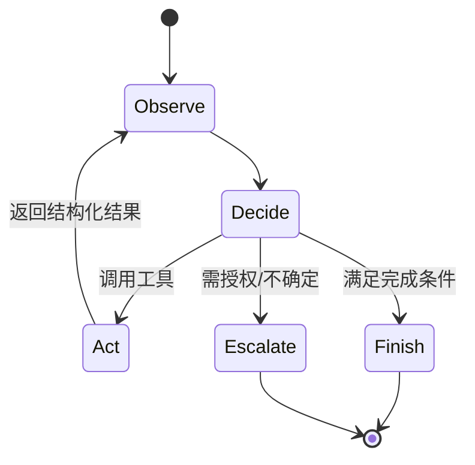

# Agent 与工具使用

本章是全局概览。工程深入阅读[Agent 架构、规划与记忆](agent-architecture.md)、[工具协议、幂等与故障恢复](agent-runtime.md)以及[Agent 评测、仿真与红队](../quality/agent-evaluation.md)。

## 定义

Agent 是让模型在循环中观察状态、选择动作、调用工具、读取结果并继续，直到完成或停止的系统。它不是“拥有自主意识”，而是概率模型驱动的受约束执行器。固定、确定的业务流程优先用普通代码/状态机，只在需要语言理解和开放决策处使用模型。

## 工具设计

工具应单一职责，名称与字段清晰，使用严格 schema。描述副作用、前置条件、权限、成本和典型错误。返回结构化数据、稳定错误码和必要 provenance，避免把巨大原始输出塞回上下文。

模型提出工具调用，外部执行层必须验证：身份与权限、参数类型/范围、资源归属、幂等键、速率/金额限制和当前状态。模型永远不是授权源。

## 规划模式

- ReAct：交替推理与动作，灵活但循环长、轨迹易漂移。
- Plan-and-execute：先计划再执行，适合多步任务，但计划可能很快过时。
- Router/workflow：模型只选择预定义分支，可靠且易审计。
- 多 Agent：按角色分工或互相评审，增加多样性，也增加成本、协调失败和共享错误。

能用一个 Agent 完成时不要为了拟人叙事拆成多个。选择依据是工具/权限隔离、上下文隔离、并行性和独立验证价值。

## 状态与记忆

- 工作记忆：当前上下文和中间结果。
- 情节记忆：过去交互/事件。
- 语义记忆：抽取后的稳定事实。
- 程序记忆：技能、规则和工作流。

记忆写入需用户可见、可编辑/删除、带来源和过期策略。模型总结可能写错；关键事实要回链原事件。检索记忆时执行 ACL，避免跨用户污染。

## 停止与恢复

设置最大步数、token/时间/费用预算、重复动作检测和无进展检测。每步持久化状态与工具结果，使崩溃后可恢复。外部副作用使用 prepare/confirm/execute 或 saga/补偿事务；恢复时先查询执行状态，不能盲目重放。

## 人在回路

以下通常需要明确确认：付款、删除、发布、发送消息、修改权限、提交代码、处理高敏数据或不可逆操作。确认界面展示具体动作、对象、影响和参数，而不是模糊的“继续吗”。不要把“用户最初要求完成目标”当作对所有未来副作用的授权。

## 安全

工具输出、网页、邮件和文档都可能包含提示注入。使用最小权限、网络/文件沙箱、域名 allowlist、秘密隔离、输出净化和审批。高权限凭证不进入模型上下文；工具代理代表用户验证授权。

## 评测

除最终成功率，还测步骤数、工具选择、参数正确、恢复、重复副作用、权限越界、注入抵抗、成本和延迟。建立可重放环境和模拟工具；线上真实副作用不能作为日常回归测试。

## 自测

1. 为什么“让模型先问用户确认”不能代替执行层权限检查？
2. Agent 崩溃重启后，如何避免重复转账？
3. 什么情况下状态机比 Agent 更适合？
