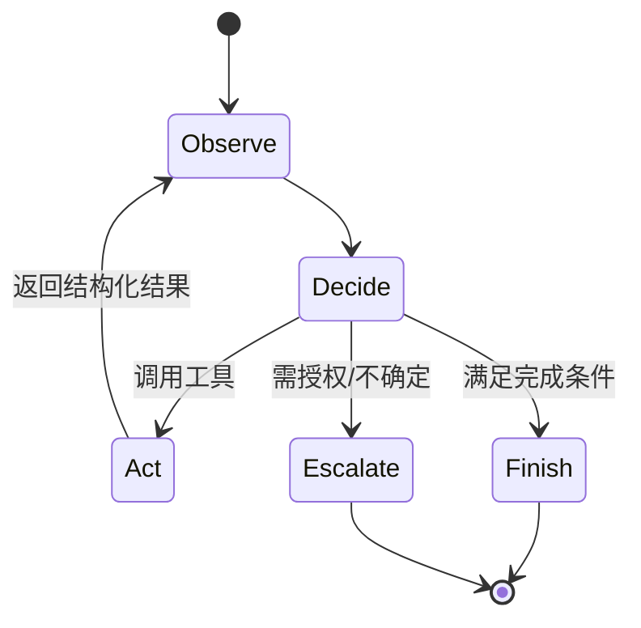

# Agent 与工具使用

<!-- learning-contract -->

**学习导航**

- **适合读者**：第一次判断是否需要 Agent 的应用工程师和产品人员。
- **先修**：理解模型输出可能错误；不要求先懂 MCP 或复杂规划。
- **首次阅读**：定义 → 工具 → 状态/记忆 → 停止/恢复 → 安全 → 评测。
- **完成信号**：能区分普通程序、Workflow 和 Agent，并列出信任边界。
- **卡住时**：先读[Prompt 输出契约](prompting.md)，再进入 Agent 状态机。

本章是全局概览。工程深入阅读[Agent 架构、规划与记忆](agent-architecture.md)、[工具协议、幂等与故障恢复](agent-runtime.md)、[MCP、A2A 与内部契约](agent-interoperability.md)以及[Agent 评测、仿真与红队](../quality/agent-evaluation.md)。

## 定义

Agent 是让模型在循环中观察状态、选择动作、调用工具、读取结果并继续，直到完成或停止的系统。它不是“拥有自主意识”，而是概率模型驱动的受约束执行器。固定、确定的业务流程优先用普通代码/状态机，只在需要语言理解和开放决策处使用模型。

## 工具设计

工具应单一职责，名称与字段清晰，使用严格 schema。描述副作用、前置条件、权限、成本和典型错误。返回结构化数据、稳定错误码和必要 provenance，避免把巨大原始输出塞回上下文。

模型提出工具调用，外部执行层必须验证：身份与权限、参数类型/范围、资源归属、幂等键、速率/金额限制和当前状态。模型永远不是授权源。

结构化参数/结果的评测也不能只有“JSON 可解析率”。推荐分开 strict syntax、schema、expected parsed value 与业务 policy：strict parser 拒绝 duplicate object key 和 `NaN/Infinity`；schema 检查类型/required/additional fields；value exact 只适合唯一 gold，且要明确 object key order、array order 与 integer/float policy；resolver 再验证 tenant、资源、单位、版本与权限。仓库 Evaluation Gate 的 `json_schema` v2 和 `json_value_exact` v1 只覆盖前述 schema/value 层，**不等于业务语义**或执行授权。

框架 adapter 也属于这个边界。仓库用真实 LangChain `StructuredTool` 与 LlamaIndex `FunctionTool` 把同一 strict 参数模型转换为 proposal，再由 canonical runtime 处理可信 tenant/capability、资源解析、policy 和 call-id cache。固定负例显示当前两个 direct tool API 对 schema 的执行行为并不相同，因此 planner schema、framework invocation 和 effect authorization 必须分别测试；运行入口与精确版本边界见 [Safe Agent framework tool adapters](../practice/projects/safe-agent.md#framework-tool-adapters)。

另一条 control 才执行真实 framework Agent loop：LangChain `create_agent()`/LangGraph 与 LlamaIndex `FunctionAgent.run()` 都经过 model→tool→model，并让独立 verifier 拒绝“policy denied/unknown tool 之后模型仍声称成功”的文本。这里的 model 是确定性进程内 fixture；LangChain 注入 framework call ID，当前 LlamaIndex handler 收不到 selection ID，只能使用可信 fixture action 派生 identity。它证明本地控制流接线，不证明真实模型、provider、网络、异步/恢复、框架默认授权或生产安全；运行入口见 [Safe Agent framework Agent loops](../practice/projects/safe-agent.md#framework-agent-loops)。

## 规划模式

- ReAct：交替推理与动作，灵活但循环长、轨迹易漂移。
- Plan-and-execute：先计划再执行，适合多步任务，但计划可能很快过时。
- Router/workflow：模型只选择预定义分支，可靠且易审计。
- 多 Agent：按角色分工或互相评审，增加多样性，也增加成本、协调失败和共享错误。

能用一个 Agent 完成时不要为了拟人叙事拆成多个。选择依据是工具/权限隔离、上下文隔离、并行性和独立验证价值。

## 状态与记忆

- 工作记忆：当前上下文和中间结果。
- 情节记忆：过去交互/事件。
- 语义记忆：抽取后的稳定事实。
- 程序记忆：技能、规则和工作流。

记忆写入需用户可见、可编辑/删除、带来源和过期策略。模型总结可能写错；关键事实要回链原事件。检索记忆时执行 ACL，避免跨用户污染。

## 停止与恢复

设置最大步数、token/时间/费用预算、重复动作检测和无进展检测。每步持久化状态与工具结果，使崩溃后可恢复。外部副作用使用 prepare/confirm/execute 或 saga/补偿事务；恢复时先查询执行状态，不能盲目重放。

## 人在回路

以下通常需要明确确认：付款、删除、发布、发送消息、修改权限、提交代码、处理高敏数据或不可逆操作。确认界面展示具体动作、对象、影响和参数，而不是模糊的“继续吗”。不要把“用户最初要求完成目标”当作对所有未来副作用的授权。

## 安全

工具输出、网页、邮件和文档都可能包含提示注入。使用最小权限、网络/文件沙箱、域名 allowlist、秘密隔离、输出净化和审批。高权限凭证不进入模型上下文；工具代理代表用户验证授权。

## 互操作

MCP 主要连接 AI 应用与 tools/resources/prompts，A2A 主要连接独立 Agent 的发现、任务和 artifact。协议提高可组合性，不建立业务信任：发现到的工具、Agent Card、远端状态和 artifact 都是待验证声明，仍须经过本地 identity、ACL、policy、approval、budget 和 verifier。

仓库的 official-SDK memory control 使用 `mcp==1.29.0` 的 client、low-level server、generated types 与 JSON Schema validation，协商 MCP 2025-11-25。schema-invalid 参数在应用 handler 前拒绝；但未列出的工具名仍进入应用 `call_tool` handler，再由应用 allowlist fail closed。它没有执行 stdio/HTTP、远程网络、认证或授权；运行入口见[互操作章节](agent-interoperability.md#mcp-sdk-memory-control)。

独立的 official-SDK stdio control 让官方 `stdio_client` 启动使用官方 `stdio_server` 的独立子进程，通过真实 OS pipe 执行同一 schema/unknown-tool 序列。它同时建立 reviewed SDK 与本地 stdio 集成证据，但没有注入畸形 raw framing、强制 shutdown/cancel，也不证明 conformance、认证授权、远程或跨厂商互操作；运行入口见[互操作章节](agent-interoperability.md#mcp-sdk-stdio-control)。

official-SDK Streamable HTTP control 则让官方 client 连接独立 subprocess 中的官方 session manager/low-level server，在真实 IPv4 loopback TCP/HTTP 上执行 stateful POST/GET SSE 与 DELETE。它把 SDK 与 HTTP transport 放在同次运行，但私有 readiness/shutdown token 不是 MCP auth，也没有 malformed body、Host/Origin、resumption、TLS/OAuth、远程或 conformance 证据；运行入口见[互操作章节](agent-interoperability.md#mcp-sdk-streamable-http-control)。

仓库的 authored strict MCP 2025-11-25 stdio control 也会真实启动本地 server 子进程，执行 initialize → initialized → tools/list → tools/call，并额外锁定 LF/UTF-8/duplicate/nonfinite/byte-cap framing 与 tool/protocol error 分层。它只证明自写固定子集，不继承官方 SDK 身份，也不证明网络认证、A2A 或跨厂商互操作；运行入口见[互操作章节](agent-interoperability.md#mcp-stdio-control)。

独立的 Streamable HTTP control 在真实 IPv4 loopback TCP/HTTP 上执行单 endpoint POST JSON/SSE、GET SSE、Origin/Bearer header gate、session/version、显式 cancellation 与 DELETE。它没有官方 MCP SDK/完整 conformance、OAuth、TLS、远程 server、SSE 恢复或业务授权证据；运行入口见[互操作章节](agent-interoperability.md#mcp-streamable-http-control)。

仓库的 A2A 1.0 loopback control 另用官方 Python SDK 1.1.2，在真实 IPv4 loopback TCP/HTTP 上执行 Agent Card discovery、JSON-RPC `SendMessage`/`GetTask`、legacy/version 错误与可选冻结官方 Schema 校验，并把 remote completed 与本地 verifier 分开。它仍不证明 TCK/完整 conformance、SSE、REST/gRPC、TLS、认证、签名 card、远程或跨厂商互操作；运行入口见[互操作章节](agent-interoperability.md#a2a-loopback-control)。

## 评测

除最终成功率，还测步骤数、工具选择、参数正确、恢复、重复副作用、权限越界、注入抵抗、成本和延迟。建立可重放环境和模拟工具；线上真实副作用不能作为日常回归测试。

## 自测

1. 为什么“让模型先问用户确认”不能代替执行层权限检查？
2. Agent 崩溃重启后，如何避免重复转账？
3. 什么情况下状态机比 Agent 更适合？
