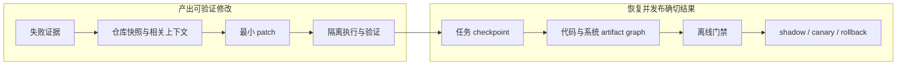
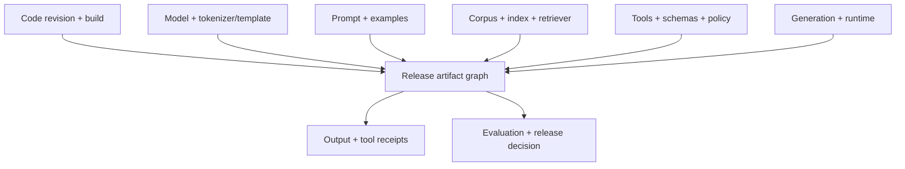

# 代码 Agent、任务状态与 LLMOps

<!-- learning-contract -->
<div class="learning-contract" markdown="1">

**学习导航**

- **适合读者**：构建代码 Agent、长任务对话系统和 LLMOps 平台的开发者。
- **先修**：软件测试、版本控制、[Agent 任务主线](agent-task-lifecycle.md)和[评测总览](../quality/evaluation.md)。
- **首次阅读**：跟着一次重复退款修复，依次完成仓库定位、最小 patch、任务恢复和分阶段发布。
- **完成信号**：能指出一次发布所对应的 base revision、patch、验证证据、任务状态和生产 artifact graph。
- **卡住时**：先只画出 `失败证据 → patch → 测试 → commit → canary`，再补对话记忆与运行追踪。

</div>

用户在长对话中提出：“退款服务在重试后提交了两次，请修复并帮我发布。”

这不是一次普通补全。代码 Agent 要锁定仓库版本，复现失败，找到重复副作用的来源，生成最小 patch，
再让测试和审查程序验证修改。任务可能在中途暂停；恢复时不能重新猜测做到哪一步。进入发布阶段后，
团队还要回答：线上究竟运行了哪份代码、模型、Prompt、工具策略和索引？

本章使用一个示意任务 `refund-duplicate-fix` 贯穿全页。它不是仓库录制的真实代码修复，
但每个机制都对应仓库中可执行的代码指标、记忆账本或 artifact fingerprint。



## 阶段一：从失败现场产出可验证 patch

### 1. 先把自然语言请求变成任务契约

“修复重复退款”至少要补齐下面的信息：

| 字段 | 本例要回答的问题 |
|---|---|
| Base revision | 失败发生在哪个不可变 commit？ |
| Failure evidence | 哪条命令、哪个输入和哪个外部状态复现了重复副作用？ |
| Expected behavior | 同一业务 effect 重试后应产生几次退款？ |
| Allowed scope | 可以修改哪些模块、依赖和配置？ |
| Verification | 哪些目标测试、回归测试和安全检查必须通过？ |
| Release authority | Agent 可以准备发布，还是可以实际放量？ |

Agent 应先把缺失项变成问题，而不是直接改代码。对于副作用缺陷，还要区分“请求发送了两次”与
“支付服务应用了两次 effect”。修复目标通常是稳定 effect identity、远端幂等契约和恢复对账，
不只是减少某条函数的调用次数。

代码模型还可能面对其他任务：行内补全、函数生成、重构迁移、解释审查、依赖修复或漏洞修补。
每类任务需要的上下文和验证器不同。一个模型在短函数 benchmark 上表现很好，不能直接证明它能安全修改大型仓库。

### 2. 行内补全与仓库修复使用不同上下文

纯 causal LM 从左向右预测。Fill-in-the-middle（FIM）把光标前缀、后缀和待补中间位置按模型约定序列化，
使模型同时利用两侧代码。FIM 的特殊 token 名称与顺序属于 checkpoint 契约，不能凭经验猜测。

仓库修复则需要追踪跨文件关系。对于 `refund-duplicate-fix`，检索顺序可以是：

1. 失败测试、错误输出和调用堆栈；
2. 退款 handler 与幂等键的定义；
3. 所有调用者、接口、Schema 和数据库约束；
4. 相邻测试、重试配置、依赖锁文件和本地开发规范；
5. 必要时查看相关提交历史与代码所有者。

路径或文本相似度只是入口。符号定义与引用、AST 索引、LSP、调用图和最近修改位置，通常比单纯向量相似更适合代码。

每个上下文片段保存路径、仓库 revision、符号或行范围，以及它被选中的原因。代码变化后，旧行号可能已经失效；
缓存键因此要包含 commit 与索引版本。

上下文预算按“失败证据 → 当前符号 → 接口与调用者 → 测试 → 配置和文档”分配。
片段尽量保留完整函数、类型或语法块；在字符串和条件分支中间截断，可能改变代码含义。

### 3. 先写最小失败假设，再生成 diff

退款重复提交的第一版假设可以是：

> 重试请求生成了新的幂等键，支付服务因此把它当成新的 effect。

接下来的循环是：

1. 在固定工作目录和环境中复现失败，并保存命令、退出码和脱敏输出；
2. 读取局部指令、实现、调用者和相关测试；
3. 用证据支持或推翻当前假设；
4. 生成尽量小的 diff，而不是重写整个文件；
5. 先运行格式、静态、类型和目标测试；
6. 再运行更广的回归与安全检查；
7. 审阅 diff、生成文件、迁移和依赖变化。

最小 patch 会减少无关覆盖，却仍可能改错位置、遗漏生成产物或与新提交冲突。应用前核对 base revision 和上下文，
应用后再次读取实际 diff。Agent 不能为了得到绿灯而删除测试、放宽断言或扩大权限。

### 4. 把编译器和测试当作下一条 observation

编译器、类型检查器、单元与集成测试、linter、静态分析器、fuzzer 和 benchmark 都可以产生新的观察。
每次执行都固定：

- 命令、工作目录、环境和超时；
- 输入 revision 与 patch identity；
- 退出码和完整但脱敏的输出；
- 失败属于产品、测试基础设施还是超时；
- 剩余修复轮数、token 与执行预算。

测试失败后，Agent 更新诊断再决定下一步，而不是机械重复同一 patch。测试通过则说明当前测试覆盖的性质成立；
它不等于软件已经不存在其他缺陷。

### 5. 不可信代码只能在受限环境中执行

模型生成的 patch、仓库现有代码和依赖安装脚本都可能执行任意程序。隔离环境至少限制：

| 资源 | 需要控制什么 |
|---|---|
| 文件系统 | 只挂载必要工作区，输出写入指定目录 |
| 网络 | 默认关闭，按域名和操作临时放行 |
| 进程与设备 | 进程数、系统调用、GPU 和 Docker socket |
| 计算资源 | CPU、内存、磁盘、时间和输出大小 |
| 凭据 | 不注入云 metadata token、生产数据库或无关 secret |
| 依赖 | 锁定来源、版本与 hash，审查 build hook 和 SBOM |

容器提供一种隔离机制，却不会自动形成完整安全边界。暴露宿主 Docker socket 或高权限凭据，
仍可能让容器内程序控制宿主或生产系统。

### 6. 代码评测要从语法走到仓库行为

验证层级逐步增加：

1. 能否解析和编译；
2. 类型与静态检查是否通过；
3. 可见和私有单元测试是否通过；
4. 集成与系统行为是否符合预期；
5. 性质测试、fuzz 和 mutation test 是否暴露缺口；
6. 安全、性能、兼容性和可维护性是否满足要求。

`refund-duplicate-fix` 的关键参考结果不是“函数被调用一次”，而是相同 effect identity 在重试、超时和恢复后
只产生一次外部退款，并且不同退款请求不会错误合并。

#### pass@k 回答“给多次机会能否至少成功一次”

对同一任务生成 (n) 个候选，其中 (c) 个通过验证器。给 (k) 次机会至少通过一次的常用估计为：

\[
\operatorname{pass@k}=1-
\frac{\binom{n-c}{k}}{\binom{n}{k}},
\qquad 1\le k\le n.
\]

```python
from about_llm.evaluation import pass_at_k

score = pass_at_k(num_samples=10, num_correct=2, k=2)
assert score == 17 / 45
```

这个数给同一任务 (k) 次机会，因此不能冒充生产只生成一次时的成功率。报告同时给出 pass@1、每题候选数、
采样参数、token 预算和执行成本。候选并非近似独立同分布，或验证器本身错误时，指标解释也会改变。

仓库级 benchmark 还要固定 base commit、issue、环境和测试集合，并检查 patch 能否应用、修改行数、依赖变化、
回归、安全、时间与成本。公开任务可能进入训练数据，因此最终判断需要新鲜或私有任务。

安全修复额外要求 exploit regression test。SQL 使用参数绑定；命令、路径和 HTML 按各自上下文转义或白名单；
授权在服务端重新检查；密码学使用成熟库；迁移、删除和外部写操作需要审批、备份与恢复方案。
同一个模型生成和审查 patch 可能共享盲点，关键修改要由独立工具或人复核。

## 阶段二：对话暂停后，恢复的是任务状态

### 7. Transcript、task checkpoint 和长期 memory 是三样东西

假设 Agent 已经生成 patch 并跑完目标测试，用户说“我晚点再继续”。系统应保存结构化任务 checkpoint：

```text
task_id
base revision + current patch/commit identity
current stage and completed transitions
reproduction command + evidence digest
verification commands + result digests
pending questions and approvals
external proposals, receipts and uncertain outcomes
budget, policy and tool versions
```

恢复时先重新核对仓库 revision、实际 diff 和证据文件，再从明确 stage 继续。递归总结聊天文本，
无法可靠恢复“测试是否真的执行”“发布是否已经审批”或“外部操作结果是否未知”。

三类信息的职责不同：

| 信息 | 例子 | 生命周期 |
|---|---|---|
| Transcript | 用户与 Agent 的原始消息 | 按会话与隐私策略保存 |
| Task checkpoint | patch、测试、审批和发布 stage | 任务结束后归档或清理 |
| Long-term memory | 用户明确允许保存的稳定偏好 | 可查看、更正、删除并受 TTL/同意约束 |

余额、订单状态、权限和发布状态来自权威数据库或工具。模型从历史消息中“记得”某个状态，不能替代重新查询。

### 8. 只有未来确实需要的信息才进入长期 memory

常见记忆可以分为：

| 类型 | 适合保存什么 | 不应怎样使用 |
|---|---|---|
| Working | 当前任务中的临时约束 | 自动升级为永久偏好 |
| Episodic | 带时间、来源和 TTL 的过去事件 | 用摘要覆盖原始来源 |
| Semantic/profile | 用户明确确认的稳定事实或偏好 | 在没有同意时跨会话个性化 |
| Procedural | 版本化工作流、策略和工具 Schema | 被某次普通对话永久改写 |

写入前要回答：未来用途是什么，用户是否预期，信息是否敏感，来源能否验证，何时过期？
模型可以提出候选记忆，确定性规则或用户确认负责真正写入。

每条记录保存值、类型、来源、创建与更新时间、过期时间、置信度、作用域、同意或策略版本，以及修正与撤回关系。
无法追溯来源的自由文本总结，不适合作为权威事实。

### 9. 可执行 memory 账本怎样处理修正

仓库的 `ConversationMemoryLedger` 把事实和修正保存成不可变事件。下面的 session 偏好先写“中文”，
一分钟后由新事件改为“English”：

```python
from datetime import datetime, timedelta, timezone

from about_llm.conversation import ConversationMemoryLedger, MemoryKind, MemoryScope

ledger = ConversationMemoryLedger()
now = datetime.now(timezone.utc)
old = ledger.add_fact(
    fact_id="fact-1",
    tenant_id="tenant-a",
    subject_id="user-7",
    key="preferred_language",
    value="中文",
    kind=MemoryKind.WORKING,
    scope=MemoryScope.SESSION,
    source_event_id="message-42",
    created_at=now,
    confidence=1.0,
    policy_version="memory-policy-v1",
    expires_at=now + timedelta(hours=8),
)
new = ledger.correct_fact(
    previous_fact_id=old.fact_id,
    new_fact_id="fact-2",
    tenant_id="tenant-a",
    subject_id="user-7",
    value="English",
    source_event_id="message-43",
    created_at=now + timedelta(minutes=1),
    confidence=1.0,
)
assert ledger.active_facts(
    tenant_id="tenant-a",
    subject_id="user-7",
    now=now + timedelta(minutes=1),
) == (new,)
```

参考实现检查这些行为：

- 同一租户、用户和 key 只能有一个 active value；修正必须指向旧事实；
- 修正与撤回不能跨租户或用户；
- Profile 作用域必须带同意凭据，session 事实不会自行升级；
- `expires_at <= now` 时事实失效，而且时间必须带时区；
- 未来发生的修正不会提前改变过去时间点的视图；
- 写入值会变成 canonical JSON 快照，调用方后来修改原对象不会篡改历史；
- Active view 隐藏已取代、撤回或过期事实，history 仍保留解释链。

这是单进程内存参考实现。生产服务还需要数据库事务、加密、RBAC、跨副本一致性、备份删除和 retention worker。
租户与用户条件必须进入存储查询，不能先读取全局数据再让模型过滤；“同 key 单 active”也需要并发测试。

### 10. 摘要用于导航，结构化状态用于恢复

摘要可能丢掉否定、时间、说话人和不确定性。长任务保留原始事件指针与结构化状态，并定期检查：

- 用户修正后，旧事实已经标记为 superseded；
- 待执行动作、已执行动作和结果未知没有混在一起；
- 工具报错没有被总结成业务事实；
- 多用户和多租户实体没有串线；
- 摘要版本能够回到对应来源范围。

长会话评测也要跨多个 turn 检查任务成功、状态准确、纠正与打断、错误记忆、隐私删除、
未知外部结果的对账，以及上下文长度、延迟和成本。单轮 benchmark 无法替代这些场景。

## 阶段三：把确切修改绑定进可回滚发布

### 11. 开发证据和生产系统都需要 identity

代码 Agent 交付的开发证据包括：

```text
base revision
patch or result commit
commands + environment
test outputs and review decisions
dependency and migration changes
known limits
```

当这份代码进入一个 LLM 服务，线上回答还受模型、Prompt、索引、工具和运行时影响：



只记录模型名称或 Git commit 都不够。图中的每个节点使用不可变 revision 或 digest，边记录兼容关系。
例如，旧工具 Schema 可能无法与新 Prompt 一起使用，即使二者分别都有版本号。

仓库的 `artifact_fingerprint` 会把显式 JSON 组件按稳定字段顺序编码为 UTF-8，再计算 SHA-256。
映射插入顺序不会改变结果，消息等序列的顺序会改变结果：

```python
from about_llm.llmops import artifact_fingerprint

first = artifact_fingerprint({"model": "m1", "messages": ["system", "user"]})
second = artifact_fingerprint({"messages": ["system", "user"], "model": "m1"})
assert first == second
```

Fingerprint 只能识别清单中实际列出的内容。若 manifest 漏掉工具策略，hash 再稳定也无法绑定该安全行为；
它也不会自动证明远程 provider 真正执行过，或两个版本语义相同。

### 12. Trace 要能从线上失败回到完整系统版本

一次请求的 trace 至少关联：

- 请求、case、时间和经过假名化的租户/用户身份；
- 模型、provider、revision、tokenizer 和模板；
- 渲染后 Prompt 的摘要，以及按隐私策略保留的消息；
- 检索查询、结果、来源、索引和 ACL；
- 工具 proposal、校验、审批、执行与 receipt；
- 生成配置、结束原因和用量；
- 分阶段延迟、重试与 cache；
- 输出、评测、安全决定、错误和最终任务状态。

Trace 本身包含敏感数据。按字段脱敏，配置 RBAC 与 TTL，并对存储和采样做限制。
“为了可观测”不是永久保存所有 Prompt 和用户输入的理由。

### 13. 离线门禁决定能否进入 shadow

对于本例，发布门禁可以按下面的顺序运行：

1. 冻结包含代码 commit 的候选 artifact graph；
2. 在固定 cases 上运行功能、质量、安全和效率评测；
3. 与当前版本做逐 case 配对比较；
4. 检查关键租户切片与“重复退款数必须为零”等强制规则；
5. 保存原始输出、配置、测试与评测报告；
6. 由有权限的 owner 批准进入 shadow，或返回全部阻断原因。

权限泄露和重复外部副作用通常是零容忍门禁，不能用总体帮助性提升抵消。

离线通过后再逐步放量：

| 阶段 | 用户影响 | 本例重点 |
|---|---|---|
| Replay/shadow | 不执行真实用户副作用 | 比较会不会提出重复退款 |
| Canary | 小流量，可快速停止 | 检查真实重试、延迟和重复 effect |
| Gradual | 按租户、地区或 use case 扩大 | 观察切片退化与容量 |
| Full | 全量但持续监控 | 保持回滚与事故响应能力 |

线上 A/B 还要做样本比例检查、用户固定分桶、保护指标和预设停止规则。点击或停留时间只是代理指标，
不能替代事务状态与安全评测。

### 14. 监控要能回答“坏在模型、代码还是依赖”

| 观测面 | 退款修复中的代表信号 |
|---|---|
| 任务质量 | 退款完成、拒答、纠正、升级人工和重复 effect |
| 系统 | 队列、TTFT、TPOT、端到端延迟、超时、429/5xx、OOM 和吞吐 |
| 成本 | 输入输出 token、检索、工具、重试和每次成功退款成本 |
| 安全 | ACL 拒绝、注入、越权执行、PII/secret 暴露和 sandbox 违规 |

原始用户 ID 和 Prompt 是高基数字段，不应直接成为 metrics label；它们放入访问受控的 trace 或对象存储。

质量下降时，先比较 artifact graph、关键切片和延迟分解。即使模型权重没变，代码、模板、索引、embedding、
reranker、工具 Schema、cache、运行时和流量构成都可能引入回归。先定位发生变化的节点，再决定是否修改 Prompt。

### 15. Cache、fallback 和 rollback 都属于系统行为

Cache identity 至少包含：

- 回答与 prefix cache：模型、模板、Prompt、输入、生成参数、租户和策略；
- 检索 cache：语料、索引、retriever 与 ACL；
- 失败或空结果：合理 TTL，不让短暂故障长期固化；
- 模型或索引更新：明确使旧 cache 失效；
- 高风险输出：不跨身份共享。

语义 cache 可能把措辞相似但权限、数字或否定含义不同的请求合并。退款等高风险操作通常不应只靠向量相似复用结果。

每种失败都要预先定义动作。Provider 429、工具超时、检索失败、Schema 无效、安全分类器不可用和 GPU OOM，
不能共享一句模糊的“自动 fallback”。备用模型可能使用不同 tokenizer、工具协议和安全能力，因此也要独立评测并留下 trace。

回滚对象包括代码、模型、tokenizer、模板、Prompt、索引、工具策略、运行时与 cache invalidation。
代码或模型回滚只能改变未来请求；已经产生的重复退款需要查询外部状态、对账和 forward fix，无法靠切回旧版本撤销。

### 16. 反馈进入数据前还要再过一次治理

点赞与点踩存在选择偏差，点击和停留时间受界面影响，用户主动修正更接近任务结果但仍不完整。
反馈管线要记录同意、脱敏、垃圾与投毒检测、抽样、标签规则、来源链和留出集隔离。

线上输出不能无条件回灌训练。否则旧模型错误、攻击内容和选择偏差会被下一版继续放大。

## 阶段四：让用户看见系统处于什么状态

退款任务的界面应区分：模型建议、检索证据、工具 proposal、等待审批、已经执行、执行失败和结果未知。
流畅动画或没有校准依据的“97% confidence”，不能把未知状态变成确定事实。

用户控制至少包括：

- 查看、更正和删除长期 memory，或关闭个性化；
- 暂停或取消长任务；
- 在副作用发生前查看对象、金额、范围和可逆性；
- 撤销工具与账户访问；
- 导出或删除数据；
- 转人工与申诉。

审批要绑定具体参数，不能让一个“确认”按钮批准未来任意退款。高风险 claim 展示来源、日期和版本，
并提供纠错入口。系统无法完成时，说明缺少什么、已经做过什么和安全的下一步。

可访问性也属于正确性：支持键盘、屏幕阅读器、清晰焦点、文本缩放、字幕和较低认知负担。
Streaming 不应让每个 token 抢焦点或被重复朗读。多语言不仅是翻译界面，还要重新检查模型、安全、排版、输入法和文化语境。

## 当前仓库能实际证明什么

本仓库目前有三组与本页直接相关的可执行基础：

| 能力 | 实现与测试 | 能支持的结论 |
|---|---|---|
| Code metric | `pass_at_k` 与 `tests/test_code_metrics.py` | 组合公式和输入边界符合当前定义 |
| Typed memory | `ConversationMemoryLedger` 与 `tests/test_conversation_memory.py` | 来源、TTL、修正、撤回和租户作用域不变量 |
| Artifact identity | `artifact_fingerprint` 与 `tests/test_llmops.py` | 显式 JSON 组件可得到稳定 fingerprint |

运行：

```powershell
python -m pytest `
  tests/test_code_metrics.py `
  tests/test_conversation_memory.py `
  tests/test_llmops.py -q
```

这些实现没有构成真实大型仓库 benchmark、持久化 memory 服务、跨副本并发系统、生产 trace backend、
线上 A/B 或语义 cache。它们适合验证基础契约，不能证明整个系统已经达到生产成熟度。

## 回到重复退款修复

任务完成时，不应只留下“Agent 说已经修好”。交付记录应能回答：

1. 哪个 base revision 上复现了什么失败？
2. 哪个 patch 或 commit 改变了哪条幂等契约？
3. 哪些命令在什么环境运行，结果如何？
4. 暂停与恢复时，任务 stage、审批和未知外部结果怎样保存？
5. 发布 artifact graph 绑定了哪些代码、模型、Prompt、工具和索引版本？
6. 哪个门禁允许进入 canary，哪些信号会停止或回滚？
7. 若重复退款已经发生，谁负责外部对账与补救？

能够逐项回到证据，才算把自然语言请求变成了可复现修改、可恢复任务和可回滚发布。

## 自测

1. 为什么 task checkpoint 不能只保存一段对话摘要？
2. `pass@10` 为什么不能直接作为单次线上代码修复成功率？
3. 模型权重不变但质量下降时，按什么顺序比较 artifact 和 trace？
4. 为什么回滚模型无法撤销已经发生的重复退款？
5. 设计一条用户修正长期偏好后的 memory supersession 记录。
