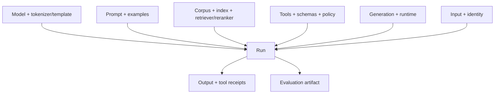

# 代码模型、对话状态与 LLMOps

代码生成、长会话和 LLMOps 看似三个主题，实际共享同一原则：模型输出必须落在可版本化、可验证、可恢复的系统中。代码要通过执行和 review，对话要维护真实状态，线上变化要能归因到完整 artifact graph。

## Part A：代码模型与软件工程 Agent

## 1. 代码任务不是一种任务

- next-token/FIM completion；
- 函数/模块生成；
- repository-level bug fix；
- test generation；
- refactor/migration；
- code explanation/review；
- vulnerability detection/remediation；
- dependency/config/build repair；
- natural language ↔ SQL/API/schema。

不同任务的 context、验证器和风险不同。“HumanEval 很高”不能证明能安全修改大型仓库。

## 2. Code representation 与 FIM

纯 causal LM 只能按左到右预测。Fill-in-the-middle（FIM）用 model-specific special tokens 序列化 prefix、suffix 和 middle，使模型能利用光标两侧。

FIM template 是 checkpoint 契约；不能猜 `<fim_prefix>` 名称或顺序。Suffix 太长也会挤占 context。评测应控制 prefix/suffix 长度、语言与文件位置。

代码 tokenizer 对空白、缩进、Unicode identifier、数字和长字符串有不同效率。格式化前后 token 数和模型行为都可能变化。

## 3. Repository context 构建

仓库任务需要的不只是语义相似文件：

- symbol definition/reference；
- import/include/module graph；
- interface/type/schema；
- failing tests、stack trace 和 logs；
- build/package/lock configuration；
- local conventions、formatter/linter；
- git diff/history/blame（按需）；
- generated/vendor boundaries；
- security/ownership policy。

### 3.1 Retrieval pipeline

可组合 lexical path/symbol search、AST/index、LSP、call graph、embedding 和 recent edit locality。先检索定义/调用者，再补相邻 tests/config，而不是把整个仓库塞满窗口。

Context item 保存 path、revision、line/symbol range 和 retrieval reason。代码变化后旧 chunk line number 失效，cache key 含 commit/index revision。

### 3.2 Context budget

优先：用户问题与失败证据 → 当前文件/符号 → 接口和调用者 → tests → config/docs。对每个片段保留完整语法边界。截断在字符串/函数中间会误导模型。

## 4. Patch-first 工作流

比整文件重写更安全：

1. 复现失败并保存 command/output；
2. 读取局部指令和相关代码；
3. 写最小假设；
4. 生成 diff/patch；
5. 静态/类型/targeted tests；
6. broader regression；
7. review diff、generated files 和 dependency changes；
8. 保留失败证据与限制。

Patch 能减少无关覆盖，但仍可能修改错误行、产生 merge conflict 或遗漏生成产物。应用前校验 base revision/context。

## 5. Execution feedback

Compiler、type checker、unit/integration tests、linter、static analyzer、fuzzer 和 benchmark 是 verifier。反馈循环必须：

- 固定 command、cwd、env、timeout；
- 捕获 exit code 与完整但脱敏 output；
- 区分 test failure、infra failure 和 timeout；
- 限制修复轮数/预算；
- 不让模型为了绿灯删除测试、放宽断言或扩大权限；
- 每轮重新运行相关安全/回归 gate。

测试通过只证明 tests 覆盖性质，不证明无 bug。

## 6. Sandbox 与依赖

生成代码和 repository code 都是不可信程序。限制 filesystem、network、process、CPU、RAM、time、output、device 和 secret。Package install/build hook 可执行任意代码；使用 allowlist registry、lock/hash、SBOM 和隔离 cache。

不要把 host Docker socket、cloud metadata token 或生产数据库暴露给 sandbox。容器不是自动安全边界。

## 7. Code evaluation

### 7.1 Correctness layers

- parse/compile；
- type/static checks；
- visible/hidden unit tests；
- integration/system behavior；
- property/fuzz/mutation tests；
- security/performance/compatibility；
- human maintainability review。

“能编译”远低于正确，“visible tests 通过”可能是 overfit。

### 7.2 pass@k

从同一任务生成 \(n\) 个独立候选，\(c\) 个通过 verifier，常用估计：

\[
\operatorname{pass@k}
=1-
\frac{\binom{n-c}{k}}{\binom{n}{k}},
\qquad 1\le k\le n.
\]

它估计给 \(k\) 次机会至少一次正确，不是单次线上成功率。依赖候选生成近似 i.i.d. 和 verifier 正确；若只生成 \(n<k\)，不能可靠报告该 pass@k。

```python
from about_llm.evaluation import pass_at_k

score = pass_at_k(num_samples=10, num_correct=2, k=2)
assert score == 17 / 45
```

同时报告 samples/task、temperature、token budget、执行成本和 pass@1。

### 7.3 Repository benchmark

固定 base commit、issue、environment 和 tests。检查 patch applies、target tests、full regression、changed lines、dependency/security、time/cost。Benchmark tests 被公开后可能污染训练，保留 fresh/private tasks。

## 8. 安全代码生成

- SQL 用 parameter binding，不拼接；
- HTML/command/path 按 context-specific escaping/allowlist；
- authz 在服务端重新检查；
- crypto 使用成熟库，不自创算法；
- secret 不进入 code/prompt/log；
- dependency/version 有来源与漏洞检查；
- migrations/删除/外部写操作需审批、备份和回滚；
- security fix 需要 exploit regression test。

让同一模型生成并 review 可能共享盲点；关键变更用独立工具/人复核。

## Part B：对话状态与记忆

## 9. 对话不是消息数组

生产状态应拆分：

- recent raw turns；
- authenticated identity、tenant、locale；
- current goal/constraints；
- confirmed facts 与 source；
- pending questions/actions；
- tool proposals、receipts 和 uncertain outcomes；
- short summary；
- user-managed long-term memory；
- policy/model/prompt versions。

模型从消息中“猜”状态不等于系统状态。余额、订单状态、权限必须来自 authoritative store/tool。

## 10. Memory 类型

### 10.1 Working memory

当前任务临时信息，任务结束应清理或显式归档。

### 10.2 Episodic memory

过去交互事件，保存 timestamp、source conversation、confidence 和 TTL。摘要不应覆盖原始来源。

### 10.3 Semantic/profile memory

稳定偏好或用户明确提供事实。区分“本次想用 Python”与“永久偏好 Python”。用户应能查看、更正、删除和关闭个性化。

### 10.4 Procedural memory

工作流、policy 和 tool schema，属于版本化系统配置，不应被某次用户对话永久改写。

## 11. Memory 写入策略

先判断：是否必要、用户是否预期、是否敏感、是否有 TTL、未来用途、可否验证。模型可提出 candidate memory，由 deterministic rule/用户确认决定写入。

每条记录：value、type、source、created/updated/expiry、confidence、scope、consent/policy、supersedes/retracted。不要保存无法追溯的自由文本总结。

### 11.1 可执行的 typed memory 核心

仓库提供内存参考实现 `ConversationMemoryLedger`。它把“记住一句话”拆成有来源的不可变 fact，以及显式 correction/retraction 事件：

```python
from datetime import datetime, timedelta, timezone

from about_llm.conversation import (
    ConversationMemoryLedger,
    MemoryKind,
    MemoryScope,
)

ledger = ConversationMemoryLedger()
now = datetime.now(timezone.utc)
old = ledger.add_fact(
    fact_id="fact-1",
    tenant_id="tenant-a",
    subject_id="user-7",
    key="preferred_language",
    value="中文",
    kind=MemoryKind.WORKING,
    scope=MemoryScope.SESSION,
    source_event_id="message-42",
    created_at=now,
    confidence=1.0,
    policy_version="memory-policy-v1",
    expires_at=now + timedelta(hours=8),
)
new = ledger.correct_fact(
    previous_fact_id=old.fact_id,
    new_fact_id="fact-2",
    tenant_id="tenant-a",
    subject_id="user-7",
    value="English",
    source_event_id="message-43",
    created_at=now + timedelta(minutes=1),
    confidence=1.0,
)
assert ledger.active_facts(
    tenant_id="tenant-a",
    subject_id="user-7",
    now=now + timedelta(minutes=1),
) == (new,)
```

参考内核保护以下不变量：

- 同一 tenant/subject/key 不能同时出现两个 active value，修正必须指向旧 fact；
- correction/retraction 不能跨 tenant 或 subject；
- profile scope 必须带 `consent_reference`，session scope 不会自动升级为长期偏好；
- expiry 边界采用 `expires_at <= now` 即失效，时间必须 timezone-aware；
- correction/retraction 只在事件时间之后生效，历史时间视图不会提前应用未来事件；
- value 在写入时成为 canonical JSON 快照，调用方之后修改原对象不会改历史；
- active view 不返回 superseded、retracted 或 expired fact，history 仍能解释修正链。

这只是单进程内存 reference，不提供数据库事务、encryption、RBAC、跨副本一致性、备份删除、retention worker 或真实授权。生产服务还需在存储查询中强制 tenant/subject 条件，并用并发测试证明“同 key 单 active”约束，而不是先全局读取后由模型过滤。

## 12. 摘要与压缩

摘要会遗漏否定、时间、谁说的和不确定性。用结构化 state + extractive source pointer，定期校验：

- 用户纠正后旧事实被标记 superseded；
- pending action 与 executed action 不混；
- tool error 不变成事实；
- 多人/多租户实体不串；
- summary version 与 source range 可追溯。

Context 压缩不是无损。长任务保留 checkpoint/state machine，不靠递归摘要无限续命。

## 13. 对话评测

- task success across turns；
- state accuracy、slot consistency；
- correction/interrupt/topic switch；
- memory precision/recall 与错误写入；
- privacy/deletion/cross-tenant；
- pending/uncertain action reconciliation；
- context length、latency/cost；
- persona/style stability（若确有产品需求）。

单轮 benchmark 不能证明长会话可靠。构造 20–100 turn synthetic/stateful scenarios，并以 authoritative state verifier 判断。

## Part C：LLMOps

## 14. Artifact graph

一次输出由以下版本共同决定：



只记录 model name 无法回放/归因。每个节点使用 immutable revision/hash，边记录兼容关系。

## 15. Trace schema

最低字段：

- trace/request/case ID、时间、tenant/user pseudonym；
- model/provider/revision、tokenizer/template；
- rendered prompt digest 与消息（按隐私策略）；
- retrieval query/results/source/index/ACL；
- tool proposal/validation/approval/execution/receipt；
- generation config/finish reason/usage；
- latency breakdown、retry/cache；
- output/evaluation/safety decision；
- error、fallback 和 final task state。

Trace 本身是敏感资产。按字段脱敏、RBAC、TTL、encryption 和 sampling；不要因“可观测”永久保存所有 prompt。

## 16. Deterministic artifact identity

仓库 `artifact_fingerprint` 对显式 JSON component 做 stable key ordering、UTF-8 和 SHA-256。Mapping insertion order 不影响 digest，sequence order会影响。

Fingerprint 只识别已列配置。它不会自动读取远程 provider、代码、环境或数据，也不证明语义/输出相同。Manifest 中遗漏 tool policy，hash 再稳定也不能重放该安全行为。

## 17. Offline evaluation 与 release gate

流程：

1. 冻结 candidate artifact graph；
2. 运行 capability/quality/safety/efficiency cases；
3. 与 baseline 做 case-level paired comparison；
4. 检查 protected slices 和 hard invariants；
5. 保存 raw outputs/config/report；
6. 由 owner 审批或阻断。

Gate 分为：必须为零的越权/副作用、统计质量阈值、延迟/成本 SLO 和人工评审。总体提升不能抵消关键租户泄露。

## 18. Online rollout

- replay/shadow：不影响用户；
- canary：小流量与严格 kill switch；
- gradual：按 tenant/region/use case；
- full：持续 drift/incident monitoring。

A/B 做 sample-ratio check、用户固定分桶、guardrail、提前停止规则。线上点击/停留是代理，不替代事实/安全评测。

## 19. Observability

### Quality

task success、citation/tool correctness、refusal、correction/escalation、human override。

### System

QPS、queue、TTFT、TPOT、E2E、timeouts、429/5xx、KV/cache、OOM、tokens/s。

### Cost

input/output/cached/reasoning/media tokens、retrieval/rerank/tool、retry、human review 与每成功任务成本。

### Safety

ACL denial、injection、unauthorized proposal/execution、PII/secret、sandbox violation、pending reconciliation。

高 cardinality label（raw user/prompt）不能直接进入 metrics；放受控 trace/object storage。

## 20. Drift 与回归定位

可能变化：input language/length、corpus freshness、retriever score、provider alias、model behavior、tool/API、policy 和用户策略。定位用 artifact diff + slice diff + latency breakdown，而不是先改 Prompt。

模型权重没变时，template、index、embedding、reranker、tool schema、cache、runtime 或 traffic 都能导致回归。

## 21. Cache

- response/prefix cache key 包含 model/template/prompt/input/generation/tenant/policy；
- retrieval cache 包含 corpus/index/retriever/ACL；
- negative/failed result 设置合理 TTL；
- model/index 更新使旧 cache 失效；
- cache hit 与 miss 分别测质量/延迟；
- sensitive output 不跨身份共享。

Semantic cache 的 embedding similarity 可能把语义不同请求合并，尤其是否定、数字和权限；高风险任务慎用。

## 22. Failure、fallback 与 rollback

明确 provider 429/timeout、retrieval failure、tool uncertain、schema invalid、safety classifier unavailable 和 GPU OOM 的行为。Fallback 模型可能 tokenizer、tool、safety 能力不同，需要独立评测，不能静默替换。

Rollback 包含 model、tokenizer/template、prompt、index/retriever、tools/policy、runtime 和 cache invalidation。数据库/外部副作用还需 forward fix/reconciliation，不能靠回滚模型撤销。

## 23. Feedback loop

点赞/踩有选择偏差，点击/停留受 UI 影响，用户修正更接近任务结果但仍不完整。Feedback pipeline 需：consent、PII removal、spam/poisoning detection、sampling、label rubric、lineage 和 holdout separation。

不要自动把所有线上输出回灌训练：会放大旧模型错误、攻击内容和 selection bias。

## Part D：AI 产品交互

## 24. 校准用户信任

界面区分：模型建议、检索证据、工具 proposal、已审批、已执行、执行结果未知。不要用流畅动画或无依据“97% confidence”制造确定性。

高风险 claim 展示 source/date/版本与纠错入口。无法完成时说明缺什么、已做什么和安全下一步。

## 25. 用户控制

- edit/delete memory 与关闭个性化；
- cancel/pause 长任务；
- 副作用 preview、对象/范围/金额/可逆性；
- revoke tool/account access；
- export/delete data；
- transfer to human 与 appeal。

确认按钮避免诱导式默认；approval 绑定具体参数，不能批准“随便处理一下”。

## 26. 可访问性

键盘、屏幕阅读器、焦点、颜色、字幕/转录、文本缩放和认知负担。Streaming 避免每个 token 抢焦点/重复朗读。图表/图像提供 alt text，但自动描述也需校验。

多语言不只翻译 UI；同时测模型、安全、排版、输入法、语音和文化语境。

## 27. 当前仓库证据边界

仓库已有代码 smoke/test、pass@k 数学、typed memory reference core、RAG/Agent CLI、评测门禁、云 contract、chat template 和 artifact fingerprint。Memory core 已验证来源、TTL、修正/撤回和租户隔离的不变量，但只是单进程内存实现。仓库仍没有真实大型仓库 benchmark、persistent memory service、跨副本并发测试、production trace backend、线上 A/B 或语义 cache。因此本章给出可执行基础合同与工程验收，不证明 L3/L4 生产成熟度。

## 28. 常见错误结论

- **“代码编译了就正确”**：功能、安全、性能和兼容仍未证明。
- **“pass@10 是线上成功率”**：它给同任务十次机会，并消耗更多预算。
- **“摘要就是会话事实”**：摘要可能错，需 source/state。
- **“保存全部 history 最准确”**：旧错误、隐私和 context 干扰会累积。
- **“记录 model name 就能重放”**：artifact graph 还有 template/index/tools/runtime。
- **“Hash 相同证明语义相同”**：fingerprint 只证明 canonical bytes 身份。
- **“只是改 Prompt，不需要发布流程”**：工具、安全和成本都可能改变。

## 自测与实践

1. 为仓库 bug fix 设计 symbol/test/config context retrieval 顺序。
2. 从 \(n=10,c=2\) 推导 pass@1 与 pass@2，为什么不能报告 pass@20？
3. 设计用户纠正旧偏好后的 memory supersession schema。
4. 列出完整 LLM trace 的版本轴与敏感字段。
5. 模型权重不变但 p95/质量下降，按哪些 artifact/metric 排查？
6. 为 tool timeout + rollback 说明为什么模型版本回退无法撤销外部状态。
