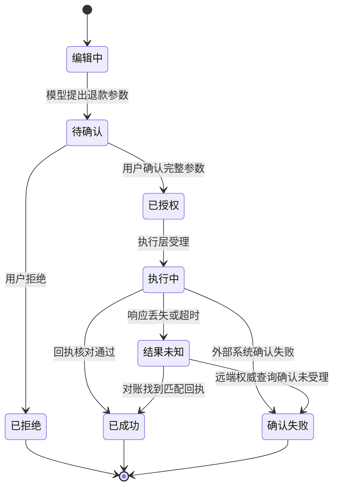

# AI 产品设计与人机协作

<!-- learning-contract -->
<div class="learning-contract" markdown="1">

**学习导航**

- **适合读者**：产品、UX、应用工程和风险团队。
- **先修**：无硬性技术先修；需要明确目标用户和高风险动作。
- **首次阅读**：300 元退款 → 用户可见状态 → 证据展示 → 确认 → 可访问性与实验。
- **完成信号**：能把每个状态映射为用户可见反馈和可验收系统行为。
- **卡住时**：先读[评测总览](../quality/evaluation.md)，把“体验更好”改写为可测假设。

</div>

**实践导航**：[退款任务生命周期](agent-task-lifecycle.md) ·
[运行退款实验](../practice/labs/lab-6-agent-lifecycle.md) ·
[RAG 证据链](rag-request-lifecycle.md) ·
[产品与系统评测](../quality/evaluation.md)
{ .doc-nav }

AI 产品设计要让用户看懂系统准备做什么、已经做了什么，以及结果何时仍然未知。流畅的回答只是界面内容，
不能代替订单记录、权限检查或支付回执。

本章面向开发者、算法工程师和产品工程协作。我们先跟完一笔真实运行的教学退款，再从中提炼状态、交互、实验和
验收方法。

## 先跟完一笔“结果未知”的退款

用户说：

> 商品坏了，帮我退 300 元。

一个只追求“对话顺滑”的产品，可能马上回答“退款已提交”。可靠的产品需要先读取订单、提出退款参数、检查权限，
再让用户确认。最难的情况发生在执行之后：支付服务已经受理退款，但响应在返回途中丢失。

仓库里可以直接运行这条任务：

~~~powershell
python projects/safe-agent/refund_lifecycle.py
~~~

为了让状态可以复算，脚本直接提供下一动作，不调用真实模型；支付服务也由本地程序模拟。资源权限、参数审批、
SQLite 账本、幂等重放、回执核对和恢复路径会真实执行。这里先把程序状态翻译成用户能理解的界面：

| 时刻 | 程序实际知道什么 | 用户应该看到什么 | 此时允许的操作 |
|---|---|---|---|
| 提议后 | 订单 `order-1001` 属于当前用户；退款参数为 300 元 | “退款申请草稿”，列出订单、金额和原因 | 修改、拒绝或确认 |
| 确认后 | 审批只绑定眼前这组参数，有效期 5 分钟 | “已确认，准备提交” | 取消尚未开始的动作 |
| 调用超时 | 本地调用失败，但账本是 `pending`；远端可能已经受理 | “退款结果未知，正在核对，请勿重复提交” | 查看状态或转人工 |
| 对账后 | 支付回执与订单、金额、原因和幂等键全部一致 | “退款已受理”，显示退款单号 | 保存凭证或联系人工 |
| 再次打开 | 相同调用读取已经核对的结果，远端副作用仍为 1 次 | 原退款结果，不再创建第二笔退款 | 查看详情 |

这里最容易误解的是第三行。脚本中的 `execution.status=failed` 表示本地函数缺少可确认响应；
`local_ledger_state=pending` 表示外部结果仍待核对。产品任务此时属于 **Unknown（结果未知）**。界面应显示
“正在核对”，禁用重复提交，并提供状态查询或人工处理入口。

最后，独立查询得到 `refund-provider-7001`，并确认金额确实为 300 元。脚本因此只发生一次远端退款效果，恢复后的
重复请求会读取已确认结果。

这个案例没有实现真实界面、用户研究或线上实验。本章接下来讨论的是：如果把这些后端事实做成产品，界面和评测应
怎样忠实反映它们。

第一次阅读可以先完成第 1～6 节，掌握用户任务、状态、证据和确认。记忆、流式输出、无障碍与实验设计可在需要时
继续阅读。

## 1. 从用户决定而不是模型能力出发

先回答：

1. 用户原本要完成什么决定或动作？
2. 不使用 AI 的基线是什么，耗时和错误在哪里？
3. AI 是生成草稿、检索证据、做建议，还是直接执行？
4. 错误的最坏后果、可逆性和发现窗口是什么？
5. 谁承担复核，是否有足够时间和替代方案？
6. 用户怎样知道系统用了哪些数据，又怎样纠正、删除和申诉？

回到退款案例，不使用 AI 的基线是客服读取订单、填写退款表单并检查支付结果。模型只负责把用户意图整理成候选参数，
权限检查和实际退款仍由可信程序完成。

“让售后更智能”无法验收。可以改成：在跨租户操作和重复退款保持为零的前提下，减少客服完成一笔退款的中位时间；
当支付结果未知时，所有界面都应阻止重复提交，并在规定时间内转入自动对账或人工处理。

## 2. 把界面映射到真实状态机

建议至少区分：



界面文案和按钮必须忠实反映状态：

| 状态 | 可以显示 | 不应显示 |
|---|---|---|
| Proposed | “待确认的草稿”与完整参数 | “已安排”“正在发送” |
| Approved | “已授权，等待执行” | “已成功” |
| Executing | 可取消性、开始时间、当前步骤 | 虚构百分比进度 |
| Unknown | “结果未知，正在核对” | 自动重试造成重复副作用 |
| Succeeded | 外部 receipt、对象、时间 | 只有模型生成的成功句子 |
| Failed | 确认失败、可安全重试条件 | 模糊的“出了点问题” |

模型生成一句“退款成功”不会改变任务状态。支付回执和业务系统记录才能支持成功状态。

## 3. 渐进展示：先给决定所需信息

首屏给用户完成决定所需的信息，再允许展开细节：

- 结论或草稿；
- 关键证据、日期和适用范围；
- 不确定或冲突点；
- 将执行的对象、范围、金额、收件人和可逆性；
- 修改、拒绝、升级人工与查看详情入口。

不要把成本、数据用途、不可逆动作或关键限制埋在折叠区。渐进展示用于管理认知负担，关键信息仍要在用户决定前出现。

退款确认页的首屏只需展示订单、金额、原因、退款影响和确认按钮。订单完整历史、权限判定记录和技术指纹可以放在
“查看详情”中。金额和“提交后可能已经产生外部效果”必须留在首屏，因为它们会改变用户是否确认。

## 4. 不确定性与校准

### 4.1 不展示虚构置信度

语言模型生成“97% confident”通常不是经过任务校准的概率。可展示的信号包括：

- 有无检索证据以及 claim 是否被 source 支持；
- 多来源是否冲突；
- 结构/业务规则是否通过；
- verifier 或分类器在固定数据上的校准结果；
- 是否超出已验证语言、文档类型或工具范围；
- 系统是否转入 abstain 或人工复核。

即使分类概率经过校准，它也只对指定数据、标签和版本成立；分布漂移后需重新验证。

### 4.2 Coverage-risk 曲线

有拒答/升级能力的系统不应只报“准确率”。对阈值 \(\tau\)，记录系统覆盖率和被回答样本的风险：

\[
\mathrm{coverage}(\tau)=\frac{\#\text{accepted}}{N},\qquad
\mathrm{risk}(\tau)=\frac{\#\text{wrong among accepted}}{\#\text{accepted}}.
\]

提高阈值通常减少覆盖率；“错误率下降”可能只是拒答更多。产品决策同时约束覆盖、风险、升级容量和群体切片。

## 5. 让证据可以被复核

证据不一定是一篇带引用的文档。退款提交前，关键证据是 `order@7` 的订单快照与当前用户身份；提交后，关键证据变成
支付服务返回的退款单号、订单、金额、原因和幂等键。两类证据分别支持“允许提出这笔退款”和“退款已经受理”。

在 RAG 产品中，证据通常表现为原文引用。此时至少支持：

- claim 与具体 source region 对齐，而不是只列文档标题；
- source 的版本、更新时间和权限状态；
- 点击后定位原文，不改变用户原本无权访问的内容；
- 多来源冲突显式展示；
- 无证据时 abstain，而不是生成看似合理的 URL；
- 用户能标记“引用无关”“证据过期”“结论不被支持”。

引用语法正确不等于 entailment；source 存在也不表示模型主张被支持。评测 citation correctness、completeness、权限负例和用户能否有效复核。

## 6. 外部动作的确认设计

确认页展示规范化后的完整参数，而不是只问“是否继续”。退款案例可以显示：

```text
动作：申请退款
订单：order-1001（版本 order@7）
金额：CNY 300.00
原因：商品损坏
外部影响：提交后支付服务可能立即受理，请勿重复操作
授权有效期：5 分钟
```

Approval token 绑定用户身份、task/call、工具与资源 revision、execution fingerprint、策略版本和过期时间。确认后参数、主体或版本改变必须重新审批。高风险动作避免预选同意、倒计时自动确认或把拒绝按钮弱化。

超时后，界面进入“结果未知”并自动对账。没收到成功响应时，用户不会看到“再试一次”按钮。

## 7. 对话、记忆与用户控制

用户应能区分：当前会话信息、已保存 profile memory、系统 policy 和外部账户数据。至少提供：

- 查看每条 memory 的值、来源、用途、创建/过期时间；
- 修正、撤回、删除和关闭未来写入；
- 明确“仅本次”与“以后也使用”；
- 切换身份/tenant 时清空不适用上下文；
- 删除后解释哪些 store 已完成、哪些 backup 按策略延迟；
- 敏感推断不因模型觉得“有用”而默认保存。

摘要是有损派生数据，不能在界面上伪装成用户确认事实。修正应产生可追溯 supersession，旧值不再进入 active context。

## 8. 流式输出、取消与恢复

Streaming 降低感知等待，但会提前展示尚未完成安全检查或结构验证的 token。高风险结构化任务可先在服务端完成并验证，再一次性呈现；普通文本也要处理：

- 用户取消后真正中止上游生成和计费（若 provider 支持）；
- partial output 标记未完成，不进入 authoritative state；
- 网络断开后按 request id 恢复或明确重新开始；
- tool proposal 与工具执行分离；
- 屏幕阅读器不对每个 token 重复朗读；
- 输出被 moderation 阻断时有一致的最终状态。

TTFT 更低不保证任务完成更快；同时测 time-to-useful-answer、time-to-correct 和 abandonment。

## 9. 错误、降级与人工接管

错误信息说明：发生在哪一层、哪些动作已执行、哪些结果未知、用户当前能安全做什么。不要暴露 secret、内部 stack 或攻击细节。

人工转接要带结构化 handoff：用户目标、已确认事实、证据、尝试步骤、pending/unknown action 与授权边界。不能只把模型摘要交给人工，也不能让用户重新描述所有内容。

Fallback 模型、无检索模式或只读模式应在界面标明能力变化。降级不跳过 ACL、安全检查和用户确认。

## 10. 可访问性与国际化

### 10.1 可访问性

- 全键盘操作、可见 focus 和合理 tab order；
- semantic labels、状态变化的 ARIA live 策略；
- 不只靠颜色表达置信/风险；
- 文本缩放、对比度、字幕和 transcript；
- streaming 批量宣布，避免每 token 抢焦点；
- 图像/图表 alt text 可由模型起草，但关键内容需校验；
- 提供减少动画和认知负担的模式。

### 10.2 国际化

翻译 UI 之外，还要测 tokenizer 成本、断行、输入法、日期/数字/货币、RTL、语音口音、拒答、安全分类和检索语料覆盖。总体英文指标不能证明中文、方言或少数语言体验。

## 11. 产品评测矩阵

| 层 | 指标示例 | 主要失败 |
|---|---|---|
| 任务 | 完成率、正确率、time-to-correct | 任务定义过窄、只测顺利路径 |
| 证据 | citation correctness/coverage、复核时间 | 引用存在但不支持 claim |
| 行为 | edit/reject/escalate、automation bias | 默认选项诱导接受 |
| 动作 | 参数正确、重复副作用、reconciliation | 把 proposal 当 executed |
| 信任 | 预测与实际依赖、错误发现率 | 满意度高但用户被误导 |
| 可及 | 键盘/读屏成功率、多语言切片 | 平均值掩盖关键群体失败 |
| 系统 | TTFT/E2E、取消成功、成本 | 只优化首 token |
| 安全 | 越权、注入、隐私、删除 | UI 承诺未被后端执行 |

满意度是重要信号但不是正确性。用户可能更喜欢自信、冗长或迎合的错误输出；必须与任务、证据和伤害指标联合分析。

## 12. 实验设计

### 12.1 原型与可用性测试

先用无模型或 recorded outputs 原型验证信息架构、确认流程和纠错入口。测试代表性任务、失败/冲突案例和辅助技术。记录观察协议、样本招募、任务顺序、研究者干预和定性编码，不把 5 人可用性测试外推为总体业务提升。

### 12.2 离线回放

固定输入和模型输出可比较不同 evidence/confirmation UI，但不能测实时延迟、真实信任或长期学习。涉及副作用时使用模拟 receipt。

### 12.3 A/B 实验与逐步发布

- 用户级稳定分桶，避免同一用户跨 variant；
- sample-ratio mismatch 检查；
- 主指标、guardrail、最小效应和停止规则预先定义；
- 质量、安全、群体和投诉不能被总体点击率抵消；
- Novelty effect 和学习效应需要足够时间窗；
- 高风险功能先 shadow/canary，并保留 kill switch。

A/B 显著只说明目标人群、时间窗和实现版本下存在统计差异，不自动说明因果机制、长期收益或外部有效性。

## 13. 同一方法怎样迁移到其他产品

### 13.1 RAG 助手

展示答案、claim-level source、文档日期、冲突和“无充分证据”。纠错反馈区分检索错、引用错和生成错。权限不足时不泄露标题或摘要。

### 13.2 工具 Agent

把计划、proposal、approval、execution、receipt 分屏或分状态展示。中断恢复先 reconcile；对 destructive action 给对象列表、影响范围和恢复路径。

### 13.3 代码助手

默认 patch-first，展示 base revision、diff、测试命令与结果。允许逐 hunk 接受；依赖、权限、迁移和测试删除单独高亮。测试通过只显示“这些检查通过”，不显示“代码已证明正确”。

## 14. 隐私与遥测

先定义产品问题，再收集完成评测所需的最少事件。普通指标标签不保存原始 Prompt、邮箱、文档标题或用户 ID。
需要排错的敏感内容进入受控 trace，并分别设置用途、访问权限、保存期限、删除和抽样规则。

“为了改进 AI”不是无限保留理由。用户反馈是否用于训练、人工查看或第三方 provider 必须分别说明。退出遥测不应导致核心服务不可用，除非该数据确为服务必需并已明确告知。

## 15. 当前仓库证据边界

本仓库已经实现 RAG 引用与权限检查、Agent 提议/审批/账本、带类型的对话记忆、离线评测门禁和云 API 契约。
这些实现可以提供产品状态和失败路径所需的后端事实。

仓库当前没有真实 UI、辅助技术审计、用户研究、线上 A/B、投诉或长期使用数据。本章提供设计与验收方法；
可用性、信任校准和业务提升仍要在目标产品中实测。

## 16. 常见反模式

- **聊天框万能化**：所有任务都塞进聊天框，没有结构化输入与状态。
- **置信度表演**：展示未经校准的百分比或“AI 已核实”。
- **引用表演**：列出来源却不对齐具体主张，或泄露用户无权查看的文档标题。
- **确认表演**：确认后参数还能变化，执行超时后又允许盲目重试。
- **记忆暗黑模式**：默认永久保存，删除入口隐藏或只删除界面记录。
- **流式速度表演**：首 token 很快，用户完成任务反而需要更久。
- **人工监督表演**：审核人员没有足够时间、证据或改判权限。
- **指标视野过窄**：用点击率或满意度抵消错误、安全和群体伤害。

## 自测与实践

1. 不看正文，画出 300 元退款从“待确认”到“对账完成”的状态机，并为每个状态写用户文案。
2. 为一个带 abstain 的 RAG 画 coverage-risk 曲线，解释阈值变化。
3. 设计 memory 查看、修正、撤回、删除和 tenant 切换流程。
4. 比较 TTFT、time-to-useful-answer 和 time-to-correct 为什么不同。
5. 为中文、读屏和键盘用户各设计一个失败路径测试。
6. 写一个 A/B 方案，明确主指标、guardrail、SRM 和停止规则。
