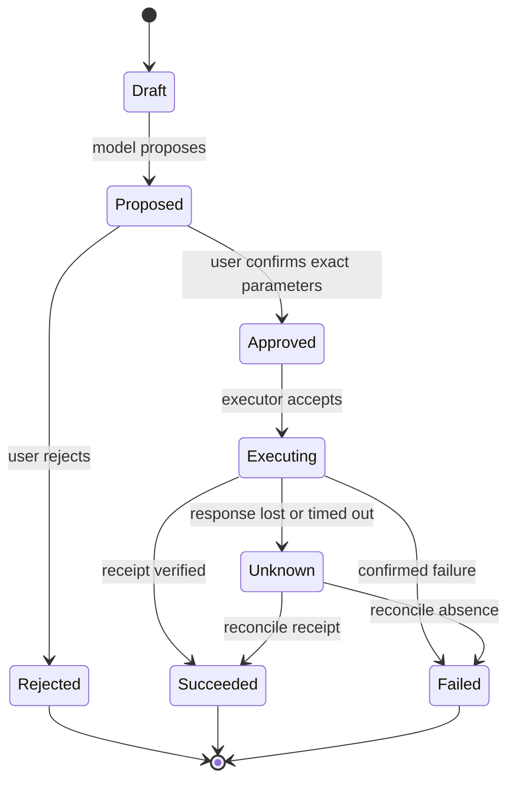

# AI 产品设计与人机协作

AI 产品设计不是给聊天框加流式动画，而是把概率性模型放进用户能理解、控制、纠错和退出的工作流。产品层必须区分模型建议、证据、系统状态和外部动作；流畅表达不应被设计成权威证明。

本章面向开发者、算法工程师和产品工程协作。它给出需求、状态、交互、实验和验收协议，但当前仓库没有真实用户研究或线上产品实验，不能用本章内容声称某个界面已经改善用户结果。

## 1. 从用户决定而不是模型能力出发

先回答：

1. 用户原本要完成什么决定或动作？
2. 不使用 AI 的基线是什么，耗时和错误在哪里？
3. AI 是生成草稿、检索证据、做建议，还是直接执行？
4. 错误的最坏后果、可逆性和发现窗口是什么？
5. 谁承担复核，是否有足够时间和替代方案？
6. 用户怎样知道系统用了哪些数据，又怎样纠正、删除和申诉？

“让回答更智能”无法验收。可操作目标例如：在不降低引用正确率和权限负例通过率的前提下，减少客服查找证据的中位时间；或在所有外部写操作需明确确认的条件下，提高完整工单创建率。

## 2. 把界面映射到真实状态机

建议至少区分：



界面文案和按钮必须忠实反映状态：

| 状态 | 可以显示 | 不应显示 |
|---|---|---|
| Proposed | “待确认的草稿”与完整参数 | “已安排”“正在发送” |
| Approved | “已授权，等待执行” | “已成功” |
| Executing | 可取消性、开始时间、当前步骤 | 虚构百分比进度 |
| Unknown | “结果未知，正在核对” | 自动重试造成重复副作用 |
| Succeeded | 外部 receipt、对象、时间 | 只有模型生成的成功句子 |
| Failed | 确认失败、可安全重试条件 | 模糊的“出了点问题” |

模型文本不是状态转移证据；执行层 receipt 和 authoritative store 才是。

## 3. Progressive disclosure 不是隐藏风险

首屏给用户完成决定所需的信息，再允许展开细节：

- 结论或草稿；
- 关键证据、日期和适用范围；
- 不确定或冲突点；
- 将执行的对象、范围、金额、收件人和可逆性；
- 修改、拒绝、升级人工与查看详情入口。

不要把成本、数据用途、不可逆动作或关键限制埋在折叠区。Progressive disclosure 用于管理认知负担，不是规避知情同意。

## 4. 不确定性与校准

### 4.1 不展示虚构 confidence

语言模型生成“97% confident”通常不是经过任务校准的概率。可展示的信号包括：

- 有无检索证据以及 claim 是否被 source 支持；
- 多来源是否冲突；
- 结构/业务规则是否通过；
- verifier 或分类器在固定数据上的校准结果；
- 是否超出已验证语言、文档类型或工具范围；
- 系统是否转入 abstain 或人工复核。

即使分类概率经过校准，它也只对指定数据、标签和版本成立；分布漂移后需重新验证。

### 4.2 Coverage-risk 曲线

有拒答/升级能力的系统不应只报“准确率”。对阈值 \(\tau\)，记录系统覆盖率和被回答样本的风险：

\[
\mathrm{coverage}(\tau)=\frac{\#\text{accepted}}{N},\qquad
\mathrm{risk}(\tau)=\frac{\#\text{wrong among accepted}}{\#\text{accepted}}.
\]

提高阈值通常减少覆盖率；“错误率下降”可能只是拒答更多。产品决策同时约束覆盖、风险、升级容量和群体切片。

## 5. Evidence UX

引用不是装饰。至少支持：

- claim 与具体 source region 对齐，而不是只列文档标题；
- source 的版本、更新时间和权限状态；
- 点击后定位原文，不改变用户原本无权访问的内容；
- 多来源冲突显式展示；
- 无证据时 abstain，而不是生成看似合理的 URL；
- 用户能标记“引用无关”“证据过期”“结论不被支持”。

引用语法正确不等于 entailment；source 存在也不表示模型主张被支持。评测 citation correctness、completeness、权限负例和用户能否有效复核。

## 6. 外部动作的确认设计

确认页展示 canonical parameters，而不是只问“是否继续”：

```text
动作：发送邮件
收件人：alice@example.com
主题：合同修订版
附件：contract-v7.pdf (sha256: ...)
外部影响：邮件发送后无法从对方邮箱撤回
授权有效期：5 分钟
```

Approval token 绑定用户身份、task/call、工具与资源 revision、execution fingerprint、策略版本和过期时间。确认后参数、主体或版本改变必须重新审批。高风险动作避免预选同意、倒计时自动确认或把拒绝按钮弱化。

Timeout 后 UI 进入 Unknown 并触发 reconciliation；不能因为“没收到成功响应”就让用户重复点击。

## 7. 对话、记忆与用户控制

用户应能区分：当前会话信息、已保存 profile memory、系统 policy 和外部账户数据。至少提供：

- 查看每条 memory 的值、来源、用途、创建/过期时间；
- 修正、撤回、删除和关闭未来写入；
- 明确“仅本次”与“以后也使用”；
- 切换身份/tenant 时清空不适用上下文；
- 删除后解释哪些 store 已完成、哪些 backup 按策略延迟；
- 敏感推断不因模型觉得“有用”而默认保存。

摘要是有损派生数据，不能在界面上伪装成用户确认事实。修正应产生可追溯 supersession，旧值不再进入 active context。

## 8. Streaming、取消与恢复

Streaming 降低感知等待，但会提前展示尚未完成安全检查或结构验证的 token。高风险结构化任务可先在服务端完成并验证，再一次性呈现；普通文本也要处理：

- 用户取消后真正中止上游生成和计费（若 provider 支持）；
- partial output 标记未完成，不进入 authoritative state；
- 网络断开后按 request id 恢复或明确重新开始；
- tool proposal 与工具执行分离；
- 屏幕阅读器不对每个 token 重复朗读；
- 输出被 moderation 阻断时有一致的最终状态。

TTFT 更低不保证任务完成更快；同时测 time-to-useful-answer、time-to-correct 和 abandonment。

## 9. Error、fallback 与 human handoff

错误信息说明：发生在哪一层、哪些动作已执行、哪些结果未知、用户当前能安全做什么。不要暴露 secret、内部 stack 或攻击细节。

人工转接要带结构化 handoff：用户目标、已确认事实、证据、尝试步骤、pending/unknown action 与授权边界。不能只把模型摘要交给人工，也不能让用户重新描述所有内容。

Fallback 模型、无检索模式或只读模式应在界面标明能力变化。降级不跳过 ACL、安全检查和用户确认。

## 10. Accessibility 与国际化

### 10.1 可访问性

- 全键盘操作、可见 focus 和合理 tab order；
- semantic labels、状态变化的 ARIA live 策略；
- 不只靠颜色表达置信/风险；
- 文本缩放、对比度、字幕和 transcript；
- streaming 批量宣布，避免每 token 抢焦点；
- 图像/图表 alt text 可由模型起草，但关键内容需校验；
- 提供减少动画和认知负担的模式。

### 10.2 国际化

翻译 UI 之外，还要测 tokenizer 成本、断行、输入法、日期/数字/货币、RTL、语音口音、拒答、安全分类和检索语料覆盖。总体英文指标不能证明中文、方言或少数语言体验。

## 11. 产品评测矩阵

| 层 | 指标示例 | 主要失败 |
|---|---|---|
| 任务 | 完成率、正确率、time-to-correct | 任务定义过窄、只测顺利路径 |
| 证据 | citation correctness/coverage、复核时间 | 引用存在但不支持 claim |
| 行为 | edit/reject/escalate、automation bias | 默认选项诱导接受 |
| 动作 | 参数正确、重复副作用、reconciliation | 把 proposal 当 executed |
| 信任 | 预测与实际依赖、错误发现率 | 满意度高但用户被误导 |
| 可及 | 键盘/读屏成功率、多语言切片 | 平均值掩盖关键群体失败 |
| 系统 | TTFT/E2E、取消成功、成本 | 只优化首 token |
| 安全 | 越权、注入、隐私、删除 | UI 承诺未被后端执行 |

满意度是重要信号但不是正确性。用户可能更喜欢自信、冗长或迎合的错误输出；必须与任务、证据和伤害指标联合分析。

## 12. 实验设计

### 12.1 Prototype 与 usability test

先用无模型或 recorded outputs 原型验证信息架构、确认流程和纠错入口。测试代表性任务、失败/冲突案例和辅助技术。记录观察协议、样本招募、任务顺序、研究者干预和定性编码，不把 5 人可用性测试外推为总体业务提升。

### 12.2 Offline replay

固定输入和模型输出可比较不同 evidence/confirmation UI，但不能测实时延迟、真实信任或长期学习。涉及副作用时使用模拟 receipt。

### 12.3 A/B 与 rollout

- 用户级稳定分桶，避免同一用户跨 variant；
- sample-ratio mismatch 检查；
- 主指标、guardrail、最小效应和停止规则预先定义；
- 质量、安全、群体和投诉不能被总体点击率抵消；
- Novelty effect 和学习效应需要足够时间窗；
- 高风险功能先 shadow/canary，并保留 kill switch。

A/B 显著只说明目标人群、时间窗和实现版本下存在统计差异，不自动说明因果机制、长期收益或外部有效性。

## 13. 三个工程案例

### 13.1 RAG 助手

展示答案、claim-level source、文档日期、冲突和“无充分证据”。纠错反馈区分检索错、引用错和生成错。权限不足时不泄露标题或摘要。

### 13.2 工具 Agent

把计划、proposal、approval、execution、receipt 分屏或分状态展示。中断恢复先 reconcile；对 destructive action 给对象列表、影响范围和恢复路径。

### 13.3 代码助手

默认 patch-first，展示 base revision、diff、测试命令与结果。允许逐 hunk 接受；依赖、权限、迁移和测试删除单独高亮。测试通过只显示“这些检查通过”，不显示“代码已证明正确”。

## 14. 隐私与遥测

先定义产品问题，再收集最少事件。Metrics label 不放 raw prompt、email、document title 或 user id；敏感内容进入受控 trace，并按 purpose、RBAC、TTL、删除和抽样策略管理。

“为了改进 AI”不是无限保留理由。用户反馈是否用于训练、人工查看或第三方 provider 必须分别说明。退出遥测不应导致核心服务不可用，除非该数据确为服务必需并已明确告知。

## 15. 当前仓库证据边界

本仓库有 RAG 引用/ACL、Agent proposal/approval/ledger、typed conversation memory、离线评测 gate 和云 API contract，可支撑产品状态与失败路径的工程示例。但没有真实 UI 实现、辅助技术审计、用户研究、线上 A/B、投诉或长期使用数据。因此本章是设计与验收协议，不证明任何产品的可用性、信任校准或业务提升。

## 16. 常见反模式

- **Chat-first**：所有任务都塞进聊天框，没有结构化输入与状态。
- **Confidence theater**：展示未经校准的百分比或“AI 已核实”。
- **Citation theater**：列来源却不对齐 claim，或泄露无权文档标题。
- **Approval theater**：确认后参数还能变，或执行失败就盲目重试。
- **Memory dark pattern**：默认永久保存，删除入口隐藏或只删 UI。
- **Streaming theater**：首 token 很快，却让用户等更久才能完成任务。
- **Human-in-the-loop theater**：人工没有时间、证据或 override 权限。
- **Metric tunnel vision**：用点击/满意度抵消错误、安全和群体伤害。

## 自测与实践

1. 把“发送邮件”画成 proposal 到 reconciliation 的状态机，并为每个状态写 UI 文案。
2. 为一个带 abstain 的 RAG 画 coverage-risk 曲线，解释阈值变化。
3. 设计 memory 查看、修正、撤回、删除和 tenant 切换流程。
4. 比较 TTFT、time-to-useful-answer 和 time-to-correct 为什么不同。
5. 为中文、读屏和键盘用户各设计一个失败路径测试。
6. 写一个 A/B 方案，明确主指标、guardrail、SRM 和停止规则。
