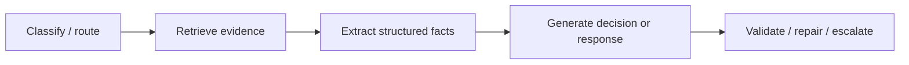

# Prompt Engineering 与输出契约

<!-- learning-contract -->
<div class="learning-contract" markdown="1">

**学习导航**

- **适合读者**：Prompt、结构化输出、应用和评测工程师。
- **先修**：[生成与解码](../core/generation.md)的输入、采样和停止基础。
- **首次阅读**：真实输入 → 任务规格 → 指令层级 → 结构化输出 → 评测。
- **完成信号**：能写输入/输出 schema、失败分支和至少 30 条回归 case。
- **卡住时**：先完成[实验 0A](../practice/labs/lab-0a-sampling.md)，再区分概率行为与任务约束。

</div>

Prompt 是模型调用协议的一部分：它描述任务、输入、约束和输出，但不提供权限、安全或事实保证。高质量 Prompt 的目标是减少歧义、暴露失败并便于自动验证，而不是寻找跨模型永久有效的“神秘咒语”。

## 1. 一次调用的真实输入

模型实际接收的内容通常来自：

\[
\text{system/developer instructions}
+\text{chat history}
+\text{retrieved evidence}
+\text{tool schemas/results}
+\text{user input}
+\text{serialization template}.
\]

Provider/模型会把 roles、special tokens、tool schema 和 generation prompt 序列化为 token IDs。UI 中看起来相同的 messages，使用不同 chat template 可能完全不同。

仓库 `render_chat` 强制使用 checkpoint 自带 template，并在 template 缺失时失败，而不是猜格式：

```python
from about_llm.integrations.transformers_tools import render_chat

rendered = render_chat(
    tokenizer,
    [
        {"role": "system", "content": "只按证据回答。"},
        {"role": "user", "content": "解释 RAG。"},
    ],
)
```

这只验证序列化契约，不证明模型会遵循指令。

## 2. 任务规格的六个部分

### 2.1 Objective

说明要完成的决策/转换，而不是堆 persona：

```text
从合同正文中抽取签约主体、签署日期与币种。
```

### 2.2 Input contract

定义输入字段、编码、语言、缺失/空值、最大长度和可信度。把用户/文档内容放进明确字段，但要知道 delimiters 只是语义提示，不是安全边界。

### 2.3 Decision rules

给必要判定标准、优先级和冲突处理。规则过多会互相矛盾；可用表格或 decision tree，并为每条规则设计测试。

### 2.4 Uncertainty behavior

定义信息不足、证据冲突、超出范围和格式损坏时怎样：`null`、`unknown`、请求澄清、拒绝或升级人工。不要只写“不要幻觉”。

### 2.5 Output contract

字段、类型、枚举、单位、时区、null/empty 区别、排序与额外字段策略。结构化输出还需应用层验证；结构合法不代表语义正确、权限通过或引用确实支持主张。

### 2.6 Evidence

要求 claim 对应 source ID/region/tool receipt，定义无证据时不可用参数记忆补齐。引用语法有效不等于语义支持。

## 3. 指令层级不是权限系统

聊天协议可能有 system/developer/user/tool 等层级，实际语义依平台。它能提高行为一致性，但外部文档、网页和 tool output 与指令仍被同一模型处理。

- Prompt 中写“绝不泄露”不能保护已经进入 context 的 secret；
- XML `<untrusted>` 标签不能阻止 indirect injection；
- 模型生成的 tool arguments 不是 authorization；
- 自称“管理员”的用户不能改变真实身份。

ACL、secret isolation、tool allowlist、审批、sandbox 和 egress policy 必须由外部系统执行。

## 4. Zero-shot、few-shot 与 instruction examples

### 4.1 Zero-shot baseline

先建立最短可用 baseline，便于知道 few-shot/分解是否真正带来增益。若一开始加入几十条规则和示例，就无法定位贡献。

### 4.2 Few-shot 设计

示例用于表达 decision boundary 与格式：

- 正例、反例、无答案、冲突和异常格式；
- 与线上语言/长度/领域相似；
- 标签经过复核；
- 顺序随机/消融，检查 recency 与 label bias；
- 不包含评测答案或敏感数据；
- source/版权允许进入 prompt 和日志。

模型可能复制示例中的实体/风格。测试换实体、换顺序和反事实输入。

### 4.3 Example selection

动态检索示例能提高相关性，但引入新的 index、embedding、ACL 和 cache 版本。示例必须按租户授权，且不得从 test answer 中检索。

## 5. 分解任务

复杂流程可拆：



优点是每步可测、可缓存、可使用不同模型；代价是延迟、token、错误级联和更多版本。若中间结果不需要语言生成，用 deterministic code。

## 6. 结构化输出

### 6.1 Prompt-only JSON

“只输出 JSON”可能产生 Markdown fence、额外解释、截断或错误类型。它可做 baseline，但不是强契约。

### 6.2 Grammar / JSON Schema constrained decoding

在 decoding 时屏蔽不能形成合法前缀的 token，可保证所覆盖的语法/结构。它不保证：

- 日期真实或合法；
- ID 存在且有权限；
- 金额单位正确；
- 引用支持结论；
- 工具调用安全；
- schema 本身没有过度授权。

### 6.3 应用层验证

1. Parse；
2. schema/type/required/additional properties；
3. semantic：范围、日期、单位、交叉字段；
4. authorization/policy；
5. existence/state/version；
6. side-effect approval/idempotency。

### 6.4 Repair loop

把具体 validation errors 返回模型，限制次数和 token；每轮仍运行全部验证。若修复失败或错误不收敛，拒绝/升级，不绕过 schema。

记录 initial output、errors、repair count 和 final status。只报告最终成功率会隐藏昂贵重试。

## 7. Tool calling Prompt

Tool description 应写：用途、参数、不可做事项、权限由谁决定、错误语义和返回 schema。模型只负责 proposal。

避免：

- 把 secret 放在 tool description；
- 让模型自由拼 URL/path/SQL；
- 用自然语言 `confirmed=true` 代替真实审批；
- 把 tool error 当成可盲目重试；
- 允许文档内容选择高权限工具。

高风险动作先生成 human-readable preview，再由外部 approval 绑定 canonical arguments fingerprint。

## 8. Grounded generation

建议 context 结构：

```text
任务与回答规则
用户问题
已授权来源列表（source_id、版本、日期、内容）
输出 schema / 引用规则
```

模型要区分：来源陈述、来源冲突、无证据和外部常识。对每个重要 claim 引用；若 sources 不足，明确 abstain。

不要把几十个低相关 chunk 塞满窗口。更多上下文会增加 distractor、冲突、injection 与成本。先测 retrieval recall，再测 context utilization 与 citation entailment。

## 9. Context budget

总预算包括：

- system/developer/template special tokens；
- tool schema；
- chat history/state；
- retrieved docs/examples；
- 当前 user input；
- 预留 output/tool results。

截断顺序是产品决策。静默丢掉 system、最近用户需求或 evidence source 会改变语义。保存 tokenized lengths 和 truncation reason。

### 9.1 Conversation history

不是越长越好。保留最近原文、结构化状态和可回溯摘要；旧指令、错误 tool result 和已撤销偏好应失效。摘要是模型生成数据，必须保存 source pointers 和更新时间。

## 10. Reasoning 与解释

要求“逐步思考”可能改变输出分布，但可见 rationale 不一定忠实，可能泄露敏感 context 或增加成本。产品通常需要：

- 简洁结论与关键限制；
- 可验证 evidence/tool result；
- 对用户有用的步骤；
- 不确定性/假设；
- 可复算的公式或代码。

不要把流畅 CoT 当内部机制审计。对数学/代码优先 external verifier，多候选时报告选择器。

## 11. Prompt injection 防御边界

可以在 Prompt 中：标识 provenance、重复任务边界、要求不执行文档指令、让模型指出可疑内容。这些是行为缓解，不是强安全控制。

系统还需：pre-ranking ACL、no secret in context、read/write tool separation、parameter validation、origin/egress allowlist、bound approval、sandbox 和 audit。安全章节详见[系统安全](../quality/safety.md)。

## 12. 多语言与本地化

- 指令语言、输入语言和输出语言分别定义；
- 日期、数字、姓名、地址与单位遵循 locale；
- few-shot 不应只覆盖英文；
- tokenizer 成本和 context truncation 按语言测；
- safety/refusal 不能只翻译关键词；
- 术语表需版本化并处理 code-switching。

同一 Prompt 翻译后不是严格等价实验。按语言维护 case 与 error taxonomy。

## 13. Prompt 评测

### 13.1 Case set

覆盖：典型、边界、空/损坏、无答案、冲突、对抗、多语言、长输入、高风险和 tool failure。按独立文档/用户 split，避免示例泄漏。

### 13.2 指标

- task accuracy/F1/field score；
- schema validity 与 semantic validity；
- citation correctness/coverage；
- harmful compliance、benign refusal；
- tool parameter/authorization；
- output/input token、repair count；
- TTFT/E2E/cost；
- protected slices。

### 13.3 比较

同一 cases 上 paired comparison，固定 model revision、template、generation config、retrieval/tool artifacts。多 seed 采样任务报告方差/CI。反复查看的测试集应降级为 dev，保留 hidden/time-fresh set。

## 14. Prompt 版本化与可重放工件

一次输出至少受：

- model/provider immutable revision；
- tokenizer/chat template；
- system/developer/user prompt version；
- few-shot/retrieval corpus/index/reranker；
- tool schema/policy；
- generation config/seed；
- runtime/provider date；
- raw input 与 media preprocessing。

仓库可对显式 JSON 组件做 canonical identity：

```python
from about_llm.llmops import artifact_fingerprint

fingerprint = artifact_fingerprint(
    {
        "model": "model-a@commit-sha",
        "template": "sha256:...",
        "prompt": "extract-v7",
        "retrieval": {"index": "idx-v4", "reranker": "rr-v2"},
        "tools": {"schema": "tools-v3", "policy": "policy-v8"},
        "generation": {"temperature": 0, "max_tokens": 256},
    }
)
```

SHA-256 只证明**明确提供的 JSON 在 canonical serialization 下相同**。它不证明组件列表完整、语义等价、安全、来源可信或远程模型能 bitwise 重放。Secret 不应进入 manifest。

## 15. Prompt caching

Provider/prefix cache 可降低重复 prefill 成本，但 cache key/命中规则依实现。自管 KV cache 的安全 identity 应包含可信 tenant/visibility domain、authorization/policy revision、model/tokenizer/chat template/adapter、position/RoPE config、KV dtype 与 exact rendered token prefix；tool schema 的影响最终也必须进入模板或 token identity。Raw prompt hash 不足，fingerprint collision 后仍做 full comparison。不要让跨安全域共享 prefix 暴露受限内容或访问模式；provider-managed caching 是否隔离、保留和计费需按其当前契约核对。

缓存命中会改变 latency/cost，因此 benchmark 分别报告 cold/warm 与 hit rate。

## 16. 变更流程

1. 写假设和目标 failure slice；
2. 从 production error 中构造 dev case，避免泄露 hidden test；
3. 修改一个主要变量；
4. 离线 paired gate；
5. 安全/成本/延迟回归；
6. Shadow → canary → rollout；
7. 监控与 rollback；
8. 记录 negative result。

“只改一句 Prompt”仍可能改变工具动作、安全拒答和 token 成本，必须走变更管理。

## 17. 常见反模式

- **Persona 堆叠**：自称专家不产生真实知识或权限。
- **绝对措辞**：“绝不幻觉”没有 evidence/abstain 机制。
- **规则冲突**：同时要求简短、详尽、只 JSON 和解释原因。
- **示例过拟合**：只测写 Prompt 时见过的样本。
- **Delimiter security**：把 XML 当 sandbox。
- **JSON trust**：结构合法后直接执行。
- **History hoarding**：把所有旧轮次永久拼接。
- **Unversioned dynamic context**：检索示例/工具 schema 变了却只记录 Prompt 文本。
- **Self-repair forever**：无限循环消耗预算并产生更自信错误。

## 18. 发布清单

- 使用真实 template/tokenizer，保存 rendered prompt/token count；
- 输入、缺失、冲突、无答案与语言规则明确；
- schema + semantic + authorization 全部验证；
- secrets/ACL/tool safety 在外部系统；
- evidence/source 与 abstain 可测；
- model/template/index/tools/generation 完整版本；
- paired quality、安全、成本和 latency gate；
- repair/retry 有限且可观察；
- cache key 含权限和版本；
- canary/rollback 经过演练。

## 19. 当前仓库证据边界

仓库已有真实 chat-template 强制渲染、三类云 API 离线 contract、结构化 JSON Schema metric、RAG citation/ACL、Agent tool validation 和 canonical artifact fingerprint 单测。它没有对任意真实云模型系统性跑 Prompt benchmark，也没有证明 provider-side instruction hierarchy、cache 或 structured output 在目标版本的完整行为。因此本章给出可执行局部契约，不宣称某个 Prompt 跨模型稳定。

## 自测与实践

1. 为什么 checkpoint chat template 缺失时不应随手套一个通用格式？
2. 为退款工具参数写 schema、semantic、authorization 和 state validation。
3. 构造结构合法但引用错误、金额错误和越权的三个 JSON。
4. 设计 few-shot 顺序/实体反事实实验。
5. 列出一次输出要重放的八个版本轴。
6. 修改 Prompt 一句话后，为什么仍要重测 injection、benign refusal 和 tool safety？
