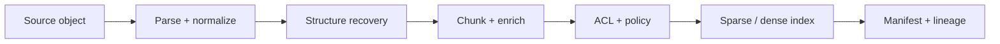

# RAG 数据摄取、切分与索引生命周期

RAG 的上限通常在生成之前就被数据管道决定。解析丢了一张表、chunk 切断了定义、旧版本没有删除，后面的 embedding、reranker 和更强模型都无法可靠补救。本章把 ingestion 当作可重放的数据产品，而不是一次性的“把文件塞进向量库”。

## 从来源到可检索单元

一条完整链路是：

每一阶段都应保留输入、输出、版本和错误。不要只保存最终向量；否则无法回答“这个回答用了哪个文件版本”“为什么一段内容消失了”“删除请求是否传到了所有副本”。

## Source、Document 与 Chunk

建议分清三个身份：

- `source_id`：业务来源，例如某个 Wiki 页面或对象存储 key；跨版本稳定。
- `source_version`：ETag、内容哈希、数据库 LSN 或显式修订号。
- `chunk_id`：可检索单元身份，用于增量 upsert、引用和删除。

chunk 的最小元数据应包含 tenant、source、version、位置、标题路径、时间、语言、ACL、解析器版本和内容哈希。权限不是生成时的提示词，而是检索前的强制过滤字段。

### 稳定 ID 的取舍

用全局顺序号命名 `doc-17-chunk-8` 很简单，但在开头插入一段会使后续 ID 全变，缓存、引用和评测全部失效。纯内容哈希在重复段落上会冲突。实用方案是对以下组合做哈希：

\[
\text{chunk\_id}=H(tenant, source, heading\_path, content\_hash, occurrence)
\]

这样，无关插入不会重命名未改段落；标题移动或内容变化会产生新 ID。重复内容用同一标题下的 occurrence 区分。仓库中的 `split_markdown` 实现了这一约定。

## 解析不是纯文本提取

不同格式的主要风险不同：

| 来源 | 需要恢复 | 常见失败 |
|---|---|---|
| HTML/Wiki | 标题、列表、表格、链接、正文区域 | 导航和页脚混入正文 |
| PDF | 阅读顺序、页码、栏、表、脚注 | 双栏交错、扫描页为空 |
| Office | 标题层级、批注、表格、嵌入对象 | 模板文本重复 |
| 代码仓库 | 文件、符号、调用关系、版本 | 按固定字符切断函数 |
| 工单/聊天 | thread、作者、时间、附件 | 上下文与权限脱离 |

解析结果需要质量指标，例如非空页比例、字符异常率、表格单元格覆盖率、OCR 置信度和重复率。解析失败应进入 dead-letter queue，并能按解析器新版本重放。

### 规范化边界

可以统一换行、Unicode 形式和无意义空白；不要随意小写化代码、删除标点、把表格压成无结构字符串，或在保留证据位置之前清理页码。保存原始对象的不可变引用，规范化结果只是派生数据。

## Chunking 的直觉

chunk 太小，证据不完整且召回结果碎片化；太大，embedding 被多个主题平均，候选占满上下文，reranker 成本上升。不存在脱离任务的“最佳 512 tokens”。选择由答案所需证据跨度、文档结构、embedding 上限、生成上下文和延迟共同决定。

### 常用策略

1. 固定 token 窗口：基线稳定，适合连续文本；应有 overlap，并记录真实 token 数。
2. 结构切分：按标题、段落、列表、代码符号或表格切，语义完整性更好。
3. Parent-child：小 child 用于召回，大 parent 用于给模型上下文。
4. Semantic chunking：按相邻句向量突变切分，成本高且容易随模型版本漂移。
5. Late chunking：先用长上下文编码，再聚合 token 表示；依赖支持该方法的模型和长度。

overlap 会提高边界召回，也会制造近重复候选并浪费上下文。先用 query-evidence 标注集比较 chunk size/overlap，而不是凭习惯选参数。

### 表格、代码和图片

表格应同时保留标题、列名、行范围和可读序列化；跨页表要先合并。代码更适合按 symbol/AST 切分，并附文件路径、签名和依赖。图片不能只保存 OCR：图表可能需要 caption、坐标区域或多模态 embedding。每类解析物都应能回链到原始位置。

## 增量更新与删除

一次 crawl 产生 desired manifest，当前索引有 existing manifest：

- 新 ID 或 payload 改变：upsert；
- existing 有而 desired 没有：delete；
- 完全相同：skip。

但“本次抓取为空”可能是权限失败、API 限流或解析器故障，不能自动解释为删除整个知识库。删除应要求完整快照标志、来源 tombstone 或显式事务边界。

更新向量和关键词索引时，优先使用 shadow collection：写新版本、跑完整性检查、原子切 alias、再延迟回收旧版本。无法原子切换时，为每个请求固定 index version，避免一次回答混合新旧 chunk。

### 删除的完整语义

删除不仅是主索引：还包括 embedding cache、rerank cache、生成 cache、日志副本、离线评测语料和备份保留策略。隐私删除与业务下线可能有不同 SLA；审计记录要证明请求在哪些系统、何时生效。

## ACL 与多租户

安全顺序是：认证用户 → 计算授权过滤器 → 在候选生成阶段应用 → 排序 → 渲染上下文。先全局 top-k 再过滤会让无权结果挤掉有权结果，也可能通过分数、缓存或 trace 泄露存在性。

缓存键至少包含 tenant、权限版本、query 规范化、索引版本、检索配置和模型版本。ACL 变化后应使旧缓存失效。高基数 ACL 可用预过滤 bitmap、分区索引或两阶段候选，但不能把安全边界委托给 LLM。

## Ingestion 可观测性

至少监控：

- 来源数、成功/失败/隔离数和端到端 freshness lag；
- 每格式解析耗时、空文档率、异常字符率；
- chunk 数、长度分布、重复率和每来源膨胀倍数；
- upsert/delete/skip 比例与孤儿向量数；
- ACL 缺失率、未知 tenant、删除传播延迟；
- embedding 吞吐、重试、模型版本和费用。

每个 chunk 的 lineage 能从索引追到规范化文档、原始对象、解析器和 job run。抽样 UI 应让维护者看到原文与 chunk 并排，而不是只看数字。

## 实验与验收

使用 `SourceDocument`、`split_markdown` 和 `plan_incremental_update` 做以下实验：

1. 在文档开头插入无关段落，验证未改 chunk id 不变。
2. 修改一个段落，验证产生一个新 chunk 和一个 delete。
3. 更改 ACL，验证 payload 被重新 upsert。
4. 制造超长无空格段落，验证无字符丢失且 chunk 有界。
5. 模拟空抓取，确认调用层不会未经确认执行全量删除。

生产验收还需真实格式 golden files、解析回归截图、并发更新、索引事务故障、删除 SLA 和跨租户对抗测试。

## 面试追问

**为什么 chunk id 不直接包含 version？** 包含 version 会让一次版本提升重命名所有未改内容。将版本作为 payload，ID 绑定内容与结构，既可复用缓存又能更新 lineage；是否 upsert 由 payload 比较决定。

**为什么 overlap 不是越大越好？** 它提高边界覆盖，但增加存储、近重复、上下文浪费和指标虚高；最终要以 evidence recall、去重后上下文质量和成本共同选择。

**如何零停机重建 embedding？** 新模型写入带版本的 shadow index，双跑离线/线上 shadow query，核对覆盖和指标，原子切 alias；保留快速回滚窗口，不在原 collection 原地混写两种向量。
