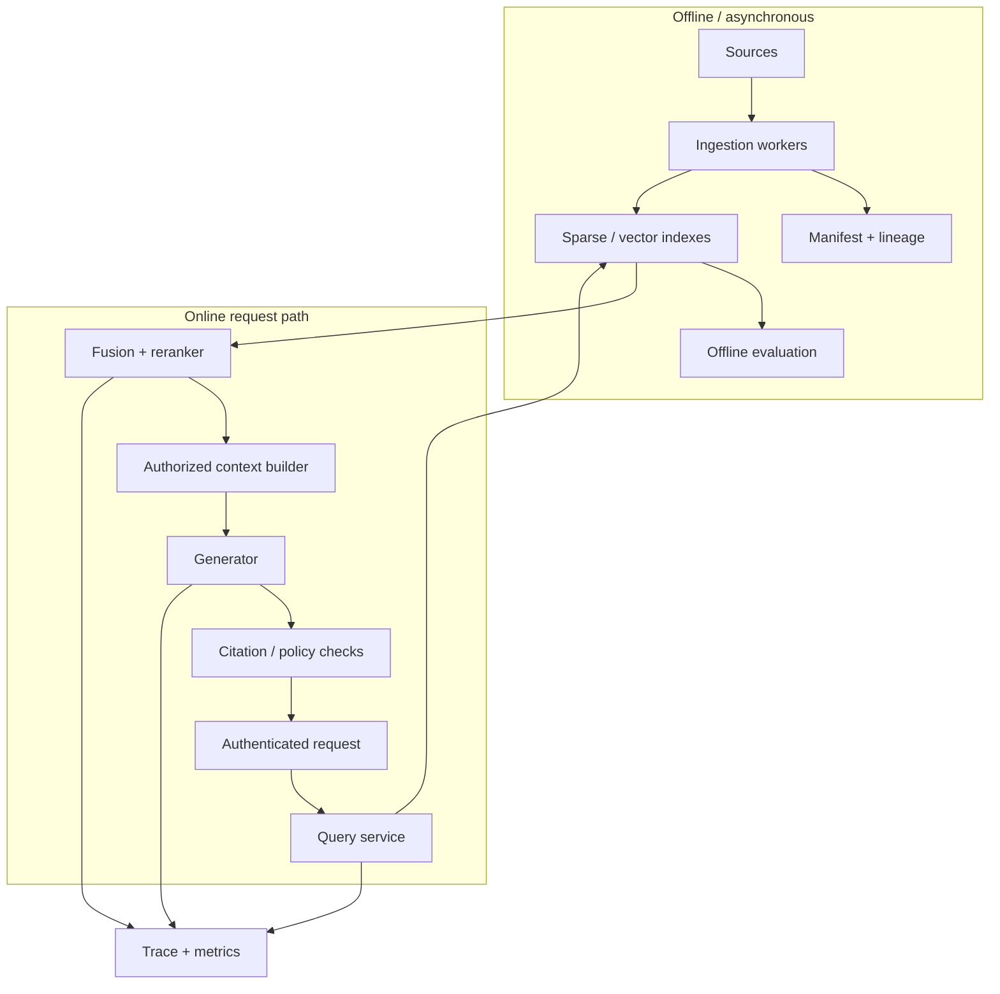

# RAG 生产架构、缓存与运维

生产 RAG 是一组独立扩缩、独立失败的服务：摄取、索引、检索、重排、生成、评测和反馈。把它们封装成一个同步 chain 会让故障边界、权限和成本不可见。本章给出从单机原型到多租户服务的演进路线。

## 参考架构

离线数据面允许重试和批处理；在线路径有严格延迟预算。索引服务不应依赖生成模型可用，生成服务也不负责判断 ACL。

## API 契约

请求包含 tenant、认证主体、query、对话引用、locale、时间上下文和可选过滤；权限从可信身份层派生，不允许客户端直接传“我可访问 admin”。响应包含 answer、结构化 citations、insufficient 状态、request id、index version 和可公开的 usage。

内部检索响应要保留每阶段 rank/score/source，而外部响应只暴露经过授权的元数据。schema 版本必须显式；新增字段向后兼容，语义变化需要新版本。

## 延迟预算

总延迟大致为：

\[
T=T_{auth}+T_{rewrite}+\max(T_{sparse},T_{dense})+T_{rerank}+T_{prompt}+T_{generation}+T_{checks}
\]

并行 sparse/dense 可以降低 wall time；rerank 和生成通常占大头。流式输出能改善 TTFT，但引用/安全检查若只能在完整答案后执行，就不能未经策略直接把未验证 token 发给高风险用户。

为各阶段设置 timeout 与降级：dense 超时可退到 BM25，reranker 超时可用融合排名；生成超时返回可恢复错误。任何降级都带 `degraded_reason` 并进入指标，不能把降级答案混入正常质量统计。

## 缓存层次

1. parse/cache：key 为 source content hash + parser version。
2. embedding cache：normalized text hash + model revision + prefix/pooling。
3. retrieval cache：tenant/ACL version + query/filter + index/config version。
4. rerank cache：query + ordered candidate content hashes + reranker revision。
5. response cache：完整授权上下文、生成配置和 policy version。

越靠后越难安全命中。response cache 可能包含用户历史和敏感答案，默认不要跨主体共享。缓存内容应加密、TTL 明确，并支持 ACL/删除事件失效。cache hit 也要记录使用的版本。

### Semantic cache

用 query embedding 找相似历史问题可以节省生成成本，但“相似”不等于同一意图，数字、时间和否定尤其危险。只在低风险、稳定知识、相同权限与过滤条件下使用，并设置严格阈值、答案 freshness 和人工可关闭开关。

## 一致性与版本

一次请求应固定 `index_snapshot`。embedding 模型、向量和距离配置构成不可分割版本；不能用新 query encoder 搜旧 document vectors。reranker、prompt、generator 和 policy 也进入 system version。

索引切换采用 build → validate → shadow → alias switch → monitor → retire。验证包括文档/chunk 数、向量维度、随机抽样可回链、ACL 完整、gold query 指标和性能。切换后保留旧 alias 以秒级回滚。

## 可靠性

### 重试与幂等

摄取 job 使用 source/version 作为幂等键。embedding 批次可重试，但 upsert 与 manifest 提交要有事务或可恢复状态。在线生成重试可能产生两次费用和不同答案；只对明确的连接前失败自动重试，并保留 provider request id。

### Backpressure

索引重建、批量上传和在线 query 争用 embedding/GPU。分离队列与容量池，为在线流量保留并发；队列长度和最老任务年龄触发限流。不要让无限重试淹没下游。

### 灾难恢复

保存 source manifest、解析产物或可重建原始引用、索引配置和版本；向量索引可以重建，但时间可能很长。定义 RPO/RTO，定期演练从备份恢复 metadata、重建索引、切换流量，而不是只确认备份文件存在。

## 多租户隔离

共享索引成本低但过滤错误影响面大；独立 collection 隔离强但运维和小租户资源浪费大。可按风险/规模分层：高敏租户独立，普通租户共享物理集群但逻辑分区和强制过滤。

限额包括文档/向量数、摄取速率、query QPS、rerank 候选、生成 token 和费用。noisy neighbor 要在队列、CPU、内存、GPU 和 provider 配额各层控制。trace 和离线评测数据也必须继承 tenant 边界。

## 安全与隐私

- 来源接入前验证许可、数据分类和 retention；
- 凭据使用 secret manager，连接器最小权限；
- 文档和 query 在静态/传输中加密；
- 日志默认不存完整敏感正文，debug 采样有审批与过期；
- 防止 URL fetcher SSRF、压缩炸弹、恶意文件和解析器漏洞；
- 模型供应商的数据保留、区域和训练政策进入选型；
- 删除事件传播到索引、缓存、评测与备份策略。

prompt injection、数据外泄和越权检索要有专门红队集。安全通过率是 release guardrail，不被平均答案分抵消。

## 可观测性

每个 request trace 包含：

- authentication/tenant/policy version 的不可敏感标识；
- rewrite 结果与过滤器；
- 各路检索耗时、候选 ID、分数和 index version；
- rerank/packing 决策、证据 token；
- provider/model、TTFT、输出 token、结束原因和费用；
- 引用审计、拒答/降级和用户反馈。

高基数 ID 不宜全部做 metrics label，应放 trace/log。指标按 endpoint、tenant tier、模型版本和结果状态聚合。建立 SLO：可用性、p95、freshness、权限违规为零、答案/引用质量抽样。

## 成本模型

单问成本可拆为 embedding/query、vector search、rerank、input tokens、output tokens 和基础设施摊销。长上下文会同时增加模型延迟和费用；盲目增大 top-k 不是免费保险。

容量估算从流量分布而不是平均值出发：峰值 QPS、并发、query/文档长度、候选数、cache hit、模型 token/s。对每个优化报告质量变化和单位请求成本，避免只降低费用却提高人工升级率。

## 发布流程

1. 离线固定集：召回、答案、引用、权限、延迟和成本。
2. 组件消融：确认变化来自哪个阶段。
3. shadow：新系统接收真实请求但不返回，比较分布和错误。
4. canary：小流量、明确自动回滚阈值。
5. 扩量：观察关键切片与长尾，不只看总体。
6. 复盘：保存配置、结果和决策，不覆盖旧报告。

新 embedding 往往需要全量重建，应与 prompt/generator 变化分开发布，否则无法定位回归。

## 故障演练

至少演练：向量库超时、部分分片丢失、reranker OOM、provider 429/5xx、索引版本不匹配、ACL 服务不可用、缓存污染、删除事件卡住和恶意文档。对安全依赖应 fail closed；对非安全质量组件可显式降级。

## 从原型到生产

- L1：内存 BM25/dense，固定小语料和离线指标。
- L2：可重放 ingestion、真实 embedding/reranker、版本化评测集。
- L3：API、持久索引、trace、ACL、缓存、故障测试。
- L4：shadow/canary、SLO、容量/成本、删除与灾备、红队门禁。

LangChain/LlamaIndex 可编排调用，但领域对象、ACL、评测和版本应保持框架无关。仓库的 adapter 项目验证转换不改变文档 ID、tenant 和排序。

## 系统设计回答框架

面试中先问规模、freshness、权限、答案风险和延迟；给出数据面/在线面；再讲索引选择、版本与一致性、质量指标、缓存键、安全、降级和成本。不要一上来只说“向量数据库 + GPT”。优秀答案会指出：没有标注集无法声称优化，没有 lineage 无法审计，没有目标硬件压测无法承诺容量。
