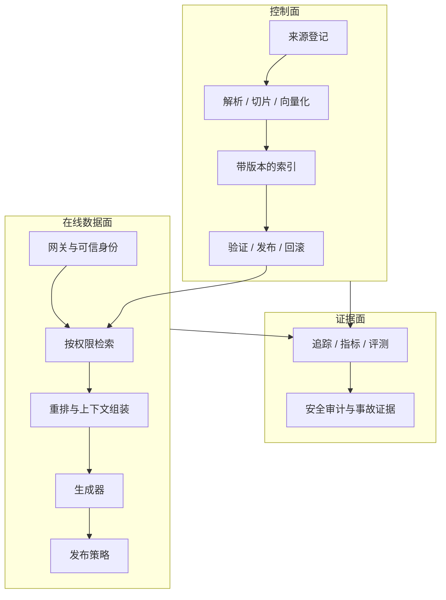

# 生产 RAG：从一次回答到长期运行

<!-- learning-contract -->
<div class="learning-contract" markdown="1">

**学习导航**

- **适合读者**：要把 RAG baseline 做成多用户服务的平台、后端与算法工程师。
- **先修**：[请求生命周期](rag-request-lifecycle.md)、[摄取](rag-ingestion.md)与[引用/拒答](rag-generation.md)。
- **首次阅读**：先跟着一次正常请求和一次超时请求，再把观察到的状态放回控制面、数据面和证据面。
- **完成信号**：能解释为什么 HTTP 已返回 504，服务容量却仍未恢复，以及哪个时刻才可以释放并发许可。
- **卡住时**：只看 `rag_service_control.py` 输出中的 `engineering`、`negative_cases` 和 `pressure`。

</div>

**实践导航**：[请求生命周期](rag-request-lifecycle.md) ·
[数据摄取](rag-ingestion.md) ·
[RAG Foundations](../practice/projects/rag-foundations.md) ·
[生产检查表](../practice/production-checklist.md)
{ .doc-nav }

离线 Demo 只需要回答一次问题。生产 RAG 必须在文档变化、权限变化、流量波动、
模型失败和依赖故障时，持续给出可解释且不越权的终态。

生产化的核心不是换成更大的向量库，而是让身份、状态、发布条件和恢复方式在每个边界都清楚可见。

## 先观察一次正常请求和一次超时

运行本地服务控制程序：

~~~powershell
python projects/rag-foundations/rag_service_control.py
~~~

它会临时创建 SQLite 数据库，通过 FastAPI、Starlette 和 HTTPX 的内存 ASGI 调用链发送请求。
先看正常路径：

| 请求 | HTTP 结果 | 可以读取的来源 | 说明 |
|---|---:|---|---|
| `engineering-token` | 200 | `public-security`、`engineering-citations` | 认证身份带有 `engineering` 权限 |
| `anonymous-token` | 200 | `public-security` | 同一问题也不能越过 ACL |
| 匿名请求在正文中加入 `tenant_id=tenant-b` | 422 | 无 | 请求 schema 不接受客户端自报租户 |
| 不带凭证 | 401 | 无 | 认证失败发生在检索之前 |

两个成功请求都有服务端生成的 `request_id` 和不同的工件指纹。它们回答同一个问题，
但授权上下文不同，所以候选、上下文和最终工件也不同。

### 504 返回后，后台工作还没有结束

程序随后把服务改成一个容易观察的压力场景：

| 设置 | 值 |
|---|---:|
| 最大并发 | 1 |
| 排队等待上限 | 0.02 秒 |
| 请求执行上限 | 0.03 秒 |
| 模拟同步工作 | 保持运行，直到第二个请求被拒绝 |
| 恢复验证的执行上限 | 1.0 秒，用来单独检查容量是否已经释放 |

状态变化如下：

```text
慢请求取得唯一许可并进入后台线程
-> 0.03 秒后，HTTP 返回 504 execution_timeout
-> 后台线程继续运行，许可仍被占用
-> 第二个请求等待 0.02 秒后返回 503 queue_saturated
-> 后台线程结束，完成回调释放许可
-> 第三个请求返回 200
```

这段过程揭示了两个不同的终态：客户端看到的请求终态已经是 504，但服务内部工作的终态仍是“运行中”。
若收到超时就立即释放许可，第二个请求也会进入线程池，服务报告的可用容量便会大于真实容量。

这个控制程序的证据范围是单进程中的身份解析、SQLite 读取、ASGI 路由和许可生命周期。
TCP、TLS、反向代理、远端身份系统和多进程部署属于目标环境验证；生产 SLO 还需要真实流量和依赖数据。

## 先把系统分成三个平面



- **控制面**把原始资料变成可发布、可回滚的索引版本。
- **数据面**处理每个用户请求，不能继承控制面的宽权限。
- **证据面**保存诊断与发布依据，也必须独立授权和脱敏。

把三者混在一个进程和一套数据库中，初期可以工作，但安全与恢复边界仍要在设计中明确。

刚才的控制程序主要观察数据面：身份怎样决定可见片段，超时和排队怎样产生不同终态。
它也留下少量证据面信息，例如服务端请求 ID、工件指纹和原因代码。控制面只负责准备固定 SQLite 数据，
并没有演示索引发布与回滚；这一部分由[摄取 walkthrough](rag-ingestion.md)继续说明。

## 请求路径：可信身份必须先到

一次请求至少需要：

```text
服务端请求 ID
已经认证的用户身份
租户 ID
用户角色或授权集合
权限策略版本
问题与对话状态
截止时间与资源预算
```

问题、`top_k` 和生成参数可以来自请求；租户和用户角色必须来自可信认证结果。
控制程序中的正文租户注入返回 422，正是在验证这条边界。

请求 A 在生产环境中的顺序仍然是：

```text
authenticate
-> authorize corpus scope
-> retrieve
-> rerank
-> pack
-> generate
-> validate citations/claims
-> publish or refuse
```

框架可以封装调用，不能改变这条安全顺序。

## 摄取路径：先构建，再发布

不要边写当前索引边服务流量。推荐 immutable version + alias：

1. 为 source snapshot 分配版本。
2. 解析、切分、提取 metadata 与 ACL。
3. 生成 lexical/vector index 到新 namespace。
4. 校验数量、失败率、抽样解析、ACL 与 retrieval regression。
5. 发布 manifest，原子切换 read alias。
6. 保留上一版，直到观察窗口结束。
7. 异步清理旧版，但遵守审计和删除策略。

Manifest 至少绑定：

```text
corpus snapshot
parser/chunker revision
embedding model/revision
tokenizer/pooling/normalization
index type and parameters
metadata/ACL schema
build time and validation report
```

只有 alias 切换成功，不代表新索引质量合格；发布前必须跑固定 qrels 和安全负例。

## 更新、删除与权限变化

文档生命周期不只是 upsert：

```text
create -> update -> supersede -> revoke -> delete -> purge evidence
```

需要分别定义：

- 新版本何时生效；
- 旧版本是否仍可回答历史问题；
- Source 删除怎样传播到 chunks、vector index、cache 和备份；
- ACL 收紧后旧 cache、trace 和 rendered context 怎样失效；
- Partial failure 如何重试而不产生双版本；
- 法务保留与用户删除请求冲突时谁决策。

空抓取不能自动解释为“删除全部”。网络失败与来源真的为空必须是不同状态。

## 索引一致性不是一个布尔值

同一份来源可能同时存在于对象存储、元数据数据库、关键词索引、向量索引和缓存中。

跨存储通常没有单个 ACID 事务。常见选择是：

- Outbox / change log 驱动各索引更新；
- 每份派生数据带 source version；
- Query 只读取同一已发布 snapshot；
- 后台 reconciliation 找 missing/extra/stale records；
- 失败时回退到上一完整版本，而不是混合新旧。

“最终一致”必须写出允许的 stale window、用户可见行为和删除 SLA。

## 多租户与缓存

多租户系统至少防四类混淆：

1. Corpus 与 index namespace 混淆。
2. Rerank 或 response cache key 缺少 caller/policy context。
3. Trace、错误日志和 APM 收集越权正文。
4. Shared embedding/cache 让隐藏文档影响可见 score 或时序。

Cache key 至少考虑：

```text
tenant / subject or entitlement set
policy revision
query and rewrite
corpus/index revision
retriever/reranker/model revision
generation and publication policy
```

高基数 entitlement 不能简单拼成长字符串。可以使用 canonical identity 或授权结果版本，
但 hash 只绑定内容，不替代授权。

ACL 收紧时，TTL 等待通常不够。需要主动失效或每次命中后重新授权。

## API 契约与终态

一个生产 endpoint 不应只返回 `answer: string`。至少区分：

```text
answer
abstain
reject
error
timeout
cancelled
```

每个终态有唯一 reason code。HTTP status、业务 action 与模型 finish reason 是不同层，不能混成一个字段。

本页控制程序观察到的组合是：

| HTTP 状态 | 业务结果或错误码 | 含义 |
|---:|---|---|
| 200 | `answer` | 请求完成，并通过当前逐字回答策略 |
| 401 | `unauthorized` | 缺少或无法识别认证凭证 |
| 422 | `invalid_request` | 请求正文试图加入 schema 不允许的字段 |
| 503 | `queue_saturated` | 在排队上限内没有取得并发许可 |
| 504 | `execution_timeout` | HTTP 停止等待，但后台同步工作仍可能继续 |

Public response 可以包含：

```json
{
  "request_id": "server-generated",
  "action": "answer",
  "answer": "... [S1]",
  "citations": [{"id": "S1", "title": "..."}],
  "missing_information": []
}
```

不要返回内部 ACL、原始越权候选、被 reject 的 raw output 或完整审计对象。

## 超时、取消与并发

客户端超时或断连，不等于后台工作已经停止。

对每一层分别问：

- HTTP handler 是否停止等待？
- 检索、重排和模型调用是否支持协作取消？
- 线程、GPU 序列或远端请求是否仍在运行？
- 并发许可何时释放？
- 最终用量与费用是否已经确定？

本项目把同步 SQLite 和 BM25 工作交给后台线程，并使用 `asyncio.shield` 避免 HTTP 超时直接取消任务对象。
超时时，服务先返回 504，再给后台任务注册完成回调。只有线程真正结束，回调才释放并发许可。

压力场景中的 504 → 503 → 200 就是这段控制流的外部证据。它仍不能证明远端模型请求已取消，
因为远端 SDK、服务端队列和计费系统各有自己的终态。

并发控制要覆盖 retrieval、rerank 和 generation 各自瓶颈，不能只限制 HTTP request 数。

## Trace：保存证据链，而不是全文堆积

一次请求的最小 trace 可包含：

```text
request/caller/policy identity
query and rewrite hash
corpus/index revision
authorized candidate count
retrieval/rerank IDs, scores and truncation
packing decisions and prompt token ledger
model/runtime/generation identity
raw-output hash and restricted location
claim/citation findings
final action, reason and timestamps
```

需要正文时，优先保存受控 snapshot reference 与 content hash；直接复制全文会扩大敏感数据面。

Unsigned SHA-256 可以发现 bytes 漂移，不能认证谁产生了工件，也不能阻止攻击者协同改写全部文件。

## 可观测性：先定义 attempt 分母

一个用户请求可能触发查询改写、多轮检索、重排、生成重试和质量判断。
因此要分别统计“用户发起了多少个业务请求”和“各个下游服务实际尝试了多少次调用”。

至少监控：

| 维度 | 指标 |
|---|---|
| 入口 | QPS、queue、认证/授权失败、deadline |
| Retrieval | candidate count、zero results、Recall 切片、filter rate |
| Rerank | candidate depth、truncation、额外 p95、GPU 利用 |
| Packing | token 使用、budget drop、source concentration |
| Generation | TTFT、E2E、token、provider error、cost |
| Answer | answer/abstain/reject/error、citation 与 accepted risk |
| Security | 跨权限 attempt、blocked candidate、注入与数据外传告警 |
| Ingestion | freshness、parse failure、stale/delete backlog |

平均值会隐藏 tenant、语言、文档类型和长尾 query。Dashboard 必须支持这些切片。

## SLO 与质量门禁分开

一个低延迟错误答案不是成功。上线门禁至少有四类：

1. **质量**：evidence recall、claim support、completeness、false refusal。
2. **安全**：tenant/ACL、注入、source exposure、public projection。
3. **可靠性**：success rate、timeout、error、恢复与删除传播。
4. **性能成本**：queue、p95/p99、token、GPU/CPU、每成功任务成本。

发布规则应写成联合条件，例如：

```text
security regressions = 0
and accepted-answer risk <= threshold
and false-refusal increase <= threshold
and p95/cost within budget
```

不能用平均正确率抵消一次跨租户泄漏。

## 评测集与线上反馈

离线集至少包含：

- Answerable、no-answer、partial-answer；
- 冲突版本、过期来源与时间查询；
- 跨 tenant、ACL blocked 与 policy change；
- 数字、否定、单位、条件和多跳；
- 文档 Prompt injection 与伪造 citation；
- Timeout、parser error、provider error 和取消。

线上 thumbs-up/down 很稀疏且有选择偏差，不能直接当 gold。
将用户反馈用于 error discovery，再经过隐私、标注与切分流程进入评测集。

Judge 模型也要固定 revision、rubric 和 calibration。Judge 通过不替代人工高风险抽查。

## 容量与成本账本

每个业务请求的成本可能包括：

```text
query rewrite
embedding
sparse/vector retrieval
reranker
generator input/output
claim judge
storage and egress
retry and failed attempts
```

报告每成功任务成本，而不只报告每次模型调用成本：

\[
\text{cost per successful task}=
\frac{\text{all attempt cost}}{\text{verified successful tasks}}.
\]

缓存可以省成本，也可能造成权限和新鲜度事故。先证明 cache key 与 invalidation，再讨论命中率。

## 备份、恢复与回滚

需要恢复的不只是 metadata DB：

- Source snapshot 与解析工件；
- Sparse/vector index 与 alias；
- Embedding/reranker/model manifest；
- Policy、Prompt 与 schema；
- Evaluation reports 与 release decision；
- 必要的审计证据。

恢复演练应在新位置执行，验证 schema、row/chunk identity、索引可读性和固定 query。

单个 SQLite 备份成功，只说明当前固定场景的本地快照路径可以工作。
远端向量库、对象存储、缓存和流量切换仍要分别演练，才能评价恢复点目标（RPO）和恢复时间目标（RTO）。

## 常见事故与第一检查点

| 事故 | 第一检查点 |
|---|---|
| 更新后答案突然变差 | corpus/index alias、parser/chunker 与 qrels regression |
| 某 tenant 看到别人的标题 | trusted identity、namespace、cache key、public projection |
| Recall 高但答案漏条件 | packing、truncation、claim completeness |
| No-answer 问题大量硬答 | evidence sufficiency 与 publication action |
| 延迟上升但模型没变 | queue、candidate depth、reranker、index compaction |
| 删除后仍能引用旧内容 | cache、旧 snapshot、trace retention、备份策略 |
| 客户端取消后容量不恢复 | 后台线程/远端调用与 permit 生命周期 |

事故复盘要保存第一个错误环节，不只贴最终坏答案。

## 渐进式生产路线

1. 单机 BM25 + extractive answer，建立权限与分母。
2. 加 SQLite/source version，演练更新、删除与恢复。
3. 加 dense/ANN 与 reranker，分开测表示、索引和排序误差。
4. 接目标 tokenizer 与 LLM，保留原始失败和 citation/refusal gate。
5. 加 API 认证、deadline、并发、trace 与 public projection。
6. 在 staging 使用真实 IAM、目标 corpus 和 shadow traffic。
7. 小流量发布，联合观察质量、安全、可靠性与成本。

每一步都应保留上一层容易观察的对照实现，避免更复杂的框架把错误原因重新藏起来。

## 可运行入口

[RAG Foundations](../practice/projects/rag-foundations.md) 提供单机参考实现：

- Markdown 切片与稳定片段 ID；
- 先授权再执行的 BM25、重排与上下文组装；
- 逐字回答、引用和拒答；
- SQLite 更新、删除、备份和恢复；
- 带持久化存储的抽取式 ASGI 服务；
- 固定 Qwen 原始失败、发布策略回放和真实门禁运行。

先运行：

~~~powershell
python projects/rag-foundations/rag_request_walkthrough.py
python projects/rag-foundations/rag_service_control.py
~~~

第一条展示检索到发布的内容状态，第二条展示身份、HTTP 和容量状态。它们都是帮助理解流程的本地程序，
不是生产部署模板。具体适用范围见
[RAG 证据页](../evidence/rag-answer-controls.md)。

## 系统设计面试回答顺序

1. 先问 corpus、用户、权限、freshness、流量与质量目标。
2. 画控制面、数据面和证据面。
3. 沿请求讲授权、召回、重排、packing、生成与发布。
4. 沿更新讲 version、alias、delete、reconciliation 与 rollback。
5. 给出质量、安全、SLO、成本的联合门禁。
6. 最后讨论缓存、分布式索引、多区域与灾备。

不要从“选择哪家向量数据库”开始。数据库是组件，不是系统边界。

## 自测

1. 控制面有权读全部 corpus，为什么数据面仍要按请求重新授权？
2. ACL 收紧后，只等待 response cache TTL 有什么风险？
3. 为什么 HTTP 已返回 504，第二个请求仍应得到 503，而不是立即进入后台线程？
4. Index alias 切换成功为什么不能作为质量发布依据？
5. 每成功任务成本为什么要把失败 attempt 计入分子？
