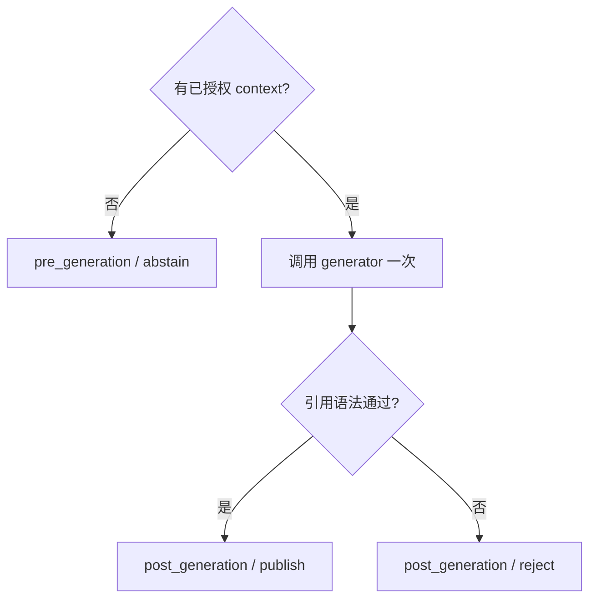

# 一次 RAG 请求如何变成可发布答案

<!-- learning-contract -->
<div class="learning-contract" markdown="1">

**学习导航**

- **适合读者**：理解 RAG 名词，但还不能把权限、检索、重排、引用和拒答连成一条链的开发者。
- **先修**：[RAG 总览](rag.md)中的候选、上下文和引用概念。
- **首次阅读**：先跟请求 A 走完全程，再看请求 B 为什么在“检索有结果”时仍拒答。
- **完成信号**：能为一次回答画出 caller、candidate、context、claim、citation 与 final action 的状态变化。
- **卡住时**：忽略模型生成，只把最终步骤理解为“从证据中复制一句话并附上 `[S1]`”。

</div>

RAG 难学，不是因为 BM25、Embedding 或 reranker 各自太复杂，而是因为它们经常被压进一个黑盒调用：

```python
answer = chain.invoke(question)
```

这个调用隐藏了最重要的工程问题：哪份身份参与授权、越权正文在哪里被挡住、
答案段何时进入候选、为什么被放进 Prompt，以及系统凭什么发布或拒绝结果。

本章跟踪两个请求：

- 请求 A：`RAG 为什么要先做 ACL 权限过滤`，知识库中有直接证据。
- 请求 B：`引用的 Kubernetes 灾难恢复步骤是什么`，只能找到主题相关、但不含答案的资料。

两者都来自 `tenant-a` 的 `engineering` 调用者。

## 先看两种终态

请求 A 的期望终态是：

```text
action = answer / publish
response = 检索必须先执行租户隔离和 ACL 权限过滤，
           再进行排序与上下文构建。[S1]
```

请求 B 的期望终态是：

```text
action = abstain
response = 证据不足，无法基于已授权知识库回答。
```

一个回答，一个拒答。它们共享同一套权限和证据流水线。

## 请求开始前：文档已经变成可检索单元

样例 corpus 有四份 Markdown source：

| Source | Tenant / ACL | 关键内容 |
|---|---|---|
| `rag-security` | `tenant-a / engineering` | ACL 顺序、引用边界 |
| `rag-evaluation` | `tenant-a / public` | Recall、MRR、nDCG、忠实度和拒答 |
| `finetuning-basics` | `tenant-a / ml` | SFT 数据检查 |
| `tenant-b-secret` | `tenant-b / public` | 故意堆入 ACL、Recall、引用等高相关词 |

摄取阶段按 Markdown 标题和段落切分 source。每个 chunk 保存：

```text
tenant_id
stable source_id
source version
chunk document_id
heading path
ACL
content hash
```

在线检索的对象是 chunk，不是整份原文。引用和评测有时按 stable source 聚合，
所以必须同时保留 chunk identity 与 source identity。

### 索引权限与请求权限不是一回事

可信索引进程可能有权限读取全部文档并建立词频或向量；普通请求不能继承这份服务权限。
请求路径要用调用者身份重新确定可见集合。

本仓库的 in-memory BM25 会在构造索引时预分词，但查询时只对已授权索引计算 IDF、平均长度和分数。
因此它证明的是 authorization-first query statistics，不是“索引进程从未读取隐藏正文”。

## 阶段 0：先固定问题与可信身份

请求 A 进入网关后，系统至少需要两类输入：

```text
untrusted input:
  query = "RAG 为什么要先做 ACL 权限过滤"

trusted context:
  tenant_id = "tenant-a"
  subject = authenticated user
  principals = ["engineering"]
  policy_revision = current authorization policy
```

Query 是用户输入，tenant 和 principals 不是。若 API body 可以自报：

```json
{"tenant_id": "tenant-b", "principals": ["admin"]}
```

那么后面的检索算法再正确也没有意义。身份应来自已验证 token、可信代理头或服务端 session，
再转换为内部 `ExecutionContext`。

## 阶段 1：建立本次请求的可见集合

授权规则先按 tenant 隔离，再检查 ACL：

```text
visible(d, caller) =
  d.tenant_id == caller.tenant_id
  and (d.acl is empty or d.acl intersects caller.principals)
```

对请求 A：

| Source | 授权结果 | 原因 |
|---|---|---|
| `rag-security` | visible | tenant 相同，ACL 命中 `engineering` |
| `rag-evaluation` | visible | tenant 内 public |
| `finetuning-basics` | blocked | caller 没有 `ml` |
| `tenant-b-secret` | blocked | tenant 不同 |

Blocked 文档不能进入查询期分数、reranker 输入、context、生成器、响应或跨主体缓存。
审计日志可以记录稳定 ID 与 reason code，不应为了“方便排错”复制越权正文。

## 阶段 2：BM25 召回三个候选

BM25 只在可见集合中计算本次查询的统计和分数。在当前固定语料和查询下，前三个 chunk 是：

| 初排 | Stable source | 内容摘要 | BM25 score |
|---:|---|---|---:|
| 1 | `rag-security` | 必须先做租户隔离与 ACL，再排序和构建上下文 | 6.1148 |
| 2 | `rag-evaluation` | 答案还需检查引用、忠实度和拒答 | 2.5060 |
| 3 | `rag-security` | 已授权证据与引用不等于语义蕴含 | 0.6798 |

第一名已经含有直接答案，说明 Recall 成功。第二、三名仍有价值：
它们可以补充回答边界，但也会争夺有限上下文。

### 此时能得出什么

可以说：在固定 corpus、调用者身份、tokenizer 和 BM25 实现下，answer-bearing chunk 进入了 top-3。

不能说：

- 整个 RAG 已经正确；
- BM25 比 dense retrieval 更好；
- 第一名来源一定真实或最新；
- 模型一定会使用第一名；
- 生产语料上的 Recall 达标。

召回只解决候选覆盖。

## 阶段 3：Reranker 重新比较 query 与候选

Reranker 收到前三名之前再次做授权检查。这样即使上游接错索引，越权正文也不会传给 scorer。

为了把重排过程讲清楚，本例预先给这三个候选设置如下分数：

| 候选 | 初排 | Rerank score | 重排后 |
|---|---:|---:|---:|
| ACL 顺序段 | 1 | 0.95 | 1 |
| 一般评测段 | 2 | 0.10 | 3 |
| 引用边界段 | 3 | 0.70 | 2 |

Top-2 因而都来自 `rag-security`：一段回答“为什么先授权”，另一段限制“引用能证明什么”。

这里的分数由作者构造，用来验证四件事：

1. Scorer 只看到授权候选。
2. 每个 score 绑定 query、chunk bytes 和 scorer identity。
3. 少分、多分、重复候选与非有限数会失败。
4. 排序与平分规则可重放。

它没有运行 learned cross-encoder，也没有证明重排提升真实相关性。

## 阶段 4：Packing 把 top-2 变成 Prompt 证据

Context packer 不只是 `results[:k]`。它依次检查：

- 每个候选仍然已授权；
- document 是否重复；
- 同一 stable source 是否超过配额；
- 加入候选后的完整 Prompt 是否超过预算；
- 输出 token 是否已经预留。

本例预算足够，两个候选都被选择并映射为短 ID：

```text
S1 -> rag-security / ACL 顺序段
S2 -> rag-security / 引用边界段
```

渲染后的上下文近似为：

```text
<source id="S1" document_id="...">
检索必须先执行租户隔离和 ACL 权限过滤，再进行排序与上下文构建。
</source>

<source id="S2" document_id="...">
生成器只能看到已授权证据；引用编号不能证明语义蕴含。
</source>
```

Source ID 只在本次 canonical context 中有意义。模型输出 `[S1]` 后，服务端再映射到授权后的显示信息。

### 为什么按完整 Prompt 计 token

不能把各 chunk 独立 token 数简单相加。System Prompt、chat template、分隔符、query 和输出预留都会占窗口，
tokenizer 也可能让拼接前后的长度不是各部分长度之和。

仓库同时保留两种教学路径：

- UTF-8 byte budget：依赖少、容易手算，但不是模型 token。
- 目标 tokenizer budget：重渲染完整 chat，再为输出显式预留 token。

两者不能混报。

## 阶段 5：先用逐字抽取建立答案基线

在接 LLM 前，透明 baseline 从 packed context 中选择覆盖 query 的原文 span：

```text
检索必须先执行租户隔离和 ACL 权限过滤，
再进行排序与上下文构建。 [S1]
```

这个 baseline 保存 span 的 `start_char`、`end_char`、原文、source 和 content hash。
因此可以机械验证：

```text
source_text[start_char:end_char] == emitted_span
```

这比“模型输出看起来不错”更容易定位 packing 与 citation wiring 的错误。

但逐字复制仍不证明：

- 来源内容是真的；
- 该句完整回答了“为什么”；
- 没有冲突或更新版本；
- lexical coverage 阈值适合真实业务；
- 生成模型也会遵守相同协议。

## 阶段 6：从生成结果到发布决策

模型或抽取器的输出不能默认直接返回。最小发布策略有三条路径：



请求 A 的答案含 `[S1]`，且 `S1` 位于本次授权 context，因此可以通过本地 citation syntax gate。

请注意：`publish` 在这个局部策略中只表示引用 ID 和段落覆盖合法，
`semantic_entailment_verified` 仍然是 false。语义支持需要独立的 claim–evidence 判断。

### Public projection 与 audit projection

如果模型生成了越权、漏引或恶意文本，审计面可能需要保留 raw output；用户面不应返回它。

- Public projection 只含固定 response、action、stage 与安全字段。
- Audit projection 可以含 raw output、未知 ID 和漏引段落，但需要独立访问控制与保留策略。

“对象能序列化”不代表可以把整个对象发给客户端。

## 请求 B：为什么检索有结果仍然拒答

现在处理请求 B：

> 引用的 Kubernetes 灾难恢复步骤是什么？

BM25 找到三段资料，因为它们含“引用”“拒答”等词：

```text
S1: 答案还需要检查引用覆盖、事实忠实度和拒答行为。
S2: 生成器只能看到已授权证据；引用编号不能证明语义蕴含。
S3: 召回阶段使用 Recall@k、MRR 和 nDCG。
```

这些结果 topical，却都不 answer-bearing。逐字抽取 baseline 的有效 query token 覆盖率只有：

\[
\frac{2}{9}\approx0.2222,
\]

低于本例设置的 `0.55` 阈值，所以终态是 `abstain`。

这条负例说明：

1. Zero results 不是拒答的必要条件。
2. Topical relevance 不是 answerability。
3. Citation availability 不是 evidence sufficiency。
4. 阈值只是需要校准的决策规则，不是普适常数。

真实系统应在独立 calibration split 上画 coverage–risk 曲线，选择业务可接受的回答率与错误风险。

## 两个请求的状态对照

| 阶段 | 请求 A | 请求 B |
|---|---|---|
| Caller | `tenant-a / engineering` | 相同 |
| 授权集合 | security + evaluation | 相同 |
| 召回 | 含直接答案 | 只有主题相关片段 |
| 重排 | 答案段和边界段进入 top-2 | 不能凭相似度制造缺失事实 |
| Packing | `S1/S2` 都可放入 | 有 context，但没有所需步骤 |
| Answer decision | exact span，coverage 1.0 | coverage 0.2222，abstain |
| Citation | `[S1]` 合法 | 没有要发布的事实 claim |
| 最终动作 | answer / syntax-publishable | abstain |

## 一次失败该归到哪里

为每个请求保存下面的最小 trace：

```text
request/caller identity
corpus/index/policy revision
authorized candidate count
retrieval IDs + scores
rerank IDs + scores + truncation
packing decisions + token ledger
rendered source map
raw output
claim -> citation -> evidence mapping
final action + reason code
```

然后找证据第一次偏离期望的环节：

| 第一个异常 | 归因 |
|---|---|
| Gold source 不在 snapshot | corpus / ingestion |
| Gold 被 ACL 挡住 | 标注 security context 或 policy |
| 可见 gold 未被召回 | retriever / ANN |
| 召回后被降到预算外 | reranker |
| Top result 没进入 Prompt | packing |
| Prompt 有证据却回答错误 | generator |
| Claim 有引用但不受支持 | citation correctness |
| No-answer case 被发布 | abstention / publication policy |

不要用“模型幻觉”概括所有失败。上游没有给模型正确证据时，调 Prompt 通常不会修复根因。

## 映射到仓库代码

| 生命周期环节 | 主要入口 | 先观察什么 |
|---|---|---|
| Markdown 摄取 | `src/about_llm/rag/ingestion.py` | stable chunk 与版本变化 |
| 授权 BM25 | `src/about_llm/rag/bm25.py` | visible indices 与授权统计 |
| Rerank | `src/about_llm/rag/reranking.py` | scorer 前二次授权和 score binding |
| Context packing | `src/about_llm/rag/context_packing.py` | 每个候选的选择原因和完整 Prompt 成本 |
| Source map / citation | `src/about_llm/rag/citations.py` | 短 ID、未知引用和漏引段落 |
| Extractive baseline | `src/about_llm/rag/extractive.py` | exact span、coverage 与 abstain |
| 发布策略 | `src/about_llm/rag/generation_policy.py` | publish、abstain、reject 三条路径 |
| 离线回答评测 | `src/about_llm/rag/answer_eval.py` | action、claim verdict 和分母 |

在[实验 5：追踪一次 RAG 问答](../practice/labs/lab-5-rag-request.md)中，
你会对请求 A/B 先写预测，再运行相同的固定场景和授权负例。

具体 claim、对应测试和目前尚未验证的部分集中在 [RAG 证据页](../evidence/rag-answer-controls.md)。

## 自测

1. 为什么可信索引进程可以读全文，不代表在线请求可以先对全文打分再过滤？
2. 请求 A 在 BM25 阶段已经把答案排第一，reranker 仍有什么价值？
3. Reranker 把两个同源 chunk 排到前两名时，packer 为什么还需要 source quota？
4. Exact span 为什么能证明 provenance，却不能证明答案完整？
5. 请求 B 有三个检索结果，为什么不能让 LLM“尽量回答”？
6. Post-generation reject 的 raw output 为什么不能直接出现在 public response？
