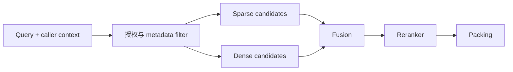

# RAG 召回、混合检索与重排

<!-- learning-contract -->
<div class="learning-contract" markdown="1">

**学习导航**

- **适合读者**：需要设计 RAG 召回、排序和离线评测的开发者与算法工程师。
- **先修**：[一次 RAG 请求的生命周期](rag-request-lifecycle.md)、向量与排序的基本直觉。
- **首次阅读**：请求 A 的三个候选 → BM25 → 稠密检索 → 融合 → 重排 → 失败归因。
- **完成信号**：能用固定相关性标注判断失败来自语料、召回、近似索引、重排还是上下文组装。
- **卡住时**：先只保留 BM25 与 10 条人工问题，确认含答案的证据能否进入前 k 个结果。

</div>

**实践导航**：[一次 RAG 请求](rag-request-lifecycle.md) ·
[运行实验 5](../practice/labs/lab-5-rag-request.md) ·
[RAG Foundations](../practice/projects/rag-foundations.md) ·
[检索表示学习](retrieval-learning.md)
{ .doc-nav }

检索不是寻找“最像问题的一段话”，而是在有限候选预算内覆盖回答所需证据。

在[请求 A](rag-request-lifecycle.md)中，用户问：“RAG 为什么要先做 ACL 权限过滤？”系统只在当前用户有权查看的
资料中计算 BM25，得到三段候选：

| 初排 | 候选内容 | 来源 | BM25 分数 | 重排分数 | 重排后 |
|---:|---|---|---:|---:|---:|
| 1 | 必须先做租户隔离与 ACL，再排序和构建上下文 | `rag-security` | 6.1148 | 0.95 | 1 |
| 2 | 回答还需检查引用、忠实度和拒答 | `rag-evaluation` | 2.5060 | 0.10 | 3 |
| 3 | 已授权证据与引用不等于语义蕴含 | `rag-security` | 0.6798 | 0.70 | 2 |

第一段直接回答问题，第三段补充使用边界。重排后，它们成为最终进入上下文的两段资料。本章后面的算法都回到这张表：
它们究竟改变了“候选有没有进来”，还是只改变“候选排在哪里”？

### 先分清本例实际运行了什么

| 部件 | 请求 A 是否执行 | 本例可以观察什么 |
|---|---|---|
| 请求级授权 | 是 | 越权文档不会进入查询期统计或打分 |
| BM25 | 是 | 三段候选及其真实分数 |
| 稠密向量检索 | 否 | 本章只解释原理与接入条件 |
| ANN 近似索引 | 否 | 没有目标向量库的召回或性能数字 |
| RRF 融合 | 否 | 只提供公式和手算方法 |
| 重排 | 使用预先记录的分数 | 排序、授权复查和分数绑定会真实执行；没有运行 learned model |
| 上下文组装 | 是 | 重排前两名怎样映射为 `S1`、`S2` |

这张表防止把一条 BM25 教学请求误写成“混合检索系统已经完整运行”。

## 先把“相关”拆成三层

对 query 与 chunk，至少区分：

| 层次 | 判断问题 | 请求 A 的例子 |
|---|---|---|
| Topical | 是否在谈同一主题？ | “RAG 还需要评测拒答” |
| Answer-bearing | 是否含回答所需事实？ | “ACL 必须先于排序” |
| Usable | 权限、版本、时间和来源是否允许使用？ | `tenant-a / engineering` 可见的当前版本 |

向量相似度很容易把“主题相近”排到前面；RAG 最终需要的是可用于回答、并且当前用户有权使用的证据。

一个问题也可能需要多份证据。标注时应保存 evidence set，不能强迫每个 query 只有唯一正确文档。

## 候选漏斗

生产检索通常不是单个模型，而是一条漏斗：



每一层用更高成本处理更少候选：

```text
百万级 corpus
-> 数百个 sparse/dense 候选
-> 数十个 rerank 候选
-> 数个 context chunk
```

如果答案在第一步就没进入候选，后面的 reranker 和 LLM 无法把它创造出来。

## 授权先于查询期统计与打分

可信索引进程可以按自己的服务权限建立索引；在线请求必须按 caller 再确定可见集合。

本仓库 BM25 的查询路径是：

1. 先选出 tenant 与 ACL 可见的 document indices。
2. 只在这些 indices 上计算 IDF 与平均长度。
3. 只对这些 documents 计算 query score。
4. 返回的 candidate 再由 reranker 与 packer 二次授权。

若只在最后删除越权结果，隐藏文档仍可能改变可见 score、候选深度、缓存与时序。

授权上下文必须进入 cache key。Policy revision 改变后，旧 cache 也要失效。

## 关键词检索：先学会 BM25

BM25 的常见形式为：

\[
\operatorname{score}(q,d)=
\sum_{t\in q}\operatorname{IDF}(t)
\frac{f(t,d)(k_1+1)}
{f(t,d)+k_1(1-b+b|d|/\overline{|d|})}.
\]

直觉可以拆成三件事：

1. Query 词在文档出现得越多，贡献越高，但收益会饱和。
2. 在 corpus 中越罕见的词，IDF 越高。
3. 长文档更容易偶然命中，所以用平均长度归一化。

BM25 特别适合：

- 错误码、产品型号、API 字段和代码符号；
- 人名、组织名和罕见缩写；
- 用户已经知道精确关键词的查询；
- 透明、便宜且可解释的回归基线。

中文必须明确 tokenizer。按单字、词、字符 n-gram 或领域词典切分会得到不同统计，
不能只写“使用 BM25”而不版本化分析器。

回到请求 A，第一段同时出现“先”“ACL”“权限”“过滤”等高价值词，因此得到 6.1148。第二段主要谈评测，
只因共享少量词得到 2.5060。BM25 分数只在当前查询、可见集合和实现中有意义，不能拿 6.1148 与另一条查询的分数
直接比较。

### 字段化检索

标题、正文、标签和代码符号不应自动等权。BM25F 或多字段查询可以提高标题和精确字段权重。

权重必须在固定评测集上调。导航标题和模板文字会重复出现，盲目提升 title boost 可能把模板噪声排到前面。

## 稠密向量检索：语义相近不等于可回答

Bi-encoder 分别编码 query 和 document：

\[
e_q=f_q(q),\qquad e_d=f_d(d),
\]

再用 inner product 或 cosine 打分：

\[
s(q,d)=\frac{e_q^\top e_d}{\lVert e_q\rVert\lVert e_d\rVert}.
\]

归一化向量上，cosine 与 inner product 的排序等价。

Dense retrieval 能找出同义改写，例如“访问控制应在哪一步执行”与“ACL 必须先于排序”。
它也可能忽略产品号、否定、数字和时效，因此通常不应无评测地替换 sparse baseline。

请求 A 尚未运行稠密检索。如果要加入，应保持原查询、调用者身份、语料版本和相关性标注不变，再比较含答案段是否
进入候选。只展示一个余弦分数，无法说明它比上面的 BM25 排序更好。

### 固定 Embedding 的运行条件

接入一个 Embedding 模型时，要固定：

- model 与 revision；
- query/document 是否使用不同 instruction prefix；
- tokenizer、最大长度和 truncation；
- pooling 与 normalization；
- 输出维度、dtype 和相似度函数；
- corpus snapshot 与 index revision。

漏掉模型要求的 query prefix，影响可能大于更换 ANN 参数。
更换 Embedding、pooling 或归一化通常意味着重建文档索引。

### 表示是怎样学出来的

Bi-encoder 常用 InfoNCE 或多正例对比目标。Negative 决定模型被要求区分什么：

- Random negative 容易，但训练信号可能太弱。
- In-batch negative 便宜，却可能包含漏标相关文档。
- Hard negative 信号强，也最容易放大 false negative。
- Mining 必须与 held-out split 隔离，避免把评测信息带回训练。

完整公式、梯度和 ColBERT/SPLADE 路线见[检索表示学习](retrieval-learning.md)。

## ANN：把向量表示误差与近似索引误差分开

Exact vector search 随文档量线性增长。ANN 用近似换吞吐：

| 方法 | 核心直觉 | 主要代价 |
|---|---|---|
| HNSW | 在多层邻接图中导航 | 内存较高，`ef_search` 影响质量与延迟 |
| IVF | 先选 coarse clusters，再扫描若干 list | `nprobe` 太小会漏候选 |
| PQ | 对向量子空间量化 | 压缩更强，距离误差更大 |
| DiskANN 类 | 让大部分索引驻留 SSD | I/O、预取和尾延迟更复杂 |

调 ANN 前，先对同一批 embedding 计算 exact top-k，把它作为近似检索的参考结果：

\[
\operatorname{ANNRecall@k}=
\frac{|R_{\text{ann}}^k\cap R_{\text{exact}}^k|}{k}.
\]

它衡量 ANN 是否复现 exact neighbor，不衡量这些 neighbor 是否真的 answer-bearing。

因此要保存两组分母：ANN recall 比较近似索引与精确向量搜索；evidence recall 比较检索结果与人工证据标注。
前者低时优先检查索引，后者在精确搜索上也低时再检查表示、语料或标注。

过滤会改变图或分区的可达性。ANN 参数必须在真实 tenant、ACL 和 metadata 分布下评测。

## 混合检索：融合名次而不是硬加分数

BM25 分数与余弦相似度不在同一尺度，直接相加会让权重含义随模型和语料变化。
Reciprocal Rank Fusion（RRF，倒数排名融合）只使用名次：

\[
\operatorname{RRF}(d)=
\sum_r\frac{1}{k+\operatorname{rank}_r(d)}.
\]

它不要求各检索器校准到相同分布，是很稳的 hybrid baseline。

例如某段资料在 BM25 中排第 1、在稠密检索中排第 3，取 `k=60` 时得分为
`1/61 + 1/63 ≈ 0.03226`。这个数字只演示名次怎样合并，不是请求 A 的运行结果。

Weighted RRF 可以偏向某一路，但权重、各路候选深度和缺失 rank 都是协议的一部分。
学习融合器能利用 score 与 metadata，却更容易过拟合和漂移。

Query router 可以让错误码优先 sparse、自然语言解释优先 dense。
在有充分 trace 前，先并行召回并记录各路贡献，避免硬路由把某类 query 永久送错通道。

## 元数据过滤不是普通相关性特征

时间、产品、区域、语言、文档状态和 ACL 应尽量进入候选生成。

对“当前报销政策”而言，已失效版本不是分数略低，而是不可用于当前答案。
对历史问题，旧版本又可能是唯一正确证据，因此需要 `effective_from/effective_to` 与 query time。

LLM 可以从 query 抽取结构化 filter，但输出要经过 schema、枚举与授权校验。
严格过滤为零时应请求澄清，不能静默扩大到无权或失效来源。

## 重排：用更贵的交互换更细的判断

Bi-encoder 在编码 query 与 document 时不交互，适合大规模召回。
Cross-encoder 把 query–document 拼在一起，让 token 在打分前交互，通常更准确但更慢。

常见漏斗是：

```text
100–1000 ANN/hybrid candidates
-> 20–100 cross-encoder candidates
-> 5–15 context units
```

重排输入要保留标题和必要的上级上下文。若最大长度把答案段截掉，模型仍可能返回一个有限且漂亮的分数。
报告至少要记录截断比例、批大小、数据类型、增加的 p95 延迟和 GPU 成本。

生成式 reranker 可以处理复杂约束，但也会引入不稳定输出、文档 Prompt injection 与更高成本。
它必须只读取授权候选，输出固定 ID/schema，并与 cross-encoder baseline 比较。

### 在请求 A 上观察重排

请求 A 的 recorded scores 把 ACL 顺序段排第一、引用边界段排第二、一般评测段排第三。

这段程序会再次检查授权，并确认分数绑定当前查询与 chunk 内容。它还会拒绝数量不对、非有限或无法稳定排序的分数。
分数来自仓库准备的固定样例，没有运行学习得到的重排模型，也没有与人工相关性标注比较。精确边界见
[RAG 证据页](../evidence/rag-answer-controls.md)。

## 查询改写与多跳检索

“那它的限制呢？”需要结合对话历史恢复实体。可以生成 standalone query，
但必须保存原 query、改写 query 和引用的 history turn，避免改写偷偷改变意图。

多跳问题可以使用：

- Decomposition：拆成若干子问题；
- Iterative retrieval：用上一跳实体扩展下一跳；
- Multi-query：生成多个改写后融合；
- HyDE：先生成假想答案或文档再检索；
- Graph retrieval：沿实体关系与文本证据共同搜索。

每种方法都会增加调用数、错误传播和注入面。需要最大深度、无进展终止、来源追踪与预算。

## 检索指标：每个数字都要写清分母

设 gold evidence 集合为 (G_q)，前 (k) 个结果为 (R_q^k)：

\[
\operatorname{Recall@k}(q)=
\frac{|G_q\cap R_q^k|}{|G_q|}.
\]

Recall 计算找回相关来源的比例。MRR 关注第一个相关结果的位置。nDCG 支持分级相关性。

本仓库的 source-level Precision 使用实际返回且被检查的槽位作分母：

\[
\operatorname{Precision@k}(q)=
\frac{|G_q\cap R_q^k|}{|R_q^k|}.
\]

若系统只返回两个结果，分母是 2，不固定写成 k。其他实现可能采用固定 k，比较前必须统一。

多跳任务还要看 all-evidence recall：

\[
\operatorname{AllEvidence@k}(q)=
\mathbf{1}[H_q\subseteq R_q^k],
\]

其中 (H_q) 是缺一不可的 required evidence。它不能替代普通 Recall，因为失败 case 不告诉你究竟缺几个证据。

### 无答案问题与不完整标注

No-answer query 的 gold 集合为空，不能塞进普通 Recall 分母。
应显式标记 `answerable=false`，并分开评价 retrieval signal 与最终拒答行为。

人工相关性标注往往不完备。新出现的高排名结果应先记为“尚未判断”，不能自动当作错误结果。
可以汇总多个系统的候选后补充标注，并同时报告前 k 个结果中已有标注的比例。

## 用 trace 定位第一个错误

| 观察 | 归因 |
|---|---|
| Gold source 不在 tenant corpus | 摄取或语料缺口 |
| Gold source 被 ACL 挡住 | Case security context 或 policy |
| 可见 gold 未进大候选集 | Sparse/dense/ANN |
| 大候选中有、rerank 后消失 | Reranker 或截断 |
| Rerank 后有、Prompt 中没有 | Packing |
| Prompt 有证据、答案仍错 | Generation 或 citation |

只有保存每层候选，才能区分“召回漏了”和“重排丢了”。

## 选型顺序

| 当前问题 | 优先动作 |
|---|---|
| 没有可复现基线 | BM25 + 人工 qrels |
| 精确实体经常漏 | 保留 sparse，检查 tokenizer 与字段 |
| 语义改写经常漏 | 加 dense，与 sparse 做 hybrid |
| Exact vector 好、ANN 差 | 调 HNSW/IVF/PQ 与过滤策略 |
| 大候选有答案、前几名没有 | 加 reranker，检查 truncation |
| Top results 重复 | 去重、source quota 与 MMR |
| No-answer 时仍有相似结果 | 建 evidence sufficiency 与拒答评测 |

不要在没有 qrels 时用最终答案的主观观感选择 retriever。

## 可运行入口

先完成[实验 5](../practice/labs/lab-5-rag-request.md)，再运行项目中的 retrieval evaluation：

~~~powershell
python -m about_llm.rag.cli evaluate `
  --corpus projects/rag-foundations/sample_corpus.jsonl `
  --cases projects/rag-foundations/sample_eval.jsonl `
  --top-k 3
~~~

检索表示学习的 NumPy 对照示例位于：

~~~powershell
python projects/rag-foundations/retriever_learning_toy.py
python -m pytest tests/test_retriever_learning.py -q
~~~

## 面试追问

**为什么有向量库还要 BM25？**
精确实体、型号和错误码经常更适合 sparse；两路错误模式互补，hybrid 也提供可解释基线。

**怎样判断该优化 Embedding 还是 ANN？**
先用相同 Embedding 做精确向量搜索。若精确搜索的证据召回率已经很低，先检查表示、语料和标注；
若精确搜索表现好、ANN 结果差，再优先调整近似索引。

**为什么 reranker 前还要再授权？**
上游候选不是永久可信，reranker 会读取正文并可能写日志或缓存。二次门禁限制错误传播范围。

## 自测

1. Topical、answer-bearing 与 usable relevance 分别是什么？
2. 为什么 ANN recall 高不代表 evidence recall 高？
3. RRF 为什么通常比直接相加 BM25 与 cosine score 更稳？
4. Reranker score 是有限实数，为什么仍需记录 truncation？
5. No-answer query 为什么不能进入普通 Recall@k 分母？
