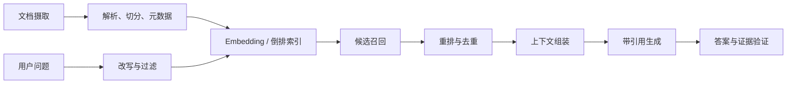

# RAG：检索增强生成

<!-- learning-contract -->

**学习导航**

- **适合读者**：第一次构建或评审 RAG 的工程师与产品人员。
- **先修**：文本表示、基本检索和模型生成直觉；无向量库前置要求。
- **首次阅读**：问题边界 → 摄取 → 检索 → 上下文 → 引用 → 分层评测。
- **完成信号**：能把失败归因到语料、召回、packing、生成或引用。
- **卡住时**：先跑[RAG Foundations 最小路径](../practice/projects/rag-foundations.md#run)。

本章建立端到端概念图。重点进阶内容分为[数据摄取与索引生命周期](rag-ingestion.md)、[召回/混合检索/重排](rag-retrieval.md)、[检索表示学习](retrieval-learning.md)、[上下文/引用/忠实度](rag-generation.md)和[生产架构与运维](rag-production.md)；阅读本章后按这个顺序深入。

## 它解决什么

RAG 在生成时从外部知识源检索证据，把参数记忆与可更新、可引用、可权限控制的数据结合。它适合时效知识、私有文档和需要来源的问答。RAG 不自动消除幻觉：检索可能漏、证据可能错，模型也可能不忠实使用证据。

## 摄取与解析

保留文档 id、标题、章节、页码、版本、时间、ACL、来源 URL 和内容哈希。PDF 的视觉顺序、表格、脚注、扫描 OCR 都会造成解析错误；先评估解析质量再调 Embedding。更新时支持幂等 upsert、删除传播和索引版本。

## 切分

固定 token 窗口简单，但可能切断语义。结构切分按标题、段落、代码函数或表格边界；语义切分按主题变化。chunk 太小缺上下文，太大降低检索分辨率并浪费窗口。重叠可保护边界，但增加重复与成本。

可采用 parent-child：小块用于匹配，命中后返回更大的父段落。表格/代码常需专用表示。不要用字符数代替 token 预算。

## 检索

- **稀疏检索**（BM25）：擅长精确术语、编号、姓名、罕见关键词。
- **稠密检索**：Embedding 捕捉语义近似，但可能忽略精确词。
- **混合检索**：分别召回，再用 RRF 或归一化分数组合。
- **授权与元数据过滤**：tenant/ACL 必须在读取正文、打分、缓存、重排或交给模型之前执行；日期、类型等过滤尽量进入候选生成。

Embedding 的 query/document 前缀、归一化和相似度必须匹配模型说明。换 Embedding 模型通常要重建索引。向量距离分数不跨模型、查询直接可比，不宜写死全局阈值。

## 查询改写和重排

对话问题可补全指代，复杂问题可分解，多查询可提高召回。但改写可能改变意图，需保留原查询。cross-encoder 或 LLM 重排更准但更慢；先宽召回再小规模重排。

RRF 常用：

\[
\text{RRF}(d)=\sum_i\frac{1}{k+\text{rank}_i(d)}
\]

它融合排名而不要求不同检索器分数同尺度。

## 上下文组装

去重近似片段，按相关性与文档结构排序，标注清晰 source id。保留必要邻接上下文，限制单文档垄断。告诉模型资料可能包含恶意指令，只作为证据。证据冲突时展示分歧和日期，不要偷偷选一个。

## 引用与答案

要求关键主张紧跟引用，并验证引用片段是否蕴含主张。引用存在不等于引用正确。无法从资料回答时应 abstain、请求澄清或转人工。对高风险答案，可先抽取可验证主张，再逐条做 entailment/规则检查。

## 分层评测

不要只看最终答案：

| 层 | 指标示例 |
|---|---|
| 解析 | 文本/表格恢复率、元数据正确率 |
| 召回 | Recall@k、MRR、nDCG、ACL 正确率 |
| 重排 | nDCG、pairwise accuracy |
| 上下文 | 证据覆盖、冗余、token 利用 |
| 生成 | 正确性、忠实度、完整性、引用精度/召回 |
| 系统 | 延迟、成本、拒答、权限泄漏 |

端到端错误应归因到“知识库无资料、解析错、检索漏、排序错、模型没使用、模型越界生成”之一，再决定改哪里。

## 建立可诊断的基线

不要直接从向量数据库和大模型开始。一个便于排错的顺序是：

1. 用 BM25 和 source-level qrels 建立 retrieval 基线；
2. 在检索前执行 tenant/ACL 授权，并加入跨权限负例；
3. 用逐字抽取答案验证 packing、引用和拒答协议；
4. 改用目标 tokenizer 计算完整 Prompt 与输出预留；
5. 最后接入生成模型，分别评价答案、忠实度和引用。

逐字抽取通过只能说明答案来自授权上下文，不说明片段相关、来源正确或答案完整。真实模型能运行也不说明会引用或拒答。两者是不同层的证据，应保留各自失败样例。

仓库中的最小实现与运行顺序见 [RAG Foundations](../practice/projects/rag-foundations.md)；深入讨论见[检索与重排](rag-retrieval.md)、[检索表示学习](retrieval-learning.md)、[生成与忠实度](rag-generation.md)和[生产 RAG](rag-production.md)。

## 高级模式

- HyDE：先生成假想答案/文档再检索，可能提高语义匹配，也可能带偏。
- Multi-hop：迭代检索中间实体，注意错误累积和停止条件。
- Graph RAG：利用实体关系和社区摘要，适合跨文档全局问题，建设成本高。
- Corrective/Adaptive RAG：先判断是否需检索、证据是否足，再决定重检索或降级。

## 自测

1. 精确产品型号查找为什么应保留 BM25？
2. RAG 返回了正确文档但答案错误，至少列出四个可能环节。
3. 如何测试不同租户文档不会交叉泄漏？
