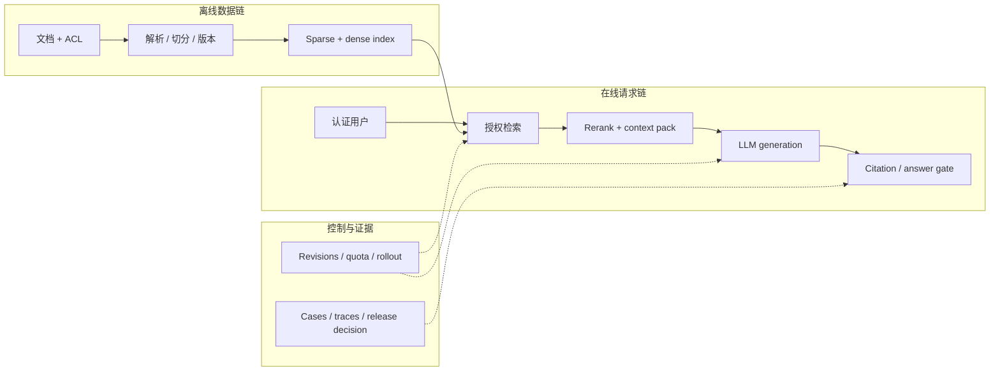

# LLM 系统设计题：从一句需求到可辩护方案

<!-- learning-contract -->
<div class="learning-contract" markdown="1">

**学习导航**

- **适合读者**：准备 LLM 应用、平台、推理或算法工程岗位系统设计面试的开发者。
- **先修**：理解 RAG 请求链、ACL、TTFT/TPOT 和基本容量估算。
- **首次阅读**：只跟企业知识助手主线；两道变体题留到第二遍。
- **完成信号**：能在 40 分钟内澄清需求、画出最小闭环、完成容量手算，并给出故障与发布方案。
- **卡住时**：先区分题目给定、自己假设和必须实测，暂时不要增加组件。

</div>

**求职导航**：[面试题与回答方法](interview-questions.md) · [岗位路线](roadmap.md) ·
[编码轮](coding-round.md) · [应用与治理题](applied-questions.md) · [行为面试](behavioral.md) · [简历项目](resume-projects.md) · [RAG 请求主线](../applications/rag-request-lifecycle.md)
{ .doc-nav }

面试官说：

> 为一家一万人的公司设计企业知识库助手。要求回答带引用，不能泄漏部门文档，峰值 20 QPS。

一个常见反应是立刻画向量数据库、Embedding、reranker 和 LLM。问题在于，这些组件还没有对应到任何可计算需求。
“一万人”不告诉你同时有多少请求；“带引用”也没有定义引用语法、语义支持和无答案行为。

好的系统设计回答像一次公开的工程推理：先把模糊需求变成约束，再给最小闭环，估算数量级，
沿故障链说明降级和恢复，最后指出哪些结论仍需压测或线上证据。

## 先看 40 分钟怎样分配 { #forty-minute-plan }

系统设计面试不是把下面所有内容一次讲完。可以按这条时间线推进，并在每个节点停下来让面试官追问：

| 时间 | 你要完成的动作 | 白板上应该留下什么 |
|---|---|---|
| 0–5 分钟 | 问出会改变架构的条件 | 用户、任务、数据、流量、SLO 与发布标准 |
| 5–8 分钟 | 声明工作假设 | “题目给定 / 当前假设 / 必须实测”三类标记 |
| 8–15 分钟 | 画最小数据链和请求链 | ACL 在哪里生效，证据怎样进入答案 |
| 15–25 分钟 | 沿一次请求讲状态和失败 | 输入、检索、生成、引用、拒答与删除路径 |
| 25–33 分钟 | 做一阶容量估算 | 在途请求、实例算术下限与余量 |
| 33–38 分钟 | 给发布、降级和恢复方案 | 指标、故障树、canary 与回滚条件 |
| 最后 2 分钟 | 总结风险与下一项证据 | 最大风险、待验证假设和演进条件 |

如果面试官在第 15 分钟就追问权限或容量，就沿当前因果链深入。时间线是防止遗漏的骨架，不是必须照读的剧本。

## 前五分钟先问什么

不要一次抛出二十个问题。先问那些会改变架构的条件：

1. **用户和权限**：单租户还是多租户，权限来自哪套身份系统，文档是否有行级或组级 ACL？
2. **任务和无答案行为**：只做事实问答，还是还要总结、比较与执行动作？证据不足时必须拒答吗？
3. **数据变化**：文档类型、规模、更新频率、删除时限和地域限制是什么？
4. **流量和 SLO**：峰值到达率、突发窗口、输入/输出长度、TTFT、TPOT 与可用性目标是什么？
5. **发布标准**：怎样衡量检索、回答、引用、安全和每成功回答成本？

如果面试官没有给数字，可以明确提出一组工作假设：

| 维度 | 当前假设 | 为什么需要确认 |
|---|---|---|
| 流量 | 峰值 20 个合格请求/秒，持续 10 分钟 | 平均 QPS 无法描述突发和排队 |
| 输入 | p50 300、p95 1,500 tokens；规划均值暂取 800 | 长 Prompt 会改变 prefill 和上下文预算 |
| 输出 | p50 120、p95 300 tokens；规划均值暂取 180 | 输出长度决定 decode 占用 |
| 停留时间 | 规划均值暂取 2.5 秒 | Little's Law 使用均值，不能拿 p95 代替 |
| SLO | p95 TTFT < 1.5 s，成功率 99.5% | 用户延迟包含排队，不只模型执行 |
| 权限 | OIDC 身份映射到部门和文档 ACL | Prompt 无法替代认证与授权 |
| 质量 | 回答和引用达到门槛；ACL 越权不允许发布 | 单个相似度分数不足以决定发布 |

把“业务给定”“当前假设”和“必须实测”分开说。这样后续数字变化时，可以替换参数，而不是推翻整套答案。

## 给出最小闭环，再讨论高级优化

企业知识助手的第一版可以分为三条链：



这张图足以说明最小闭环，但还不是“已经可以上线”的证据。方案先对文档和 ACL 做版本管理，只在授权范围内进行
混合检索（hybrid retrieval）。系统把有限证据装入 Prompt，让模型生成带来源 ID 的答案；最后再根据证据情况
返回答案、拒答，或因协议错误拒绝请求。

Graph RAG、Agent、多轮 query planning 或微调可以后加。先说明它们准备解决哪个已观测失败，
否则“高级架构”只是把更多不可观测步骤塞进主链。

## 在线链路按一次请求讲清楚

用户问：“生产数据库的备份保留多久？”

1. 网关从认证 token 取得用户、租户和权限组；请求正文不能自报管理员身份。
2. 检索器只在该用户可见的文档集合中计算候选。
3. 词面检索保留型号、错误码和专有名词，向量检索补充语义改写。
4. 重排器比较问题与候选，证据打包器按目标 tokenizer 预留输出空间后再装入证据。
5. LLM 把回答拆成可检查的短陈述，并附上简短来源 ID。
6. 引用门禁检查 ID 是否存在、关键陈述是否有引用，以及引用片段是否支持陈述；证据不足时拒答。

权限要在正文进入打分器、Prompt 和共享缓存之前生效。若先在全库打分、最后过滤结果，
越权文档已经影响检索统计、重排结果或模型输入。

上下文预算以聊天模板最终渲染的结果为准。系统指令、历史、问题和证据可以先分别规划，
但发布记录仍要保存完整输入的 token IDs、总数和打包决定。模板边界会加入额外 token，各段计数未必能直接相加。

离线链路保存来源、解析器、文本块、ACL、向量和索引版本。索引采用蓝绿发布时，每个请求固定读取一个快照，
避免同一次问答混用新旧数据。缓存键也要包含索引和权限规则版本。

收到删除请求后，系统从原文出发，继续清理派生文本块、索引和缓存；受控日志则按单独的保留与删除规则处理。

## 容量估算先发现数量级错误

Little's Law 给稳定系统的一阶关系：

\[
L=\lambda W.
\]

这里的 \(\lambda\) 和 \(W\) 都是同一稳定时间窗内的**均值**。采用前面声明的规划假设，
\(\lambda=20\) 请求/秒、\(W=2.5\) 秒，因此平均在途请求约为：

\[
L=20\times 2.5=50.
\]

不能把 p95 延迟代入这个均值公式。50 个在途请求也不等于 50 张 GPU；它们可能正处于网关、检索、排队或流式生成。

若每请求平均输入 \(t_{in}\) 个 token、输出 \(t_{out}\) 个 token，API usage volume 可以粗估为：

\[
R_{token}=QPS\,(t_{in}+t_{out}).
\]

按规划均值 800 个输入 token、180 个输出 token 计算，峰值流量约为每秒 19,600 个 token。
十分钟窗口共收到 12,000 个请求，对应约 11,760,000 个输入加输出 token。

这个量适合估算 API 费用和数据流量，不等于 GPU 的实际计算量。输入处理（prefill）和逐 token 生成（decode）
使用资源的方式不同；补齐长度、批处理、缓存和调度也会改变真实工作量。

这里先选择的主张是“在这份 workload 和 SLO 下需要多少实例”，因此 token 量只用于发现数量级错误；
它既不能证明实例吞吐，也不能预测质量。面试时先把主张和对应指标说出来，才能说明下一项压测应改变哪一个变量。

因此，“每个实例能处理多少 QPS”必须来自目标模型、推理运行时、量化方式、硬件和真实长度分布下的压测。
为了继续手算，假设压测已经表明：单实例在满足 TTFT/TPOT 门槛时可以稳定处理 4 QPS。此时：

| 计划条件 | 算法 | 需要的实例数 |
|---|---:|---:|
| 只满足 20 QPS | \(\lceil 20/4\rceil\) | 5 |
| 预留 25% 流量余量 | \(\lceil 20\times1.25/4\rceil\) | 7 |
| 再允许 1 个实例不可用 | \(\lceil 20\times1.25/4\rceil+1\) | 8 |

5 是算术下限，不是生产建议。表中最终的 8 表示：失去一个实例后，剩余 7 个仍能承担规划的 25 QPS。
如果团队把滚动发布和单实例故障视为同一个“最多一个不可用”条件，就只加一次；不能看到两个名词便重复加余量。

### 把 SLO 换算成窗口里的请求

前面还假设了 99.5% 的成功率。若面试官确认这个目标就应用在同一个十分钟窗口，那么 12,000 次请求中最多允许：

\[
12{,}000\times(1-0.995)=60
\]

次失败。面试手算时，也可以把“p95 TTFT 小于 1.5 秒”读成至少 95% 的请求要在 1.5 秒内收到首个 token，
即至少 11,400 次；正式统计还要约定分位数算法。

这两个数字不能合并成一个“总失败预算”。成功率描述请求是否得到合格终态，TTFT 描述首 token 延迟。
一次请求可能成功但首 token 较慢，也可能既超时又失败。

两项 SLO 还可能采用不同的合格流量分母。
正式方案必须写明统计窗口、合格请求、取消与重试怎样计数。这里的十分钟换算只是面试中的数量级检查。

### 压测方式会改变你看到的问题

| 发压方式 | 请求怎样到达 | 适合观察什么 | 容易漏掉什么 |
|---|---|---|---|
| 闭环 | 完成一个请求后再发下一个 | 固定用户或固定并发下的体验 | 系统变慢时发送速率也下降，可能隐藏过载 |
| 开放环：固定间隔 | 按预定节奏发送，不等待上一个请求 | 在稳定到达率下观察饱和与排队 | 不能代表真实流量中的随机突发 |
| 开放环：Poisson | 按指数分布采样请求间隔 | 在可复现的随机到达下观察尾部排队 | 一次有限样本的实际 QPS 不会恰好等于设定值 |

无论选择哪一种，都要保存计划到达、实际发送、首 token 和结束时间。
如果负载生成器已经跟不上计划节奏，报告还应单独给出这部分延迟，不能把它算成服务端排队。

### 两个白板练习

1. 峰值改为 35 QPS，单实例仍是 4 QPS，保留 25% 余量并允许一个实例不可用，需要多少实例？
2. 如果 p95 输入长度从 1,500 增加到 6,000，能否继续沿用“单实例 4 QPS”？

??? note "答案"

    第一题是 \(\lceil35\times1.25/4\rceil+1=12\) 个实例。第二题不能直接沿用旧结果；长度分布已经变化，
    prefill、KV 占用、排队和 batch 组成都会变化，需要用新分布重跑容量实验。

## 用故障树解释为什么请求失败

不要只列 dashboard 指标。先从用户终态向上追：

```text
用户没有得到可用答案
├─ 接入：认证、配额、payload、客户端断连
├─ 排队：突发、饥饿、长请求 head-of-line blocking
├─ 上下文：解析错、索引旧、ACL 过滤、packing 截断
├─ 模型：OOM、超时、schema 错、拒答或版本回归
├─ 工具：429、部分成功、重复副作用、outcome unknown
└─ 响应：引用错误、流式协议、计费或日志遗漏
```

对每个叶子回答四件事：什么信号能发现、用户看到什么、自动怎样降级、何时需要人工。

例如召回为空时应明确 abstain，而不是让模型用参数记忆补齐；reranker 不可用时可以退到经过评测的 hybrid baseline；
生成超时时可以返回授权后的相关文档和可重试状态。所有降级都保留 ACL、数据地域和安全策略。

## 发布方案必须同时回答质量与可靠性

知识助手至少分三层评测：

| 层 | 主要问题 | 示例指标 |
|---|---|---|
| Retrieval | 答案证据是否进入候选并留在 context | Recall@k、nDCG、answer-bearing coverage |
| Answer | Claim 是否正确、受证据支持，缺证据时是否拒答 | correctness、citation support、abstention |
| System | 权限、延迟、失败和成本是否达标 | ACL violations、TTFT/TPOT、success rate、cost/success |

发布 gate 保留逐 case 结果和关键切片。平均质量不能抵消跨租户泄漏，低延迟也不能抵消大量 `429`。
Shadow 用真实输入检查兼容性，canary 承接真实结果；两者都要预先定义流量资格、停止条件和 rollback owner。

回答中主动区分证据等级：公式只是估算，离线回放验证固定 case，目标硬件压测验证一个 workload snapshot，
真实 production SLO 则需要明确时间窗、样本量、流量占比和事故记录。

## 把白板结论交给可运行实验

系统设计回答不会因为“仓库里有测试”就自动可信。每个实验至少要回答两句话：结果支持哪项判断，
以及它没有覆盖什么。下面这些入口可以把本章的五个关键判断落到具体状态和数字上：

### 1. ACL 必须先于检索打分

```powershell
python projects/rag-foundations/rag_request_walkthrough.py
```

运行后检查越权文档是否进入查询期分数、重排和上下文。这个固定语料可以验证本仓库的授权顺序，
但外部向量库仍要单独核对过滤语义和查询计划。

### 2. 开放环的到达计划不应随响应变慢

```powershell
python -m pytest tests/test_inference_workload.py -q
```

测试会重放固定间隔和带 seed 的 Poisson 到达计划。它检查的是客户端时钟，目标服务能否承受这份流量仍需压测。

### 3. KV Cache 可以先做字节账本

```powershell
python -m pytest tests/test_inference_memory.py -q
```

测试中的固定数值可以用前面的公式独立手算。得到的是理想 KV 字节数，尚未加入 allocator、分页碎片、
CUDA Graph 和临时工作区。

### 4. 客户端断连、生成停止和资源释放是三件事

```powershell
python projects/inference-serving/incremental_streaming_control.py `
  --verify projects/inference-serving/incremental-streaming.recorded-report.json
```

记录会区分 ASGI 断连传播与协作式异步迭代器停止。它没有执行 GPU kernel，也没有测量真实 KV block 何时释放。

### 5. 副作用超时后要先对账

```powershell
python projects/safe-agent/refund_lifecycle.py
```

固定退款故障只产生一次 provider effect，并能从 `pending` 恢复。这个结果支持当前状态机，
不能当作所有并发与网络分区下的 exactly-once 证明。

这些实验的用途不是替面试答案“盖章”，而是训练自己从一句架构判断继续追问：状态在哪里、数字怎样算、
失败如何观测、还缺哪次真实压测。

## 变体一：能发邮件和建工单的 Agent

只说相对企业知识助手新增的检查点：模型只能提出动作；服务端解析身份与资源；schema、ACL、业务规则和预算先于
执行；审批绑定具体参数和版本；副作用超时后按稳定 ID 查询，不盲目重放。完整状态机见
[一次 Agent 退款](../applications/agent-task-lifecycle.md)，编码反例见[幂等副作用题](coding-idempotent-effect.md)。

容量题仍沿主线估算模型调用、工具等待和并发，但成功分母要增加业务 effect 是否被独立验证，不能只看回答文本。

## 变体二：单卡多租户 LLM 服务

只增加三组差异：显存账本包含权重、KV 与 workspace；准入和公平性按 token 工作量而非请求数；prefix cache identity
同时绑定权限域和模型/tokenizer/template。理想 KV 公式、Paged KV、取消和真实压测统一见
[推理服务项目](../practice/projects/inference-serving.md)，这里不再复述一套容量教程。

回答时明确区分模型内部完成、服务终态和客户端终态。过载可快速拒绝或路由到已验证降级方案，但不能放松租户隔离。

## 面试回答最后怎样收口

用四句话结束，而不是继续加组件：

1. **当前方案**：最小闭环和关键不变量是什么？
2. **最大风险**：哪个失败会造成最严重用户或安全影响？
3. **下一项证据**：哪次压测、故障注入或 case 评测最可能推翻当前假设？
4. **演进条件**：观察到什么信号后，才引入微调、Agent、复杂检索或更多 GPU？

面试官通常会继续追问：删除怎样传播、p99 为什么升高、怎样证明没有跨租户泄漏、模型升级为何回归，
以及成本中遗漏了哪些重试、工具和人工。回答时沿已经画出的数据链、请求链和故障树定位，
不要重新背一份互不相干的组件清单。
