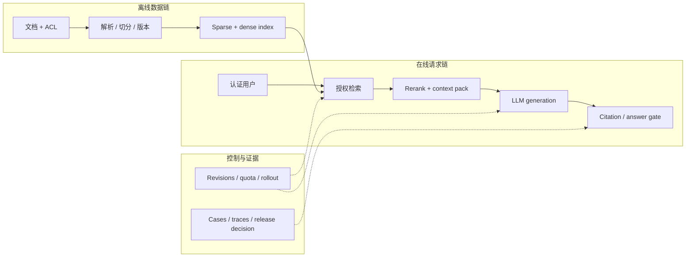

# LLM 系统设计题：从一句需求到可辩护方案

面试官说：

> 为一家一万人的公司设计企业知识库助手。要求回答带引用，不能泄漏部门文档，峰值 20 QPS。

一个常见反应是立刻画向量数据库、Embedding、reranker 和 LLM。问题在于，这些组件还没有对应到任何可计算需求。
“一万人”不告诉你同时有多少请求；“带引用”也没有定义引用语法、语义支持和无答案行为。

好的系统设计回答像一次公开的工程推理：先把模糊需求变成约束，再给最小闭环，估算数量级，
沿故障链说明降级和恢复，最后指出哪些结论仍需压测或线上证据。

## 前五分钟先问什么

不要一次抛出二十个问题。先问那些会改变架构的条件：

1. **用户和权限**：单租户还是多租户，权限来自哪套身份系统，文档是否有行级或组级 ACL？
2. **任务和无答案行为**：只做事实问答，还是还要总结、比较与执行动作？证据不足时必须拒答吗？
3. **数据变化**：文档类型、规模、更新频率、删除时限和地域限制是什么？
4. **流量和 SLO**：峰值到达率、突发窗口、输入/输出长度、TTFT、TPOT 与可用性目标是什么？
5. **发布标准**：怎样衡量检索、回答、引用、安全和每成功回答成本？

如果面试官没有给数字，可以明确提出一组工作假设：

| 维度 | 当前假设 | 为什么需要确认 |
|---|---|---|
| 流量 | 峰值 20 eligible QPS，持续 10 分钟 | 平均 QPS 无法描述 burst 和 queue |
| 输入 | p50 300、p95 1,500 tokens | 长 prompt 会改变 prefill 和上下文预算 |
| 输出 | p50 120、p95 300 tokens | 输出长度决定 decode 占用 |
| SLO | p95 TTFT < 1.5 s，成功率 99.5% | 用户延迟包含排队，不只模型执行 |
| 权限 | OIDC 身份映射到部门和文档 ACL | Prompt 无法替代认证与授权 |
| 质量 | 回答正确、引用支持、越权为零 | 单个相似度分数不足以决定发布 |

把“业务给定”“当前假设”和“必须实测”分开说。这样后续数字变化时，可以替换参数，而不是推翻整套答案。

## 给出最小闭环，再讨论高级优化

企业知识助手的第一版可以分为三条链：



这已经足以形成可上线的最小方案：版本化文档和 ACL，授权后做 hybrid retrieval，
把有限证据打包进 Prompt，生成带 source ID 的答案，再由发布策略决定 answer、abstain 或 reject。

Graph RAG、Agent、多轮 query planning 或微调可以后加。先说明它们准备解决哪个已观测失败，
否则“高级架构”只是把更多不可观测步骤塞进主链。

## 在线链路按一次请求讲清楚

用户问：“生产数据库的备份保留多久？”

1. Gateway 从认证 token 生成 subject、tenant 和 principals；请求 body 不能自报管理员身份。
2. Retriever 只在该用户可见的文档集合中计算候选。
3. Sparse retrieval 保留型号、错误码和专有名词，dense retrieval 补语义改写。
4. Reranker 比较 query 与候选，context packer 按目标 tokenizer 预留输出后再装入证据。
5. LLM 生成 atomic claims 和短 source IDs。
6. Citation gate 检查 ID、覆盖和 evidence；证据不足时返回 abstain。

权限要在正文进入 scorer、Prompt 和共享 cache 之前生效。若先在全库打分、最后过滤结果，
越权文档已经影响 query statistics、reranker 或模型输入。

Context budget 以最终 chat template 渲染结果为准。System、history、query 和 evidence 可以分别做规划，
最终仍要保存完整 input token IDs/count 和 packing decisions，因为分段 token 数未必严格可加。

离线链路则保存 source、parser、chunk、ACL、embedding/index 和删除版本。蓝绿 index 发布允许请求固定到一个 snapshot，
cache key 也要包含 index 与 policy revision。删除请求沿原文、派生 chunk、index、cache 和受控日志传播。

## 容量估算先发现数量级错误

Little's Law 给稳定系统的一阶关系：

\[
L=\lambda W.
\]

如果峰值到达率 \(\lambda=20\) QPS，平均端到端停留 \(W=2.5\) 秒，平均在途请求约为 50。
这不意味着需要 50 张 GPU；在途请求还包含网关、检索、排队和流式生成。

若每请求平均输入 \(t_{in}\) 个 token、输出 \(t_{out}\) 个 token，API usage volume 可以粗估为：

\[
R_{token}=QPS\,(t_{in}+t_{out}).
\]

这个量适合估算 token 费用和流量，不等于 GPU forward work。Prefill 与 decode 使用不同资源，
真实 padded slots、kernel FLOPs、KV 和显存流量还受 batch、prefix cache、调度、beam 与 speculative decoding 影响。

因此实例数要通过目标模型、runtime、量化、硬件和真实长度分布下的压测得到。
假设单实例在满足 TTFT/TPOT SLO 时稳定处理 4 QPS，算术下限是 5 个实例；
容量计划还要加入单实例故障、滚动发布和 burst 余量。

压测需要说明 arrival process。Closed-loop worker 会在系统变慢时自动降低 offered load，
适合模拟有限并发；constant 或 Poisson open-loop 更容易暴露饱和 queue。
两者都保存 scheduled-offered、dispatch、first-token 和 terminal 时间，并报告 generator lag。

## 用故障树解释为什么请求失败

不要只列 dashboard 指标。先从用户终态向上追：

```text
用户没有得到可用答案
├─ 接入：认证、配额、payload、客户端断连
├─ 排队：突发、饥饿、长请求 head-of-line blocking
├─ 上下文：解析错、索引旧、ACL 过滤、packing 截断
├─ 模型：OOM、超时、schema 错、拒答或版本回归
├─ 工具：429、部分成功、重复副作用、outcome unknown
└─ 响应：引用错误、流式协议、计费或日志遗漏
```

对每个叶子回答四件事：什么信号能发现、用户看到什么、自动怎样降级、何时需要人工。

例如召回为空时应明确 abstain，而不是让模型用参数记忆补齐；reranker 不可用时可以退到经过评测的 hybrid baseline；
生成超时时可以返回授权后的相关文档和可重试状态。所有降级都保留 ACL、数据地域和安全策略。

## 发布方案必须同时回答质量与可靠性

知识助手至少分三层评测：

| 层 | 主要问题 | 示例指标 |
|---|---|---|
| Retrieval | 答案证据是否进入候选并留在 context | Recall@k、nDCG、answer-bearing coverage |
| Answer | Claim 是否正确、受证据支持，缺证据时是否拒答 | correctness、citation support、abstention |
| System | 权限、延迟、失败和成本是否达标 | ACL violations、TTFT/TPOT、success rate、cost/success |

发布 gate 保留逐 case 结果和关键切片。平均质量不能抵消跨租户泄漏，低延迟也不能抵消大量 `429`。
Shadow 用真实输入检查兼容性，canary 承接真实结果；两者都要预先定义流量资格、停止条件和 rollback owner。

回答中主动区分证据等级：公式只是估算，离线回放验证固定 case，目标硬件压测验证一个 workload snapshot，
真实 production SLO 则需要明确时间窗、样本量、流量占比和事故记录。

## 变体一：能发邮件和建工单的 Agent

如果题目加入副作用，最小方案先保持 workflow：

```text
理解请求 -> 收集字段 -> 生成草稿 -> 用户确认
-> 执行 -> 查询业务状态 -> verifier -> 最终答复
```

模型不持有邮件或工单凭证。它只提出 ToolCall；runtime 使用认证 context 和服务端解析的 resource 检查 schema、
ACL、policy 与预算。Approval 绑定 subject、task、call、具体参数、资源和 policy revision。

执行前在 ledger claim 稳定 call/effect ID。超时后先查询外部系统：provider 可能已成功，只是响应丢失。
Transactional outbox 可以在同一数据库事务中写业务状态和 pending effect，再由带 lease 的 worker 投递。

Outbox 提供的是本地原子记录与 at-least-once delivery。Provider 成功而本地 ack 丢失时仍会重投；
只有对端真正 honor idempotency key 才能折叠重复请求。Receipt 还要和订单、收件人、金额或工单状态核对。

Agent 评测要把几种分母分开：

- task success 只统计有 final-state verifier 的 case；
- blocked unsafe proposal 检查越权是否在 handler 前停止；
- unapproved attempt 检查副作用是否绕过审批；
- duplicate effect 由业务状态或模拟环境 verifier 计数；
- unresolved pending 单独阻塞发布。

故障注入至少覆盖执行前超时、执行成功后响应丢失、`429`、业务失败、审批后参数漂移，
以及进程在 ledger/outbox 不同位置崩溃。完整主线见[一次 Agent 退款任务](../applications/agent-task-lifecycle.md)。

## 变体二：单卡多租户 LLM 服务

如果题目变成一张消费级 GPU 承载多个租户，核心从检索转向 admission、KV 和公平性。

```text
Gateway: authentication / quota / max tokens / cancellation
Scheduler: queue / continuous batching / fairness / preemption
Engine: weights / Paged KV / prefix cache / kernels
Observer: TTFT / TPOT / tokens/s / KV / terminal outcomes
```

显存账本至少包含 weights、KV 和 workspace。未做 prefix sharing 的 decoder-only 模型，KV 元素数量一阶估算为：

\[
2BTLH_{kv}D_h,
\]

其中 2 对应 K/V，\(B\) 是并发序列，\(T\) 是缓存长度，\(L\) 是层数，
\(H_{kv}\) 是 KV heads，\(D_h\) 是 head dimension；最后乘每元素字节数。
Block allocator、量化、prefix sharing、sliding window、碎片和临时 workspace 会改变真实值。

公平性不能只按 request count。32k prompt 和 64-token prompt 消耗完全不同，可以用预计 prefill/decode work、
deadline 与 tenant quota 做 admission 和 scheduling，同时保留硬性上下文与输出上限。

Prefix cache identity 由可信 gateway 状态构造，绑定 tenant/visibility domain、policy、
model/tokenizer/template/adapter、position/RoPE、KV dtype 和 exact token prefix。
命中后还要比较完整字段，正在使用的 block 用 refcount/lease 固定，取消时观察 disconnect-to-release。

过载时快速 `429`、进入已验证的小模型路线或减少非必要输出预算。安全检查和租户隔离不参与性能降级。
容量实验分别覆盖 prefill-heavy、decode-heavy、cold/warm cache、取消和单租户热点。

## 面试回答最后怎样收口

用四句话结束，而不是继续加组件：

1. **当前方案**：最小闭环和关键不变量是什么？
2. **最大风险**：哪个失败会造成最严重用户或安全影响？
3. **下一项证据**：哪次压测、故障注入或 case 评测最可能推翻当前假设？
4. **演进条件**：观察到什么信号后，才引入微调、Agent、复杂检索或更多 GPU？

面试官通常会继续追问：删除怎样传播、p99 为什么升高、怎样证明没有跨租户泄漏、模型升级为何回归，
以及成本中遗漏了哪些重试、工具和人工。回答时沿已经画出的数据链、请求链和故障树定位，
不要重新背一份互不相干的组件清单。
