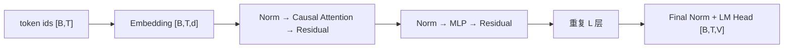

# Transformer：从张量契约到增量解码

<!-- learning-contract -->
<div class="learning-contract" markdown="1">

**学习导航**

- **适合读者**：需要实现、调试或部署 decoder-only 模型的工程师。
- **先修**：[Tokenization](tokenization.md)、矩阵乘法、softmax 和因果语言建模。
- **首次阅读**：4-token prefill → 第一轮 decode → Attention shape → 四类 mask → KV Cache。
- **完成信号**：能手算两 token attention，并验证 cached/full logits 等价。
- **卡住时**：先回到[数学基础](../foundations/math.md)的三候选预测；需要更多 shape 练习时看
  [线性代数](../foundations/math-linear-algebra.md)。

</div>

调试 decoder-only 模型时，最容易迷路的是张量形状。同一条序列先从 token ID 变成隐藏状态，再拆成 Q、K、V；
注意力把多个头的信息混合后，结果回到残差流，最后投影成整个词表上的 logits。

本章只追踪一次具体 forward。假设一条短 prompt 被 tokenizer 编成 4 个 token：

```text
input_ids: [t0, t1, t2, t3]
batch B=1, sequence T=4
```

Prefill 会同时算完这 4 个位置，并用最后一个位置的 logits 选择第一个输出 token。随后进入 decode：每次只新增
一个 token，并复用前面保存的 K/V。读到每一节时，都问同一个问题：**这一步读了哪些位置，张量是什么形状，
它为训练还是生成服务？**

为了让形状可以手算，本页使用一个教学配置：

```text
d=512, Hq=8, Hkv=2, D=64
```

这里有 8 个 query head、2 个 K/V head，每 4 个 query head 共享一组 K/V。一次 prefill 和第一步 decode 的形状账本是：

| 阶段 | Q | K/V 可见历史 | Attention score | Logits |
|---|---|---|---|---|
| Prefill `t0..t3` | `[1,8,4,64]` | `[1,2,4,64]` | `[1,8,4,4]` | `[1,4,V]` |
| Decode `t4` | `[1,8,1,64]` | `[1,2,5,64]` | `[1,8,1,5]` | `[1,1,V]` |

Prefill 的最后一行 logits 用来选出 `t4`。把 `t4` 送回模型后，decode 才生成预测 `t5` 的 logits。后文所有专题
都可以回到这两行检查，而不必重新想象一组抽象符号。

## 1. Decoder-only 数据流

输入 token ID \(I\in\mathbb{N}^{B\times T}\) 先经过词嵌入层（Embedding），得到隐藏状态
\(X\in\mathbb{R}^{B\times T\times d}\)。上面的短输入会从 `[1,4]` 变成 `[1,4,512]`。

这个例子使用 Pre-Norm：每个子层先做归一化，再把计算结果加回残差流。一个 block 的计算是：

\[
X' = X + \operatorname{Attention}(\operatorname{Norm}(X)),
\qquad
X'' = X' + \operatorname{MLP}(\operatorname{Norm}(X')).
\]

堆叠 \(L\) 层后，再经 final norm 和 LM head 得到 logits：

\[
Z\in\mathbb{R}^{B\times T\times V}.
\]



自回归训练通常让位置 \(t\) 的隐藏状态预测下一个 token。标签需要相对输入错开一位，但实现位置因库而异：
有的 data collator 先移动标签，有的模型在计算 loss 时移动。两边都做会让监督信号再错开一位。

调试时要把三个问题分开：`input_ids` 提供了哪些 token，attention mask 允许每个位置读取谁，loss mask 又让哪些
位置参与目标函数。

## 2. 缩放点积注意力

对某一层输入 \(X\)：

\[
Q=XW_Q,\quad K=XW_K,\quad V=XW_V,
\]

\[
A=\operatorname{softmax}\left(\frac{QK^\top}{\sqrt{D}}+M\right),
\qquad O=AV.
\]

其中每个 query/key head 的维度为 \(D\)。若各分量近似独立且方差相近，未缩放点积的方差会随 \(D\) 增长；除以 \(\sqrt D\) 用于控制 score 尺度，避免 softmax 过早饱和。这是初始化直觉，不是对训练后分布的独立同分布承诺。

数值稳定 softmax 先减去每行最大值：

\[
\operatorname{softmax}(s_i)=
\frac{\exp(s_i-\max_j s_j)}{\sum_k\exp(s_k-\max_j s_j)}.
\]

如果某个 query 看不到任何 key，它对应的一整行 score 都会被写成 `-inf`。此时 softmax 的分母为零，会产生 NaN。

因此，每个有效 query 至少要能看到一个 key。若业务允许全遮挡行，kernel 必须另行定义返回值。本仓库的 NumPy
实现选择直接报错，让问题停在输入边界，而不是把 NaN 继续传到后面的层。

## 3. 多头张量形状

设 query head 数为 \(H_q\)，K/V head 数为 \(H_{kv}\)，每个 head 的维度为 \(D\)。通常有
\(d=H_qD\)。线性投影完成后，把张量整理成以下形状：

| 张量 | 形状 |
|---|---|
| Q | `[B, Hq, Tq, D]` |
| K | `[B, Hkv, Tk, D]` |
| V | `[B, Hkv, Tk, Dv]`，常有 `Dv=D` |
| attention score | `[B, Hq, Tq, Tk]` |
| head output | `[B, Hq, Tq, Dv]` |

输出将 query heads 拼回 `[B,Tq,Hq*Dv]`，再过 output projection。多个头提供多个投影子空间，但不能由 attention heatmap 自动推出每个头具有稳定、可命名的人类语义。

### 3.1 MHA、GQA 与 MQA

- MHA：\(H_{kv}=H_q\)，每个 query head 有独立 K/V head；
- GQA：\(1<H_{kv}<H_q\)，每组 \(H_q/H_{kv}\) 个 query heads 共享 K/V；
- MQA：\(H_{kv}=1\)，所有 query heads 共享一组 K/V。

只有当 \(H_q\) 能被 \(H_{kv}\) 整除，简单均匀分组才成立。仓库的 `grouped_query_attention` 为解释等价性而物理 `repeat` K/V heads；优化 kernel 不应真的复制，否则会抵消 cache/带宽收益。

理想 dense KV Cache 元素数为：

\[
2\,B\,L\,T\,H_{kv}\,D,
\]

式子开头的 2 分别代表 K 和 V。GQA 与 MQA 减少了 K/V head 数，所以 KV Cache 更小，decode 读取的 K/V 数据也更少。

但 Q 投影、MLP、词嵌入和词表输出层不会按同样比例缩小。模型若使用潜变量或压缩注意力，K/V 的保存方式已经
变化，也不再适用这条标准 MHA/GQA 公式。

## 4. 四类 mask 不可混用

### causal mask

位置 \(t\) 只能读取 key position \(\le t\)。训练时所有 query 仍可并行计算；mask 禁止信息泄漏，不要求逐 token forward。

### padding mask

屏蔽为 batch 对齐加入的 padding key。左 padding、右 padding、position id 和生成 kernel 的组合必须按模型路径验证。

### packing/document mask

训练时常把多篇文档拼成一个长序列。普通 causal mask 只阻止读取未来位置，因此后一篇文档仍能读取前一篇。

若训练目标要求文档互相独立，需要使用块对角的文档 mask，并同时处理位置 ID 和损失 mask。EOS 只是序列中的一个
token；插入 EOS 本身不会改变注意力可见性。

### loss mask

Loss mask 决定哪些标签参与目标函数，常用 ignore index 表示。例如，把 prompt 对应的 label 设为 `-100`，可以只训练
response 部分。

这不会改变注意力可见性：回答部分仍然可以读取输入提示。反过来，因果 mask 也只控制“能读谁”，不会自动排除
padding 或提示位置上的 loss。

回到 4-token prompt：只修改最后的 `t3`，更早位置 `t0..t2` 的 logits 应保持不变。这个反事实测试可以发现未来信息
泄漏。Padding、文档拼接和 loss mask 是另外三种契约，需要分别设计测试。

## 5. LayerNorm、RMSNorm 与残差

LayerNorm 对最后一个特征维计算均值和方差：

\[
\operatorname{LN}(x)=\gamma\odot
\frac{x-\mu}{\sqrt{\sigma^2+\epsilon}}+\beta.
\]

RMSNorm 不减均值：

\[
\operatorname{RMSNorm}(x)=
\gamma\odot\frac{x}{\sqrt{\operatorname{mean}(x^2)+\epsilon}}.
\]

RMSNorm 与 LayerNorm 是两种不同函数。RMSNorm 保留输入均值，也通常没有 LayerNorm 中的 bias；checkpoint 必须按照
训练时使用的类型加载，不能把两者互换。

Epsilon、统计量的累积精度、输出转换精度和权重精度都会影响结果。仓库的 `rms_norm` 使用 float64 累积，是为了给
小数组提供高精度参考值。目标硬件上的 kernel 可能采用不同归约顺序，因此不要求逐 bit 相同。

Pre-Norm 在进入 Attention 或 MLP 前归一化，残差支路保留一条较直接的恒等路径。Post-Norm 则先完成残差相加，
再对结果归一化。

Norm 的位置会改变整个 block 的函数和优化行为，也是 checkpoint 架构的一部分。分析深层训练稳定性时，还要一起
考虑初始化、残差缩放、学习率和数值精度。

## 6. RoPE：旋转 Q/K，不是给 hidden state 加表

对每一对维度 \((x_{2i},x_{2i+1})\)，位置 \(p\) 的 RoPE 使用角度 \(p\theta_i\) 做二维旋转：

\[
\begin{bmatrix}x'_{2i}\\x'_{2i+1}\end{bmatrix}
=
\begin{bmatrix}
\cos(p\theta_i)&-\sin(p\theta_i)\\
\sin(p\theta_i)&\cos(p\theta_i)
\end{bmatrix}
\begin{bmatrix}x_{2i}\\x_{2i+1}\end{bmatrix}.
\]

常见频率形式是 \(\theta_i=\text{base}^{-2i/D}\)。旋转保持每对分量的二范数；对 Q/K 同时应用后，点积包含相对位置差。把 query position 与 key position 同时平移相同常数，理想数学点积不变。仓库测试直接验证这两个性质。

工程上仍需核对：

- interleaved pair 还是 rotate-half layout；
- rotary dimension 是否等于完整 head dimension；
- base、scaling 类型与参数；
- position id 如何处理 padding、packing、sliding window 和 cache offset；
- sin/cos 的计算与存储 dtype。

只把 `max_position_embeddings` 或 RoPE scaling factor 调大，不证明模型能有效利用更长上下文。短上下文回归、长位置检索、干扰鲁棒性和多跳综合都需在目标 checkpoint/runtime 实测。

## 7. MLP、SwiGLU 与参数口径

经典两层 MLP：

\[
\operatorname{MLP}(x)=W_2\,\sigma(W_1x).
\]

门控形式 SwiGLU 常写作：

\[
\operatorname{SwiGLU}(x)=
W_d\left(\operatorname{SiLU}(W_gx)\odot W_ux\right).
\]

SwiGLU 有门控（gate）、升维（up）和降维（down）三个投影。GELU MLP 常见的中间维度经验值不能直接用于计算
SwiGLU 参数量；模型通常会重新选择中间维度，在参数量和计算量之间取平衡。

是否包含 bias、怎样做 tensor parallel 切分、能否融合激活，以及量化路径是否支持，都要以具体 checkpoint 和
推理框架为准。

## 8. Prefill、Decode 与 KV Cache 等价性

### Prefill

对 `[t0,t1,t2,t3]` 并行计算 Q/K/V 和 causal attention，并为每层保存 4 个位置的 K/V。
因果关系限制“能看谁”，不妨碍 GPU 同时计算多行 query。

### Decode

假设第一个输出是 `t4`。下一步只为 `t4` 计算 Q/K/V，把它的 K/V 追加到 cache；新 query 读取
`t0..t4` 的可见 K/V，产生 `t5` 的 logits。没有 cache 时可以重算完整前缀，数学目标相同，但会重复大量工作。

仓库 NumPy 测试比较：

```python
full = attention(Q, K, V, causal_mask(T))
step_t = attention(Q[t:t+1], K[:t+1], V[:t+1], causal_mask(1, t+1))
assert concat(step_0, ..., step_T_minus_1) == full
```

比较完整前向与使用 cache 的增量解码时，要固定以下条件：相同权重、相同 RoPE 位置、相同可见性，以及完整保存的
K/V。模型还应切换到评估模式，关闭训练时的 dropout。

量化 cache、滑动窗口淘汰和不同 kernel 的浮点归约顺序都可能带来数值差异。小数组上的 `allclose` 只验证注意力
代数，生产环境中的 cache allocator、并发调度和 GPU 吞吐需要另外测试。

## 9. 用 NumPy 对照实现检查公式

仓库 `src/about_llm/from_scratch/attention_numpy.py` 提供：

- 数值稳定 softmax 与 fully-masked-row 拒绝；
- 支持 past length 的 causal mask；
- scaled dot-product attention；
- 不物化完整 score/probability 的 blockwise online-softmax 对照实现；
- float64 累积的 RMSNorm 参考实现；
- interleaved-pair RoPE；
- 通过显式 K/V head repeat 定义的 GQA 参考实现。

~~~powershell
python -m pytest tests/test_attention_numpy.py -q
python -m pytest tests/test_gpt_torch.py tests/test_gpt_jax.py -q
~~~

NumPy 测试验证局部代数。PyTorch 和 JAX 的 tiny GPT 测试再向外走一层，检查完整前向、梯度和一次参数更新。

跨框架对账前，要统一归一化方式、激活函数、mask、权重共享、loss 和优化器。两个模块名称相同，只说明接口相似，
不保证每一步数值相同。

`blockwise_online_attention` 覆盖三条路径：因果 prefill、带历史 K/V 的单 token decode，以及调用者提供的布尔
可见性 mask。某个 query 没有任何可见 key 时，函数会报错。

具体输入、反事实差值和未覆盖项集中在
[Transformers 控制台账](../evidence/transformers-controls.md)。

## 10. 复杂度和 kernel 边界

标准稠密注意力的每个 head 都有 \(T_qT_k\) 个分数和对应概率。计算分数、再按概率聚合 V，主要算术量随
\(T_qT_kD\) 增长。线性投影和 MLP 则通常包含 \(Td^2\) 量级的计算。

序列较短而隐藏维度较大时，线性层可能占主导；序列变长后，Attention 计算与 KV 读写会更加突出。渐近复杂度只能
说明增长趋势，实际延迟还取决于 kernel、显存带宽、batch 和硬件利用率。

FlashAttention 通过 tiling、重计算和 online softmax 减少 HBM 往返与完整中间矩阵存储。它仍计算精确 attention
的数学目标，不是把一般复杂度改成线性；不同浮点归约顺序也可能产生细小差异。

[Attention 数值计算](../foundations/attention-numerics.md)给出递推公式，
`projects/transformers-basics/online_softmax_demo.py` 会逐块与 dense reference 对账。这项 NumPy 实验只验证代数，
执行范围不包含 CUDA kernel 和 HBM 流量测量。

部署时应记录实际使用的计算后端，并确认 head dimension、数值类型、mask、GQA、RoPE 和硬件组合确实选择了预期
kernel。配置中出现一个启用开关，并不能证明运行时没有回退。

如果这里的“模型算子、ATen、编译图和 kernel”仍容易混在一起，先跟一次
[RMSNorm 算子计算栈](../systems/operator-stack.md#rmsnorm-trace)，再回来看 Attention backend。

## 11. 架构类型

- Encoder-only：通常用双向 self-attention，适合表示、分类和抽取；
- Decoder-only：用 causal self-attention 将任务统一为 continuation；
- Encoder-decoder：encoder 双向处理 source，decoder 通过 causal self-attention 与 cross-attention 条件生成；
- 稀疏/线性 attention、SSM、卷积或混合架构：改变信息混合、状态与硬件权衡，不能只按渐近复杂度判断真实速度或质量。

“Transformer”代表一类架构，不是一份固定配置。阅读具体模型时，至少确认下面四组选择：

- 归一化：类型、放在子层之前还是之后；
- Attention：位置编码、head 分组和滑动窗口；
- Block：MLP 形式、bias 与并行残差；
- 输出：logit 缩放与输入输出权重共享。

加载 checkpoint 前，应从 config 和模型代码确认这些选择。

## 12. 常见错误定位

| 现象 | 优先检查 |
|---|---|
| 训练 loss 异常低 | label shift、未来泄漏、train/test contamination |
| padding 后输出变化 | padding mask、position ids、left/right padding |
| packed 训练质量异常 | document mask、EOS、position reset、loss mask |
| cache 与无 cache 输出不同 | cache append 轴、layer/head layout、RoPE offset、mask |
| 长上下文突然退化 | RoPE/scaling、训练长度、cache/window、position construction |
| GQA shape 错误 | `Hq % Hkv`、repeat/group mapping、K/V layout |
| FP16 出 NaN | mask row、softmax upcast、norm epsilon、激活/梯度尺度 |
| 优化 attention 反而变慢 | backend fallback、shape、序列长度、编译/预热、数据搬运 |

## 自测

1. (B=2,T=128,d=1024,H_q=16,H_{kv}=4) 时，Q/K score 与理想单层 KV Cache 的形状/元素数是什么？
2. 为什么 loss mask 不能阻止跨文档 attention 泄漏？
3. GQA 为什么减少 KV Cache，却不让全部 attention 参数和 FLOPs缩小为 (H_{kv}/H_q)？
4. RoPE cache decode 为什么必须给新 token 使用绝对 offset，而不是每步位置 0？
5. 怎样用“修改未来 token”和“逐步 cache vs full causal”两个测试分别验证不同不变量？
6. FlashAttention 的“精确”为什么不意味着不同 kernel/dtype 逐 bit 一致？
