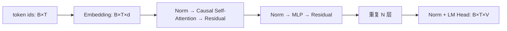

# Transformer

## 学习目标

- 解释 decoder-only Transformer 的数据流。
- 写出自注意力公式并跟踪多头张量形状。
- 理解因果 mask、位置编码、残差、归一化和 MLP 的作用。

## 整体结构

以 decoder-only 模型为例：token id 经 Embedding 变为向量，叠加或注入位置信息，依次通过若干 Transformer block，最终归一化并投影到词表 logits。

现代模型多用 pre-norm，即先归一化再进入子层。post-norm 是子层与残差相加后归一化，深层训练稳定性不同。

## 缩放点积注意力

给定 \(X\in\mathbb{R}^{B\times T\times d}\)：

\[
Q=XW_Q,\quad K=XW_K,\quad V=XW_V
\]

\[
\text{Attention}(Q,K,V)=\text{softmax}\left(\frac{QK^T}{\sqrt{d_k}}+M\right)V
\]

\(QK^T\) 产生每个 query 对每个 key 的匹配分数；除以 \(\sqrt{d_k}\) 防止维度增大时点积方差过大、softmax 过度饱和；mask \(M\) 把不允许的位置加上负无穷；softmax 后的权重对 value 加权求和。

因果 mask 只允许位置 \(t\) 关注 \(\le t\) 的位置，防止训练时看到未来答案。Padding mask 则屏蔽批次中的填充位置，两者目的不同。

## 多头注意力

把总维度分成 \(H\) 个头，每头维度 \(D=d/H\)：

- Q/K/V reshape 为 `[B,H,T,D]`；
- 注意力分数为 `[B,H,T,T]`；
- 每头输出拼回 `[B,T,d]`，再经输出投影。

多个头允许不同子空间和关系并行计算，但不能简单断言每个头都有清晰、固定的人类语义。

### MHA、MQA 与 GQA

标准多头注意力（MHA）每个 query 头都有独立 K/V 头。Multi-Query Attention（MQA）让所有 query 头共享一组 K/V；Grouped-Query Attention（GQA）让若干 query 头共享一组 K/V。后两者大幅降低自回归推理的 KV Cache 与内存带宽，代价可能是一定能力损失。

## MLP

注意力在 token 间混合信息，MLP 对每个位置独立进行通道变换。经典形式：

\[
\text{MLP}(x)=W_2\,\sigma(W_1x)
\]

SwiGLU 等门控形式通常为 \((\text{SiLU}(xW_g)\odot xW_u)W_d\)。中间维度通常大于隐藏维度，MLP 往往占模型参数和 FLOPs 的很大部分。

## 残差与归一化

残差 \(x+F(x)\) 提供短梯度路径，也允许每层在已有表示上做修正。LayerNorm 对特征维计算均值和方差；RMSNorm 只按均方根缩放，计算更简单。归一化稳定激活尺度，但具体位置、epsilon 和精度会影响训练。

## 位置信息

无位置编码的自注意力对 token 排列是置换等变的，无法区分顺序。常见方案：

- **绝对位置 Embedding**：位置 id 查表并与 token Embedding 相加，简单但外推受限。
- **RoPE**：按位置旋转 Q/K 的二维分量，让点积包含相对位置信息；现代 decoder 常用。
- **ALiBi**：在注意力分数上加入与相对距离相关的线性偏置。
- **相对位置偏置**：直接学习或计算相对距离的偏置。

扩展 RoPE 上下文可用频率缩放或插值，但“配置允许更长”不等于模型能可靠利用更长信息，需在目标长度继续训练并评测。

## 复杂度

标准注意力分数矩阵的时间和显存随 \(T^2\) 增长；投影和 MLP 约随 \(Td^2\) 增长。短序列、大隐藏维度时线性层可能主导；长序列时注意力更昂贵。FlashAttention 通过分块和在线 softmax 减少显存读写与中间矩阵存储，它计算的是精确注意力（存在浮点顺序差异），不是稀疏近似。

## 架构变体

- **Encoder-only**：双向注意力，擅长表示、分类和抽取。
- **Decoder-only**：因果注意力，统一用续写完成多种生成任务。
- **Encoder-decoder**：编码器双向理解输入，解码器通过交叉注意力条件生成。
- **稀疏/线性注意力、状态空间模型**：改变长序列的信息混合与复杂度，但在质量、硬件效率和通用性间有新权衡。

## 常见误区

- 注意力权重不天然等于因果解释。
- 更长上下文窗口不等于稳定记住窗口内所有信息。
- \(O(T^2)\) 只描述某部分渐近复杂度，不直接等于真实延迟。
- Transformer 不是只有注意力；MLP、数据、训练目标和系统实现同样关键。

## 自测

1. \(B=2,T=128,d=1024,H=16\) 时，每头 Q 的形状和注意力矩阵形状是什么？
2. 因果 mask 与 padding mask 有何不同？
3. GQA 为什么能减少推理内存？它不减少哪一部分 query 计算？
4. FlashAttention 为什么能加速而不需要改变数学定义？
