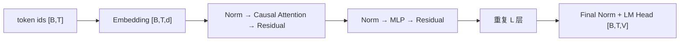

# Transformer：从张量契约到增量解码

<!-- learning-contract -->
<div class="learning-contract" markdown="1">

**学习导航**

- **适合读者**：需要实现、调试或部署 decoder-only 模型的工程师。
- **先修**：[Tokenization](tokenization.md)、矩阵乘法、softmax 和因果语言建模。
- **首次阅读**：Decoder-only 数据流 → Attention shape → 四类 mask → KV Cache。
- **完成信号**：能手算两 token attention，并验证 cached/full logits 等价。
- **卡住时**：回到[数学基础](../foundations/math.md)的 shape 与矩阵乘法。

</div>

打开一个 decoder-only 模型的调试器，最容易迷路的地方不是公式，而是同一个序列不断改变形状：token ids
先变成 hidden states，再拆成 Q/K/V，经过多头混合后回到 residual stream，最后投影成整个词表的 logits。

本章只追踪一次具体 forward。假设一条短 prompt 被 tokenizer 编成 4 个 token：

```text
input_ids: [t0, t1, t2, t3]
batch B=1, sequence T=4
```

Prefill 会同时算完这 4 个位置，并用最后一个位置的 logits 选择第一个输出 token。随后进入 decode：每次只新增
一个 token，并复用前面保存的 K/V。读到每一节时，都问同一个问题：**这一步读了哪些位置，张量是什么形状，
它为训练还是生成服务？**

## 1. Decoder-only 数据流

输入 token id \(I\in\mathbb{N}^{B\times T}\) 经 Embedding 得到隐藏状态
\(X\in\mathbb{R}^{B\times T\times d}\)。在上面的短 prompt 中，它从 `[1,4]` 变成 `[1,4,d]`。
每个 Pre-Norm block 计算：

\[
X' = X + \operatorname{Attention}(\operatorname{Norm}(X)),
\qquad
X'' = X' + \operatorname{MLP}(\operatorname{Norm}(X')).
\]

堆叠 \(L\) 层后，再经 final norm 和 LM head 得到 logits：

\[
Z\in\mathbb{R}^{B\times T\times V}.
\]



自回归训练常让位置 \(t\) 的 hidden state 预测下一个 token。不同库可能由 data collator 显式 shift，
也可能在模型 loss 内部 shift；两边都做会错移一位。`input_ids`、attention visibility 和 labels/loss mask
是三个不同契约。

## 2. 缩放点积注意力

对某一层输入 \(X\)：

\[
Q=XW_Q,\quad K=XW_K,\quad V=XW_V,
\]

\[
A=\operatorname{softmax}\left(\frac{QK^\top}{\sqrt{D}}+M\right),
\qquad O=AV.
\]

其中每个 query/key head 的维度为 \(D\)。若各分量近似独立且方差相近，未缩放点积的方差会随 \(D\) 增长；除以 \(\sqrt D\) 用于控制 score 尺度，避免 softmax 过早饱和。这是初始化直觉，不是对训练后分布的独立同分布承诺。

数值稳定 softmax 先减去每行最大值：

\[
\operatorname{softmax}(s_i)=
\frac{\exp(s_i-\max_j s_j)}{\sum_k\exp(s_k-\max_j s_j)}.
\]

若一行所有 key 都被 mask，直接对全 `-inf` 做 softmax 会产生未定义的 `0/0`/NaN。应让数据与 mask 构造保证每个有效 query 至少能看到一个 key，或由 kernel 明确定义该情况；仓库 NumPy oracle 选择 fail closed。

## 3. 多头张量形状

设 query head 数为 \(H_q\)，K/V head 数为 \(H_{kv}\)，head dimension 为 \(D\)，通常 \(d=H_qD\)。reshape 后：

| 张量 | 形状 |
|---|---|
| Q | `[B, Hq, Tq, D]` |
| K | `[B, Hkv, Tk, D]` |
| V | `[B, Hkv, Tk, Dv]`，常有 `Dv=D` |
| attention score | `[B, Hq, Tq, Tk]` |
| head output | `[B, Hq, Tq, Dv]` |

输出将 query heads 拼回 `[B,Tq,Hq*Dv]`，再过 output projection。多个头提供多个投影子空间，但不能由 attention heatmap 自动推出每个头具有稳定、可命名的人类语义。

### 3.1 MHA、GQA 与 MQA

- MHA：\(H_{kv}=H_q\)，每个 query head 有独立 K/V head；
- GQA：\(1<H_{kv}<H_q\)，每组 \(H_q/H_{kv}\) 个 query heads 共享 K/V；
- MQA：\(H_{kv}=1\)，所有 query heads 共享一组 K/V。

只有当 \(H_q\) 能被 \(H_{kv}\) 整除，简单均匀分组才成立。仓库的 `grouped_query_attention` 为解释等价性而物理 `repeat` K/V heads；优化 kernel 不应真的复制，否则会抵消 cache/带宽收益。

理想 dense KV Cache 元素数为：

\[
2\,B\,L\,T\,H_{kv}\,D,
\]

其中 2 表示 K 与 V。GQA/MQA 直接降低这一项及 decode 读取带宽，但不会按同样比例减少 Q projection、MLP、Embedding、LM head 或全部权重。若 checkpoint 使用 latent/compressed attention，不能套用标准 MHA/GQA cache 公式。

## 4. 四类 mask 不可混用

### causal mask

位置 \(t\) 只能读取 key position \(\le t\)。训练时所有 query 仍可并行计算；mask 禁止信息泄漏，不要求逐 token forward。

### padding mask

屏蔽为 batch 对齐加入的 padding key。左 padding、右 padding、position id 和生成 kernel 的组合必须按模型路径验证。

### packing/document mask

把多篇文档拼进一个长 block 时，普通 causal mask 仍允许后一篇读取前一篇。若训练目标要求文档独立，需 block-diagonal/document-aware visibility，并同时正确设置 position 与 loss。仅插入 EOS 不会自动切断 attention。

### loss mask

决定哪些 label 对目标函数有贡献，常用 ignore index 表示。它不改变 attention visibility：把 prompt label 设为 `-100` 不会阻止 response token 读取 prompt；反过来 causal mask 也不会自动排除 padding/prompt loss。

回到 4-token prompt：只修改 `t3`，位置 `t0..t2` 的 logits 应保持不变。这个测试能抓 causal 泄漏，
却没有覆盖 padding、packing 或 loss mask；它们需要各自的不变量。

## 5. LayerNorm、RMSNorm 与残差

LayerNorm 对最后一个特征维计算均值和方差：

\[
\operatorname{LN}(x)=\gamma\odot
\frac{x-\mu}{\sqrt{\sigma^2+\epsilon}}+\beta.
\]

RMSNorm 不减均值：

\[
\operatorname{RMSNorm}(x)=
\gamma\odot\frac{x}{\sqrt{\operatorname{mean}(x^2)+\epsilon}}.
\]

RMSNorm 不是 LayerNorm 的“推理简化模式”；两者参数与函数不同，不能在加载 checkpoint 时互换。
Epsilon、统计累积 dtype、输出 cast 和 weight dtype 都会影响数值。仓库 `rms_norm` 的 float64 累积只是
小数组 correctness reference，不代表目标 kernel 的逐 bit 行为。

Pre-Norm 在进入子层前归一化，残差支路保留较直接的 identity path；Post-Norm 在残差相加后归一化。它们会改变优化与 checkpoint 函数，不是可随意切换的代码风格。深层稳定性还受初始化、residual scaling、学习率和数值精度影响，不能归因于 norm 位置一个因素。

## 6. RoPE：旋转 Q/K，不是给 hidden state 加表

对每一对维度 \((x_{2i},x_{2i+1})\)，位置 \(p\) 的 RoPE 使用角度 \(p\theta_i\) 做二维旋转：

\[
\begin{bmatrix}x'_{2i}\\x'_{2i+1}\end{bmatrix}
=
\begin{bmatrix}
\cos(p\theta_i)&-\sin(p\theta_i)\\
\sin(p\theta_i)&\cos(p\theta_i)
\end{bmatrix}
\begin{bmatrix}x_{2i}\\x_{2i+1}\end{bmatrix}.
\]

常见频率形式是 \(\theta_i=\text{base}^{-2i/D}\)。旋转保持每对分量的二范数；对 Q/K 同时应用后，点积包含相对位置差。把 query position 与 key position 同时平移相同常数，理想数学点积不变。仓库测试直接验证这两个性质。

工程上仍需核对：

- interleaved pair 还是 rotate-half layout；
- rotary dimension 是否等于完整 head dimension；
- base、scaling 类型与参数；
- position id 如何处理 padding、packing、sliding window 和 cache offset；
- sin/cos 的计算与存储 dtype。

只把 `max_position_embeddings` 或 RoPE scaling factor 调大，不证明模型能有效利用更长上下文。短上下文回归、长位置检索、干扰鲁棒性和多跳综合都需在目标 checkpoint/runtime 实测。

## 7. MLP、SwiGLU 与参数口径

经典两层 MLP：

\[
\operatorname{MLP}(x)=W_2\,\sigma(W_1x).
\]

门控形式 SwiGLU 常写作：

\[
\operatorname{SwiGLU}(x)=
W_d\left(\operatorname{SiLU}(W_gx)\odot W_ux\right).
\]

它有 gate、up、down 三个投影。不能把 GELU MLP 的“中间维度约为若干倍 d”直接套成 SwiGLU 参数量；不同模型会调整 intermediate size 以平衡参数/FLOPs。bias、tensor parallel 切分、激活融合和量化支持也以 checkpoint/runtime 为准。

## 8. Prefill、Decode 与 KV Cache 等价性

### Prefill

对 `[t0,t1,t2,t3]` 并行计算 Q/K/V 和 causal attention，并为每层保存 4 个位置的 K/V。
因果关系限制“能看谁”，不妨碍 GPU 同时计算多行 query。

### Decode

假设第一个输出是 `t4`。下一步只为 `t4` 计算 Q/K/V，把它的 K/V 追加到 cache；新 query 读取
`t0..t4` 的可见 K/V，产生 `t5` 的 logits。没有 cache 时可以重算完整前缀，数学目标相同，但会重复大量工作。

仓库 NumPy 测试比较：

```python
full = attention(Q, K, V, causal_mask(T))
step_t = attention(Q[t:t+1], K[:t+1], V[:t+1], causal_mask(1, t+1))
assert concat(step_0, ..., step_T_minus_1) == full
```

这项等价需要相同权重、RoPE position、visibility、未被错误截断的 cache，以及可比数值路径。训练 dropout 必须关闭；量化 cache、滑窗淘汰、不同 kernel reduction order 可能产生数值差异。小数组 `allclose` 只证明 reference algebra，不证明生产 cache allocator、并发调度或 GPU 吞吐。

## 9. 可执行 correctness oracle

仓库 `src/about_llm/from_scratch/attention_numpy.py` 提供：

- 数值稳定 softmax 与 fully-masked-row 拒绝；
- 支持 past length 的 causal mask；
- scaled dot-product attention；
- 不物化完整 score/probability 的 blockwise online-softmax oracle；
- float64 累积的 RMSNorm reference；
- interleaved-pair RoPE；
- 通过显式 K/V head repeat 定义的 GQA reference。

~~~powershell
python -m pytest tests/test_attention_numpy.py -q
python -m pytest tests/test_gpt_torch.py tests/test_gpt_jax.py -q
~~~

NumPy 测试验证局部代数；PyTorch/JAX tiny GPT 再验证完整 forward、梯度和一步更新。跨框架对账要求显式统一
LayerNorm、activation、mask、weight tying、loss 与 optimizer，不能因为模块同名就假设数值等价。

`blockwise_online_attention` 覆盖 causal prefill、带历史 K/V 的单 token decode 和任意 boolean visibility mask。
任一 query 没有可见 key 时会 fail closed。精确 fixture、反事实差值和未覆盖项集中在
[Transformers 控制台账](../evidence/transformers-controls.md)。

## 10. 复杂度和 kernel 边界

标准 dense attention 的 score/probability 张量有 \(T_qT_k\) 项，每头 score 与 value aggregation 的主要算术随 \(T_qT_kD\) 增长。投影与 MLP 通常含 \(Td^2\) 量级项。短序列/大 hidden 时线性层可能主导；长序列时 attention 与 KV 读写更突出。Big-O 不能直接替代实测延迟。

FlashAttention 通过 tiling、重计算和 online softmax 减少 HBM 往返与完整中间矩阵存储。它仍计算精确 attention
的数学目标，不是把一般复杂度改成线性；不同浮点归约顺序也可能产生细小差异。

[数学基础](../foundations/math.md#attention-storage-online-softmax)给出 recurrence，
`projects/transformers-basics/online_softmax_demo.py` 会逐块与 dense reference 对账。这个 NumPy 实验没有执行
CUDA kernel，也没有测 HBM 流量。部署时要记录实际 backend，并检查 head dim、dtype、mask、GQA、RoPE
与硬件是否走到了预期 kernel，而不是只看“开关已启用”。

## 11. 架构类型

- Encoder-only：通常用双向 self-attention，适合表示、分类和抽取；
- Decoder-only：用 causal self-attention 将任务统一为 continuation；
- Encoder-decoder：encoder 双向处理 source，decoder 通过 causal self-attention 与 cross-attention 条件生成；
- 稀疏/线性 attention、SSM、卷积或混合架构：改变信息混合、状态与硬件权衡，不能只按渐近复杂度判断真实速度或质量。

“Transformer”不是一个固定 config。Norm 类型/位置、position method、head grouping、MLP、bias、parallel residual、sliding window、logit scaling 与 weight tying 都可能变化。

## 12. 常见错误定位

| 现象 | 优先检查 |
|---|---|
| 训练 loss 异常低 | label shift、未来泄漏、train/test contamination |
| padding 后输出变化 | padding mask、position ids、left/right padding |
| packed 训练质量异常 | document mask、EOS、position reset、loss mask |
| cache 与无 cache 输出不同 | cache append 轴、layer/head layout、RoPE offset、mask |
| 长上下文突然退化 | RoPE/scaling、训练长度、cache/window、position construction |
| GQA shape 错误 | `Hq % Hkv`、repeat/group mapping、K/V layout |
| FP16 出 NaN | mask row、softmax upcast、norm epsilon、激活/梯度尺度 |
| 优化 attention 反而变慢 | backend fallback、shape、序列长度、编译/预热、数据搬运 |

## 自测

1. (B=2,T=128,d=1024,H_q=16,H_{kv}=4) 时，Q/K score 与理想单层 KV Cache 的形状/元素数是什么？
2. 为什么 loss mask 不能阻止跨文档 attention 泄漏？
3. GQA 为什么减少 KV Cache，却不让全部 attention 参数和 FLOPs缩小为 (H_{kv}/H_q)？
4. RoPE cache decode 为什么必须给新 token 使用绝对 offset，而不是每步位置 0？
5. 怎样用“修改未来 token”和“逐步 cache vs full causal”两个测试分别验证不同不变量？
6. FlashAttention 的“精确”为什么不意味着不同 kernel/dtype 逐 bit 一致？
