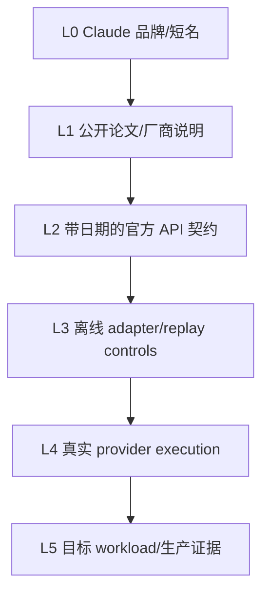
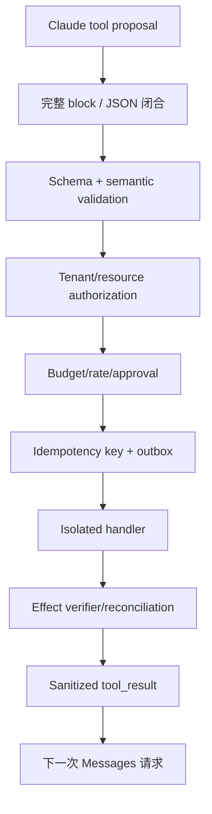

# Claude 证据台账：Messages、流式与生产验证

本页保存接口核对日期、对象投影、状态机、预算账本、固定输入和验证程序的精确边界，供协议实现和 claim 审计使用。
它不是第一次学习 Claude 的入口；请先读[Claude 教材](../models/claude.md)，再按需要回到这里核对细节。

**读者入口**：[Claude 教材](../models/claude.md) · [云 API 契约](../models/cloud-api-contracts.md) · [Agent 总览](../applications/agents.md)
{ .doc-nav }

| 查什么 | 去哪里 |
|---|---|
| 第一次理解 Claude 与 Messages API | [Claude 教材](../models/claude.md) |
| 核对对象、block、stream 与工具协议 | 本页 Messages、Block 和状态机分区 |
| 核对 retry、budget、上下文或缓存 | 本页对应控制分区与“可运行实验” |
| 判断一项供应商 claim 能否发布 | 本页证据阶梯、常见错误和一手资料 |

## 适用范围与证据边界

本台账把 Anthropic 的公开研究、Claude 产品能力与 Messages API 契约分开记录，并为 content blocks、工具调用、长上下文和 prompt caching 指出对应的控制与边界。

**先修知识**：decoder-only Transformer、SFT/偏好训练、HTTP/JSON、流式事件、Agent 工具执行与评测。

Claude 是闭源模型产品。Constitutional AI、RLHF/RLAIF 等公开论文可以解释一条研究路线，却不能证明当前某个 Claude 版本采用论文中的完整训练配方。未公开的参数量、层数、训练数据、稀疏/稠密结构、路由和后训练细节应**保持未知**；不要从输出风格、旧论文或产品名称反推内部架构。

本台账的接口事实按 Anthropic Messages 官方参考于 **2026-09-20** 由 LLM 复核。具体 model id、上下文、价格、区域、限额和 beta header 都是时间敏感产品事实，应在部署时固定检查日期和版本，不在稳定教材中维护“永久最新”表。

本仓库没有访问 Anthropic 账号或真实付费 endpoint，也没有执行 Anthropic SDK、DNS/TLS、HTTP/2、真实 SSE、prompt caching、tool/thinking blocks 或计费。可执行证据只覆盖 authored request/response fixtures、text-only stream state machine、provider-neutral retry/HTTP/budget controls；这些不能外推当前 Claude 质量、产品能力或生产可靠性。

## 闭源 API 的 L0 标签与 L1–L5 证据阶梯

这里的 L0–L5 是本页的供应商证据轴，区分品牌、公开资料、协议与目标环境结果。
[仓库地图](../guide/repo-map.md)的 L0–L4 描述项目成熟度，两者不能按编号直接换算；引用等级时应同时写出具体证据。

开放权重页面通常按 config→weights→runtime 分层；闭源 API 无法取得权重，因此证据阶梯必须改成 wire/product 版本：



| 层级 | 当前仓库证据 | 能证明 | 不能证明 |
|---|---|---|---|
| L0 | `Claude` 名称 | 候选产品家族 | model id、能力、版本 |
| L1 | Constitutional AI / HH-RLHF 等论文 | 论文设置与研究路线 | 当前产品完整训练配方 |
| L2 | Messages reference，checked_at 2026-09-20 | 当日由 LLM 审阅到的 request/content/usage/stop contract | 文档未来不变、账号/区域行为 |
| L3 | authored JSON/SSE/MockTransport/SQLite controls | 本地 adapter/state/policy 行为 | Anthropic SDK/网络/provider/billing |
| L4 | **没有** | 需要受控真实请求/stream trace | 当前模型质量、配额、错误和费用 |
| L5 | **没有** | 需要代表性任务、负载和线上分母 | 生产 SLO、安全和因果收益 |

### L2 也不是 immutable byte evidence

来源台账记录官方 URL、scope、核对日期与复核方法。官方网页可能原地更新，因此准确表述是“2026-09-20 由 LLM 按该页面审阅”，不是“该 URL 永久证明相同协议”。生产 adapter 需要：

登记项里的原始 `status=verified` 只表示那次登记的语义核对已记录；本项徽章明确标为 LLM 复核。页面来源徽章使用构建时的有效状态：它会随
`next_review_at` 与 probe 结果变为 stale、unknown 或 pending-review；这种降级不回写本段的历史核对日期，也不替代对 claim 的语义复核。

- 固定 `anthropic-version`/beta headers；
- 保存 SDK/schema version 与 checked_at；
- 对真实响应做 capability probe；
- 将未知字段/事件保留为 unknown，而不是默认 unsupported 或 supported；
- 定期回归 parser、tool loop、usage、retry 与错误语义。

### 不可拼接原则

本仓库的 text request builder、text response parser、text SSE state machine、provider-neutral retry、budget ledger 是不同 controls。它们共享 canonical types 不表示执行过一条真实 Anthropic 调用；尤其不能合成“已完成 Claude tool use、流式取消、prompt caching 和成本治理”。

## 公开研究路线怎样读

### Constitutional AI

Constitutional AI 的核心学习价值是把一组自然语言原则引入监督与偏好数据生成：模型先根据原则批评、修订回答，再由人类或 AI 反馈形成训练信号。它把“哪些行为值得奖励”显式化，便于讨论原则冲突、覆盖不足和标注规模。

但 constitution 不是可执行安全策略。原则可能含糊、互相冲突或遗漏业务约束；模型也可能错误应用原则。生产系统仍需身份、ACL、数据隔离、工具审批、审计和人工升级通道。

### RLAIF 与人类监督

RLAIF 用模型反馈扩展偏好标注，降低部分人工比较成本。它没有消除人类监督：人仍要选择原则、抽检反馈质量、定义不可接受风险、处理分布外案例并决定发布门槛。若 evaluator 与被评模型共享偏差，自动反馈还可能放大盲区。

阅读论文时把证据拆成三层：论文实际实验、作者提出的机制解释、你对当前产品的外推。只有第一层能直接归属于论文设置；第三层必须标为假设。

## Messages API 心智模型

Messages 不是“把所有内容拼成一个字符串”。请求与响应都应按有类型的 block 处理。

### Provider wire object graph

```text
Message request
├── model
├── max_tokens
├── system                 # 顶层；若使用
├── messages[]
│   ├── role=user|assistant
│   └── content=text|string-or-blocks
└── optional provider fields

Message response
├── id / type / role / model
├── content[]              # typed blocks
├── stop_reason / stop_sequence
└── usage                  # input/output 与版本相关扩展
```

这不是完整 OpenAPI/JSON Schema，只提炼本台账已审阅的稳定对象关系。Optional/beta/tool/cache/thinking/citation/media 字段必须按目标版本的官方 schema 单独建模。

### Canonical business model 与 wire model 分开

业务层不要直接依赖 provider JSON：

```text
CanonicalRequest
  identity + messages + max output + tool proposals + policy context
        │
        ▼
Anthropic adapter
  top-level system + Messages blocks + headers
        │
        ▼
HTTP/SSE transport
        │
        ▼
ProviderResponse
  raw blocks/events/usage/terminal
        │
        ▼
Task projection
  text | tool proposal | refusal | incomplete | error
```

Canonical 层负责业务语义，provider extension 负责 Messages 特有字段。不能为了“一套 schema”把 block、stop、usage 或 opaque state 压成一个字符串。

一个教学用请求形状如下：

```json
{
  "model": "<pinned-model-id>",
  "max_tokens": 1024,
  "system": "你是受约束的分析助手。",
  "messages": [
    {
      "role": "user",
      "content": [{"type": "text", "text": "分析这份工单"}]
    }
  ]
}
```

这段 JSON 只表达稳定的数据模型，不承诺所有模型或 API 版本都支持相同可选字段。关键边界是：

- `system` 位于请求顶层，不是一个普通的 `system` role message；
- `messages` 表示 `user`/`assistant` 对话历史；
- `content` 可以是 block 序列，不能假设永远只有纯文本；
- 响应的 `content` 可能包含 text、tool use 或其他受支持 block；
- `stop_reason`、usage 和 request id 应进入日志，而不是只保存最终文本；
- usage 使用 input/output token 语义；缓存相关 token 字段按实际响应版本单独保留。

### 仓库 request builder 实际做了什么

`build_anthropic_request()` 是一个窄 text adapter：

| 项目 | 本地行为 |
|---|---|
| URL | `base_url.rstrip('/') + '/v1/messages'` |
| auth | `x-api-key` header |
| version | caller 必须提供 `anthropic-version` |
| system | 从 canonical messages 拆到顶层 |
| conversation | 只保留 user/assistant text messages |
| output cap | 顶层 `max_tokens` |
| sampling | `temperature`，要求 finite/non-negative |

它拒绝非 absolute HTTP(S) base URL、缺失 key/version/model、布尔/非正整数 output cap 与 NaN/Infinity temperature。`RequestSpec` 复制 JSON/headers、拒绝非 finite JSON，`repr` 不包含 headers，`sanitized_headers()` 遮蔽认证值并拒绝大小写不同的重复 header name。

这些是本地输入验证，不证明目标 host 正确、API key 有效、版本仍受支持、请求被发送或 provider 接受。

### Response projection 的有损边界

`parse_anthropic_response()`：

- 要求顶层 `content` 是 block list；
- 选择所有 `type=text` blocks；
- 要求每个选中文本为非空 string；
- 按顺序拼接所有 text blocks；
- 映射 `usage.input_tokens/output_tokens`；
- 映射 `stop_reason` 与 model；
- 没有 text block 时明确失败。

它返回仓库的最小 `ChatResponse(text, model, input_tokens, output_tokens, finish_reason)`，**不会保真返回 tool/thinking/signature/citation/media/unknown blocks**。生产 adapter 必须先保存受控 raw block identity，再按任务投影；不能把这个 text-only parser 描述成完整 Messages client。

### 完整性优先于“尽量给字符串”

| 响应形态 | 正确业务状态 |
|---|---|
| 一个或多个 text blocks | 按明确规则投影 text，保留 block identity |
| tool-use only | `tool_proposed`，不是空 text |
| text + tool use | mixed typed result，不静默丢任一类 |
| refusal/safety block | typed refusal/safety outcome |
| unknown block | fail closed 或受控 opaque extension |
| terminal 缺失/截断 | incomplete/error，不伪造 success |

Response parse success 也不等于业务任务成功；schema、事实、工具权限、引用和安全仍需下游 gate。

如果业务只返回 `response.content[0].text`，一旦第一个 block 不是文本、出现多个文本块或工具调用，就会静默丢数据。更稳的 adapter 先保留原始 block，再按任务投影成文本、引用、工具候选或拒答状态。

## Block 与事件驱动解析

### 为什么不能只做 text parser

统一内部结构可以是：

```text
ProviderResponse
├── provider/model/request_id
├── blocks[]
│   ├── text(text)
│   ├── tool_call(id, name, arguments)
│   └── provider_specific(raw)
├── stop(reason, sequence?)
├── usage(input, output, cache?)
└── raw_response_hash
```

规范化层不应把未知 block 丢弃；可在受控存储中保留 `provider_specific` 供回放和后续迁移，但不能因此把它写入普通日志或公开 trajectory。上层任务若要求纯文本，可以显式连接所有 text block；若响应没有文本，应返回类型错误或工具状态，而不是空字符串。

2026 年论文 [Stealing Reasoning Traces from Proprietary LLM APIs](https://arxiv.org/abs/2608.09867) 把包括 Anthropic 在内的特定 2026 年 7 月 API 版本作为历史案例，报告 opaque reasoning block 可在错误会话、用户或兼容模型中重放。论文作者已在发布前披露，并明确说明截至 2026 年 8 月原攻击方法因供应商缓解而不可复现；内部协议未公开。因此本章不把论文结果外推为当前 Messages API 漏洞，也不根据字段外观猜测现行签名/加密语义。通用架构控制见 [Opaque Reasoning 工件与轨迹安全](../quality/reasoning-artifact-security.md)。

### Opaque reasoning/state 的工程原则

如果目标 API/version 返回 thinking、signature、opaque state 或 summary：

- 按 provider/model/version/request/conversation/tool-context 绑定 identity；
- 默认不可跨用户、租户、模型、region 或兼容 provider 移植；
- 不修改、拼接、伪造或用普通文本替代 opaque bytes；
- 不把它当事实证据、权限 token、签名证明或完整内部 chain-of-thought；
- audit storage 与 public response 分开；
- trajectory 发布使用 allowlist，禁止 secret/system prompt/raw tool result 泄露；
- replay 前再次做授权、expiry、context 和 capability 检查。

Unknown 字段的安全默认不是“丢掉并继续”，也不是“原样返回用户”；应在受控 adapter extension 中保留类型/位置/size/hash，并根据任务 fail closed。

### 历史漏洞证据不能外推当前漏洞

这篇论文提供的是特定时间/版本和作者实验范围内的历史证据。供应商缓解、API 版本变化以及缺少 plaintext ground truth 都限制结论。准确表述应包含测试时间、受影响对象、披露/缓解状态与未验证事项，不能只摘“可窃取 reasoning”标题。

### Streaming 是状态机

流式传输会把消息开始、content block 开始/增量/结束、消息级增量与结束拆成不同事件。健壮实现需要：

1. 用 message/block id 或 index 关联增量；
2. 按 block 类型累积 text 或工具参数；
3. 只在结构闭合后解析工具 JSON；
4. 保存终止原因与最终 usage；
5. 对断流、重复事件和未知事件显式报错或降级。

SSE event/chunk 数不是 token 数。吞吐和费用必须使用服务端 usage 或经声明的 tokenizer 估算，二者要分开标记。

### Text-block lifecycle

仓库 `AnthropicTextStream` 审计的 authored subset：

```text
message_start
  → content_block_start(index, type=text)
  → content_block_delta(index, text_delta)*
  → content_block_stop(index)
  → message_delta(stop_reason, usage?)
  → message_stop
```

它允许多个活动 text block index，但每个 delta/stop 必须引用活动 block。状态不变量包括：

- SSE `event:` 与 JSON payload `type` 必须一致；
- `message_start` 恰好一次；
- content block index 不能重复 start；
- inactive/unknown index 不能接 delta/stop；
- 本地 subset 只接受 `text` / `text_delta`；
- stop_reason 不能重复；
- `message_stop` 时不能仍有 active block；
- `message_stop` 前必须观察 stop_reason；
- `message_stop` 后拒绝任何事件；
- EOF 前必须完成 `message_stop`；
- `ping` 可忽略，provider `error` 转成协议错误。

固定 authored trace 将 `message_start` 的 3 input tokens、一个 `hello` delta、`message_delta` 的 1 output token + `end_turn`，以及 `message_stop` 映射为 usage/text/finish/transport_end updates。

### 四种“结束”不能混写

| 结束层 | 示例 | 含义 |
|---|---|---|
| content block | `content_block_stop` | 某 block 结构闭合 |
| model | `message_delta.stop_reason` | 模型停止原因已知 |
| provider message | `message_stop` | Messages stream terminal |
| transport | HTTP/SSE EOF/close | 字节流结束 |

只有 transport EOF 而没有 provider terminal 是截断；看到 block stop 也不能提前结算完整 response。OpenAI `[DONE]`、Anthropic `message_stop` 与 Gemini finishReason+EOF 是不同协议，不能统一成一个硬编码字符串。

### Byte framing 在 provider state 之前

网络读取返回 arbitrary byte chunks，不保证一次 read 对应一行、一个 SSE event、一个 JSON object、一个 Unicode code point 或一个 token。仓库 `SSEDecoder` 先处理 UTF-8/BOM、CR/LF/CRLF、comment、field、多行 data、空行终止与资源上限，再把完整 `SSEEvent` 交给 provider state machine。

EOF 残留半行或未由空行结束的 event 必须失败。自动 reconnect 可能重放生成、文本和费用，所以 decoder 不自行 reconnect。

### 当前 streaming 证据的严格范围

- authored in-memory `SSEEvent` 与 byte fixtures；
- 没有 Anthropic SDK；
- 没有真实 DNS/TLS/HTTP/2/backpressure；
- 没有 tool-use/input-json/thinking/signature delta；
- 没有真实断连、服务端 cancellation、停止生成或停止计费证据；
- 没有 latency/token throughput。

因此可写“实现并测试 text-block 状态机”，不能写“完成 Claude 全量流式协议或生产断连取消”。

## 工具调用的正确状态机

模型产生 `tool_use` block 只表示**候选动作**。外部 runtime 校验后执行工具，再把对应 `tool_result` 作为后续输入返回；call id 必须关联，不能靠工具名或顺序猜测。

推荐链路：

```text
model proposes tool_use
  -> schema/type validation
  -> resource ownership and ACL
  -> budget / approval / idempotency
  -> isolated execution
  -> sanitize tool_result
  -> append result to conversation
  -> model continues or stops
```

必须处理的失败包括：参数 JSON 不完整、未知工具、同一 call 重复提交、执行超时、结果过大、结果内提示注入和模型再次请求同一副作用。SDK 的自动 tool loop 不能越过业务授权层。

外部网页、邮件、工单和 RAG 文档都属于低信任数据。即使它们被包装成 tool result，也不能获得 system 指令的权限。高风险工具应把审批绑定到**规范化后的参数与资源版本**，避免审批后参数漂移。

### 工具调用要分 proposal、authorization 与 effect



模型 proposal 不授予权限；SDK helper 也不能替代 C–H。至少保存：

| 对象 | Identity |
|---|---|
| proposal | response/message/block/call id + raw arguments hash |
| schema | tool name + schema version/hash |
| authorization | tenant/subject/resource/action/policy revision |
| approval | normalized args + resource version + approver + expiry |
| effect | idempotency key + attempt/provider receipt |
| result | success/failure/uncertain + public/audit projection |

### Streaming tool arguments 的特殊风险

如果工具 arguments 分多个 delta 到达：

- JSON prefix 可解析不等于完整 JSON；
- 重复/错序 delta 不能静默拼接；
- block stop 前不得执行；
- duplicate key、NaN/Infinity、unknown field 和资源上限应 fail closed；
- Unicode/escape 边界必须按 bytes→SSE→JSON 三层处理；
- parser error 不能回显 secret/raw payload 到普通日志。

仓库 `AnthropicTextStream` 会直接拒绝非 text block/delta，因此**没有工具流式解析证据**。

### 副作用与 uncertain outcome

Timeout/cancel/read failure 不能证明 provider 或工具没有执行。对于写操作：

1. 发送前持久化 intent/outbox；
2. 使用业务幂等键，不只用模型 call id；
3. provider success 后、本地 ack 前崩溃按 at-least-once 处理；
4. outcome uncertain 进入 reconciliation，不自动当失败重试；
5. tool result 只在 effect verifier 后标 completed。

Exactly-once 不能由一次 Messages loop、SQLite transaction 或 idempotency header 单独证明。

## 跨主题控制索引

下列规则属于跨供应商运行时，不在 Claude 台账重讲。Claude 接入只需记录固定 API/version 对这些规则的差异。

| 主题 | 本页需要绑定的 Claude 对象 | 权威正文 |
|---|---|---|
| Retry / deadline / cancellation | Status/error allowlist、`Retry-After`、request id、是否已发送、远端 outcome 和 usage | [云 API 可靠性](../models/cloud-api-reliability.md) |
| Usage / budget | `max_tokens`、typed usage、cache/thinking/tool 字段、pricing snapshot 与每 attempt receipt | [云 API 可靠性](../models/cloud-api-reliability.md) |
| 长上下文 | Protocol acceptance、runtime completion、位置/任务有效性 | [长上下文系统](../frontier/long-context-systems.md) |
| Prompt caching | Ordered blocks、model/API/beta、tools、tenant/policy、TTL 与正式 usage 字段 | [Claude 教材](../models/claude.md) |
| 模型迁移 | Exact model id、prompt/tools/parser、case manifest、all-attempt 分母与 paired result | [评测方法](../quality/evaluation-methodology.md) |
| Agent 安全 | Proposal、authorization、approval、effect 与 reconciliation | [Agent 任务生命周期](../applications/agent-task-lifecycle.md) |
| Rollout / rollback | Model、headers、prompt、schema、parser、retry、pricing 与 evaluation 的完整 bundle | [LLMOps](../applications/llmops-release.md) |
| 数据治理 | 目标账号/地区/合同的 retention、training use、residency、logging、deletion 与 subprocessors | [隐私与公平](../quality/privacy-fairness.md) |

## 本地可靠性与预算记录

| Control | 本地契约 | 证据边界 |
|---|---|---|
| Retry policy | Bounded attempts、monotonic deadline、受限 `Retry-After`、injected jitter；仅 `replay_safe=true` 且 `outcome_uncertain=false` 自动重放 | 不能简化为 `if status >= 500: retry`；它也不是 Anthropic 当前错误规范。 |
| Transport classification | Pool/connect 前失败可标 known-not-sent；write/read/protocol/attempt-timeout、HTTP response 和 cancellation 默认 uncertain | 客户端观测不证明 provider 没有生成或计费。 |
| Partial stream | 已发布文本后默认不自动 replay；若重启则使用新 identity，除非 provider 有正式 resume contract | 防止重复文本/tool/usage；不证明 server cancellation。 |
| Budget reservation | Request identity 绑定 billing scope、URL、完整 JSON body、redacted headers 和唯一 `max_tokens`；发送前 reserve，完整 usage 后 settle | SQLite 原子性只覆盖本地账本，不覆盖 provider。 |
| Fixed pricing fixture | Input `$1/M`、output `$2/M`；60 input + 10 max output reserve 80 micro-USD，58 input + 4 output settle 66 | 这些不是 Claude/Anthropic 价格、usage 或发票。 |
| Retry budget fixture | HTTP 500→200；attempt 1 的 80 记 uncertain，attempt 2 结算 66，总计 146；limit=140 时第二次发送前阻断 | 每个 replay attempt 独立记账；TTL 不能自动释放 uncertain reservation。 |
| Prompt cache | 当前仓库没有真实 request/response | 没有 hit rate、节省比例、TTFT、费用、租户隔离或删除证据。 |

Messages 的 `max_tokens` 是输出上限，不是最终 usage。Cache、thinking、tool、batch/tier、最低计费单位、
币种与税费都要来自带日期的正式 pricing contract，并以 provider billing export 做最终 reconciliation。

## 可运行 controls

**三供应商离线 contract fixture**

~~~powershell
python -m about_llm.integrations.cloud_api_cli verify `
  --contracts projects/cloud-api-contracts/contracts.example.jsonl `
  --output artifacts/cloud-api/contracts.json
~~~

Anthropic case 检查顶层 system、`/v1/messages`、redacted `x-api-key`、version header、text/usage/stop mapping。
报告必须保留 `network_performed=false` 与 `real_credentials_used=false`；三家 fixture 一起通过不表示协议语义相同。

**Request/response 与 stream state**

~~~powershell
python -m pytest tests/test_cloud_api.py tests/test_cloud_stream.py -q
~~~

负例覆盖 invalid endpoint、布尔/非 finite 数值、无 text block、event/payload mismatch、inactive block delta、
缺 stop reason 和 truncated terminal；没有执行真实 SDK/HTTP/tool/thinking。

**Retry、HTTP 与预算**

~~~powershell
python -m about_llm.integrations.cloud_api_cli retry-matrix `
  --output artifacts/cloud-api/retry-matrix.json
python -m pytest tests/test_cloud_api_retry.py tests/test_cloud_http.py `
  tests/test_usage_budget.py tests/test_sqlite_usage_budget.py `
  tests/test_budgeted_cloud.py -q
~~~

**Opaque artifact 与 trajectory publication**

~~~powershell
python -m about_llm.integrations.cloud_api_cli reasoning-replay-matrix `
  --output artifacts/cloud-api/reasoning-replay-matrix.json
python -m about_llm.integrations.cloud_api_cli trajectory-release-gate `
  --input projects/cloud-api-contracts/trajectory-release.example.json `
  --output artifacts/cloud-api/trajectory-release-report.json
~~~

AES fixture 和 allowlist gate 只验证通用 context binding 与公开轨迹最小化，不模拟 Anthropic thinking/signature。

## 真实 provider 证据缺口

取得明确授权和费用预算后，最小 smoke 应固定 exact origin、model/API/version/beta headers，并：

1. 发送一次有严格 input/output cap 的最短 text request；
2. 保存脱敏 request id、typed blocks、stop、usage 与 latency；
3. 分别执行 non-stream 与 stream，不假设两者 byte-identical；
4. 测一个确定未发送负例和一个 provider error，不自动重试 uncertain；
5. 设置 hard cost/request/deadline gate；
6. 标注真实 credential、network 和 billing scope，且不在默认 CI 运行。

这只得到 L4 单请求协议证据，不得到代表性质量、prompt-cache 收益、tool/thinking 完整性或生产 SLO。

## Claim 导出矩阵

| 可写 claim | 必须紧邻说明 | 禁止升级 |
|---|---|---|
| Anthropic Messages 离线 adapter | 显式拆分顶层 system、ordered content blocks、usage、stop reason 与 `message_stop`；对 event/payload mismatch、inactive block、重复 terminal、truncated EOF 和 non-text delta fail closed | 没有执行 Anthropic SDK、真实网络/账号/model、tool/thinking blocks 或 prompt caching。 |
| Tool 状态机 | Tool proposal 与 authorization/effect 分离；参数 block 闭合后才做 schema、ACL、approval 和 idempotency | SDK auto-loop 或 tool-use block 不是授权，也不证明真实 effect。 |
| Retry / budget contracts | MockTransport 与 SQLite 上按 attempt 保存 retry、unknown outcome、reservation 和 reconciliation | 不证明 Anthropic error semantics、usage、invoice、server cancellation 或 exactly-once billing。 |
| Opaque state 发布 | Unknown/thinking/signature blocks 默认保留在受控审计面，公开 trajectory 使用 allowlist | 不证明现行 thinking protocol、安全加密或当前存在历史论文所述漏洞。 |
| 固定文档核对 | 接口事实截至 2026-09-20 由 LLM 逐项复核，并保留来源状态 | 不能写成 immutable 协议快照或当前账号能力。 |

禁止表述：“复现 Claude 架构/Constitutional AI 训练”“完成全量 SDK/API 兼容”“实现真实 Claude tool calling
和断连取消”“验证 prompt cache 节省比例或 Claude 价格”“达到生产质量、性能或安全 SLO”。

## 一手资料

- Anthropic，[Messages API reference](https://platform.claude.com/docs/en/api/messages)，顶层 system、无状态消息历史、content blocks、usage 与 stop reason；LLM 复核 2026-09-20。[SOURCE:anthropic-messages]
- Anthropic，[Tool use](https://platform.claude.com/docs/en/agents-and-tools/tool-use/overview)，工具 block 与客户端执行循环。
- Bai 等，[Constitutional AI: Harmlessness from AI Feedback](https://arxiv.org/abs/2212.08073)，原则、批评/修订与 RLAIF 研究路线。
- Bai 等，[Training a Helpful and Harmless Assistant with Reinforcement Learning from Human Feedback](https://arxiv.org/abs/2204.05862)，HH-RLHF 研究设置。
