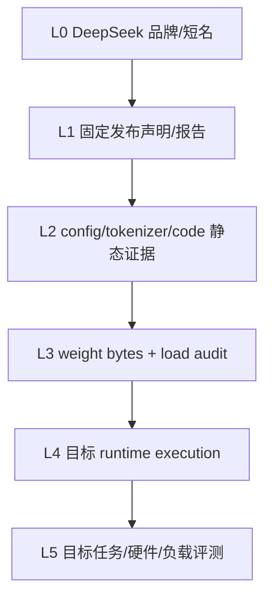

# DeepSeek 证据台账：MLA、MoE 与推理系统验证

本页保存精确 revision、config 字段、公式边界、固定输入和验证结论，供复核、实验设计和 claim 审计使用。
它不是第一次学习 DeepSeek 的入口；若你还不能解释 MoE、MLA 与 reasoning post-training 分别解决什么问题，
请先读[DeepSeek 教材](../models/deepseek.md)。

**读者入口**：[DeepSeek 教材](../models/deepseek.md) · [Transformer](../core/transformer.md) · [前沿专题](../frontier/reasoning-long-context-moe.md)
{ .doc-nav }

| 查什么 | 去哪里 |
|---|---|
| 第一次理解 DeepSeek、MLA、MoE 与推理后训练 | [DeepSeek 教材](../models/deepseek.md) |
| 核对固定 V3 config 与架构字段 | 本页“固定 DeepSeek-V3 config 证据” |
| 核对 MLA、MoE、FP8、MTP 或 R1 的证据等级 | 本页对应专题分区 |
| 运行实验或限定作品集 claim | 本页“可运行实验”“常见错误”和作品集边界 |

## 适用范围与证据边界

本台账把 DeepSeek 的 MoE 训练/服务、Multi-head Latent Attention（MLA）与推理后训练分开记录，并给出判断蒸馏 checkpoint 是否采用 DeepSeek-V3 架构所需的证据。

**先修知识**：MHA/GQA、KV Cache、MoE routing、SFT/偏好优化、强化学习、量化与服务基准。

“DeepSeek”同时指研究路线、开放 checkpoint 和云产品。具体 checkpoint 是否包含 MLA、MoE、Multi-Token Prediction 或某种后训练机制，必须看其技术报告、config、代码与 model card，不能因品牌相同就默认。

本台账唯一固定的模型级 artifact 是 `deepseek-ai/DeepSeek-V3` revision `e815299b0bcbac849fa540c768ef21845365c9eb` 的 1,660-byte `config.json`。[SOURCE:deepseek-v3-config]
仓库没有下载 DeepSeek 权重/tokenizer、没有执行声明的 remote code、forward、MLA cache、MoE routing、FP8 kernel、R1 推理或云 API；通用 NumPy/PyTorch/Gloo fixtures 也不能借给 DeepSeek checkpoint。

## L0 标签与 L1–L5 证据阶梯

这里的 L0–L5 是本页的供应商证据轴，区分发布材料、文件、加载、执行与目标评测。
[仓库地图](../guide/repo-map.md)的 L0–L4 描述项目成熟度，两者不能按编号直接换算；引用等级时应同时写出具体证据。



L0 不是实质证据；L1–L5 才是五级证据强度：

| 层级 | 当前仓库的 DeepSeek 证据 | 可以写 | 不可以写 |
|---|---|---|---|
| L1 | 固定 revision/source URL 与官方报告链接 | 审阅对象和论文主张来源 | 当前云产品或所有衍生模型事实 |
| L2 | immutable V3 config raw bytes + semantic snapshot | 字段出现、保守 marker classification、公式拒绝 | 实际 tensor layout、参数量、显存 |
| L3 | **没有** | — | 已下载/校验/加载 V3 权重 |
| L4 | **没有 DeepSeek target runtime** | 仓库准备的固定样例只能证明通用机制 | 已执行 MLA/MoE/FP8/R1 |
| L5 | **没有** | — | 质量、长上下文、GPU 性能或生产 SLO |

### 通用机制证据是旁路，不是升级台阶

仓库确实执行了：

- strict decoder-config inspector；
- NumPy/PyTorch top-k、capacity、reroute/dropless 和 gradient fixtures；
- two-process CPU/Gloo capacity、all-to-all forward/backward controls；
- pass@k、self-consistency、verifier-selection 与 PPO/RM teaching controls。

它们没有读取 DeepSeek config/weights，输入、专家、路由、loss、collective 和硬件都是 authored contract。因此这些证据不能把 DeepSeek 从 L2 提升到 L3/L4，也不能拼成“复现 DeepSeekMoE/R1”。

## 对象识别：研究、Checkpoint、蒸馏与 API 分行

| 对象 | 必须固定 | 常见误写 |
|---|---|---|
| V2/V3 研究机制 | report revision、公式、实验设置 | 把论文全部机制套给任意 checkpoint |
| V3 开放 checkpoint | model revision、config/code/weights/tokenizer/license | 只用“DeepSeek-V3”短名 |
| R1 checkpoint | exact model card、base architecture、post-training identity | 自动继承 V3 MLA/MoE |
| R1 Distill | teacher/data claim + 实际 Qwen/Llama base config | 把蒸馏行为当 teacher 架构复制 |
| DeepSeek cloud API | model id、catalog date、endpoint/contract/usage | 用开放权重 config 推断 provider runtime |
| 第三方量化 | upstream base + converter + calibration + file manifest | 把第三方文件当官方原始权重 |

发布/实验 manifest 至少包括：

```text
model id + immutable revision
raw config/code/tokenizer/weight files + bytes/hash
trust_remote_code / reviewed code identity
base / instruct / reasoning / distill identity
dtype/quantization + runtime/kernel/device
template/special tokens/generation protocol
adapter/data/evaluation identities
license/AUP/redistribution review
```

无密钥 SHA-256 只能绑定 bytes，不能认证 DeepSeek、模型发布者或实验执行者。

## 先分开三条技术线

1. **训练与架构效率**：稀疏专家、路由、负载均衡和并行通信；
2. **推理内存效率**：MLA 等潜在表示压缩怎样改变 KV Cache；
3. **推理行为后训练**：可验证奖励、强化学习、SFT/冷启动数据、蒸馏和 test-time compute。

三条线可能出现在同一技术报告中，但解决的问题不同。MoE 不自动带来推理能力，MLA 不等于量化，强化学习也不改变 checkpoint 的基础 attention 结构。

## 固定 DeepSeek-V3 config 证据

仓库 release-evidence manifest 固定：

| 字段 | 值 |
|---|---|
| model/repository | `deepseek-ai/DeepSeek-V3` |
| revision | `e815299b0bcbac849fa540c768ef21845365c9eb` |
| upstream config bytes | 1,660 |
| upstream SHA-256 | `cbf0b95dc614de208a109bb5fd4e7eed11385e9c68411d2c17db5319443035d9` |
| local semantic fingerprint | `sha256:fed8c13b4637058cd68e600bd4bf7dc734bda4594dd583e3b49fa27c6e123cc6` |
| manifest checked_at | `2026-08-13` |

执行：

```powershell
python projects/transformers-basics/verify_release_evidence.py
```

默认输出完全离线，`upstream_verified=false`。共享 manifest fingerprint 为 `sha256:74166133716bfebddb444587e9f9a012b4beada923f5209482308ff61194953b`，默认 projection fingerprint 为 `sha256:40b3fe7b2a9c054ea6aa17e9e747d1831b8ae41ee3d55130c916f818acbe4638`。它们绑定整个 Llama/Qwen/DeepSeek release-evidence manifest/projection，不是 DeepSeek 单记录签名。

来源登记中 immutable config 的原始 `status=verified` 表示已人工核对固定 revision；本地 verifier 的
`upstream_verified=false` 则表示本次离线运行没有访问上游。两者不能互相替换：页面来源徽章还要按构建时的有效状态显示，历史 revision、bytes、hash 与 `checked_at` 不因当前环境而回写。

### Core 与供应链字段

| 类别 | config observation |
|---|---|
| loader | `model_type=deepseek_v3`、`architectures=[DeepseekV3ForCausalLM]` |
| custom mapping | `auto_map` 指向 `configuration_deepseek` / `modeling_deepseek` |
| residual width/layers | `hidden_size=7168`、`num_hidden_layers=61` |
| dense MLP width | `intermediate_size=18432` |
| activation/norm | `hidden_act=silu`、`rms_norm_eps=1e-6` |
| vocabulary | `vocab_size=129280`、`tie_word_embeddings=false` |
| tokens | `bos_token_id=0`、`eos_token_id=1` |
| metadata/default | `torch_dtype=bfloat16`、`transformers_version=4.33.1` |

`auto_map` 只说明 config 声明了自定义 module mapping。仓库没有审阅或执行该 revision 的 remote code，因此不能声称 `trust_remote_code=True` 路径安全、可复现或与某个已安装 Transformers 实现等价。

加载前应先：

1. 固定所有 Python/config/tokenizer/weight bytes；
2. 在 import/反序列化前检查路径、size/hash 和资源上限；
3. 审阅动态 import、native extension、网络/文件/进程副作用；
4. 在隔离环境以最低权限执行；
5. 保存实际 imported module/class/file identity；
6. 加载后核对 state-dict names/shapes/dtypes/device placement。

### MLA marker 字段

| 字段 | 固定值 |
|---|---:|
| `num_attention_heads` | 128 |
| `num_key_value_heads` | 128 |
| `q_lora_rank` | 1536 |
| `kv_lora_rank` | 512 |
| `qk_nope_head_dim` | 128 |
| `qk_rope_head_dim` | 64 |
| `v_head_dim` | 128 |

这些字段触发 `known_mla_markers_present=true`。检查器必须返回：

```text
attention_kind: null
head_dim: null
standard_kv_applicable: false
estimate_refused: true
standard_kv_estimates: []
```

关键点：虽然 config 同时有 128 query heads 和 128 KV heads，也不能分类为标准 MHA。`hidden_size/num_attention_heads=7168/128=56` 更不能当作 Q/K head dim；config 已显式给出 128-d non-RoPE、64-d RoPE 与 128-d value 相关维度，结构不是标准 `d/H` contract。

### MoE marker 字段

| 字段 | 固定值 |
|---|---:|
| `n_routed_experts` | 256 |
| `n_shared_experts` | 1 |
| `num_experts_per_tok` | 8 |
| `moe_intermediate_size` | 2048 |
| `first_k_dense_replace` | 3 |
| `moe_layer_freq` | 1 |
| `n_group` / `topk_group` | 8 / 4 |
| `scoring_func` | `sigmoid` |
| `topk_method` | `noaux_tc` |
| `norm_topk_prob` | `true` |
| `routed_scaling_factor` | 2.5 |
| `ep_size` | 1 |

这些字段触发 `known_moe_markers_present=true`，但字段名本身不证明：

- 实际 state-dict 是否完整匹配；
- dense/MoE layer schedule 的代码语义；
- shared expert combine 顺序；
- group-limited routing、score correction 或 load-balance 的实现；
- capacity/drop/reroute/dropless policy；
- expert ownership、all-to-all layout 或并行规模；
- 总参数、激活参数或真实 FLOPs。

所有这些都需要固定 code、weight inventory 和 runtime tensor/collective trace。

### FP8 与位置/MTP markers

固定 config 还出现：

```text
quantization_config.quant_method = fp8
quantization_config.fmt = e4m3
quantization_config.activation_scheme = dynamic
quantization_config.weight_block_size = [128,128]
max_position_embeddings = 163840
rope_scaling.type = yarn
rope_scaling.factor = 40
rope_scaling.original_max_position_embeddings = 4096
num_nextn_predict_layers = 1
```

正确结论只是“固定 config 含这些字段”。它不证明：

- 权重文件实际每层/每 tensor 的 dtype、scale 和 block layout；
- 目标 runtime 执行过 E4M3、动态 activation scaling 或对应 kernel；
- 163,840 tokens 可加载、可生成或任务有效；
- YaRN 配置与当前实现完全兼容；
- Multi-Token Prediction head/训练目标/推理路径已加载或执行。

FP8 不是 INT8；E4M3 的数值范围、scale granularity、累加 dtype、异常值处理和硬件 kernel 都会影响误差与性能。`torch_dtype=bfloat16` 与 `quant_method=fp8` 字段共存也不能由 config alone 解释成唯一 runtime dtype policy。

## DeepSeek-V3 claim 台账

固定 config 只支持字段观察和条件式推导。通用 MoE、MLA、对齐、服务机制由专题正文负责；本节记录这些机制与
DeepSeek-V3 revision 之间实际建立了哪一层联系。

### MoE 字段与条件式参数账

| Claim | 计算或记录 | 边界 |
|---|---|---|
| 单 routed expert 主矩阵 | 若采用无 bias 的 SwiGLU 三矩阵 MLP，`P_expert=3dm`；代入 `d=7168`、`m=2048` 得 44,040,192 | 这是 canonical shape 假设，不是 state-dict inventory。 |
| 单层 routed-expert 总量 | 256 × 44,040,192 = 11,274,289,152 parameters | 未加入 shared expert、router、bias、norm、attention、MTP 或 dense replacement。 |
| 每 token 选择量 | 8 × 44,040,192 = 352,321,536 parameters | “选择参数”不等于实际 FLOPs、resident memory 或 kernel work。 |
| Routing markers | `sigmoid`、`noaux_tc`、`norm_topk_prob=true`、scale `2.5`、groups `8/4` | 字段不定义 correction、tie-break、capacity、drop/reroute 或梯度语义。 |
| EP payload | 主项约为 assignments × hidden width × dtype bytes，返回路径同量级 | Logical tensor payload 不是 wire bytes，也不包含 framing、padding、同步与拓扑。 |

总参数与 active parameters 必须从加载后的 unique storage/name/shape 账本重算，并明确 shared expert、attention、
embedding、MTP、dense replacement 和 tied alias 的口径。通用 routing、capacity 与 collective 的可执行证据见
[MoE 系统](../frontier/moe-systems.md)、[前沿证据台账](frontier-controls.md)和
[Transformers 证据台账](transformers-controls.md)；这些 authored CPU/Gloo controls 不是 DeepSeek runtime。

### MLA marker 与拒绝标准 KV 估算

一类 paper-style MLA 可把 K/V 相关状态压到 latent `c_t^{KV}=W^{DKV}h_t`，再由上投影恢复 content key/value，
并把 RoPE 相关分量分开。Content score 的投影可重排：

\[
(q_{t,i}^{C})^T W_i^{UK}c_j^{KV}
=((W_i^{UK})^Tq_{t,i}^{C})^T c_j^{KV}.
\]

这解释了为什么 projection absorption 可能避免为历史 token 物化完整 K/V，但不证明目标 runtime 已采用某个 kernel。

看到 `kv_lora_rank=512` 与 `qk_rope_head_dim=64` 时，不能直接发布
`M=LBT(512+64)s`。Config 没说明实际长期保留哪些 tensor、共享/复制方式、dtype scale、page alignment、
额外 transformed state 或 prefix/beam/speculative/MTP 布局。因此 verifier 必须返回：

~~~text
attention_kind: null
head_dim: null
standard_kv_applicable: false
estimate_refused: true
standard_kv_estimates: []
~~~

可离线复核两条拒绝路径：

~~~powershell
python projects/transformers-basics/inspect_config.py `
  projects/transformers-basics/configs/mla-moe.example.json --tokens 4096
python projects/transformers-basics/verify_release_evidence.py
python projects/transformers-basics/verify_release_evidence.py --verify-upstream
~~~

第一条只使用仓库自编 `AuthoredMLAMoECausalLM` fixture。第二组绑定真实
`deepseek-ai/DeepSeek-V3` revision `e815299…c9eb` 的 1,660-byte config，
raw SHA-256 `cbf0b95d…35d9` 与 semantic fingerprint `fed8c13b…3cc6`。
它们证明“已知 MLA markers 出现时 fail closed”，没有执行 remote code、权重、cache tensor 或 kernel。

要升级为 runtime 证据，必须固定 code/kernel revision，枚举每层 cache tensor 的 name/shape/dtype/stride/device，
逐 token 观察增长，与 full recompute 对账 logits，并分开 raw payload、allocator、workspace 和 device peak。
Batch、prefix sharing、beam/speculative、取消、OOM 与 timeout 都要进入分母。

## 发布材料与执行证据矩阵

| 主题 | 当前固定观察 | 需要补齐的目标证据 | 当前不能写 |
|---|---|---|---|
| V2/V3 架构 | 固定 V3 config 含 MLA、MoE 与 custom `auto_map` markers | 固定 code/weights、state inventory、forward 与 tensor/collective trace | “已复现 DeepSeek-V3/DeepSeekMoE”。 |
| FP8 | Config 为 `fp8/e4m3`、dynamic activation、weight blocks `[128,128]` | Tensor dtype/scale/layout、target kernel、误差、resident/peak、质量与性能 | 任何压缩比、显存、speedup 或质量数字。 |
| YaRN / 长上下文 | `max_position_embeddings=163840`、factor `40`、original max `4096` | 目标 tokenizer、full-length matrix、位置/任务/输出长度、OOM/timeout | “163,840 tokens 已有效验证”。 |
| MTP | `num_nextn_predict_layers=1` | Head/module shape、loss mask/backward、draft/verify/acceptance trace 与 target speedup | “已执行多 token 解码加速”。 |
| R1 / GRPO-style | 官方工作描述 RL、可验证奖励、冷启动/SFT 和蒸馏路线 | 固定报告/实现、rollout identity、old/reference、reward components 与 held-out evaluation | “仓库复现 R1/GRPO 并提升推理”。 |
| Distill checkpoint | Model card 可声明 teacher 数据或行为 | 实际 student base config、weights、template、lineage、许可与 runtime | 继承 teacher 的 MLA/MoE/cache/LoRA 结构。 |
| 云 API | 可能提供部分 OpenAI-compatible shape | 固定 endpoint/version 的 capability probe、usage、SSE、tool、错误和账单 | 与开放权重、当前账号或 provider 内部实现等价。 |
| 单卡与服务 | 当前只有 config-level preflight | Weight inventory、目标 GPU load/forward/cache、TTFT/TPOT、失败与回滚 | “单卡部署 DeepSeek-V3”或任何性能结论。 |

FP8 的 E4M3 浮点格式不能套 INT8 结论。MTP training head 不自动参与服务解码。可验证奖励只检查 verifier 编码的属性；
编译、tests、exact answer、schema 与 model judge 都可能留有 shortcut。Test-time compute 比较必须固定总 token/候选预算，
并分别报告 pass@1、oracle@k、selected@k、相关性、截断、延迟和每成功任务成本；机制详见
[推理系统](../frontier/reasoning-systems.md)和[对齐](../training/alignment.md)。

Reasoning content/state 按不透明数据处理：不假设它是完整 chain-of-thought，不作为事实或授权依据，不跨未声明兼容的
model/revision/request 重用；public projection 必须排除系统提示、tool secret 与内部审计字段。

## 运行入口

| 目的 | 命令 | 验收与边界 |
|---|---|---|
| 固定 V3 config | `python projects/transformers-basics/verify_release_evidence.py` | Revision/raw hash/semantic fingerprint、MLA/MoE markers 和 fail-closed projection 精确匹配；不加载权重。 |
| Release evidence 回归 | `python -m pytest tests/test_model_release_evidence.py -q` | 只验证 manifest/projection 和负例。 |
| Authored MLA 拒绝负例 | `python projects/transformers-basics/inspect_config.py projects/transformers-basics/configs/mla-moe.example.json --tokens 4096` | 必须返回 `estimate_refused: true`；fixture 不是 DeepSeek config。 |
| 通用 MoE 机制 | `python -m pytest tests/test_moe_routing.py tests/test_moe_training.py -q` | 只覆盖 authored routing/capacity/gradient。 |
| MoE 通信 | `moe_all_to_all_control.py`、`moe_all_to_all_training_control.py`、`moe_all_to_all_capacity_training_control.py` | CPU/Gloo 的隔离 controls，不是 CUDA/NCCL 或目标 EP。 |

## 目标证据缺口

若要从当前 L2 config 证据升级，选择许可和资源允许的 exact DeepSeek/Distill checkpoint，并依次固定：

1. Config、custom code、tokenizer、template、generation config 和所有 weight shards；
2. Import/load 前的 path、size、hash 与资源上限，以及 remote code/native kernel 审阅；
3. Load 后的 class、state names/shapes/dtypes/device 与 unique-storage parameter count；
4. Prefill、cache/full recompute、greedy generate 和 stop/usage；
5. MLA cache tensor 与 MoE router/expert/collective trace；
6. Unsupported、fallback、OOM、timeout 和 cancellation 终态；
7. 同预算的任务、质量、安全、延迟、显存与每成功任务成本。

若对象是 Qwen/Llama distill，attention、cache 和 LoRA modules 服从 student base，而不是 teacher 品牌。
Recorded verifier 若不重放 load/forward，只能说明历史 artifact 内部契约仍成立。

## Claim 导出矩阵

| 可写 claim | 必须紧邻披露 | 禁止升级 |
|---|---|---|
| 固定 DeepSeek-V3 config gate | Revision `e815299…c9eb`、1,660-byte raw config/hash、semantic snapshot、MLA/MoE/FP8/YaRN/MTP markers，以及 `standard_kv_applicable=false`、`estimate_refused=true` | 没有 weights/tokenizer/remote-code execution、cache、routing、FP8/MTP、有效长上下文、GPU、质量、性能或许可证据。 |
| 通用 MoE controls | Authored NumPy/PyTorch/two-process Gloo fixtures 覆盖 capacity/drop/reroute/dropless、sparse/dense gradient 与 variable-split all-to-all | 不能与 config gate 合并成“复现 DeepSeekMoE”。 |
| 供应商文档 claim | 固定来源、revision/date、原文范围与来源状态 | 不能借给第三方量化、distill checkpoint 或云 API 的未观察行为。 |

禁止表述：“MLA cache 已降低到 576 elements/token/layer”“完成 FP8/MTP 加速和 163k 长上下文”
“单卡部署 DeepSeek-V3”“GRPO/蒸馏提升了推理质量”或“OpenAI-compatible API 与开放权重等价”。

## 一手资料

- DeepSeek-AI，[DeepSeek-V3 official repository](https://github.com/deepseek-ai/DeepSeek-V3)，技术报告、模型卡与运行入口。
- DeepSeek-AI，[DeepSeek-R1 official repository](https://github.com/deepseek-ai/DeepSeek-R1)，推理后训练与蒸馏 checkpoint 说明。
- DeepSeek-AI，[DeepSeek-V2](https://arxiv.org/abs/2405.04434)，DeepSeekMoE 与 MLA 公开描述。
- 目标 checkpoint 的 config、tokenizer、model card 和 runtime 支持矩阵；具体部署的最高优先级证据。
