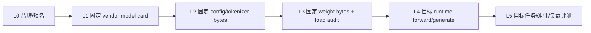

# Llama 证据台账：发布、Checkpoint 与 Runtime 验证

本页保存固定 model-card revision、config/weight 检查方法、公式前提、命令与验证边界，供供应链和 claim 审计使用。
它不是第一次学习 Llama 的入口；请先读[Llama 教材](../models/llama.md)，再来核对精确证据。

**读者入口**：[Llama 教材](../models/llama.md) · [Transformer](../core/transformer.md) · [单卡微调](../training/peft-qlora-engineering.md)
{ .doc-nav }

<!-- learning-contract -->
<div class="learning-contract" markdown="1">

**学习导航**

- **适合读者**：开放权重部署、量化、微调、模型评测和供应链工程师。
- **先修**：decoder-only Transformer、KV Cache、tokenizer、LoRA/QLoRA 与基本 GPU 内存模型。
- **首次阅读**：L0 标签与 L1–L5 证据阶梯 → checkpoint inventory → RMSNorm/RoPE/SwiGLU/GQA → 模板 → 内存 → 微调/部署 → 许可与发布。
- **完成信号**：能从固定 revision 的真实文件推导结构和预算，并清楚标注 vendor claim、config deduction、weight execution 与 task evidence 的差别。
- **卡住时**：回到[Transformer](../core/transformer.md)、[推理优化](../systems/inference-optimization.md)和[单卡微调](../training/peft-qlora-engineering.md)。

</div>

## 学习目标与证据边界

读完本章，你应能：

1. 不依赖“Llama”品牌名，从 checkpoint inventory 与 config 判断结构；
2. 推导 RMSNorm、RoPE、SwiGLU、GQA 的计算与内存影响；
3. 区分 Base/Instruct、tokenizer、chat template 与 generation config；
4. 估算参数、理想 KV payload、LoRA 参数和单卡峰值的不同组成；
5. 为量化、adapter、Transformers/vLLM 部署设计可回滚实验；
6. 固定来源、revision、文件 hash、许可与证据边界；
7. 不把 vendor-reported 128k、参数量或训练 token 写成本仓库独立测量。

Llama 是开放权重生态的重要基线，但“Llama”不是一个固定架构。不同代际、尺寸、Base/Instruct、text/multimodal 版本可能拥有不同词表、head 布局、RoPE 配置、上下文、模板、许可和 runtime 支持。

所有具体结论应以所选 checkpoint 的 immutable revision、`config.json`、tokenizer files、generation config、model card、weight inventory 和 license 为准。

## L0 前置标签 + L1–L5 五级证据阶梯

模型工程最常见的错误，是把不同强度的证据拼成一个“已验证”结论：

这里的 L0 只是待核验的品牌/短名，不算实质证据；真正的证据强度从 L1 到 L5 共五级。因此下图共有六层，但不是“六级实证”。



| 级别 | 能证明什么 | 仍不能证明什么 |
|---|---|---|
| L0 名称 | 人类约定的候选家族 | revision、结构、权重身份 |
| L1 model card | 固定厂商文档声明过什么 | config/权重匹配、独立测量 |
| L2 config/tokenizer | 给定 bytes 的字段与静态推导 | 权重就是它、代码真的执行 |
| L3 weight inventory | 实际交给 loader 的文件身份 | forward 正确、总体质量 |
| L4 runtime execution | 指定环境/输入上的真实运行 | 长上下文、任务分布、生产性能 |
| L5 evaluation | 声明 workload 上的质量/性能 | 未覆盖域、未来版本、其他硬件 |

本仓库对 Llama 当前只建立了 **L1 immutable vendor-model-card projection**。Authored GQA config 和 NumPy RMSNorm/RoPE/GQA 是机制证据，不是任何 Llama checkpoint；真实 weight/load/forward control 当前属于另一个固定 Qwen checkpoint，不能借给 Llama。

## 仓库中的固定 Llama 3.2 发布证据

`projects/transformers-basics/release-evidence/manifest.json` 固定 Meta `llama-models` commit：

```text
revision:
  0e0b8c519242d5833d8c11bffc1232b77ad7f301
source:
  .../models/llama3_2/MODEL_CARD.md
upstream size:
  25,416 bytes
upstream SHA-256:
  cdc06052012c47654cfa49dc41a766cdb8801c4dfd469bee6d42774b058beb78
local projection SHA-256:
  be14f72e9cbf200abb9740acc3049b82dca717d4f1e1eb4a46a8ed439a3ceb99
```

离线运行：

```powershell
python projects/transformers-basics/verify_release_evidence.py
```

当前固定输出：

| 字段 | 值 |
|---|---|
| manifest checked_at | `2026-08-13` |
| manifest fingerprint | `sha256:74166133716bfebddb444587e9f9a012b4beada923f5209482308ff61194953b` |
| projection fingerprint | `sha256:40b3fe7b2a9c054ea6aa17e9e747d1831b8ae41ee3d55130c916f818acbe4638` |
| Llama source fragments | 6 |
| `upstream_verified` | `false` |
| `source_fragments_verified` | `false` |

默认模式只严格检查本地 manifest、projection schema/hash 和预期投影；它没有在本轮下载 25,416-byte upstream 文档。因此 `upstream_verified=false` 和 `source_fragments_verified=false` 是正确证据，不是失败。

### `--verify-upstream` 多证明哪一步

显式联网模式：

```powershell
python projects/transformers-basics/verify_release_evidence.py --verify-upstream
```

它从 allowlisted public HTTPS origin 下载固定 revision 的原始 bytes，先核对 size/SHA-256，再验证六段 exact fragments。Fetcher 拒绝 HTTP、非 allowlist host、userinfo 和超过 1 MiB 的 artifact。

即使联网验证成功，也只证明“当次下载 bytes 与已审阅 manifest 一致”。无密钥 SHA-256 不认证 Meta、下载者或审阅者，TLS/DNS 也不是发布内容签名；上游组织/仓库控制权和本地 verify→loader TOCTOU 仍需供应链设计处理。

### Model card projection 允许写什么

固定 projection 将下列内容全部标成 `vendor_model_card_claims_not_independent_measurements`：

- publisher：Meta；
- family：Llama 3.2 text-only；
- parameters：`1B (1.23B)`、`3B (3.21B)`；
- reported context length：`128k`；
- GQA：`true`；
- shared embeddings：`true`；
- pretraining tokens：`Up to 9T tokens`；
- knowledge cutoff：`December 2023`。

因此正确写法是：“固定 Llama 3.2 官方 model card 报告……”。错误写法是：“本仓库测得 Llama 有 128k 有效上下文/3.21B 参数/训练了 9T tokens”。

这个 control 没有读取 gated Hugging Face config、tokenizer 或权重，没有执行 remote code、forward、generate、长上下文任务或许可证适用性审查。

## Checkpoint inventory：模型不只是权重文件

一个可部署 checkpoint 通常至少需要审计：

```text
model repository + immutable revision
├── config.json
├── generation_config.json        # 若存在
├── tokenizer.json / tokenizer.model
├── tokenizer_config.json
├── special_tokens_map.json       # 若存在
├── model*.safetensors
├── model.safetensors.index.json  # 分片时
├── chat template / prompt format
├── README / model card
└── LICENSE / acceptable-use terms
```

不同仓库的实际文件名可能不同。重点不是凑齐固定名字，而是为 loader 真正读取的每个文件保存：relative path、size、SHA-256、来源 URL/revision 与用途。

### Revision 必须是 immutable identity

本仓库 inspector 要求显式 `--revision`：

```powershell
python projects/transformers-basics/inspect_checkpoint.py `
  <model-id> --revision <full-commit-hash>
```

参数必填并不阻止调用者传入可移动 branch/tag。发布 evidence 应确认 resolved revision 是完整 immutable commit，并分别绑定 model 与 tokenizer identity。

### Loader 前后各验证什么

推荐顺序：

1. 在任何反序列化或 remote code import 前检查 manifest、路径、size/hash 和资源上限；
2. 使用实际准备交给 loader 的 bytes，避免“验证 A、打开 B”；
3. 默认 `trust_remote_code=False`，优先 safetensors；
4. 加载后核对 class、parameter inventory、dtype、device placement 与 config；
5. 运行固定 prefill/cache/generate control；
6. 保存 runtime/library/hardware manifest。

`weights_only`、safetensors 或 `trust_remote_code=False` 都会降低部分风险，但不是对不可信输入的完整安全证明。

## 从 config 读取结构，而不是从家族名猜

至少检查：

| 字段 | 决定什么 | 常见误读 |
|---|---|---|
| `model_type` / `architectures` | loader/实现候选 | 字符串不证明权重身份 |
| `hidden_size` | residual width (d) | 不等于 MLP width |
| `num_hidden_layers` | decoder block 数 (L) | 不能由“B”标签精确猜出 |
| `num_attention_heads` | query heads (H_q) | 不一定等于 KV heads |
| `num_key_value_heads` | MHA/GQA/MQA 与 KV 容量 | 忽略它会错估 KV |
| `head_dim` 或可推导值 | 每 head 维度 (d_h) | 自定义 attention 未必等于 (d/H_q) |
| `intermediate_size` | gated MLP width (m) | 不是普通二层 MLP 参数公式 |
| `vocab_size` | embedding/output 第一维 | 不证明 tokenizer 文件匹配 |
| `max_position_embeddings` | 配置位置范围 | 不证明有效上下文 |
| `rope_*` | 频率/扩展配置 | 不能跨版本机械复制 |
| `tie_word_embeddings` | 输入/输出是否共享 | 改变参数量与 adapter 发布 |
| norm epsilon / bias flags | 数值路径与参数量 | 默认值可能随实现变化 |

若字段缺失、自定义 code 改写语义或权重 shape 不符，应停止推导。Family-level heuristic 只能生成检查问题，不能生成事实。

### Config snapshot 也有两种 identity

- raw byte SHA-256：绑定下载到的原始 `config.json`；
- normalized semantic fingerprint：绑定 loader/`AutoConfig.to_dict()` 的规范化对象。

Normalized snapshot 可能包含库默认值和 metadata，不等于 raw byte hash。两者都不认证发布者，也不证明 config 与 weights 匹配。

## Llama-style decoder block 的直觉

许多 Llama 系 text checkpoint 使用 pre-norm decoder-only block。抽象写成：

\[
h' = h + \operatorname{Attention}(\operatorname{RMSNorm}(h)),
\]

\[
h'' = h' + \operatorname{MLP}(\operatorname{RMSNorm}(h')).
\]

具体 norm 位置、bias、head dim、RoPE 和 MLP 实现必须以固定 checkpoint config/code 为准。

### RMSNorm

\[
\operatorname{RMSNorm}(x)=g\odot
\frac{x}{\sqrt{\frac{1}{d}\sum_{i=1}^{d}x_i^2+\epsilon}}.
\]

它不减去均值，通常学习 scale (g)。工程上仍要检查：

- epsilon；
- reduction/accumulation dtype；
- 输出 dtype；
- affine 参数存在与 shape；
- norm 在 attention/MLP 前后的位置。

RMSNorm 与 LayerNorm 不能只因为 shape 相同就互换；checkpoint 参数语义和数值轨迹会改变。

### RoPE

对第 (j) 对通道，可把 position (p) 的二维旋转写为：

\[
R(p,\theta_j)
\begin{bmatrix}x_{2j}\\x_{2j+1}\end{bmatrix},
\quad
R=
\begin{bmatrix}
\cos(p\theta_j)&-\sin(p\theta_j)\\
\sin(p\theta_j)&\cos(p\theta_j)
\end{bmatrix}.
\]

对 Q/K 同时旋转后，点积编码相对位置结构。需要固定 base frequency、rope dimension、scaling/type 和实现版本；只改 `max_position_embeddings` 并不会训练出新的长上下文能力。

“接受 128k tokens”至少可以分成三件事：

1. tokenizer/HTTP/runtime 是否接受；
2. KV/position implementation 是否能运行；
3. 目标任务在各位置是否可靠。

Vendor-reported context length只回答产品/model-card 声明，不自动回答第三项。

### SwiGLU

常见 gated MLP：

\[
\operatorname{MLP}(x)=W_d\left(
\operatorname{SiLU}(W_gx)\odot W_ux
\right).
\]

忽略 bias 时，若 hidden width 为 (d)、intermediate width 为 (m)，三组主要权重约为：

\[
P_{\text{MLP}}=3dm.
\]

这解释了为什么不能用普通 (2dm) 两层 MLP 公式。实际参数仍要从 state dict inventory 重算。

### GQA

设 query heads 为 (H_q)，KV heads 为 (H_{kv})，head dim 为 (d_h)。GQA 让多个 query heads 共享 K/V heads；当 (1<H_{kv}<H_q) 时处于 MHA 与 MQA 之间。

忽略 bias 且 output width 为 (d) 时：

\[
P_Q=dH_qd_h,
\quad
P_K=P_V=dH_{kv}d_h,
\quad
P_O=H_qd_hd.
\]

若 (H_qd_h=d)，attention projection 约为：

\[
P_{\text{attn}}=2d^2+2dH_{kv}d_h.
\]

GQA 主要减少 K/V projection 与 cache；Q/O、MLP、embedding 和全部 runtime 开销不会按 (H_{kv}/H_q) 同比例缩小。

## 参数量必须从 shape 账本重算

在常见、无 bias、每层结构一致的简化条件下：

\[
P_{\text{block}}\approx
P_{\text{attn}}+3dm+2d,
\]

其中 (2d) 是两个 RMSNorm scales。总参数近似为：

\[
P_{\text{total}}\approx
L P_{\text{block}} + P_{\text{embedding/head}} + P_{\text{final norm}}.
\]

若 input/output embeddings tied，词表主权重通常按唯一存储计一次 (Vd)；若 untied，主项接近 (2Vd)。参数账本还需加入 bias、额外 norm、可能存在的 learned positional/RoPE 参数、自定义层和多模态组件；非持久 RoPE cache、KV cache 等 buffer/运行态张量应另列，不能混入 trainable parameter count。逻辑 state-dict entry 数、唯一底层存储数与可训练参数数也必须分别定义。

“1B/3B”是产品标签，model card 中括号值是 vendor-reported。发布工程应从实际 state dict name/shape/dtype 计算唯一 parameter count，并解释是否包含 tied alias、buffer 和 adapter。

## KV Cache：理想 payload 不是显存峰值

标准 dense K/V、batch (B)、层数 (L)、token 数 (T)、KV heads (H_{kv})、head dim (d_h)、每元素 (s) bytes 时：

\[
M_{KV,\text{ideal}}
=2LBTH_{kv}d_hs.
\]

前面的 2 分别代表 K 和 V。

该公式不包含：

- block/page 对齐与内部碎片；
- allocator metadata；
- prefix sharing/refcount；
- quantization scale/zero；
- temporary/workspace；
- CUDA graph reserve；
- model weights、activations 或 logits；
- beam/best-of-N/self-consistency 的多序列状态。

因此它只能作为 lower-level tensor payload estimate。

### 怎样解释仓库准备的固定样例

```powershell
python projects/transformers-basics/inspect_config.py `
  projects/transformers-basics/configs/standard-gqa.example.json `
  --tokens 4096 --element-bytes 2
```

`authored_standard_gqa` 在 32 层、8 KV heads、head dim 128、4,096 tokens、batch 1、2-byte element 下得到 536,870,912 bytes。

这个配置是公式测试夹具，**不是任何 Llama checkpoint**，也不是“Llama 4K 显存”。

## Base、Instruct 与 chat template

Base checkpoint 主要面向 next-token continuation；Instruct checkpoint 还经过指令/对话后训练。两者可能共享主干结构，却有不同使用契约。

### Chat template 属于模型输入协议

模板决定：

- role 与 system 的序列化；
- BOS/EOS/header/end-of-turn token；
- generation prompt；
- tool definition/call/result 的表示；
- assistant-only training mask 的边界。

常见错误：

- 给 Base 套 Instruct template 并期待自动获得指令能力；
- 从旧代际复制 `[INST]` 或 special token；
- 训练和部署使用不同 template revision；
- `add_generation_prompt` 与训练格式不一致；
- 手工追加 EOS，造成重复或错误停止；
- model revision 固定但 tokenizer/template 漂移。

### 最小 template matrix

在下载权重前就可对 tokenizer 运行：

```text
single user
system + user
multi-turn
empty assistant generation prompt
tool definition + call + result
Unicode / multilingual
very long user content
```

保存 rendered text、token IDs、attention mask、special-token positions 与 tokenizer/template fingerprint。成功 tokenize 不证明权重匹配或回答质量。

## Generation config 与停止协议

固定：

- decoding method；
- temperature/top-p/top-k；
- max new tokens；
- EOS/PAD/BOS IDs；
- stop strings；
- repetition/length penalties；
- framework/runtime version。

Transformers 的 `generation_config.json`、model config defaults、显式 kwargs 和服务层参数可能有 precedence 差异。比较 runtime 前先输出最终 resolved config。

应用 stop string、tokenizer EOS 与 provider/service finish reason 是不同概念。客户端截断可见文本不能伪造模型真实 terminal 或修改 usage。

## 权重与运行内存账本

参数存储的理论主项：

\[
M_{weights}=\sum_i \operatorname{numel}(W_i)\times bytes(dtype_i).
\]

实际推理峰值近似拆成：

\[
M_{peak}\approx
M_{weights}+M_{KV}+M_{activations}+M_{workspace}
+M_{allocator}+M_{runtime}.
\]

训练再加入 gradients、optimizer state、master weights、saved activations、adapter 和 dataloader/runtime buffer。

PyTorch `allocated`、`reserved`、进程 RSS 与设备总占用是不同指标。报告必须注明采样 API、时间点和是否先执行 warm-up。

## 量化：文件位宽不是端到端位宽

“4-bit 模型”通常只说明部分权重存储。至少记录：

- quantized layer allowlist；
- code range 与 signed/unsigned convention；
- group size、axis、scale/zero dtype；
- packing layout 与 padding；
- 未量化 embedding/norm/lm head；
- compute dtype 与 accumulation dtype；
- KV cache dtype；
- dequant/fused kernel 与 workspace；
- artifact bytes、resident bytes 与 peak memory。

4-bit 不等于每个模型参数严格 0.5 byte，也不自动提高速度。目标 runtime 没有匹配 fused kernel 时，可能增加转换和延迟。

### 量化验收

至少比较：

1. FP/BF16 baseline；
2. quantized checkpoint reload；
3. fixed-token logits/greedy continuation；
4. 任务质量与长尾 slice；
5. 权重/KV/peak memory；
6. TTFT、TPOT、throughput 与并发；
7. artifact/no-overwrite/reload identity。

CPU packing oracle 不证明目标 GPU kernel、显存节省或加速。

## LoRA 与 QLoRA

对线性权重 (W\in\mathbb{R}^{d_{out}\times d_{in}})，LoRA 使用：

\[
W'=W+\frac{\alpha}{r}BA,
\quad
A\in\mathbb{R}^{r\times d_{in}},
\quad
B\in\mathbb{R}^{d_{out}\times r}.
\]

该层可训练参数为：

\[
P_{LoRA}=r(d_{in}+d_{out}).
\]

总参数必须遍历实际 target modules；`q_proj/v_proj`、QKV fused projection 与 all-linear 的计数完全不同。

### QLoRA 不等于全流程 4-bit

QLoRA 通常把 frozen base 以低位格式存储，同时 adapter、梯度、optimizer、activations 与部分计算使用更高精度。报告“4-bit 训练”时必须拆开这些状态，而不是用 base 文件大小代替训练峰值。上式的 \(\alpha/r\) 是经典 LoRA scaling；若使用 rsLoRA 等变体，必须把实际 scaling rule 写入 artifact，而不能继续套用该式。

### 训练前的四项 gate

1. 固定 base/model/tokenizer/template revision；
2. 从模型实例发现 target modules 并计算 trainable/frozen ledger；
3. 检查 assistant-only labels、padding、tool turn 与 truncation；
4. 在 backward 前完成数据 provenance/license/sensitive/near-duplicate/readiness gate。

### Adapter 发布

Adapter artifact 至少绑定：

- exact base weight identity；
- tokenizer/chat template；
- PEFT/Transformers/runtime versions；
- rank/alpha/dropout/target modules；
- training data/readiness identity；
- merge policy 与 dtype；
- held-out evaluation；
- file inventory/hash 与 license。

保存后必须在**新基座实例**重载，比较固定输入 logits/continuation。内存中 merge 成功不能替代发布 artifact reload。

## Transformers 与 vLLM：正确性和服务证据分开

Transformers 适合建立：

- tokenizer/template/token ID baseline；
- state dict/dtype/device inventory；
- prefill/cache/full recompute 对账；
- greedy token baseline；
- adapter merge/reload control。

vLLM 等服务 runtime 适合测：

- continuous batching；
- paged KV management；
- prefix cache；
- preemption/scheduling；
- OpenAI-compatible serving subset；
- target GPU 吞吐与延迟。

比较时必须固定同一 weight/tokenizer/template/generation identity。若输出不同，按顺序检查：

1. rendered token IDs；
2. BOS/EOS/PAD 与 stop；
3. resolved generation defaults；
4. dtype/quantization；
5. KV/prefix cache；
6. kernel tolerance；
7. scheduler/batching effects。

“vLLM 能启动”不证明模板正确、质量相同、取消释放资源或生产 SLO。

## 长上下文评测：reported length 不是有效长度

至少设计位置与任务双切片：

| 切片 | 问题 |
|---|---|
| 开头/中部/结尾 needle | 位置信息是否可恢复 |
| 多 needle | 是否遗漏或混淆 |
| 冲突文档 | 是否遵循可信来源/时间 |
| 顺序/计数/聚合 | 是否需要全局状态 |
| 长输入+长输出 | 输出预算和一致性 |
| 多语言/代码 | tokenizer 与能力分布 |

报告 tokenizer token length，而不是 UTF-8 bytes/字符。还应记录 OOM、timeout、truncation、refusal 和 wrong answer 的完整分母。

Vendor model card 的 128k 只是 vendor-reported context length；本仓库未执行 Llama 128k task。

换言之，**128k 不等于有效上下文**：接收长度、成功执行和目标任务在各位置可靠，是三种不同结论。

## 单张消费级 GPU 的实验路线

### 零权重阶段

1. 固定 model card/license/revision；
2. 下载并 hash config/tokenizer/template；
3. 计算参数和理想 KV；
4. 预估 weight/adapter/optimizer/activation/KV；
5. 设计最小 quality/safety/long-context set。

### 加载阶段

1. 使用最短 prompt、batch 1；
2. 明确 dtype/device map，不用含糊的 `auto` 作为证据；
3. 记录实际 loader files 与 parameter inventory；
4. warm-up 后测 peak；
5. 保存 OOM 前配置和降级动作。

### 容量扫描

逐项改变一个变量：input length、max output、batch/concurrency、quantization、KV dtype。报告成功/失败分母与 offered workload，避免只保存最好点。

推理常见降级顺序：batch/concurrency 1 → 减少 input/output budget → 选择受验证的高效 attention/KV 配置 → 量化或更小 base。训练常见降级顺序：micro-batch 1 → gradient accumulation → 减少 sequence length → gradient checkpointing → 减少 LoRA targets/rank → 量化 frozen base 或更小 base。两条路线都要在每次改变后生成新 manifest，并重新做正确性/质量回归；这些手段是否省显存或提速，以目标 runtime 与硬件实测为准。

## 质量与安全评测

一个开放权重 checkpoint 的验收不应只有 perplexity 或聊天截图：

- 目标任务与明确 baseline；
- 指令遵循/格式/tool arguments；
- 事实、引用与 abstention；
- 多语言和代码 slice；
- 长上下文位置/任务 slice；
- prompt injection/越权/refusal；
- Base/Instruct/quantized/adapter paired comparison；
- 置信区间、失败分类与 regression gate。

本地 verifier 通过只证明 artifact/控制流；model-as-judge、人工标注和在线指标需要各自校准与分母。

## 许可与开放权重边界

**开放权重不等于 OSI 开源**。“可下载权重”不自动等于 OSI 开源软件。具体 Llama 版本可能有独立 Community License、acceptable-use、归因、再分发或规模条款。

固定 projection 只证明 model card 中出现了 Llama 3.2 Community License 链接，不证明你的训练数据、adapter、合并权重、容器、SaaS 或地域用途合法。

发布前至少审查：

- exact model/version license；
- acceptable-use policy；
- adapter/derivative/redistribution 条款；
- tokenizer/code/dependency license；
- 数据许可与隐私；
- 目标客户/地域/行业约束；
- attribution 与 NOTICE。

本教材不提供法律意见；需要由责任主体留下书面审查结论。

## 供应链与生产发布

### 发布 manifest

```json
{
  "model_id": "<repo>",
  "revision": "<immutable-commit>",
  "files": [{"path": "...", "size": 0, "sha256": "..."}],
  "tokenizer_revision": "...",
  "template_sha256": "...",
  "runtime": "transformers/vllm + exact version",
  "dtype_or_quantization": "...",
  "adapter": null,
  "license_review_id": "...",
  "evaluation_artifact": "sha256:..."
}
```

Unsigned JSON 只提供自洽 identity。生产 provenance 还需要受控发布者、签名/透明日志、trusted head、不可变存储与密钥治理。

### Canary 与回滚

升级 model/tokenizer/template/runtime/quantization 的任一项都视为候选系统变化。使用 paired offline eval → shadow → canary；回滚包必须保留旧的完整 identity，而不是只保留旧 model alias。

## 本仓库可运行实验

### 1. Release evidence

```powershell
python projects/transformers-basics/verify_release_evidence.py
python -m pytest tests/test_model_release_evidence.py -q
```

13 个测试覆盖 local/offline report、可注入 upstream bytes、raw-byte tamper、semantic snapshot tamper、manifest contract/scenario drift、path traversal、duplicate JSON、untrusted URL 与 CLI。

### 2. Authored mechanism controls

```powershell
python projects/transformers-basics/inspect_config.py `
  projects/transformers-basics/configs/standard-gqa.example.json `
  --tokens 4096 --element-bytes 2
```

配合 NumPy RMSNorm/RoPE/GQA/cache tests，可以核对公式；这些 fixture 都没有加载 Llama config/weights。

### 3. 仍缺失的目标 Llama control

要把 Llama 证据提升到 L3/L4，至少需要：

1. 选择许可允许、单机可承受的 exact Llama checkpoint；
2. 固定 config/tokenizer/weight 全文件 manifest；
3. 加载前重哈希实际 bytes；
4. `trust_remote_code=False` 或固定审阅后的实现；
5. 执行 prefill/cache/full/greedy control；
6. 保存 parameter/dtype/device/runtime scope；
7. 加入 tamper、wrong-template、wrong-revision negative；
8. 再做目标 GPU/任务评测。

没有完成这些步骤前，必须明确写“仓库未执行 Llama 权重”，不能声称仓库已运行或部署 Llama checkpoint。

## 常见错误

- 把 “Llama” 当成固定 config；
- 把 vendor 128k 写成有效长上下文测量；
- 把 model card 参数标签当 state dict 重算；
- 只固定 model revision，不固定 tokenizer/template；
- 把 authored GQA fixture 写成 Llama 内存结果；
- 把 config fingerprint 当权重来源证明；
- 把 4-bit 文件大小当 GPU 峰值；
- 把 LoRA trainable parameter 少写成训练显存同比下降；
- 把 Base 套 Instruct template 当正常聊天模型；
- 把 vLLM 启动命令当性能证据；
- 把可下载权重写成 OSI 开源；
- 把无密钥 hash 写成签名或发布者认证。

## 面试与作品集验收

### 面试追问

1. 为什么 model card、config、weight、runtime 与 task evidence 不能互借？
2. RMSNorm 与 LayerNorm 的数学和 checkpoint 兼容差异是什么？
3. SwiGLU 为什么有三个主要投影？
4. GQA 减少哪些参数/KV，哪些部分不会同比减少？
5. 如何从 state dict 处理 tied embedding parameter count？
6. Reported context 与 effective context 有何区别？
7. Base/Instruct、chat template 与 stopping protocol 如何关联？
8. 4-bit 和 QLoRA 分别量化了哪些状态？
9. Adapter artifact 为什么必须绑定 base/tokenizer/template？
10. Immutable URL + SHA-256 为什么仍不等于发布者签名？

### 可写进简历的诚实版本

> 构建开放权重 release-evidence gate：固定 Meta Llama 3.2 model-card commit、25,416-byte/SHA-256 与六段 source fragments，将 1B/3B、128k、GQA、shared embeddings、9T 与 cutoff 明确投影为 vendor-reported；以 strict manifest、allowlisted HTTPS、tamper/path/duplicate-JSON negatives 和离线 receipt 固化证据边界。

紧邻位置必须披露：该 control 没有下载或执行 Llama config/tokenizer/weights，不证明参数量、有效上下文、许可适用、GPU/runtime、质量、性能或生产安全。

如果作品集还包含量化/LoRA/vLLM，必须另附目标 checkpoint、目标硬件、任务集和实际 artifact；不能用 Llama model-card evidence 与 Qwen runtime control 拼成一个“Llama 已部署”结论。

## 一手资料

- Meta，[固定 Llama 3.2 text-only model card](https://raw.githubusercontent.com/meta-llama/llama-models/0e0b8c519242d5833d8c11bffc1232b77ad7f301/models/llama3_2/MODEL_CARD.md)，本仓库 immutable vendor-claim source；检查日期 2026-08-13。
- Meta，[Llama models repository](https://github.com/meta-llama/llama-models)，model card、prompt format 与许可入口；使用时固定 commit。
- Touvron 等，[LLaMA: Open and Efficient Foundation Language Models](https://arxiv.org/abs/2302.13971)，早期 LLaMA 公开论文与 architecture motivation。
- Hugging Face，[Chat templates](https://huggingface.co/docs/transformers/en/chat_templating)，template 序列化机制；产品/checkpoint 事实仍以固定文件为准。
- 具体 checkpoint 的 config、tokenizer、weight manifest、model card 与 license，是该实验最高优先级证据。
