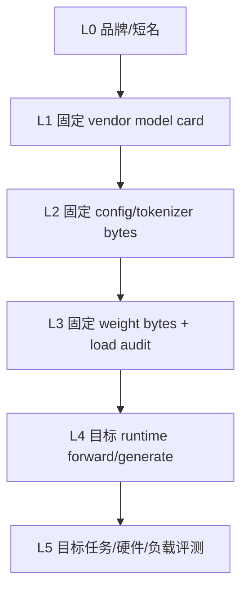

# Llama 证据台账：发布、Checkpoint 与 Runtime 验证

本页保存固定 model-card revision、config/weight 检查方法、公式前提、命令与验证边界，供供应链和 claim 审计使用。
它不是第一次学习 Llama 的入口；请先读[Llama 教材](../models/llama.md)，再来核对精确证据。

**读者入口**：[Llama 教材](../models/llama.md) · [Transformer](../core/transformer.md) · [单卡微调](../training/peft-qlora-engineering.md)
{ .doc-nav }

| 查什么 | 去哪里 |
|---|---|
| 第一次理解 Llama 家族与使用路线 | [Llama 教材](../models/llama.md) |
| 核对 checkpoint inventory、config、权重和模板 | 本页 inventory、结构和 Base/Instruct 分区 |
| 核对 KV、内存、量化、LoRA 或 runtime | 本页对应工程分区与“可运行实验” |
| 核对许可、供应链和可发布 claim | 本页许可、生产发布、常见错误与作品集边界 |

## 适用范围与证据边界

本台账按以下核对项组织：

1. 不依赖“Llama”品牌名，从 checkpoint inventory 与 config 判断结构；
2. 推导 RMSNorm、RoPE、SwiGLU、GQA 的计算与内存影响；
3. 区分 Base/Instruct、tokenizer、chat template 与 generation config；
4. 估算参数、理想 KV payload、LoRA 参数和单卡峰值的不同组成；
5. 为量化、adapter、Transformers/vLLM 部署设计可回滚实验；
6. 固定来源、revision、文件 hash、许可与证据边界；
7. 不把 vendor-reported 128k、参数量或训练 token 写成本仓库独立测量。

Llama 是开放权重生态的重要基线，但“Llama”不是一个固定架构。不同代际、尺寸、Base/Instruct、text/multimodal 版本可能拥有不同词表、head 布局、RoPE 配置、上下文、模板、许可和 runtime 支持。

所有具体结论应以所选 checkpoint 的 immutable revision、`config.json`、tokenizer files、generation config、model card、weight inventory 和 license 为准。

## 台账证据轴：L0 前置标签与 L1–L5 阶梯

模型工程最常见的错误，是把不同强度的证据拼成一个“已验证”结论：

这里的 L0 只是待核验的品牌/短名，不算实质证据；真正的证据强度从 L1 到 L5 共五级。因此下图共有六层，但不是“六级实证”。

这套编号只标记本页从发布声明到目标评测的**证据输入与执行范围**。它不使用[仓库地图](../guide/repo-map.md)的 L0–L4 项目成熟度定义，不能据此把项目升级为可复现实验、工程样例或生产设计。



| 级别 | 能证明什么 | 仍不能证明什么 |
|---|---|---|
| L0 名称 | 人类约定的候选家族 | revision、结构、权重身份 |
| L1 model card | 固定厂商文档声明过什么 | config/权重匹配、独立测量 |
| L2 config/tokenizer | 给定 bytes 的字段与静态推导 | 权重就是它、代码真的执行 |
| L3 weight inventory | 实际交给 loader 的文件身份 | forward 正确、总体质量 |
| L4 runtime execution | 指定环境/输入上的真实运行 | 长上下文、任务分布、生产性能 |
| L5 evaluation | 声明 workload 上的质量/性能 | 未覆盖域、未来版本、其他硬件 |

截至本页可复核的台账记录（2026-08-13），本仓库对 Llama 只建立了 **L1 immutable vendor-model-card projection**。Authored GQA config 和 NumPy RMSNorm/RoPE/GQA 是机制证据，不是任何 Llama checkpoint；真实 weight/load/forward control 当前属于另一个固定 Qwen checkpoint，不能借给 Llama。

## 仓库中的固定 Llama 3.2 发布证据

`projects/transformers-basics/release-evidence/manifest.json` 固定 Meta `llama-models` commit：

```text
revision:
  0e0b8c519242d5833d8c11bffc1232b77ad7f301
source:
  .../models/llama3_2/MODEL_CARD.md
upstream size:
  25,416 bytes
upstream SHA-256:
  cdc06052012c47654cfa49dc41a766cdb8801c4dfd469bee6d42774b058beb78
local projection SHA-256:
  be14f72e9cbf200abb9740acc3049b82dca717d4f1e1eb4a46a8ed439a3ceb99
```

离线运行：

```powershell
python projects/transformers-basics/verify_release_evidence.py
```

当前固定输出：

| 字段 | 值 |
|---|---|
| manifest checked_at | `2026-08-13` |
| manifest fingerprint | `sha256:74166133716bfebddb444587e9f9a012b4beada923f5209482308ff61194953b` |
| projection fingerprint | `sha256:40b3fe7b2a9c054ea6aa17e9e747d1831b8ae41ee3d55130c916f818acbe4638` |
| Llama source fragments | 6 |
| `upstream_verified` | `false` |
| `source_fragments_verified` | `false` |

默认模式只严格检查本地 manifest、projection schema/hash 和预期投影；它没有在本轮下载 25,416-byte upstream 文档。因此 `upstream_verified=false` 和 `source_fragments_verified=false` 是正确证据，不是失败。

### `--verify-upstream` 多证明哪一步

显式联网模式：

```powershell
python projects/transformers-basics/verify_release_evidence.py --verify-upstream
```

它从 allowlisted public HTTPS origin 下载固定 revision 的原始 bytes，先核对 size/SHA-256，再验证六段 exact fragments。Fetcher 拒绝 HTTP、非 allowlist host、userinfo 和超过 1 MiB 的 artifact。

即使联网验证成功，也只证明“当次下载 bytes 与已审阅 manifest 一致”。无密钥 SHA-256 不认证 Meta、下载者或审阅者，TLS/DNS 也不是发布内容签名；上游组织/仓库控制权和本地 verify→loader TOCTOU 仍需供应链设计处理。

### Model card projection 允许写什么

固定 projection 将下列内容全部标成 `vendor_model_card_claims_not_independent_measurements`：

- publisher：Meta；
- family：Llama 3.2 text-only；
- parameters：`1B (1.23B)`、`3B (3.21B)`；
- reported context length：`128k`；
- GQA：`true`；
- shared embeddings：`true`；
- pretraining tokens：`Up to 9T tokens`；
- knowledge cutoff：`December 2023`。

因此正确写法是：“固定 Llama 3.2 官方 model card 报告……”。错误写法是：“本仓库测得 Llama 有 128k 有效上下文/3.21B 参数/训练了 9T tokens”。

这个 control 没有读取 gated Hugging Face config、tokenizer 或权重，没有执行 remote code、forward、generate、长上下文任务或许可证适用性审查。

## Checkpoint inventory：模型不只是权重文件

一个可部署 checkpoint 通常至少需要审计：

```text
model repository + immutable revision
├── config.json
├── generation_config.json        # 若存在
├── tokenizer.json / tokenizer.model
├── tokenizer_config.json
├── special_tokens_map.json       # 若存在
├── model*.safetensors
├── model.safetensors.index.json  # 分片时
├── chat template / prompt format
├── README / model card
└── LICENSE / acceptable-use terms
```

不同仓库的实际文件名可能不同。重点不是凑齐固定名字，而是为 loader 真正读取的每个文件保存：relative path、size、SHA-256、来源 URL/revision 与用途。

### Revision 必须是 immutable identity

本仓库 inspector 要求显式 `--revision`：

```powershell
python projects/transformers-basics/inspect_checkpoint.py `
  <model-id> --revision <full-commit-hash>
```

参数必填并不阻止调用者传入可移动 branch/tag。发布 evidence 应确认 resolved revision 是完整 immutable commit，并分别绑定 model 与 tokenizer identity。

### Loader 前后各验证什么

推荐顺序：

1. 在任何反序列化或 remote code import 前检查 manifest、路径、size/hash 和资源上限；
2. 使用实际准备交给 loader 的 bytes，避免“验证 A、打开 B”；
3. 默认 `trust_remote_code=False`，优先 safetensors；
4. 加载后核对 class、parameter inventory、dtype、device placement 与 config；
5. 运行固定 prefill/cache/generate control；
6. 保存 runtime/library/hardware manifest。

`weights_only`、safetensors 或 `trust_remote_code=False` 都会降低部分风险，但不是对不可信输入的完整安全证明。

## 从 config 读取结构，而不是从家族名猜

至少检查：

| 字段 | 决定什么 | 常见误读 |
|---|---|---|
| `model_type` / `architectures` | loader/实现候选 | 字符串不证明权重身份 |
| `hidden_size` | residual width (d) | 不等于 MLP width |
| `num_hidden_layers` | decoder block 数 (L) | 不能由“B”标签精确猜出 |
| `num_attention_heads` | query heads (H_q) | 不一定等于 KV heads |
| `num_key_value_heads` | MHA/GQA/MQA 与 KV 容量 | 忽略它会错估 KV |
| `head_dim` 或可推导值 | 每 head 维度 (d_h) | 自定义 attention 未必等于 (d/H_q) |
| `intermediate_size` | gated MLP width (m) | 不是普通二层 MLP 参数公式 |
| `vocab_size` | embedding/output 第一维 | 不证明 tokenizer 文件匹配 |
| `max_position_embeddings` | 配置位置范围 | 不证明有效上下文 |
| `rope_*` | 频率/扩展配置 | 不能跨版本机械复制 |
| `tie_word_embeddings` | 输入/输出是否共享 | 改变参数量与 adapter 发布 |
| norm epsilon / bias flags | 数值路径与参数量 | 默认值可能随实现变化 |

若字段缺失、自定义 code 改写语义或权重 shape 不符，应停止推导。Family-level heuristic 只能生成检查问题，不能生成事实。

### Config snapshot 也有两种 identity

- raw byte SHA-256：绑定下载到的原始 `config.json`；
- normalized semantic fingerprint：绑定 loader/`AutoConfig.to_dict()` 的规范化对象。

Normalized snapshot 可能包含库默认值和 metadata，不等于 raw byte hash。两者都不认证发布者，也不证明 config 与 weights 匹配。

## 机制与工程职责索引

下面的通用机制由专题正文负责；本台账只记录它们在目标 Llama checkpoint 上需要核对的对象。

| 主题 | Llama 核对项 | 权威正文 |
|---|---|---|
| RMSNorm / RoPE / SwiGLU / GQA | Config 字段、weight shapes、代码语义与实际 tensor trace | [Transformer](../core/transformer.md) |
| 参数与 KV | Unique storage、tied aliases、dtype、实际 cache layout、allocator 与 peak | [推理优化](../systems/inference-optimization.md) |
| Base / Instruct / template | Exact tokenizer、chat template、generation prompt、special tokens 和 stop；不能假定所有版本都使用 `[INST]` | [Llama 教材](../models/llama.md) |
| Generation | Tokenizer/model/generation config 与 call kwargs 的最终合并结果 | [生成与解码](../core/generation.md) |
| 量化 | Per-tensor format、scale/metadata、loader/kernel、resident/peak 与 paired quality | [推理优化](../systems/inference-optimization.md) |
| LoRA / QLoRA | Exact base、target modules、fan-in/out、scaling、adapter manifest 与独立重载 | [LoRA/QLoRA 工程](../training/peft-qlora-engineering.md) |
| Transformers / vLLM | Token IDs、logits/cache/stop parity，再分别测调度、取消、容量和性能 | [Serving](../systems/serving.md) |
| 长上下文 | Protocol acceptance、runtime completion、位置/任务有效性 | [长上下文系统](../frontier/long-context-systems.md) |
| 质量与安全 | 同一 case manifest 下的任务、语言、引用、拒答、工具与安全切片 | [评测方法](../quality/evaluation-methodology.md) |
| 许可与供应链 | License/AUP、文件 provenance、签名、依赖与完整回滚 bundle | [安全](../quality/safety.md) · [LLMOps](../applications/llmops-release.md) |

## 公式 fixture 与证据边界

| 项目 | 固定公式或观察 | 不能推出 |
|---|---|---|
| Decoder 参数账 | `L × P_block + P_embedding/head + P_final_norm`；tied embedding 按 unique storage 与 logical entries 分账 | 未读取目标 config/weights 时，不能给目标 Llama 参数量。 |
| 标准 dense KV | `2BLTH_kv d_h s` | 不含 block/alignment、scale、workspace、临时 tensor 与 allocator reserve。 |
| Authored GQA fixture | 32 层、8 KV heads、head dim 128、4,096 tokens、batch 1、2-byte element 得 536,870,912 bytes | Fixture 不属于 Llama checkpoint，不能写成真实显存。 |
| GQA 影响 | 主要减少 K/V projection、cache 与相关读取 | Q/O、MLP、embedding 和 runtime 不按 `H_kv/H_q` 同比缩小。 |
| Model-card 128k | Vendor-reported context length | 不证明请求完成、任意位置有效、长输出可靠或成本可接受。 |
| Hash | 对可信期望值检查所选 bytes 是否变化 | 无密钥 SHA-256 不认证发布者、许可或运行来源。 |

当前仓库只有固定 Llama 3.2 text-only model-card 的发布证据，没有目标 Llama config、tokenizer、weights、forward、
KV、量化、LoRA、vLLM、128k task 或 GPU 结果。来自 Qwen 或 authored fixture 的运行记录不能填补这些空格。

## 运行入口

**固定发布证据**

~~~powershell
python projects/transformers-basics/verify_release_evidence.py
python -m pytest tests/test_model_release_evidence.py -q
~~~

13 个测试覆盖 local/offline report、可注入 upstream bytes、raw-byte/semantic tamper、manifest contract/scenario drift、
path traversal、duplicate JSON、untrusted URL 与 CLI。默认 `upstream_verified=false`，表示本轮没有访问上游，
不是验证失败，也不是当前网页状态的证明。

**Authored config/KV 机制**

~~~powershell
python projects/transformers-basics/inspect_config.py `
  projects/transformers-basics/configs/standard-gqa.example.json `
  --tokens 4096 --element-bytes 2
~~~

该命令只执行仓库自编标准 GQA config。真实 Llama control 必须另选 exact repository/revision，并固定 config、
tokenizer/template、generation config、全部 weight shards 与 license。

## 目标 Llama 证据缺口

从发布材料升级到可复现实验时依次保存：

1. Load 前的完整 file inventory、path/size/hash、许可与资源上限；
2. Load 后的 class、state-dict names/shapes/dtypes/device 与 unique-storage parameter count；
3. 固定 Prompt 的 prefill、cache/full recompute、greedy generate 与 stop trace；
4. 参数、KV、activation、workspace、allocator 和 runtime 的实际内存；
5. FP/BF16、量化与 adapter 的 paired quality/safety 和目标 GPU 性能；
6. Start/middle/end、多跳、冲突、聚合与长输出的 context matrix；
7. Transformers/vLLM 的输入、logits、stop、取消和失败终态对账；
8. Shadow、canary、完整 bundle rollback 与事故记录。

能够加载或启动服务只建立对应路径的 smoke，不自动获得正确性、性能、取消、质量或生产 SLO。

## Claim 导出矩阵

| 可写 claim | 必须紧邻披露 | 禁止升级 |
|---|---|---|
| Llama 3.2 发布证据 gate | 固定 model-card commit、25,416-byte/SHA-256、六段 exact source fragments；将 1B/3B、128k、GQA、shared embeddings、9T 与 cutoff 标为 vendor-reported | 没有加载 config/tokenizer/weights，没有 forward/generate/128k/GPU，也未证明许可适用、质量、性能或生产安全。 |
| Strict manifest verifier | Allowlisted HTTPS、path/duplicate-JSON/tamper negatives 与离线 receipt | Immutable URL + SHA-256 仍不是发布者签名；verify 后 reopen 仍有 TOCTOU。 |
| Authored GQA 公式 | 536,870,912-byte 理想 KV 结果及全部假设 | 不能与 model card 或另一个 Qwen runtime 拼成“部署、微调或评测 Llama”。 |

任何目标运行都要把 model、tokenizer、template、runtime、quantization、adapter、data 与 evaluation identity
绑定成同一条证据链。

## 一手资料

- Meta，[固定 Llama 3.2 text-only model card](https://raw.githubusercontent.com/meta-llama/llama-models/0e0b8c519242d5833d8c11bffc1232b77ad7f301/models/llama3_2/MODEL_CARD.md)，本仓库 immutable vendor-claim source；检查日期 2026-08-13。
- Meta，[Llama models repository](https://github.com/meta-llama/llama-models)，model card、prompt format 与许可入口；使用时固定 commit。
- Touvron 等，[LLaMA: Open and Efficient Foundation Language Models](https://arxiv.org/abs/2302.13971)，早期 LLaMA 公开论文与 architecture motivation。
- Hugging Face，[Chat templates](https://huggingface.co/docs/transformers/en/chat_templating)，template 序列化机制；产品/checkpoint 事实仍以固定文件为准。
- 具体 checkpoint 的 config、tokenizer、weight manifest、model card 与 license，是该实验最高优先级证据。
