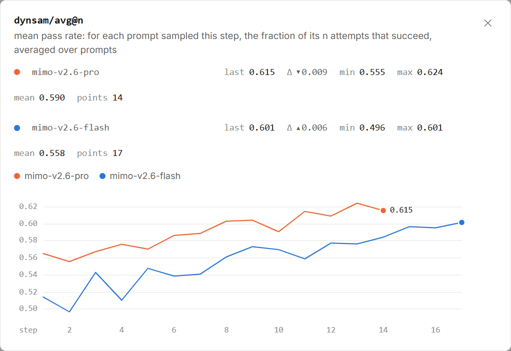

# MiMo RL：图表与数据

第一次阅读，建议从[十一篇看图专题](../../models/mimo-rl-series.md)选择一个问题。
这里保留各篇使用的固定图表与数值，方便读到一半时放大图片、查数或重算。

## 9 月 18 日：第二次回看

[本次新发现与监督更新记录](reviews/2026-09-18.md)：评测从一组增加到三组，Pro 数据组成调整，两条运行的日志新鲜度不同。
记录保留五张新截图；17:21 的再次观察还展示了 AutomationBench 旁注与同检查点成绩的修订。

[打开 17:19—17:20 的最新固定查看器](snapshots/2026-09-18T09-19-30-038024Z/viewer.html)：Pro 到第 18 步、Flash 到第 25 步，三组评测分别保留当前协议标签。

[打开 9 月 18 日 14:07—14:08 的离线查看器](snapshots/2026-09-18T06-07-28-636152Z/viewer.html)：Pro 到第 17 步、Flash 到第 24 步。
下面的首批教材材料仍固定在 9 月 17 日，各自的时间和读数不变。

## 9 月 17 日：第一张成功率图

下面是 **2026 年 9 月 17 日北京时间 15:40**，从[小米 MiMo 公开看板](https://mimo.xiaomi.com/rl/#chart/dynsam%2Favg%40n)截下的 `dynsam/avg@n` 图。
橙线对应 Pro，蓝线对应 Flash；纵轴记录每个训练步里，按题目平均的尝试成功比例。

图 1｜来源：小米 MiMo。横轴为训练步，纵轴为线性刻度，平滑关闭。点击图片可放大。

## 先看这三处

**看右端：** Pro 最后是 `0.615`，约 61.5%；Flash 是 `0.601`，约 60.1%。
这里统计的是各自训练采样的表现。每道题多次尝试，先算成功比例，再对题目取平均。

**看橙线最后一段：** 第 13 步约 62.38%，第 14 步约 61.52%，下降约 0.86 个百分点。
虽然最后一步回落，终点仍比第 1 步的 56.47% 高约 5.06 个百分点。

**看横轴和点数：** Pro 有 14 个点，Flash 有 17 个点。每个点是一个训练步的汇总，背后可以有很多道题和很多份回答。
蓝线更长，表示这里已显示的训练步更多；这张图没有按训练小时对齐两条运行。

**[继续读完整图解：0.615 怎么算、曲线为什么起伏、训练团队从中看什么 →](../../models/mimo-rl.md)**

## 想自己算一算

- [打开原尺寸截图](figures/2026-09-17-avgn.png)。
- [下载这张图的逐点数值 CSV](figures/2026-09-17-avgn.csv)：可用表格软件打开，包含 Pro 的 14 个点和 Flash 的 17 个点。

CSV 中 Pro 第 15—17 步留空，因为截图时橙线只到第 14 步；空白不代表成功率为 0。

## 后续专题的图表与数值

下面这些局部截图截于当天北京时间 **16:05—16:08**。每篇正文都标出了自己的截图时间。

| 想查什么 | 图片与讲解 |
|---|---|
| 状态卡与费用 | [图片](figures/2026-09-17-series/status.png) · [讲解](../../models/mimo-rl-progress.md) |
| 训练奖励与优势 | [奖励图](figures/2026-09-17-series/reward.png) · [优势图](figures/2026-09-17-series/penalty.png) · [讲解](../../models/mimo-rl-reward.md) |
| 熵、目标与梯度 | [熵图](figures/2026-09-17-series/entropy.png) · [目标图](figures/2026-09-17-series/pg-loss.png) · [梯度图](figures/2026-09-17-series/gradient.png) · [讲解](../../models/mimo-rl-update.md) |
| 计算一致性与版本差 | [KL 图](figures/2026-09-17-series/consistency.png) · [版本差图](figures/2026-09-17-series/staleness.png) · [讲解](../../models/mimo-rl-consistency.md) |
| 轨迹长度与交互 | [长度图](figures/2026-09-17-series/length.png) · [轮数图](figures/2026-09-17-series/turns.png) · [讲解](../../models/mimo-rl-trajectories.md) |
| 难度与采样池 | [全失败](figures/2026-09-17-series/all-fail.png) · [全成功](figures/2026-09-17-series/all-pass.png) · [日志](figures/2026-09-17-series/sampler.png) · [来源表](figures/2026-09-17-series/sampler-sources.png) · [讲解](../../models/mimo-rl-sampling.md) |
| 数据组成 | [来源图](figures/2026-09-17-series/composition.png) · [执行器图](figures/2026-09-17-series/harness.png) · [讲解](../../models/mimo-rl-data-mix.md) |
| 单步速度 | [耗时图](figures/2026-09-17-series/timing.png) · [讲解](../../models/mimo-rl-throughput.md) |
| 评测与运行健康 | [评测图](figures/2026-09-17-series/benchmark.png) · [错误率](figures/2026-09-17-series/infra-error.png) · [沙箱数](figures/2026-09-17-series/environments.png) · [讲解](../../models/mimo-rl-evaluation.md) |
| 指标查找 | [筛选界面](figures/2026-09-17-series/metric-browser.png) · [讲解](../../models/mimo-rl-metrics.md) |

[下载本组逐点数值](figures/2026-09-17-series/selected-series.json)：包含两条运行各 30 项选定指标，Pro 到第 14 步、Flash 到第 17 步。
[下载状态卡、采样与评测读数](figures/2026-09-17-series/observations.json)：保留不同画面各自的时间和检查点。
这两份数据采用 JSON 格式，可以用文本编辑器打开；曲线数值按各自的 `steps` 顺序排列。

## 想在更多曲线之间切换？

[打开交互式曲线查看器](snapshots/2026-09-17T06-55-18-167565Z/viewer.html)，可以切换运行、筛选指标并查看逐点数值。
这是当天 **14:55—14:56** 保存的较早记录，比上面的截图早约 45 分钟；其中 Flash 只到第 16 步。
先在查看器里找到 `dynsam/avg@n`，再尝试打开 `actor/entropy_loss`，看看模型的输出分布如何随训练变化。