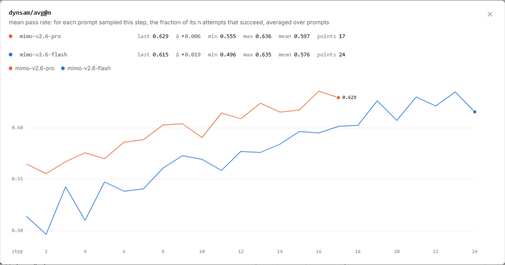
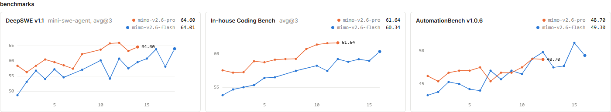
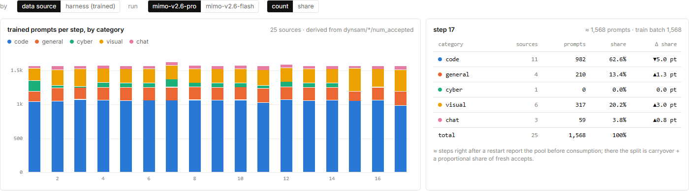
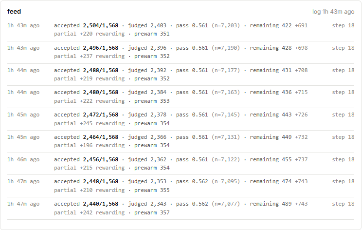
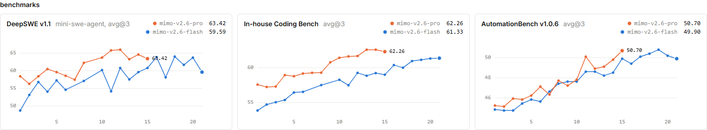

# 9 月 18 日回看 MiMo RL：新增评测、数据调整与日志新鲜度

第一次阅读建议先看[十一篇看图专题](../../../models/mimo-rl-series.md)。
这次在 **2026 年 9 月 18 日北京时间 13:56—14:11** 回到原站，比较昨天的固定图表，并检查采集器能否继续保存新数据。
最明显的变化有三处：评测从一组变成三组；Pro 的代码与视觉题配比发生变化；Pro 的实时采样日志长时间没有刷新。
文末另附 **17:19—17:21** 的再次观察：训练继续推进，AutomationBench 的协议旁注和部分历史分数也发生了变化。

## 训练又向前走了多少？

图 1｜[MiMo 原站 `dynsam/avg@n`](https://mimo.xiaomi.com/rl/#chart/dynsam%2Favg%40n)，
截于 **9 月 18 日北京时间 14:09:48**，step 横轴、线性刻度、平滑关闭。点击图片可放大。

把昨天专题使用的末点与今天的末点放在一起：

| 运行 | 昨天 16:05 的末点 | 今天完整采集的末点 | 成功率变化 |
|---|---|---|---:|
| Pro | 第 14 步，61.5234% | 第 17 步，62.9303% | +1.4069 个百分点 |
| Flash | 第 17 步，60.1257% | 第 24 步，61.5464% | +1.4207 个百分点 |

两条曲线都比昨天的末点高，但今天图中的最后一步仍在下降：
Pro 从第 16 步的 63.5523% 回落到 62.9303%；Flash 从第 23 步的 63.4844% 回落到 61.5464%。
因此，“相对昨天提高”与“最近一步回落”仍然同时成立。

这些是各自采样任务上的表现。下面的数据配比变化提醒我们，跨步差值还混合了训练题目的变化，不能直接全归因于模型参数改善。

## 评测卡片从一张变成三张

图 2｜[MiMo 原站 overview](https://mimo.xiaomi.com/rl/#overview)，截于 **9 月 18 日北京时间 14:09:48**。
下表的检查点关联另于 **14:10:59—14:11:00** 从评测接口读取，与截图末值相符。

| 评测与页面给出的协议 | Pro 最新已公布结果 | Flash 最新已公布结果 |
|---|---|---|
| DeepSWE v1.1；mini-swe-agent，avg@3 | 第 14 步：64.60 | 第 18 步：64.01 |
| In-house Coding Bench；avg@3 | 第 12 步：61.64 | 第 16 步：60.34 |
| AutomationBench v1.0.6；旁注为空 | 第 12 步：48.70 | 第 16 步：49.30 |

后两组是相对昨天材料新增的评测。它们扩展了观察维度，但具体题目、运行配置和分数含义仍需对应协议说明。
尤其是 AutomationBench 没有显示 `avg@3`，不能把旁边两张卡片的设置移过去。

### 最新结果可以低于先前最高结果

Pro 的 DeepSWE 第 12 步为 65.97，第 13 步为 63.27，第 14 步为 64.60。
这三点表示先下降再回升，最新的 64.60 仍低于先前的 65.97。
卡片右上角显示最新结果时，数字减少可能来自新增了一个较低分的检查点，并不表示旧检查点成绩被改写。

本次监督还直接看到了独立评测的异步发布：

| 读取时段，北京时间 | DeepSWE Pro 末点 | DeepSWE Flash 末点 |
|---|---|---|
| 约 13:58 | 第 12 步，65.97 | 第 16 步，63.86 |
| 14:07—14:08 完整快照内的评测响应 | 第 14 步，64.60 | 第 16 步，63.86 |
| 14:09 截图及 14:11 接口复核 | 第 14 步，64.60 | 第 18 步，64.01 |

这期间训练曲线仍停留在 Pro 第 17 步、Flash 第 24 步。
**训练版本、实时采样日志和评测发布是不同的更新节奏。** 定期保存材料时，三类接口都要分别读取，不能只检查训练步是否增加。

## Pro 的题目组成发生了什么变化？

图 3｜[MiMo 原站 data source 组成图](https://mimo.xiaomi.com/rl/#overview)，截于 **9 月 18 日北京时间 14:09:48**。
当前选择 Pro，第 17 步；图中 `≈` 表示重启后使用近似分配。

| 类别 | 昨天 Pro 第 14 步 | 今天 Pro 第 17 步的显示估算 |
|---|---:|---:|
| code | 1,061 题，67.7% | 982 题，62.6% |
| general | 190 题，12.1% | 210 题，13.4% |
| cyber | 64 题，4.1% | 0 题，0.0% |
| visual | 206 题，13.1% | 317 题，20.2% |
| chat | 47 题，3.0% | 59 题，3.8% |

页面仍能列出历史上的 25 个来源，而 Pro 当前第 18 步采样池只有 24 个来源 ID，已没有 `cyber/dataset-9aui`。
Flash 当前采样池仍保留该来源。历史目录存在，与当前任务池是否继续使用某来源，是两个需要分开看的事实。

原站公告还提到：Pro 的训练集群与评分服务曾有网络连接问题；团队在检查 rollout 日志后，决定从后续 Pro 运行移除 cyber 数据。
公告没有展开所谓不良行为的具体样本，因此可以确认这项调整，不能进一步替他们定义问题行为。

这是很有价值的训练过程信息：团队会查看模型产生的行为，再调整训练任务。
要理解采样成功率变化，也应同时看调整后的题目组成；图中的重启近似标记还限制了逐题精确比较。

## 模型、数据与系统指标并没有一起变化

下表仍比较昨天专题末点与今天完整采集末点：

| 指标 | Pro：第 14 → 17 步 | Flash：第 17 → 24 步 |
|---|---:|---:|
| 平均奖励 | 0.587569 → 0.588000 | 0.583729 → 0.595029 |
| 轨迹总长度均值 | 106,203 → 91,803.6 token | 108,308 → 128,499 token |
| Agent 轮数均值 | 59.49 → 43.90 | 52.59 → 59.86 |
| 平均策略版本差 | 1.21246 → 0.209416 | 0.836915 → 2.1832 |
| 基础设施错误率 | 0.6170% → 0.4368% | 3.0355% → 0.7123% |

Pro 的平均采样成功率提高了，平均奖励却几乎持平，轨迹和交互变短。
Flash 的轨迹更长、版本差更大，基础设施错误率则比昨天末点低。
这些同时发生的变化，适合继续结合任务类别、样本内容和调度记录分析，不能用一条“所有指标都变好”的叙述概括。

本次公告另提到，Pro 在第 17 步因专家负载不均出现显存不足，并调整了训练并行策略。
对使用专家路由的系统，负载偏斜可能让部分设备承受更多工作；因此总资源充足时，局部设备也可能先遇到容量问题。
公告给出了这次排查方向，公开页面没有提供完整模型架构、路由策略或具体并行参数。

## `in progress` 旁边，日志却已经过时

图 4｜[MiMo 原站 Pro 采样日志](https://mimo.xiaomi.com/rl/#overview)，截于 **9 月 18 日北京时间 14:09:48**。

日志右上角是 **1h 43m ago**，而运行状态仍是 `in progress`。
这说明当时能看到的最新采样记录已经较旧。究竟是采样暂停、记录停止上报，还是页面服务滞后，需要运行方进一步确认。

在稍早的完整快照中，用服务端 `status.clock.now` 减去 `live.log_time`：
Pro 相差约 **6,107 秒（101.8 分钟）**，Flash 相差约 **16 秒**。
这两个接口陆续读取，时间差是当次观测的近似年龄，不能当成两条运行完全同步的时钟测量。

由此，采集检查要分别回答三件事：请求是否成功、目录是否完整、原站观测有多新。
取得完整文件时，里面仍然可能是较旧的运行日志；增加访问频率也不能让原站更快产生新数据。

## 17:21 再看：同一检查点的成绩也会修订 {#later-review}

图 5｜[MiMo 原站 overview](https://mimo.xiaomi.com/rl/#overview)，截于 **北京时间 17:21:30**。
检查点对应关系取自稍早 **17:19:30—17:20:47** 的完整记录，截图末值与其一致。

| 最新公布的评测 | Pro 第 15 步 | Flash 第 21 步 |
|---|---:|---:|
| DeepSWE v1.1；mini-swe-agent，avg@3 | 63.42 | 59.59 |
| In-house Coding Bench；avg@3 | 62.26 | 61.33 |
| AutomationBench v1.0.6；avg@3 | 50.70 | 49.90 |

与图 2 相比，AutomationBench 现在明确显示 `avg@3`。再对齐同一个检查点，还能发现旧成绩的修订：

| AutomationBench 的同一个检查点 | 14:07—14:08 记录，旁注为空 | 17:19—17:20 记录，旁注为 avg@3 |
|---|---:|---:|
| Pro 第 12 步 | 48.70 | 48.90 |
| Flash 第 16 步 | 49.30 | 49.40 |

这些变化发生在**同一个检查点**上，不能解释成模型又训练了几步。
公开材料显示评分记录与协议旁注一起更新，但没有交代历史分数的具体重算过程。
比较时要保留“哪个模型检查点、哪个评测协议、哪次发布记录”三个信息，不能把两次记录直接拼成一条口径不变的曲线。

训练曲线此时已推进到 Pro 第 18 步（成功率 61.7368%）和 Flash 第 25 步（64.0833%）。
Pro 最新采样日志属于第 19 步，其时间戳比早先记录前进了；新快照里日志仍旧约 110.6 分钟，Flash 约 3.2 秒。
这说明两次查看之间出现了新进展，同时再次提醒我们：看到一条旧日志，不能据此判断整个时段都没有训练。

### 用新画面检查自己的读图方法

为什么 Pro 的 AutomationBench 第 12 步从 48.70 变为 48.90，不能写成“训练使分数提高了 0.20”？

??? success "展开思路"

	两个分数对应同一个检查点，变化来自两次公布的评测记录；旁注也从空白变为 avg@3。
	当前材料没有交代具体重算方式。应描述同检查点评测记录的修订，另用不同检查点、可比协议的结果分析训练进展。

## 固定材料入口

- [本次完整数值](../snapshots/2026-09-18T06-07-28-636152Z/facts.json.gz)与[离线曲线查看器](../snapshots/2026-09-18T06-07-28-636152Z/viewer.html)。
- [17:19 再次观察的数值](../snapshots/2026-09-18T09-19-30-038024Z/facts.json.gz)与[独立查看器](../snapshots/2026-09-18T09-19-30-038024Z/viewer.html)，保留修订后的评测旁注和成绩。
- [四张图各自的来源与时间](../figures/2026-09-18-review/figure-index.json)。图片为逐图分析所需的原站局部引用，权利归原站权利人。
- [第五张图的来源与时间](../figures/2026-09-18-publish-review/figure-index.json)。
- [材料维护与引用范围](../../mimo-rl-controls.md#supervised-2026-09-18)。

继续学习可回到[数据配比](../../../models/mimo-rl-data-mix.md)、[评测](../../../models/mimo-rl-evaluation.md)
和[训练推理一致性](../../../models/mimo-rl-consistency.md)，用新画面检查昨天学到的读图方法。