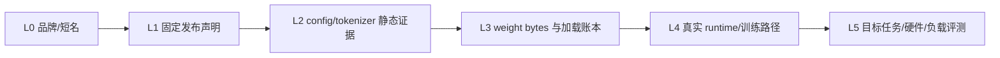

# Qwen Checkpoint、训练与服务证据台账

本页保留固定 revision、文件 hash、运行报告、训练验证和作品集 claim 的精确边界，供复核与维护使用。
第一次学习请从[Qwen 模型家族](../models/qwen.md)开始，不要把逐项验证记录当作课程顺序。

**证据导航**：[Qwen 教材](../models/qwen.md) · [模型选型](../models/landscape.md) · [Transformers 项目](../practice/projects/transformers-basics.md) · [单卡微调项目](../practice/projects/single-gpu-finetuning.md)
{ .doc-nav }

<!-- learning-contract -->
<div class="learning-contract" markdown="1">

**学习导航**

- **适合读者**：中文、多语言、工具调用、模型训练和推理服务工程师。
- **先修**：Transformer、tokenizer、MoE、RAG 与 LoRA 基础。
- **首次阅读**：证据阶梯 → checkpoint inventory → 固定 config/weights → tokenizer/template → runtime → 训练/服务。
- **完成信号**：能对账 checkpoint、chat template、真实运行报告和目标任务，同时拒绝跨实验拼接结论。
- **卡住时**：回到[Tokenization](../core/tokenization.md)和[模型选型](../models/landscape.md)。

</div>

## 学习目标与证据边界

读完本章应能为中文/中英混合任务选择并检查 Qwen checkpoint，解释 dense/MoE、Base/Instruct、文本/代码/多模态版本的边界，并能验证 tokenizer、chat template 与 tool calling 是否和部署 runtime 一致。

**先修知识**：decoder-only Transformer、MoE、tokenization、RAG、LoRA/QLoRA、Transformers chat template。

Qwen 家族覆盖多语言、代码、数学、视觉、音频、dense 与 MoE 等多条路线，不能用一个架构描述所有 Qwen checkpoint。本文讲稳定检查方法；具体层数、head、专家数、上下文、thinking/tool 模式和许可都以固定 revision 的 config、model card 与官方仓库为准。

本章的主要可执行对象不是“整个 Qwen 家族”，而是固定的 `Qwen/Qwen2.5-0.5B-Instruct` revision `7ae557604adf67be50417f59c2c2f167def9a775`。其他代际、尺寸、Base/Instruct、MoE、多模态或云端产品只提供检查框架，不能继承这个 checkpoint 的实验结果。

## L0 标签与 L1–L5 证据阶梯

把“我用过 Qwen”改写成可审计结论，至少要分清以下层级：



L0 不是实质证据；L1–L5 才是五级证据强度：

| 层级 | 当前仓库的 Qwen 证据 | 能证明 | 不能证明 |
|---|---|---|---|
| L1 | immutable revision URL 与来源台账 | 审阅对象的发布 identity | 发布者签名、当前 alias 行为 |
| L2 | 659-byte `config.json`、strict semantic snapshot | 固定字段和保守静态推导 | weight 匹配、真实执行 |
| L3 | 7 个选定文件、999,586,347 bytes、逐文件 hash | loader 候选 bytes 的 identity | forward 正确、总体质量 |
| L4 | CPU FP32 forward/cache/generate、hook、HTTP、RAG、SFT/LoRA/DPO controls | 指定环境、输入和路径确实执行 | 代表性质量、GPU、生产可靠性 |
| L5 | **尚未取得** | 需要目标任务/硬件/负载的统计证据 | 不能从单样本或 recorded report 外推 |

### 证据不可拼接原则

仓库中存在多条共享 checkpoint identity 的 Qwen control，但共享 identity 不等于共享执行：

- target-checkpoint control 执行 prefill/cache/generate，没有训练；
- activation patching 执行 10 次 forward 与 hooks，没有 backward；
- loopback service 执行真实 HTTP，但 SSE 在 generation 完成后才发送；
- RAG control 只覆盖两条 authored case，原始行为门禁为 0/2；
- behavior-evaluation control 真实执行七次 `GenerationMixin.generate()`，但 suite 是 authored 小集，不是外部预注册、独立留出或代表性 benchmark；
- SFT final-label control 只执行 no-grad forward；
- LoRA 与 DPO 各自执行一次不同的 backward/optimizer step；
- 所有这些都没有执行 CUDA、vLLM 或代表性线上 workload。

因此不能把它们拼成“Qwen 已完成 GPU 微调、RAG 质量提升、增量流式服务和生产部署”。每条结论必须回指真正执行它的 report、scope 与失败分母。

## Checkpoint inventory：先把对象限定完整

“Qwen 模型”至少要补全：

```text
family / generation / modality
model id + immutable revision
Base / Instruct / reasoning variant
dense / MoE / multimodal architecture
config + tokenizer + processor + template
weight shards + index + generation config
runtime + dtype/quantization + device
adapter + training/evaluation identity
license / acceptable-use / redistribution review
```

### 三种常被混写的对象

| 对象 | 主要证据 | 典型错误 |
|---|---|---|
| 本地开放权重 checkpoint | immutable files、loader、runtime | 用云 API 名称代替 weight identity |
| 云端 Qwen API 产品 | 官方 catalog、endpoint、request/response contract | 从本地 config 推断 provider 路由/计费 |
| 基于 Qwen 的 adapter/system | base + adapter + template + data/eval manifest | 只写 adapter 文件名，不绑定基座 |

同一品牌下的三个对象可能在模板、策略、量化、上下文、版本和安全层上完全不同。模型选型表必须分别建行，不能用一个 `qwen-latest` alias 合并。

### 最小发布 manifest

```json
{
  "model_id": "Qwen/Qwen2.5-0.5B-Instruct",
  "revision": "<full-immutable-commit>",
  "files": [{"path": "...", "bytes": 0, "sha256": "sha256:..."}],
  "tokenizer_revision": "<full-immutable-commit>",
  "template_sha256": "sha256:...",
  "runtime": {"name": "transformers", "version": "..."},
  "dtype_or_quantization": "...",
  "adapter_manifest": null,
  "evaluation_manifest": "sha256:...",
  "license_review_id": "..."
}
```

Unsigned JSON 和无密钥 SHA-256 只能建立自洽 identity，不能认证发布者或执行者。生产 provenance 还需要受控发布流程、签名/透明日志、可信 head、不可变存储与密钥治理。

### 候选模型的五个限定

“Qwen 模型”至少还缺五个限定：

1. **代际与 checkpoint**：不同公开代际配置和模板不同；
2. **Base 或 Instruct**：续写基座和对话后训练模型不是同一接口；
3. **dense 或 MoE**：总参数、激活参数、加载内存与每 token 计算的含义不同；
4. **文本/代码/视觉/音频**：processor、输入模态和生成头可能不同；
5. **本地权重或云 API**：provider 端模型、路由、配额和协议不能由本地 model card 推断。

检查 checkpoint 时记录：

```text
model id + commit hash
model_type / architectures
hidden_size / intermediate_size / num_hidden_layers
num_attention_heads / num_key_value_heads
dense or MoE: total params / active params / experts / top-k
rope and max position configuration
tokenizer files / special tokens / chat template
generation config / tool template / license
recommended Transformers/runtime versions
```

若 config 使用模型专有字段，不要按字段名猜公式；先查同 revision 的官方实现和技术报告。

可用 `inspect_checkpoint.py <model-id> --revision <commit-hash>` 保存 normalized config/generation snapshots、resolved metadata、模板直接生成的 token IDs，并比较 tokenizer/model/generation 三方 special-token IDs。snapshot 可能含库默认值/metadata，不是原始 JSON byte hash；generation config 加载失败也不能仅凭 `OSError` 区分文件缺失、认证或网络问题。完整 commit hash 才是预期的不可变输入；脚本参数必填不等于 branch/tag 不会移动。脚本不加载权重或 processor，也不证明有效 runtime defaults、许可、质量与支持矩阵。

## 固定 Qwen2.5-0.5B-Instruct config

仓库的 release-evidence manifest 固定：

| 字段 | 固定值 |
|---|---|
| model id | `Qwen/Qwen2.5-0.5B-Instruct` |
| revision | `7ae557604adf67be50417f59c2c2f167def9a775` |
| upstream `config.json` bytes | 659 |
| upstream SHA-256 | `18e18afcaccafade98daf13a54092927904649e1dd4eba8299ab717d5d94ff45` |
| local semantic fingerprint | `sha256:ee6f9831a4c4729cf094af9a76a53dfe1dde8e34a8251889f527d2179c7d918d` |
| manifest checked_at | `2026-08-13` |

默认执行：

```powershell
python projects/transformers-basics/verify_release_evidence.py
```

默认 verifier 完全离线，所以报告中的 `upstream_verified=false` 是范围声明。只有显式 `--verify-upstream` 才会重新获取 immutable URL 并核对原始 bytes；成功也不等于发布者签名。

### 原始字段、静态推导和运行事实要分开

固定 semantic snapshot 包含：

| 类别 | config 字段 |
|---|---|
| loader | `model_type=qwen2`、`architectures=[Qwen2ForCausalLM]` |
| 主干 | `hidden_size=896`、`intermediate_size=4864`、`num_hidden_layers=24` |
| attention | `num_attention_heads=14`、`num_key_value_heads=2` |
| position | `max_position_embeddings=32768`、`rope_theta=1000000.0` |
| window | `use_sliding_window=false`、`sliding_window=32768`、`max_window_layers=21` |
| norm/activation | `rms_norm_eps=1e-6`、`hidden_act=silu` |
| vocabulary | `vocab_size=151936`、`tie_word_embeddings=true` |
| tokens | `bos_token_id=151643`、`eos_token_id=151645` |
| metadata/default | `torch_dtype=bfloat16`、`use_cache=true`、`transformers_version=4.43.1` |

这里必须做三次隔离：

1. **原始字段**：只说明固定 JSON 写了什么；
2. **保守推导**：只在标准 attention contract 完整、自洽时计算；
3. **运行事实**：由实际 loader/model/runtime report 给出，不能从 config 默认值代替。

例如 config 写 `torch_dtype=bfloat16`，而仓库 target control 明确强制 CPU FP32。前者是发布配置字段，后者才是这次执行的 dtype。把两者合并成“模型以 BF16 跑过”是错误结论。

同理，`use_sliding_window=false` 表示这份固定 config 没有启用 sliding-window 路径；不能因为同时出现 `sliding_window` 与 `max_window_layers` 字段就宣称执行过窗口注意力。

### GQA 静态推导

在该标准 config contract 下：

\[
d_h=\frac{d}{H_q}=\frac{896}{14}=64,
\]

\[
g=\frac{H_q}{H_{kv}}=\frac{14}{2}=7.
\]

因此每个 KV head 对应 7 个 query heads，检查器把 attention 分类为 GQA。这个结论仍依赖“字段采用标准语义”的 contract；如果 remote/custom code 改写 shape 或 cache layout，必须停止套公式并审阅实现与实际 tensor shape。

### KV Cache 的精确算术和严格边界

标准 dense K/V 理想 payload：

\[
M_{KV}=2LBTH_{kv}d_hs.
\]

对 `L=24`、`B=1`、`T=32768`、`Hkv=2`、`dh=64`、`s=2`：

\[
M_{KV}=2\times24\times1\times32768\times2\times64\times2
=402{,}653{,}184\ \text{bytes}=384\ \text{MiB}.
\]

每 token、每层的 K/V payload 是 `512 bytes`；全部 24 层每 token 是 `12,288 bytes`。公式不包含：

- page/block 对齐与内部碎片；
- allocator metadata 和 runtime reserve；
- prefix sharing、copy-on-write 与引用计数；
- 量化 scale/zero、dequant workspace；
- model weights、activations、logits 和 temporary tensors；
- beam/best-of-N/并发产生的多 sequence 状态。

所以 402,653,184 bytes 不是 GPU 峰值，也不证明 32,768-token 请求能成功，更不证明长上下文任务有效。

### `vocab_size` 与 tokenizer size 不要求字面相等

固定 config 的 `vocab_size=151936`；目标运行报告中的 tokenizer `vocabulary_size_with_added_tokens=151665`。这两个值属于不同对象和口径。正确 gate 是：

- 所有实际 input/output/special token ID 都在 embedding/logit 维度内；
- model、tokenizer、template 和 generation config identity 被分别固定；
- 不擅自把 271 的差解释成“坏文件”或特定类型 reserved token；
- 如果更换 tokenizer，重新运行 template/token-ID 与 logits control。

实际 prefill logits 的最后一维是 151,936，与 model config vocabulary dimension 一致；这仍只证明固定执行 case，不证明所有 tokenizer 行为。

## 中文与多语言 tokenizer

中文“字符数”、UTF-8 字节数与 token 数不是固定比例。数字、空格、标点、繁简体、罕见字、中英混排、代码和 JSON 会显著改变切分。成本和上下文预算必须用目标 tokenizer 实测。

至少建立以下 tokenizer 回归集：

- 中文新闻、口语、古文与繁体；
- 产品型号、日期、金额、电话号码和长数字；
- 中英混合术语、URL、Markdown、LaTeX；
- Python/SQL/JSON，尤其缩进、引号和转义；
- emoji、组合字符、罕见 Unicode 与恶意控制字符；
- system/user/assistant/tool 多轮模板。

报告 `tokens/汉字`、`tokens/byte`、p50/p95 序列长度和截断率。不能只用一段中文示例断言“某 tokenizer 更适合中文”；序列更短也不自动等于任务质量更高。

### Tokenizer/template 是可执行输入协议

固定 checkpoint control 审计的 7 个文件包括：

| 文件 | bytes | SHA-256 前缀 | 作用 |
|---|---:|---|---|
| `config.json` | 659 | `18e18afc…` | model config |
| `generation_config.json` | 242 | `e558847a…` | generation defaults |
| `merges.txt` | 1,671,839 | `599bab54…` | tokenizer merges |
| `model.safetensors` | 988,097,824 | `fdf756fa…` | weights |
| `tokenizer.json` | 7,031,645 | `c0382117…` | tokenizer graph/data |
| `tokenizer_config.json` | 7,305 | `5b5d4f65…` | template/tokenizer config |
| `vocab.json` | 2,776,833 | `ca10d7e9…` | vocabulary |

合计 999,586,347 bytes。它是**选定执行文件账本**，不是整个远端仓库镜像；未在 manifest 中的 README、license 或其他文件没有因此被绑定。

目标 CPU report 还记录：

- tokenizer class：`Qwen2TokenizerFast`；
- chat-template fingerprint：`sha256:a73bb899d5ba2d192113fd053fc16ef0f633e783bdf6b18e3793295cb49f8bdd`；
- EOS token ID：151,645；
- PAD token ID：151,643；
- prompt token count：31；
- prompt token-ID fingerprint：`sha256:cc7ce3462c0ee498e88a37fd2f8fc8c3cc2050cc6c80a25912eeebbcf989f612`。

Template 回归至少要保存：

```text
messages JSON
tools / tool_choice / parallel-call policy
add_generation_prompt / continue_final_message
rendered text bytes
input token IDs + attention mask
assistant spans / training labels
BOS/EOS/PAD/turn-boundary positions
template + tokenizer + model revisions
```

只保存最终 prompt 文本不够，因为相同可见文本可能通过不同 special-token 路径产生不同 token IDs；只保存 token IDs 也不够，因为无法审计角色、工具和数据来源。

### Chat template 与 SFT assistant mask 不是同一保证

Transformers 能成功 `apply_chat_template()`，不表示模板提供训练所需的 assistant-generation mask。仓库的 target SFT control 在三条固定工具对话上观察到：checkpoint 原生模板能生成相同 input IDs，但原生模板没有 `` marker，返回全零 assistant mask。

仓库随后使用独立审核的 generation-aware template：

- 仍与原生模板逐 token 生成相同的 47 / 301 / 200 个 input IDs；
- 独立保存的 assistant serialization 对应 8 / 51 / 31 个监督 token；
- 覆盖 multi-turn、parallel tool calls、tool preamble 与 `system/user/assistant/tool` roles；
- 在 Arrow Dataset 构造前完成 tokenization/mask，避免异构 nested arguments 被 Arrow struct 扩展并插入 `null` 后改变模板输入。

最终真实 TRL 0.29.1 collator batch 为 `[3,301]`，包含 548 个 attention tokens、355 个 padding tokens、90 个监督 labels 和 813 个 `-100`。CPU FP32 no-grad forward loss 为 1.251716136932373。

这条证据只证明固定模板/记录/collator/forward 的标签路径；它**不执行 backward**，不证明数据合法、工具结果真实、任意 provider schema、多模态、收敛、质量或安全。

## 架构检查：dense、GQA 与 MoE

公开 Qwen 文本 checkpoint 常属于 decoder-only causal Transformer，但具体 norm、MLP、RoPE、bias、weight tying 和 attention 结构随代际/版本变化。像 Llama 一样，先从 config 计算 KV Cache；`num_key_value_heads` 不等于 `num_attention_heads` 时通常意味着 GQA/MQA 形式。

MoE 版本需要同时报告：

- 总参数与每 token 激活参数；
- routed/shared experts（若该 checkpoint 存在）；
- 每 token 选择专家数与路由规则；
- router/负载均衡损失；
- 单卡是否需要容纳全部专家权重；
- expert parallel 的 all-to-all 与负载分布。

“激活参数像小模型”只描述部分计算，不代表加载显存、通信或实际 tokens/s 与同规模 dense 模型相同。

仓库的 `moe_routing.py` 是通用 CPU 教学 fixture：固定 top-k/capacity/tie-break，区分 assignment drop 与整 token drop，并执行线性 expert combine。`moe_training_control.py` 另用 PyTorch CPU Float64 在同一训练图真正执行 top-2 router/三组 MLP experts 与 score-priority capacity/drop，对齐 sparse—dense forward/backward，并用 detached-gate、collapsed-router balance、两种 post-drop policy、全丢 token、padding 与两个 CPU-local routing groups 拆出梯度和 overflow 语义。Padding 不进 capacity/output/aux/gradient；逐组 aux 按 active-token 数加权。v3 独立 fixture 又执行 deterministic full-ranking reroute 和 dropless nominal-capacity-excess policy：reroute 将两个 overflow slots 从 expert 0 改派到 expert 2、满足当前 group capacity；dropless 保留四个 expert-0 assignments 并报告超额 2。两者 sparse—dense output 与 materialized-zero gradient 差均为 0。

这些 fixtures 使用不同输入，且不读取任何 Qwen config/weight；int64 group label 不等于 distributed collective，authored reroute/dropless 也不是 Qwen 默认策略。它们仍未实现特定 Qwen MoE 的 routed/shared/fine-grained experts、auxiliary loss、expert-parallel/all-to-all/GPU kernel、目标 checkpoint、收敛、质量或性能；学习具体 checkpoint 时必须重新从固定 revision 的 config、weight 与官方实现建立契约。

仓库另有 two-process CPU/Gloo capacity-group control：真实 `all_gather` 将两 rank 的 2+2 tokens 组成 replicated global routing batch，两个 `all_reduce` 得到 active count=4 与 selected counts `[4,0]`；local-only 总计 kept=2，而 global capacity=1 只 kept=1。它没有读取 Qwen，也没有 expert ownership/`all_to_all`/distributed backward，所以只能证明 authored collective-capacity 反事实，不能升级为 Qwen MoE 或 expert-parallel 证据。

另一条 two-process CPU/Gloo fixture 才执行 owner-only expert placement 与 variable-split token dispatch/return：source→owner counts `[[1,2],[1,0]]`，owner forward 后按 source metadata 返回并 scatter，四个输出与单进程 oracle 一致。它不是 Qwen checkpoint，没有读取 Qwen config/weight，也不含 capacity、backward、CUDA/NCCL 或性能；这不能证明 Qwen MoE runtime、具体专家布局、router/gate 归一化或训练语义。

第三条独立 fixture 再执行 authored all-to-all backward + router-gradient all-reduce、owner expert gradient 与一步 SGD；global mean loss 和单进程 oracle 精确对齐。它不是 Qwen MoE training，仍不读取 Qwen config/weight、不含 capacity/shared experts/CUDA/NCCL，也不证明 Qwen optimizer、训练稳定性、收敛、质量或性能。

第四条 capacity-aware all-to-all training control 在另一张 two-process CPU/Gloo 图中加入 global score-priority drop、kept-only dispatch、zero-assignment source backward 与一步 SGD；keep mask `[F,T,T,F]`，dropped token output/hidden task gradient 为零，并与单进程 capacity oracle 对齐。它仍不是 Qwen MoE training：不读取 Qwen config/weight，也不证明 Qwen 的 capacity、shared expert、router、optimizer、CUDA/NCCL、训练稳定性、收敛、质量或性能。

同目录 `configs/moe-gqa.example.json` 也只是 `authored_moe_gqa` 公式 fixture：它证明本仓库检查器能同时报告 MoE markers，并仍按显式标准 GQA 字段计算理想 K/V payload；它不对应任何 Qwen 代际，不能证明专家总数、激活参数或 routing 语义。若出现已知 MLA marker，检查器会 fail closed；“没有命中当前 marker 列表”也不等于已经证明该架构不是其他 latent/proprietary attention。

为了把“通用 fixture”与“发布 checkpoint 证据”分开，release-evidence control 固定 `Qwen/Qwen2.5-0.5B-Instruct` 的不可变 revision `7ae5576…9a775`，同时绑定上游 `config.json` 原始 659 bytes 的 SHA-256 和本地 strict-JSON semantic snapshot。当前固定配置显式给出 24 层、14 query heads、2 KV heads、hidden size 896，因此标准检查器推得 head dim 64、每个 KV head 组对应 7 个 query heads。32,768 tokens、batch 1、2-byte K/V element 的理想 dense payload 为：

\[
2\times 2\times 64\times 24\times 32768\times 2
=402{,}653{,}184\ \text{bytes}.
\]

```powershell
python projects/transformers-basics/verify_release_evidence.py --verify-upstream
```

这个 402,653,184 bytes 是 config-level ideal tensor payload，不含 allocator/block 对齐、workspace、量化 scale、权重和其他请求，也不证明 32,768 是有效任务上下文或目标 runtime 使用同一 cache layout。Control 不下载权重/tokenizer、不执行 remote code/forward，也不从 config 推断准确参数量、质量、许可或单卡可运行性。

### 固定权重的 CPU 执行控制

为了把“config 可解析”与“目标权重真的进入 forward”分开，仓库还固定同一 revision 的 7 个执行文件。`model.safetensors` 的 immutable URL、988,097,824-byte 长度与 SHA-256 `fdf756fa…b7fe` 被写入 manifest；全部选定文件合计 999,586,347 bytes。运行器在加载前重哈希实际文件，从已验证本地 snapshot 以 `trust_remote_code=False` 加载，并强制 CPU FP32 eager：

```powershell
python projects/transformers-basics/run_target_checkpoint.py
# cache 已准备好时可禁止网络
python projects/transformers-basics/run_target_checkpoint.py --local-files-only
```

2026-08-13 的录制报告确实执行 `Qwen2ForCausalLM`、目标 tokenizer/chat template、prefill、KV-cache 第二步、full recompute 与框架 `generate()`。它记录 494,032,768 个冻结参数、1,976,131,072-byte 参数存储、31-token prompt、`[1,31,151936]` logits，以及 `[17,151645]` → `2<|im_end|>`；manual prefill/cache argmax 与 `generate()` 一致，cached/full max absolute error 为 `3.719329833984375e-05 ≤ 1e-4`。报告 fingerprint 为 `sha256:56528a3e…dba62`；v1 固定恰好两 token，nested closed-schema 会在协同重算 self-hash 后继续拒绝 runtime、冻结状态、shape 和 scope 漂移。

这比 config evidence 多证明了“一组固定 bytes 在该 CPU/库版本/单 prompt 上通过指定执行路径”，但 verifier 与 loader 分次按路径打开文件，没有消除 verify-load TOCTOU；它仍不是来源签名、训练复现、质量基准、32k 有效上下文、许可判断、显存峰值、CUDA/vLLM 等价或生产性能。参数存储 bytes 也不能当作进程峰值内存。release-evidence 命令仍只核对 config；两类报告不可互相冒充。

## 固定权重执行：观察值与边界

Target-checkpoint report 的完整身份：

| 项目 | 值 |
|---|---|
| checkpoint manifest | `sha256:ddf41f2cff963bc2a8fc186c28369abba8a920b850152fc815e2b17c7d037876` |
| recorded report | `sha256:56528a3e02ed6ef9d205dcf83ba456658d639d7681ab6a1ad9eb110211edba62` |
| checked_at | `2026-08-13` |
| runtime | Windows / CPython 3.12.10 / PyTorch 2.13.0+cpu / Transformers 4.57.6 |
| device/dtype/attention | CPU / FP32 / eager |
| model class | `Qwen2ForCausalLM` |
| total/trainable params | 494,032,768 / 0 |
| parameter storage | 1,976,131,072 bytes |

### Prefill、cache、full recompute 与 generate

固定执行链：

1. 对 31-token chat-template prompt 执行 full prefill；
2. 得到 `[1,31,151936]` logits；
3. 保存最后位置 logits fingerprint；
4. 以真实 `past_key_values` 执行第二步；
5. 对同一扩展序列执行 full recompute；
6. 比较 cached/full argmax 与最大绝对差；
7. 调用框架 `GenerationMixin.generate()` 做 greedy 终止对照。

结果：

- generated token IDs：`[17,151645]`；
- decoded continuation：`2<|im_end|>`；
- EOS token ID：151,645；
- manual prefill argmax 与 generate 一致；
- manual cached argmax 与 generate 一致；
- cached/full argmax 一致；
- cached/full max absolute error：`3.719329833984375e-05`；
- tolerance：`1e-4`。

这个 tolerance 是该 fixed control 的验收阈值，不是所有 dtype、kernel、序列长度和设备的通用数值保证。Argmax 一致也不等于完整 logits bitwise equal。

### 真实权重仍未证明的事项

- publisher signature / provenance authentication；
- manifest 外全部仓库文件；
- verify 后 loader reopen 的 TOCTOU 消除；
- 训练复现、中文总体质量或知识正确性；
- 32k effective context；
- license compatibility；
- CUDA、vLLM、FlashAttention 或量化 runtime；
- peak memory、throughput、TTFT/TPOT、并发或 SLO；
- production safety。

“加载了真实权重”只能把证据提升到这个固定执行路径，不能把所有未知项自动变成 true。

## 固定 Qwen 单矩阵量化：真实权重不等于完整低位 checkpoint

为了跨过“随机 tiny weight quantization”但不越过证据边界，仓库在同一 immutable snapshot 上增加一个 selected-matrix control：第一层 `model.layers.0.self_attn.o_proj.weight` 是 bias-free `[896,896]` FP32 Linear，含 802,816 参数，占全模型 `0.0016250258120530175`。

```powershell
python projects/transformers-basics/run_qwen_weight_quantization_control.py `
  --local-files-only
python projects/transformers-basics/run_qwen_weight_quantization_control.py `
  --verify projects/transformers-basics/target-checkpoints/qwen2.5-0.5b-instruct.weight-int4.recorded-report.json
```

Quantizer 使用每个 contiguous row group 128 weights 一个 FP32 absmax scale，4-bit 对称 code range `[-7,7]`，不用 `-8`。所以这里的“INT4”不等于 NF4，也不等于 GPTQ/AWQ/SmoothQuant 或特定 GPU runtime layout。

| 观察项 | 值 |
|---|---:|
| selected FP32 weight | 3,211,264 bytes |
| ideal packed codes | 401,408 bytes |
| FP32 scales | 25,088 bytes |
| strict one-tensor bundle | 427,328 bytes |
| selected-matrix serialized ratio | 7.514752134192002× |
| weight relative-L2 / max-abs | 0.1323337087 / 0.0400739387 |
| real `o_proj` output relative-L2 / max-abs | 0.0700015308 / 0.0109238923 |
| full-model last logits relative-L2 / max-abs | 0.08513807180570929 / 1.6255179643630981 |
| last argmax token | 17 → 17 |

运行先捕获 31-token target forward 中的 `[1,31,896]` activation；再 strict reload packed artifact，确认 codes/scales 与 selected-layer output round-trip；最后仅用反量化 FP32 值临时替换该矩阵，执行第二次完整模型 forward，并恢复原 weight。Artifact/report fingerprints 分别为 `sha256:006cc9a2abdd62b8513926fe822f892b58fc309ab4141fd7a3d6a1acac470bf7` 与 `sha256:df9ee045be4bf2e2ab4441bacfe24ffd1f903e9a0715bda0f35219ac3928f5cb`。

Argmax 仍为 17 是单提示观测，不是“INT4 无损”：末位 logits 已有 8.51% relative-L2 与 1.6255 max-abs 变化。更不能把 7.5148× 写成 Qwen checkpoint、RAM/VRAM 或速度提升：artifact 只覆盖 0.1625% 参数，其余 weight 仍是 FP32；没有完整 low-bit checkpoint/loader、fused kernel、calibration、generation、GPU/CUDA/vLLM、resident/peak memory、latency/throughput 或代表性质量评测。

## Activation patching：干预证据不是可解释性故事

独立 control 复用同一 7-file checkpoint，但有自己的 protocol 和 report：

| 项目 | 值 |
|---|---|
| protocol | `sha256:e34b2bfe2999fe52acb18e8f1908d89db286db042be67ad4f2343d7b83ed6702` |
| report | `sha256:3f8410f5c31666b1be4f83e343a5b849a0545b2f635f7d415da85a195eebb18c` |
| intervention | position 19 的 ` France` ↔ ` Germany` |
| readout | position 25 的 `logit(Paris)-logit(Berlin)` |
| model | 24 layers、hidden size 896、CPU FP32 eager |

Clean/corrupt baseline：

- top token：`Paris` / `Berlin`；
- metric：9.210310935974121 / -7.7003021240234375；
- clean-minus-corrupt gap：16.91061305999756。

Authored protocol 预先选 layer 0/11/23；source-position normalized recovery 分别为：

| condition | recovery |
|---|---:|
| layer 0 source position | 1.0000241370674128 |
| layer 11 source position | 0.9922442752431005 |
| layer 23 source position | 0.0 |
| full-prefix first-layer positive control | 1.0 |
| readout-position final-layer positive control | 1.0 |
| future-position first-layer negative control | 0.0 |

Recovery 不裁剪到 `[0,1]`，因此 1.000024… 不是“超过 100% 的因果正确率”。Final-layer source-position recovery 为 0 是 hook 之后没有机会再跨 position 混合到过去 readout 的结构结果，不证明最后一层不存储事实。

Control 实际执行 10 次 forward、真实 hooks、无 backward；结束后 hook count 为 0。它不是外部可信时间戳 preregistration，也不证明唯一/自然 circuit、head/MLP/feature 定位、总体事实性、CUDA 性能或生产安全。

## 推理服务：HTTP/SSE 契约与模型执行分开

Target service control 在独立 subprocess 启动真实 IPv4 loopback TCP/HTTP：

| 身份 | 值 |
|---|---|
| service manifest | `sha256:cfb9b5409c1ccec7267d85e5adca2ae8f8e9e80c0ff4301f0414f659728fb4ea` |
| report | `sha256:63e566ca60126c09c0f97f23b591e879d6efe7991b646f72bcc96ec493617ddb` |
| endpoint | `/v1/chat/completions` |
| network | HTTP、IPv4 loopback、无 TLS |

它真实覆盖：

- models endpoint；
- non-stream chat；
- SSE chat；
- unauthorized → 401；
- unknown field → 422；
- wrong model → 404；
- `[DONE]` 与 stream usage；
- non-stream/stream content 和 usage 对账；
- 两次真实 `GenerationMixin.generate()`。

但是 `generation_completed_before_sse_emission=true`：两条 content delta 是 generation 完成后的分块，不是 incremental model decoding。它没有证明客户端断连能取消 generation、释放 KV/GPU 或停止计费，也没有执行 vLLM、CUDA、TLS、OAuth/JWT/IAM、多 worker、远程网络、容量/性能或完整 OpenAI API compatibility。

## Qwen RAG：忠实记录失败，再验证发布策略

### 原始 attempt：行为门禁 0/2

Real-weight RAG control 固定同一 checkpoint、四条 authored corpus、两条 query、ACL-before-score BM25、384-token 总预算和 64-token 输出预留。

| case | 真实观察 | gate |
|---|---|---|
| answerable citation | 209-token prompt；复述授权证据，EOS 结束，但没有 `[S1]` | citation syntax fail |
| empty evidence | retrieval/context 为空；115-token prompt；仍生成 64 tokens，未 EOS | exact abstention fail |

总体 `expected_behavior_gate_passed_count=0/2`。报告 `sha256:829663e216828ad418ddf9a6c38ee487fe44b38d3939072d0ce443e8e8ee5b60` 保留失败，没有修补 output。

两个失败证明固定 authored cases 上发生了什么，不证明 Qwen 总体 RAG 质量为零；同样也不能用模型复述原文来证明语义 entailment。

### Guarded runtime：一条 reject，一条零调用 abstain

另一条独立 control 让 publication policy 真实包裹模型 callback：

- manifest：`sha256:9ead4c0655673117f62e154ac78f7fed8a3f0da6acec1ed874b80e17cf40778a`；
- report：`sha256:00706d003921282625e7c8ad89291c64493d35c13faf4ad7e7553a1388f29ede`。

有证据 case：

- 208-token prompt + 64-token reservation = 272-token packing ledger；
- framework/callback invocation 均为 1；
- raw output 为“无权文档不得进行排序”并以 EOS 结束；
- 因缺引用执行 `post_generation/reject`；
- public decision 不含 raw output。

空证据 case：

- 授权 retrieval/context 为空；
- 本地审计 prompt 为 116 tokens，但 `prompt_transmitted_to_model=false`；
- framework/callback invocation 均为 0；
- 执行 `pre_generation/abstain`；
- public decision 不含 raw output。

汇总为 1 次真实 framework generate API invocation、1 次 post-generation reject、1 次 pre-generation abstain、0 次 publish。API method count 不是内部 forward/kernel/provider request/计费计数；两条 authored query 也不是质量或生产安全评测。

## 目标训练 controls：三条证据不能互借

### 1. SFT final-label：只到 forward

前文的标签 control 确认 `[3,301]` collator、90 个监督 labels 与 no-grad loss 1.251716。它没有 backward、optimizer、adapter 或收敛结论。

### 2. LoRA：单样本单步 plumbing

固定 LoRA control：

| 项目 | 值 |
|---|---:|
| prompt / supervised tokens | 41 / 3 |
| target modules | 24 层 `q_proj/v_proj` |
| rank / alpha | 4 / 8 |
| adapter parameters | 270,336 |
| trainable finite gradient tensors | 96 / 96 |
| nonzero B tensors/elements after step | 48 / 98,304 |
| adapter safetensors | 1,093,728 bytes |
| initial / post-step loss | 0.0038636348 / 0.5845565796 |

494,032,768 frozen-base parameters 的前后 fingerprint 相同；adapter 保存后加载到新基座，固定输入 logits maximum error=0。Report 为 `sha256:8a3897b10dbc2f55bb5ad3a8851fe659670e6951c19e58ae7fd269f9fb026230`。

Loss 在这一步**上升**。准确结论是“目标权重上的 PEFT backward/export/reload plumbing 成功”，不是“训练改善”“完成 QLoRA”或“质量提升”。该 control 没有量化 base、CUDA、AMP、scheduler/resume、held-out set 或性能证据。

### 3. DPO：同 batch loss 下降不等于人类偏好提升

固定 DPO control 使用两条 authored binary pairs：

| 项目 | 值 |
|---|---:|
| collated shape / attention tokens | `[4,28]` / 112 |
| completion token counts | `[5,5,5,5]` |
| initial / final trainer loss | 0.6931471825 / 0.3333517313 |
| final relative margins | 8.5662918091 / 10.0164527893 |
| finite LoRA gradient tensors | 96 |
| reference replay max-abs drift | 0.54707717896 |

Frozen base、完整 non-adapter state、model config 与 generation config fingerprint 前后相同；两次 reference forward 内 adapter 均 disabled，但数值 replay 不是 bitwise equal。Report 为 `sha256:3cafbade034045df61e09907185d6ae37a71e81075e96586bd9c46a3b549b7bc`。

`good/bad` 是 authored 标签，不是人类标注证据。一次同 batch loss/margin 改变不证明 held-out preference、对齐、安全、收敛或泛化；它也不是 QLoRA/CUDA/vLLM 训练。

### 训练证据对照表

| 结论 | SFT label | LoRA | DPO |
|---|---:|---:|---:|
| 真实 target weights loaded | 是 | 是 | 是 |
| assistant label/collator path | 是 | 单样本独立路径 | pairwise 独立路径 |
| backward | 否 | 是 | 是 |
| optimizer step | 0 | 1 | 1 |
| adapter export/reload | 否 | 是 | 否 |
| held-out quality proven | 否 | 否 | 否 |
| CUDA/QLoRA executed | 否 | 否 | 否 |

这张表是防止把三条 control 拼成“完整 SFT→DPO→部署流水线”的最低门禁。

## Base、Instruct 与思考模式

Base checkpoint 适合续写、继续预训练和自定义后训练；Instruct checkpoint 依赖官方 chat template。对话模板通常编码 role、turn boundary、generation prompt、tool schema/result 和停止 token。

部分公开 Qwen checkpoint 或模板支持可配置的思考/非思考行为。是否存在、怎样开启、reasoning 文本是否暴露以及对应 token 预算，必须查看具体 model card 和 tokenizer template。不要跨版本复制参数，也不要通过脆弱的字符串删除“思考标签”；parser 应基于该版本明确协议，并保留原始输出用于审计。

思考模式比较要固定：最大输出、实际 token、采样、候选数、验证器、wall time 和任务成功率。更长轨迹不保证答案更正确。

## Tool calling 与结构化输出

工具 schema 往往不是简单附在普通用户文本后，而是由 chat template 序列化成训练见过的控制格式。正确流程：

1. 用 checkpoint tokenizer 渲染 tools、messages 和 tool result；
2. 检查 token ids、generation prompt 与 stop tokens；
3. 对模型输出做版本化 parser；
4. schema/范围/资源归属校验；
5. 外部 Agent runtime 执行 ACL、审批、幂等和审计。

模型只提出调用。即使官方示例能自动执行工具，生产系统也不能把该便捷循环当作授权层。

结构化输出评测包含语法合法率、schema 合法率、字段语义、枚举/单位、未知字段、恶意字符串和越权资源 id。不要只统计 JSON 可解析率。

## 中文 RAG 实践

Qwen 的中文生成能力不能补偿检索错误或 ACL 泄漏。至少比较：

| 组件 | 必测基线 |
|---|---|
| sparse | 字符 n-gram、中文分词 BM25 或兼顾英文 token 的 BM25 |
| dense | 多语言/中文 embedding，并固定 query/document 前缀 |
| reranker | cross-encoder 与无重排基线 |
| chunking | 中文标题/段落/表格结构，不只固定字符数 |
| query | 精确实体、型号、英文缩写、中英混合、错别字 |
| generation | 有答案、无答案、冲突、过期证据与引用 |
| security | tenant/ACL 过滤、间接提示注入和敏感字段 |

更换 Qwen generation checkpoint 时保持检索结果固定，先测生成器；更换 embedding/reranker 时保存候选列表，先测召回与排序。否则无法归因提升来自哪一层。

## 单卡 LoRA/QLoRA

LoRA target modules 由实际 module names 决定，不能从 Llama 教程机械复制。MoE checkpoint 还要决定是否训练 shared/routed expert、router 或普通 attention/MLP 投影；不同选择的训练参数、通信和过拟合风险不同。

单卡实验顺序：

1. 固定 revision 与许可，检查 tokenizer/template；
2. 运行 Base/Instruct Prompt 基线和 RAG 基线；
3. micro-batch 1、短序列、少量样本过拟合，检查 labels；
4. LoRA rank/target 消融；
5. 保存/reload/merge 数值回归；
6. 领域、中文长尾、通用、安全和格式切片评测；
7. 记录峰值显存、训练 token、时间和 adapter 大小。

云端 Qwen API 与本地开放权重分别评测：它们可能使用不同模型、模板、路由、量化与内容策略。

## 单消费级 GPU：先做状态账本，再谈“能跑”

对固定 494,032,768 参数 checkpoint，纯参数 payload 的理论主项为：

| 存储假设 | 理论参数 payload | 证据性质 |
|---|---:|---|
| FP32 | 1,976,131,072 bytes | 目标 CPU report 实际 parameter storage |
| 2-byte dtype | 988,065,536 bytes | 参数数乘 2 的公式值，未在 GPU 实测 |
| ideal 4-bit codes | 247,016,384 bytes | 仅 code payload，不含 scale/zero/packing/未量化层 |

`model.safetensors` 是 988,097,824 bytes，和“2 bytes × 参数数”接近但不相等；文件包含容器 metadata，且 file bytes 不等于 runtime resident/peak bytes。

推理峰值应拆成：

\[
M_{peak}\approx M_{weights}+M_{KV}+M_{activations}
+M_{workspace}+M_{allocator}+M_{runtime}.
\]

训练还要加入 gradients、optimizer states、master weights、saved activations、adapter、dataloader 和 communication buffers。QLoRA 只降低 frozen-base 的部分存储，不会把这些状态全部变成 4-bit。

### LoRA 状态也不能只看 adapter 文件

当前 LoRA control 的 270,336 个 FP32 adapter parameters 理论参数 bytes 为 1,081,344；实际 `adapter_model.safetensors` 为 1,093,728 bytes。训练时还存在：

- adapter gradients；
- optimizer first/second moments；
- 可能的 FP32 master/state；
- base dequant/compute workspace；
- activations 与 checkpointing trade-off；
- padding/truncation 后的真实 token workload。

因此“adapter 只有约 1.09 MB”不能推导训练峰值也只有约 1.09 MB。

### 目标 GPU 实测 runbook

1. 固定 checkpoint、adapter、tokenizer/template 和 runtime/container digest；
2. 输出 GPU 型号、driver、CUDA、PyTorch、Transformers/PEFT/bitsandbytes 版本；
3. 从 batch 1、短 input/output、greedy/no-grad 起步；
4. warm-up 后同时采集 framework allocated/reserved、NVML process/device 和 OOM；
5. 扫 input length、output cap、batch/concurrency、KV dtype、quantization；
6. 训练时另扫 sequence length、micro-batch、accumulation、checkpointing、LoRA targets/rank；
7. 保存每个失败点，不只保存最好结果；
8. 用同一 quality/safety cases 对比 FP/BF16、量化、adapter 与 runtime。

仓库当前没有目标 GPU 记录，所以不能填写任何“显存占用、tokens/s、TTFT、TPOT、最大并发或加速百分比”的事实数字。

## 评测：中文能力、工具、RAG 与系统指标分层

### 固定七例行为 control：真实生成仍不是 L5

仓库为同一固定 Qwen2.5-0.5B-Instruct snapshot 增加了独立行为评测 control。它在加载前重哈希 7 个文件、999,586,347 bytes，以 CPU FP32/eager、batch 1、greedy、`max_new_tokens=12` 真实调用七次 `GenerationMixin.generate()`：

```powershell
python projects/evaluation-gate/run_qwen_target_behavior_evaluation.py --verify projects/evaluation-gate/target-qwen-behavior.recorded-report.json
```

Suite/report fingerprints 分别为 `sha256:27ada9b1b16cebca8dd9135a5b875de11f412fc9a0f10c6acc462ff76b316201` 与 `sha256:dd30a278cbc076c973c0b0babc9e752b1063d8bfb114c852b34ea42b2cd85c43`。逐例结果如下；这里的 normalized exact 固定为 NFKC + `casefold()` + 首尾/连续 whitespace 归一化，token F1 再按英文数字串或单个中日韩统一表意字符切分：

| case | expected → raw output | literal exact | normalized exact | token F1 |
|---|---|---:|---:|---:|
| 中文算术 | `42` → `42` | 1 | 1 | 1 |
| 英文算术 | `42` → `112` | 0 | 0 | 0 |
| 中文/英文事实 | `北京`/`Paris` → 同值 | 2/2 | 2/2 | 2/2 |
| 空证据拒答 | `无法回答` → `无法回答` | 1 | 1 | 1 |
| 大小写复制 | `LLM-2026` → `llm-2026` | 0 | 1 | 1 |
| JSON | `{"answer":42}` → `{"answer": 42}` | 0 | 0 | 1 |
| **汇总** | 7 cases | **4/7** | **5/7** | **6/7** |

三个分数回答不同问题。大小写复制 case 说明 `casefold()` 会掩盖本应保真的大小写错误；JSON case 说明当前 normalized exact 保留内部空格，而 token F1 会忽略标点和空白。结构化输出若只看 token F1，甚至无法区分部分语法错误，因此还应 parse JSON、验证 schema 和字段语义。

在另一个明确版本化的 scorer 中，`{"answer":42}` 与 `{"answer": 42}` 会通过 `json_value_exact`，因为两者 strict parse 后的 canonical value 相同；这不应反向修改已录制三指标 report。`json_schema` 仍需要 case 提供 schema，且 schema-valid/value-equal 都不证明数字来源、单位、权限或业务状态。比较 Qwen 的 JSON 能力时应新建 run manifest，同时报告 strict syntax、schema、value 与 domain validator，不能挑对模型最有利的口径。

这条 control 记录 raw output、prompt/continuation token identity、EOS/length-cap 终止和 deterministic slice aggregate，但**没有记录 latency**，也没有 judge、人类标注、系统对照、置信区间或发布决策。七条 case 是 authored、未外部预注册、未独立抽样且不保证未受 prompt 选择影响；它不代表中文、英文、数学、事实性、指令遵循或结构化输出总体质量。因此它提升的是“固定权重确实在固定输入上生成了什么”的 L4 行为证据，L5 仍未取得。

### 任务质量

| slice | 最低指标 | 关键失败 |
|---|---|---|
| 中文事实/抽取 | exact/F1 + case audit | 实体、数字、单位、否定 |
| 中英混合 | task score + token length | 缩写、型号、代码切换 |
| 结构化输出 | syntax/schema/semantic 三层 | 可解析但字段含义错 |
| tool proposal | name/arguments/resource policy | 越权 ID、未知字段、单位错 |
| RAG | retrieval + citation + entailment + abstention | 漏引、错引、空证据生成 |
| reasoning mode | 同 output budget 的 success/cost | 轨迹更长但结果不改进 |
| safety | policy slices 与 over-refusal | 只报整体拒绝率 |

### 长上下文

`max_position_embeddings=32768` 只是一项 config observation。有效上下文评测至少覆盖：

- start/middle/end needle；
- multiple needles 与冲突证据；
- 顺序、计数、聚合与跨段引用；
- 长输入 + 长输出预算；
- 中文、中英混合、代码与表格；
- OOM、timeout、truncation、refusal 和 wrong answer 的完整分母。

报告必须用目标 tokenizer token count，不用字符/UTF-8 bytes 冒充 token。单个 needle 命中也不能证明所有长上下文任务。

### 系统指标

至少区分：

- offered、admitted、started、completed、successful 请求数；
- client queue、server queue、TTFT、TPOT、terminal latency；
- success-conditional 与 all-attempt latency；
- input/output tokens、实际生成/接受/丢弃 tokens；
- 峰值/稳态内存、OOM/retry/cancel/timeout；
- cost per successful task。

CPU 单请求 fixed control 和 post-completion SSE 都不能提供这些生产统计量。

## 生产发布与回滚

任何一个组件变化都要视为候选系统变化：

```text
weights / adapter / tokenizer / template
generation defaults / parser / stop policy
runtime / kernel / dtype / quantization
RAG corpus / embedding / reranker / packing
tool schema / authorization / publication policy
```

推荐流程：

1. 构建完整 byte manifest 与受控 release identity；
2. artifact-only verifier 检查内部自洽；
3. 从原始输入 full-local recomputation；
4. paired offline quality/safety regression；
5. target hardware capacity/load test；
6. shadow → canary → staged rollout；
7. 按完整 bundle identity 回滚，而不是只改 model alias。

Hash/fingerprint 能检测声明对象漂移，但无密钥 self-hash 不能认证来源；本地 report 也不能证明云 API、线上 traffic 或未来版本。

## 多模态版本

视觉/音频版本通常需要 `AutoProcessor` 或专用 processor，不是把图片路径塞进文本 tokenizer。输入要记录媒体 MIME、尺寸/时长、采样、压缩、tile/patch 设置和 processor revision。

中文多模态评测至少覆盖 OCR 小字、表格/图表数值、空间关系、文档布局、视频时间定位、音频转写和文本线索遮蔽。图像中的文字是低信任输入，不能提升为 system 指令或工具授权。

## 可运行实验

先复跑仓库已固定的 Qwen2.5-0.5B-Instruct CPU control，确认本机报告与已录制契约的相同项和环境相关项；再选择另一个小尺寸 Qwen Instruct checkpoint 并固定 commit：

1. 运行 `run_target_checkpoint.py --local-files-only`（或首次联网路径）并校验 manifest/report；
2. 运行 `run_qwen_weight_quantization_control.py --local-files-only`，分账局部 artifact、dequantized forward 与尚缺的完整 runtime；
3. 运行 `run_qwen_target_behavior_evaluation.py --verify ...`，逐例解释 literal/normalized/F1 冲突，再用新文件重跑真实权重；
4. 运行 `inspect_checkpoint.py` 导出另一个目标的 config/template；
5. 对中文、英文、数字、代码各 100 条统计 token 长度；
6. 渲染普通对话、system、tools、tool result，保存 token fixture；
7. 用 Transformers 跑 greedy 基线和结构化输出小集；
8. 比较 BM25、dense、hybrid、reranker 的中文 RAG 指标；
9. 在显存允许时做短序列 LoRA，并和 Prompt/RAG 基线配对评测。

实验报告必须能回答“哪个 checkpoint、哪个模板、哪个 tokenizer、哪组数据、什么硬件与预算”。

## 常见错误

- 用“Qwen”一个词代替代际、尺寸、Base/Instruct、模态和 revision；
- 用字符数估 token 预算；
- 把云 API 行为当作本地 checkpoint 行为；
- 从其他架构复制 LoRA target modules；
- 只看 MoE 激活参数而忽略总权重与通信；
- 手写工具模板或用字符串切 reasoning/tool 输出；
- 中文总体分数上升，却不检查数字、实体、中英混合和权限切片。

## 面试追问

1. L0–L5 证据中，config、weight inventory、forward 和任务评测为什么不能互借？
2. 如何由 14 query heads、2 KV heads、hidden 896 推出 head dim 64、GQA group 7？
3. 402,653,184-byte KV 公式包含什么、漏掉什么？
4. 为什么 config 的 BF16 字段与本仓库 CPU FP32 execution 不矛盾？
5. 中文 tokenizer 效率怎样影响成本、batch 和有效上下文？
6. 原生 chat template 能生成输入，为什么 assistant-only SFT mask 仍可能全零？
7. dense/MoE 的总参数、激活参数和实际显存怎样公平比较？
8. tool template 变化为什么会破坏调用，即使 messages JSON 没变？
9. 原始 RAG 0/2 与 guarded runtime 的 0 publish 分别证明什么？
10. LoRA loss 上升、DPO 同 batch loss 下降各自为何都不能证明质量？
11. Post-completion SSE 为什么不是 incremental decoding/cancellation 证据？
12. 云 API 与本地 Qwen 如何做质量—延迟—成本对比？
13. 思考/非思考模式怎样在同预算下评测？
14. 多模态输入为何需要独立 processor 与安全边界？
15. 单矩阵 artifact 为 7.5148× 且 argmax 不变，为何都不能推出整模型量化无损、显存下降或加速？
16. 同一七例输出为什么会得到 literal exact 4/7、normalized exact 5/7 与 token F1 6/7？哪两个 case 暴露了归一化/分词口径的风险？

## 作品集与简历证据边界

### 可写的固定权重执行

> 固定 Qwen2.5-0.5B-Instruct immutable revision 和 7-file/999,586,347-byte selected snapshot，加载前逐文件重哈希；在 CPU FP32 eager 路径执行 31-token prefill、真实 KV-cache 第二步、full recompute 与 greedy `GenerationMixin.generate()`，对账 `[17,151645]`、argmax 和 `3.7193e-05≤1e-4` cached/full 误差。

必须紧邻披露：单 prompt、CPU、无性能/质量/32k/GPU/vLLM/许可/生产证明，verify→loader reopen TOCTOU 未消除。

### 可写的 selected-weight INT4

> 在同一固定 snapshot 上，对第一层 `[896,896]` `o_proj.weight` 的 802,816 个参数执行 row-group-128 packed INT4；strict artifact 427,328 bytes，相对该矩阵 FP32 为 7.514752×。捕获真实 activation 并重载执行后，selected output/last logits relative-L2 为 0.070002/0.085138，source weight 恢复 exact。

必须紧邻披露：只覆盖全模型 0.1625%，运行时反量化 FP32，单提示 argmax 17→17 不证明质量；无完整 low-bit checkpoint/loader、fused kernel、GPU、内存或性能证据。

### 可写的训练 plumbing

> 在同一固定 checkpoint 上执行 `q_proj/v_proj` LoRA 单步 backward/export/reload：270,336 trainable parameters、96 个 finite gradient tensors、494,032,768 frozen-base parameter fingerprint 不变，1,093,728-byte adapter 在新基座重载后固定 logits exact。

必须同时写：单样本单步 loss 从约 0.003864 升到 0.584557；不是 QLoRA/CUDA，也不证明收敛或质量提升。

### 可写的发布门禁

> 在两个 authored Qwen RAG cases 上忠实记录原始 citation/abstention gate 0/2；再由真实 guarded runtime 观察有证据时 framework generate API 进入 1 次后 missing-citation reject、空证据时 callback/framework 0 次并 pre-generation abstain，public projection 均不泄露 raw output。

必须同时写：两条 case 不是总体质量集，API method count 不是内部 forward/kernel/provider billing，claim-evidence entailment 和生产集成均未证明。

### 可写的固定行为评测

> 在固定 Qwen2.5-0.5B-Instruct revision 上以 CPU FP32 greedy 真实生成 7 条 authored cases，保存 raw/token/terminal identity 并严格复算三种指标；literal exact、NFKC+casefold normalized exact、token F1 分别为 4/7、5/7、6/7，逐例保留英文算术 `112`、大小写复制 `llm-2026` 与 JSON 空格差异。

必须同时写：suite 未外部预注册、未独立留出、非代表性且无统计功效；没有系统比较、judge、人评、延迟/性能或发布 gate，不能简写成“Qwen 准确率 85.7%”。

### 禁止合成的表述

- “完成 Qwen GPU/QLoRA 训练并提升质量”；
- “部署 vLLM 高并发流式服务”；
- “RAG 忠实度达到 100%”；
- “activation patching 定位了事实存储 circuit”；
- “32k 长上下文已经验证”；
- “无密钥 hash 证明官方来源/不可篡改”。

## 一手资料

- Qwen Team，[Qwen3 official repository](https://github.com/QwenLM/Qwen3)，公开模型卡、部署和模板入口；具体版本以所选 revision 为准。
- Qwen Team，[Qwen documentation](https://qwen.readthedocs.io/)，官方使用与部署文档。
- Hugging Face，[Chat templates](https://huggingface.co/docs/transformers/en/chat_templating)，模板渲染与 generation mask。
- 目标 checkpoint 的 config、tokenizer、model card 与 license；它们高于跨代概述。
