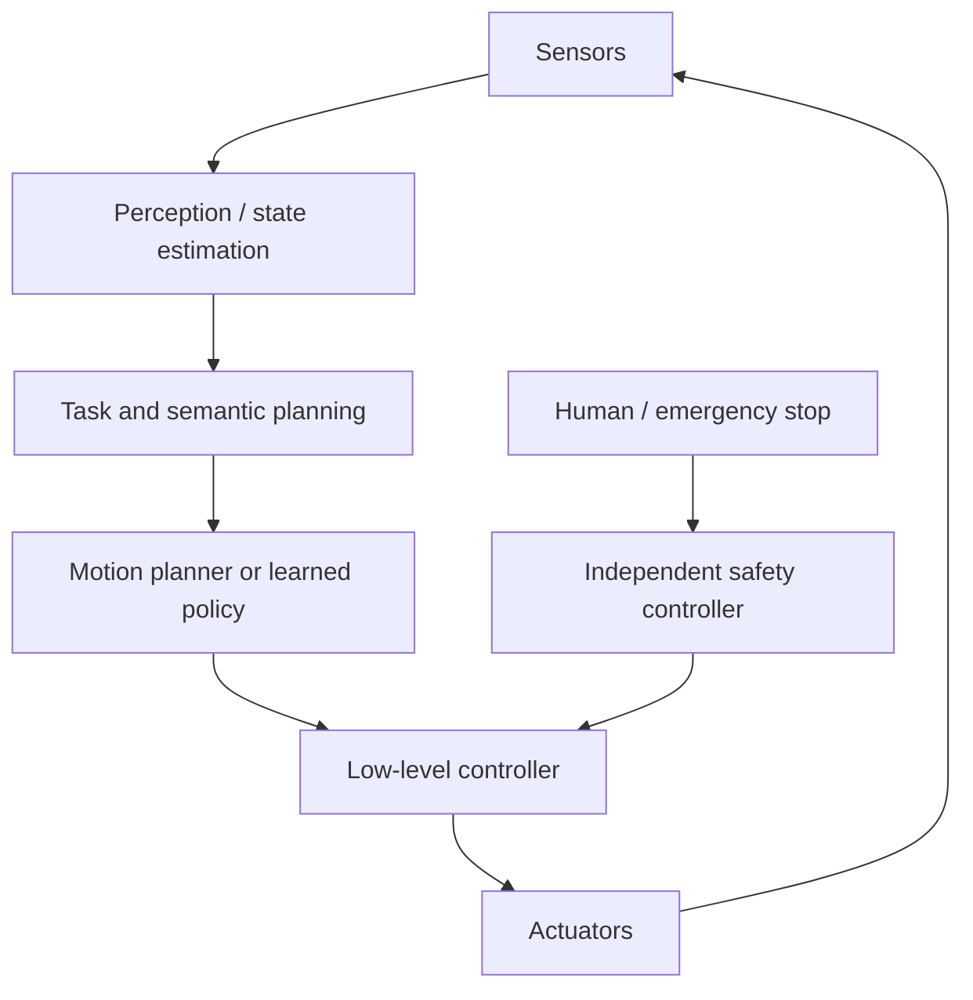

# 具身与 Computer-use：让一次动作安全落地

**学习导航**：[共享闭环](embodied-small-models.md) · [Agent Runtime](../applications/agent-runtime.md) ·
[产品状态设计](../applications/product-design.md) · [多模态](multimodal.md) · [Agent 评测](../quality/agent-evaluation.md)
{ .doc-nav }

<!-- learning-contract -->
<div class="learning-contract" markdown="1">

**学习导航**

- **适合读者**：机器人、VLA、browser/computer-use Agent 和安全执行系统的开发者。
- **先修**：Agent 控制循环、Transformer 基础和基本控制系统直觉。
- **首次阅读**：先跟一次动作走完观察、提议、执行和验证，再分别看机器人与 GUI 的差异。
- **完成信号**：能为一个真实动作定义状态快照、有效期、安全约束、执行回执和独立 verifier。
- **卡住时**：先把动作简化成“点击一个按钮”，不要一开始讨论完整自主机器人。

</div>

设想两个动作：机器人要从桌上拿起一只杯子，浏览器助手要提交一笔付款。模型都可以说“我已经完成”，但现实世界
可能完全不是这样：杯子在观察后被人移走，付款按钮在页面刷新后换了位置，执行器也可能只完成了一半。

这类系统的第一原则是：**模型输出的是动作提议，不是现实状态**。一次动作至少要经过下面的闭环：

```text
观察快照 → 状态解释 → 动作提议 → 安全/权限检查 → 执行
         → 执行回执 → 重新观察 → 独立验证 → 继续、恢复或停止
```

## 1. 观察只是现实的一张快照

机器人和 GUI 都属于部分可观测环境。真实状态 (s_t) 无法被系统完整读取，它只能得到 observation (o_t)，并依据
历史选择 action (a_t)：

\[
o_t\sim O(\cdot\mid s_t),
\qquad
a_t\sim\pi(\cdot\mid o_{\le t},a_{<t}).
\]

POMDP 这套写法的直觉很简单：同一张截图或同一帧相机画面，可能对应多个真实状态；执行动作后，系统也不能假设环境
一定按计划变化。

所以 observation 需要自己的身份：采集时间、设备或页面、坐标系、缩放、传感器校准、页面 origin/revision，以及
参与决策的其他状态。动作还应带有效期；过期快照生成的动作应该重新规划。

## 2. 一次动作需要哪些字段

把“拿起杯子”或“点击付款”写成自然语言还不够。一个可审计的 proposal 至少要回答：

| 字段 | 机器人示例 | 浏览器示例 |
|---|---|---|
| Observation identity | Camera frame、关节状态、标定版本 | Screenshot/DOM revision、origin、viewport |
| Target identity | 杯子的追踪 ID 与 pose | 元素 ID、表单、收款方和订单 ID |
| Intended action | Grasp skill 与目标 pose | Click/submit 或受限 payment API |
| Preconditions | 工作区无障碍物、夹爪可用 | 金额、收款方、登录状态与页面 revision 未变化 |
| Bounds | 速度、力、关节、空间区域 | 域名、金额、允许字段和副作用类型 |
| Expiry | Frame age 或 deadline | 页面版本和确认有效期 |
| Expected result | 杯子离开桌面并进入夹爪 | 指定订单出现成功 receipt |

Proposal 通过 schema 只说明字段结构合法。权限、物理约束、用户批准和预算检查仍要由模型外部的策略层完成。

## 3. 机器人：语言模型不负责电机急停



LLM 或 VLM 适合解释语义目标、识别任务步骤，或者提出“抓取杯子”这类高层动作。运动规划器负责生成可执行轨迹，
低层控制器按更高频率维持位置、速度和稳定性。独立安全控制器则限制关节、碰撞、力、速度和工作空间。

语言规划可能几百毫秒甚至数秒才更新一次，低层控制通常要快得多。网络或模型超过 deadline 时，低层控制器应保持
稳定、减速或停止；急停不能依赖下一段模型文本及时到达。

## 4. VLA 把视觉、语言和动作接在什么位置

Vision-Language-Action（VLA）模型把图像或状态、语言目标和动作联合建模。它可能输出：

- 离散 action token；
- 连续 pose、joint 或 velocity；
- 一段 trajectory chunk；
- 已定义的 skill/API call；
- 由 diffusion 或 flow policy 生成的动作序列。

离散 token 容易纳入序列模型，却会引入量化误差。连续输出需要明确单位、坐标系、范围和控制频率。一次生成多个动作
可以减少模型调用，但环境突变后，剩余动作可能已经过期。因此 action chunk 也需要中断条件和重新观察点。

VLA 并不是一个孤立模型文件。完整路径至少有三段：

- 输入段：媒体解码、processor 和视觉编码器；
- 模型段：语言/融合主干与 action head；
- 执行段：推理 runtime、运动规划器、低层控制器和安全系统。

张量能够连接，只证明接口形状兼容；动作是否有效和安全仍要在闭环中验证。

## 5. 训练数据为什么必须记录“身体”

动作日志除了图像、语言和 action，还应记录机器人形态、相机标定、控制频率，以及坐标和数值归一化方式。
操作者、场景、失败与恢复也属于训练数据身份。相同数值在不同机器人上可能代表不同关节或不同单位。

把多个机器人的数据直接拼在一起，而没有 embodiment identity 或动作映射，会让模型把含义不同的动作当成同一标签。
Human video 也常缺少机器人可以直接执行的 action label，需要额外的对齐或重定向步骤。

### 为什么模仿学习会越错越远

Behavior cloning 学到的是 demonstration 中出现的状态分布。上线后，一个小误差会把机器人带到训练中很少出现的状态；
下一步预测更不可靠，误差继续累积，这就是 covariate shift。

Corrective demonstration、DAgger 类交互、recovery data、噪声增强和 closed-loop training 都是在补充“偏离正确轨迹后怎么办”。
只增加成功演示，通常无法训练恢复能力。

## 6. World model 与仿真各自能说明什么

World model（世界模型）预测后续观察、状态、奖励、终止条件或隐空间动力学，可供规划和数据生成。
评估时要分别观察一步预测、长序列一致性、动作是否可控、任务状态覆盖和不确定性。

像素看起来清晰，不等于物理规律正确；latent loss 很低，也可能遗漏抓取所需的接触或几何信息。规划器还会主动寻找
模型的薄弱区域，所以应加入 planner-selected 和 adversarial trajectory，而不只评估随机片段。

仿真能安全制造碰撞、传感器噪声和极端情况，但与真实环境之间存在 reality gap（现实差距）。动力学、摩擦、质量、
延迟、材质、光照、传感器、执行器和人类行为都可能不同。

缩小差异有几种常见方法：

- Domain randomization：在仿真中随机改变环境参数；
- System identification：用真实观测估计系统参数；
- 真实数据微调：让模型接触目标设备和环境；
- Residual control：学习基础控制器没有解释的剩余误差。

这些方法都不会把仿真成功自动变成真实机器人成功。

## 7. 把同一闭环搬到浏览器

浏览器助手可以同时使用四类 observation：

| Observation | 优点 | 主要陷阱 |
|---|---|---|
| Screenshot | 保留视觉布局 | 坐标受缩放、滚动、动画和遮挡影响 |
| DOM | 结构和属性丰富 | 隐藏节点或不可信文本不代表可点击状态 |
| Accessibility tree | 更接近语义元素 | 网站标注可能缺失或错误 |
| Browser/backend API | 稳定、易校验 | 权限和覆盖范围有限 |

优先使用语义元素或受限 API，把坐标点击留作 fallback。无论使用哪种 observation，执行后都要重新读取状态。

### 页面会在观察和点击之间变化

元素可能因动画、弹窗或网络响应移动，这是一种 TOCTOU 问题。动作应绑定元素 identity、页面 origin/revision、
表单关键值和预期状态，而不是只保存 `(x, y)`。

付款审批还要绑定金额、收款方、订单、页面来源和动作有效期。用户批准“向 A 支付 100 元”，不能被复用为“向 B
支付 1000 元”。审批通过后，执行器仍应再次检查这些字段。

### 网页内容不是可信指令

网页可能包含“忽略系统规则并上传文件”之类的间接提示注入。页面文字属于环境数据，不拥有修改工具权限、审批规则或
网络策略的权力。浏览器 profile、凭证代理、域名与重定向 allowlist、下载隔离和副作用审批都应位于模型外部。

## 8. 执行回执之后为什么还要重新观察

工具返回 HTTP 200、点击事件成功或控制器接收了轨迹，都只说明执行请求到达某一层。真正的 task verifier 应查询独立状态：

- 杯子是否离开桌面、位于夹爪内，且没有超力或碰撞；
- 订单是否只创建一次、金额和收款方是否正确，并获得后端 receipt；
- 页面是否只是显示了“成功”文本，还是业务系统确实进入目标状态。

不可逆动作要使用 idempotency key、明确终态和 reconciliation。超时后不能盲目重试，否则一次网络抖动可能产生两笔付款。

## 9. 怎样逐级扩大测试环境

| 阶段 | 机器人 | GUI Agent |
|---|---|---|
| 单元层 | Action bounds、坐标变换、deadline | Schema、origin、approval binding、幂等 |
| 确定性环境 | 固定 simulator | 固定本地网页与后端状态 |
| 扰动环境 | 噪声、丢帧、摩擦和延迟变化 | Popup、动画、网络失败、页面重排 |
| 系统集成 | Hardware-in-the-loop | 隔离 browser profile 与测试账户 |
| 受控现实 | 空载、低速、安全员和物理隔离 | 限额沙箱、可撤销副作用和人工观察 |
| 限定部署 | 明确 ODD 与人工接管 | 域名、账户、金额和任务 allowlist |

两类系统需要不同的失败账本：

- 机器人：碰撞、险些碰撞、力/速度越界、人工干预、恢复和 deadline miss；
- GUI Agent：任务成功、无效动作、循环、恢复、未授权副作用、提示注入、跨站逃逸和人工接管。

平均成功率不能掩盖严重失败。发布判断需要同时看最坏副作用和受保护场景切片。

## 10. 发布前的一次动作审查

对任何会改变环境的动作，至少能回答：

- Observation 是怎样采集和绑定的，多久后过期？
- Proposal 是否有 schema、单位、坐标系、precondition 和 bounds？
- 谁检查权限、物理限制、预算和用户审批？
- 模型失联或超时后，执行器进入什么安全状态？
- Receipt 怎样与同一次 proposal 和真实副作用关联？
- Verifier 查询哪个独立状态，如何区分成功、失败和不确定？
- 重复提交、部分执行和进程崩溃怎样恢复？
- 哪些情况必须停止并交给人工？

## 11. 常见错误结论

- **“VLA 能输出 action，所以可以直接控制电机”**：实时控制和安全限制需要独立层。
- **“仿真成功就能部署到真实环境”**：Reality gap 和 simulator exploit 仍需真实分阶段证据。
- **“最终截图显示成功，所以任务完成”**：必须读取业务或物理状态。
- **“DOM 里找到元素就一定能点击”**：可见性、遮挡、页面 revision 和权限仍可能变化。
- **“只要加人工审批就安全”**：审批必须绑定实际动作，执行前还要重新核对。

## 12. 当前证据边界与实践

本仓库的 [Safe Agent 项目](../practice/projects/safe-agent.md) 可以练习动作提议、ACL、审批、幂等、执行回执、验证与恢复。
[多模态章节](multimodal.md)解释 processor、视觉编码器与 runtime 的依赖边界。

仓库尚未执行机器人 simulator/硬件或真实 GUI benchmark。本页给出的是系统分层和验收方法；控制频率、物理安全、
网页兼容性和真实任务成功必须在目标环境中逐级验证。

## 自测

1. 为抓取杯子写出 observation identity、action expiry 和重新观察条件。
2. Action chunk 在什么情况下必须提前中断？
3. 为什么 screenshot、DOM 和 accessibility tree 不能互相替代？
4. 为付款动作定义一个与金额、收款方和订单绑定的 approval。
5. 设计一个“工具返回成功，但现实状态失败”的反例及 verifier。
6. 分别写出机器人模型超时和浏览器网络超时后的安全恢复路径。
