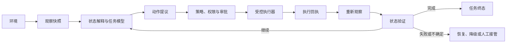

# 从观察到行动：具身、计算机使用与本地智能

<!-- learning-contract -->

**学习导航**

- **适合读者**：想理解机器人、computer-use Agent 或端侧模型系统的开发者。
- **先修**：Agent 控制循环、基本推理服务概念和安全边界。
- **首次阅读**：先读本页的共享闭环，再从下方选择一条路线。
- **完成信号**：能区分观察、动作提议、受控执行、状态验证和模型路由。
- **卡住时**：先读 [Agent Runtime](../applications/agent-runtime.md) 的端到端任务主线。

想象一个运行在笔记本上的助手。它读取浏览器页面，准备点击“确认付款”；简单页面由本地小模型处理，复杂页面可能
升级给云端模型。这个任务同时包含三个问题：

1. 当前页面究竟处于什么状态；
2. 哪个动作可以安全执行；
3. 这一步应在本地完成，还是交给其他模型、工具或人工。

机器人、浏览器 Agent 和端侧模型的具体技术不同，但都不能只靠一次模型输出结束任务。它们共享同一个闭环：

这张图里最重要的不是模型名称，而是几个不能省略的边界：观察只是对环境的一次采样，动作文本只是提议，执行器回执
只说明调用发生过，最终还要重新读取环境来判断任务是否真的成功。

## 三类系统怎样对应到同一个闭环

| 系统 | 观察 | 动作 | 独立验证 | 典型高风险失败 |
|---|---|---|---|---|
| 机器人 | Camera、力传感器、关节与位置状态 | 抓取、移动、速度或 skill call | 物体状态、碰撞、力和位置 | 过期感知导致碰撞或越过安全限制 |
| Computer-use Agent | Screenshot、DOM、accessibility tree、API state | Click、type、scroll、浏览器/API call | 页面后端状态、订单或资源 receipt | 坐标漂移、间接提示注入、误付款或误删除 |
| 端侧小模型系统 | Prompt、本地文档、设备与网络状态 | 本地回答、工具调用、云端升级 | 质量 verifier、策略和任务结果 | 敏感内容误上传、低置信错误未升级 |

三者也有不能混用的部分。机器人需要毫秒级低层控制与物理安全；GUI 依赖网页身份、权限和可撤销副作用；端侧模型
更关注内存、延迟、能耗、路由质量和隐私。把它们塞进一套统一 API，并不会自动解决这些领域约束。

## 选择学习路线

### 路线 A：系统真的会改变环境

[具身与 Computer-use：让一次动作安全落地](embodied-computer-use.md)沿两次具体动作展开：机器人抓取物体，以及浏览器
提交付款。你会学习：

- 部分可观测环境为什么要求重新观察；
- 语言规划、运动规划和低层控制为何必须分层；
- VLA、模仿学习、world model 和 sim-to-real 各解决哪一段；
- Screenshot、DOM 与 accessibility tree 的取舍；
- TOCTOU、绑定审批、执行回执与 state-based verifier；
- 怎样从仿真逐级走到真实设备和真实账户。

### 路线 B：同一个任务在哪个模型上运行

[端侧小模型与本地智能：从一次路由决定开始](on-device-small-models.md)跟随一次本地助手请求，解释：

- “小模型”为什么必须相对硬件和工作负载定义；
- Processor、模型、runtime、kernel、router 和 verifier 各做什么；
- 数据、蒸馏、PEFT 与量化怎样改善端侧方案；
- 怎样读 risk–coverage、cost–quality 和升级率；
- Speculative decoding 在什么条件下保持目标分布；
- 本地个性化、联邦学习和 adapter 生态还会引入哪些风险。

## 学习时始终追问五件事

1. **观察来自哪里？** 它是否可能过期、缺失、被攻击者控制或只覆盖部分状态？
2. **模型输出是什么？** 是自然语言、结构化动作、连续控制量，还是一个路由决定？
3. **谁可以执行？** 哪一层检查权限、物理限制、预算和用户审批？
4. **怎样确认成功？** Verifier 查询的是现实状态，还是只看模型自己生成的成功文本？
5. **失败后怎么办？** 系统会停止、回滚、重新规划、换模型，还是交给人工？

这五个问题比记住某个 VLA、Agent framework 或端侧模型名称更稳定。模型和依赖库会更新，但观察、执行与验证之间的
因果关系不会因此消失。

## 共同的错误直觉

- **“模型输出了动作，所以动作已经完成”**：执行可能被拒绝、超时、部分成功或作用于错误目标。
- **“页面或机器人返回成功文本，所以任务成功”**：验证应读取独立状态，而不是复述提示内容。
- **“本地运行就天然隐私”**：设备备份、日志、恶意应用、模型抽取和云端升级仍可能泄露数据。
- **“模型更小就一定更快”**：Context、KV Cache、数据搬运、kernel 和目标硬件共同决定延迟。
- **“平均成功率够高就可以发布”**：一次不可逆付款或严重碰撞不能被大量简单成功样本抵消。

## 当前仓库能提供哪些实践

仓库已经实现 Agent 的动作提议、审批、幂等、执行回执、结果对账与恢复，也提供 Paged KV、量化、LoRA 和
speculative sampling 的可执行实验。这些实验可以验证上述系统中的局部机制。

机器人模拟器与硬件、真实 GUI benchmark、移动设备端侧模型、联邦学习 round 和目标 GPU kernel 尚未在仓库中运行。
因此，两条路线主要建立架构和验收方法；设备性能、现实副作用与真实任务成功仍需在目标环境中测量。

## 自测

1. 为浏览器付款动作分别写出 observation、proposal、approval、execution、receipt 和 verifier。
2. 为什么机器人语言规划超时后，应由低层控制器保持稳定或停止，而不是等待模型回复？
3. 本地模型把复杂请求升级到云端前，需要检查哪些数据和权限？
4. 举一个“最终界面相同，但实际业务状态不同”的例子。
5. 为一次失败任务设计停止、重试、降级和人工接管的优先顺序。
