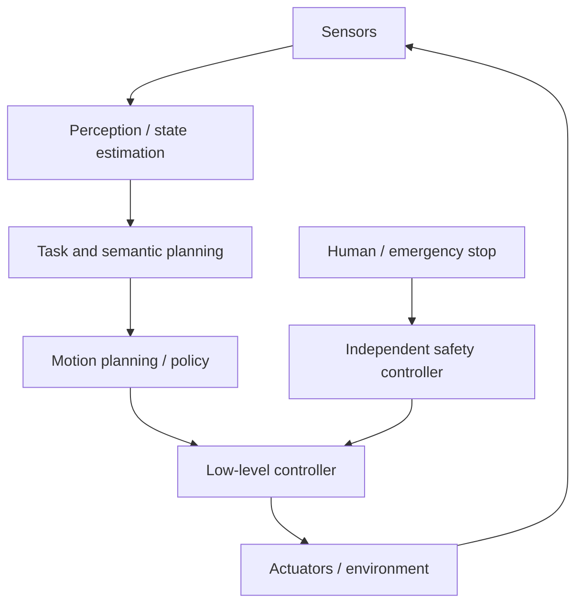
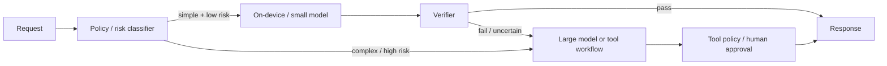

# 具身、计算机使用、小模型与本地智能

这些方向把语言模型放进闭环环境：机器人动作改变物理世界，GUI Agent 改变账户状态，小模型在资源受限设备上持续响应。评价重点从“回答像不像”转为任务成功、状态估计、权限、恢复、延迟和现实副作用。

## 1. 闭环决策与部分可观测性

可用 POMDP 直觉描述：真实状态 \(s_t\) 不完全可见，系统获得 observation \(o_t\)，根据历史/估计选择 action \(a_t\)，环境转移到 \(s_{t+1}\)。

\[
o_t\sim O(\cdot\mid s_t),
\qquad
a_t\sim\pi(\cdot\mid o_{\le t},a_{<t}).
\]

文本 Agent 常假设工具返回准确状态；物理/GUI 环境却有遮挡、延迟、丢帧、弹窗、执行失败和外部变化。系统需要 action receipt 与重新观察，不能把“模型输出了动作”当“动作已成功”。

## 2. 机器人系统分层

LLM/VLM 可参与语义感知、任务分解或高层 action proposal，不应直接绕过 joint limit、collision avoidance、force/velocity limit、control barrier、watchdog 和 emergency stop。

### 2.1 时间尺度

语言规划可能每秒或更慢，运动控制常需更高频率。若网络/模型延迟超过 control deadline，应由低层 controller 保持稳定、减速或停止；不能等待下一段自然语言。

## 3. Vision-Language-Action（VLA）

VLA 将图像/状态、语言目标和 action 联合建模。Action 表示可能是：

- 离散 action tokens；
- 连续 pose/joint/velocity；
- trajectory chunk；
- skill/API call；
- diffusion/flow policy 生成的 action sequence。

离散化简化序列建模但带 quantization error；连续 action 需要输出分布、约束和 control rate。Trajectory chunk 降低调用频率，却可能在环境突变时继续执行过期动作。

### 3.1 数据来源

- teleoperation/demonstration；
- robot logs 与 recovery；
- simulation；
- human video（通常缺 robot action label）；
- synthetic augmentation；
- reinforcement learning/online interaction。

记录 robot morphology、camera calibration、control frequency、action normalization、operator、场景和失败。把不同机器人 action 直接拼接而没有 embodiment token/映射会混淆语义。

## 4. Imitation 与 offline data 问题

Behavior cloning 在 demonstration state distribution 上学习。执行时一个小错误会进入训练未覆盖状态并累积，即 covariate shift。可用 corrective demonstration、DAgger 类交互、recovery data、noise augmentation 和 closed-loop training 缓解。

Offline RL/VLA 还面临 support mismatch：模型不应对数据外 action 过度乐观。仿真器 reward/成功条件也可能被 exploit。

## 5. Sim-to-real

仿真可安全生成大量失败和极端场景，但存在 reality gap：

- dynamics、friction、mass、latency；
- camera/lighting/material；
- sensor noise/dropout；
- actuator backlash/saturation；
- 人和物体行为；
- 仿真碰撞/成功判定漏洞。

Domain randomization、system identification、real-data fine-tuning 和 residual control 可缩小差异。仿真成功只能证明在该 simulator/config 下成功，不能写成真实机器人验证。

## 6. 机器人安全测试

逐级扩大：

1. unit test action bounds；
2. deterministic simulator；
3. randomized/noisy simulation；
4. hardware-in-the-loop；
5. 空载/低速受控场地；
6. 有安全员和物理隔离的真实任务；
7. 限定 ODD（operational design domain）部署。

指标：任务成功、collision/near miss、force/velocity violation、intervention、recovery、deadline miss、energy、最坏状态。平均成功率不能掩盖一次严重碰撞。

## 7. World model

World model 预测 observation/state/reward/termination 或 latent dynamics，可用于 planning、imagination 和 data generation。需要区分：

- one-step predictive accuracy；
- long rollout consistency；
- action-conditioned controllability；
- task-relevant state coverage；
- uncertainty/OOD detection。

像素预测清晰不等于物理正确，latent prediction loss 低也不保证规划所需变量被保留。规划器会利用 world model 偏差，应在 adversarial/planner-selected trajectories 上评估。

## 8. GUI / Computer-use Agent

Observation 可以是 screenshot、DOM、accessibility tree、OCR、network/API state 的组合。Action 包括 click/type/scroll、semantic element action、browser/API call。

### 8.1 Observation 选择

- Screenshot 保留视觉布局，但坐标受缩放、滚动、动画影响；
- DOM 结构丰富，但可能包含隐藏/不可信节点且不代表视觉可点击；
- Accessibility tree 更语义化，但网站标注可能缺失；
- API 稳定且可校验，但权限/覆盖有限。

优先语义 action 与受限 API，坐标点击作为 fallback。执行后重新观察并验证 state change。

### 8.2 动态页面

Element 可能在观察和点击之间移动（TOCTOU），弹窗或网络响应改变页面。Action 应绑定 element identity、页面 origin/revision 与预期状态，而不只保存 `(x,y)`。

### 8.3 安全

- 隔离 browser profile 与 ephemeral session；
- credential broker 代填，不把密码给模型；
- domain/redirect/download allowlist；
- 登录、发送、付款、删除、发布需要 bound approval；
- 对网页文字做 indirect injection threat model；
- 禁止绕过 CAPTCHA/anti-abuse；
- 下载扫描、文件 quarantine 与 MIME/content validation；
- 完整 action/receipt/reconciliation audit。

## 9. GUI Agent 评测

在可 reset environment 中运行。报告：

- task success 与 state-based verifier；
- step count、token/tool calls、latency/cost；
- invalid action、loop/no-progress；
- recovery after popup/network/tool failure；
- unauthorized/irreversible side effects；
- injection attack success；
- cross-site/domain escape；
- human intervention。

页面最终出现成功文案可能是模型读到文本后复述，verifier 应查询真实 state。真实个人账户不应作为可重复 benchmark。

## 10. 什么是“小模型”

没有固定参数阈值。Small Language Model（SLM）是相对部署约束定义：能否在目标单卡、CPU、移动端或延迟/成本预算内运行。报告：参数、active parameters、weight/KV bytes、context、dtype、target hardware 与 TTFT/TPOT。

小模型优势：低延迟/成本、可本地、易隔离和专用；限制：长尾知识、复杂推理、instruction robustness、多语言与安全泛化可能更弱。

## 11. 提升小模型

### 11.1 Data 与 compute

较小模型可用更多高质量 token、curriculum、dedup 和领域 mixture 提高效率。数据重复和 teacher synthetic bias 仍需控制。

### 11.2 Distillation

- logit distillation：匹配 teacher distribution；
- response distillation：学习 teacher output；
- reasoning/process distillation：学习验证过的轨迹；
- feature distillation：匹配中间表示；
- preference distillation：用 teacher/judge pair/ranking。

Teacher 输出不是 ground truth。记录 teacher revision、prompt、sampling、verifier 和许可；学生可能复制 teacher 错误、安全盲点与冗长风格。

### 11.3 PEFT 与专用化

LoRA/adapter 可低成本学习领域格式。专用模型应保持 out-of-scope detection 和 escalation，不要因目标测试好就处理所有流量。

### 11.4 Compression

Quantization、pruning、low-rank、vocabulary/architecture 设计降低内存/计算。权重变小不保证速度等比例提高；目标硬件 kernel 决定收益。

## 12. Model routing 与 cascade

令 router 给出是否由小模型处理，阈值 \(\tau\) 控制 coverage：

- coverage：小模型直接处理比例；
- risk/error：被直接处理请求中的失败；
- escalation rate/cost；
- high-risk miss：本应升级却未升级。

画 risk–coverage/cost–quality 曲线。Router confidence 需要校准，并按语言、领域和攻击输入切片。高风险类别可 rule-based always escalate，不依赖小模型自报置信。

### 12.1 Cascade

小模型先答，verifier 通过则返回，否则升级大模型/工具/人工。总成本包括第一次生成、验证、重复 prompt 和升级；不是简单的 `small_cost × coverage + large_cost × escalation`，除非已计入共享/重复项。

### 12.2 Feedback loop

只对升级样本获得高质量标签，会产生 selection bias。Router 训练应抽样审计未升级请求，防止盲区永久不可见。

## 13. Speculative decoding

Draft model 提议多个 token，target model 并行验证。严格的 speculative sampling 使用接受/拒绝与 residual distribution，可保持 target distribution；“target 逐 token 验证并取一致前缀”的 greedy 变体保持 target greedy output。

概率级规则不可省略：proposal \(x\sim q\) 以 \(\min(1,p(x)/q(x))\) 接受，拒绝则从 normalized \((p-q)_+\) 采样；首次拒绝后丢弃剩余 draft，全接受才发 bonus target token。仓库已有解析一步边际与 block 控制流 oracle，但 authored probability vector 不是目标模型 logits，CPU 循环也不是 verification kernel。

并非任何“让小模型先写、大模型挑”都无损。若只接受 draft 高分 token 或改变采样逻辑，输出分布会变。Speedup 取决于 draft latency、acceptance rate、proposal length、target verification kernel 和 batch。

## 14. 本地个性化

On-device adapter/memory 可减少原始数据上传，但设备丢失、backup、debug log、恶意 app 和 model extraction 仍是风险。个性化应可查看、删除、禁用和回滚；base model 更新后验证 adapter compatibility。

不要把敏感长期记忆直接拼入每个 prompt。使用本地加密 store、purpose/TTL、检索权限和用户控制。

## 15. Federated learning

Federated 让设备计算 update 而非上传 raw data，但不自动提供隐私：

- update/gradient 可能泄露；
- malicious client poisoning/backdoor；
- server 可观察参与和更新；
- secure aggregation、DP 与 authentication 各解决不同问题；
- 设备 availability/网络造成参与偏差；
- unlearning 与设备删除请求困难。

报告 client sampling、local steps、aggregation、secure aggregation、DP adjacency/budget、robust aggregation 和 dropout handling。

## 16. 去中心化与协作推理

把模型分布在用户/边缘节点可能降低中心依赖，但引入：

- 不可信节点返回错误/窃取 activation；
- 网络延迟与 churn；
- model/version consistency；
- incentive/Sybil/availability；
- 中间 activation 的隐私；
- verification 成本。

Cryptographic proof、replication 或 spot-check 也有成本和适用边界。不能因“权重不集中”就宣称数据私密。

## 17. 模型合并与本地 adapter 生态

多个 adapter/merge 可组合专用能力，但必须共享 base revision、target modules、shape/scaling 和 tokenizer/template。独立初始化模型不能直接逐权重平均。Merge 后重测每项能力、安全与量化；本地插件式 adapter 还需要签名、权限、来源和冲突管理。

## 18. 生产架构示例

Router、verifier、tool policy 和 human approval 分别有独立版本与评测。大模型 fallback 不应继承小模型生成的恶意/错误上下文而不标 provenance。

## 19. 发布门禁

### 机器人

- ODD、action bounds、deadline 和 independent safety controller；
- sim/noise/hardware-in-loop/real staged evidence；
- collision/near-miss/force 与 recovery；
- emergency stop 在模型不可用时仍工作。

### GUI Agent

- resettable environment、state verifier；
- credential broker、origin/domain policy；
- bound approval、idempotency、receipt；
- injection、popup、download、network failure 与 no-progress。

### 小模型与路由

- target hardware quality/latency/memory/energy；
- risk–coverage 与 protected slices；
- escalation/verifier 的总成本和失败；
- teacher/data lineage 与 out-of-scope behavior；
- offline/edge privacy 和 update rollback。

## 20. 当前仓库证据边界

仓库有 Safe Agent 的审批/幂等/reconciliation、Roofline/KV、LoRA、speculative sampling 概率 oracle 和评测门禁，可作为 GUI/小模型系统的组件证据；但没有机器人 simulator/硬件、真实 GUI benchmark、移动设备 SLM、federated round 或 speculative decoding kernel 实跑。因此本文是架构和验收协议，不是具身/端侧生产验证。

## 21. 常见错误结论

- **“VLA 输出动作，所以可以直接控制电机”**：低层安全和实时 controller 必须独立。
- **“仿真成功就是现实成功”**：reality gap 与 simulator exploit 仍在。
- **“GUI 显示成功就任务成功”**：需要真实 state verifier/receipt。
- **“小模型参数少就一定更快”**：kernel、memory、context 和硬件决定。
- **“Router 平均准确高就安全”**：高风险 false-negative 可能集中在少数切片。
- **“Speculative decoding 都保持 target 分布”**：只有满足特定接受/残差算法的实现才保持。
- **“Federated 等于隐私”**：更新、参与和 malicious client 仍有风险。

## 自测与实践

1. 为机器人任务拆分语言规划频率与低层控制频率，并定义 deadline miss 行为。
2. 设计一个 simulator exploit，说明为什么 reward success 不等于真实任务。
3. 为 GUI 付款动作写 observation→approval→execution→receipt 契约。
4. 画小模型 router 的 risk–coverage 曲线，怎样处理高风险类别？
5. 区分 greedy speculative decoding 与保持 target sampling distribution 的算法。
6. 列出 federated learning 中 secure aggregation 与 differential privacy 分别保护什么。
