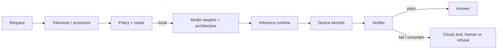
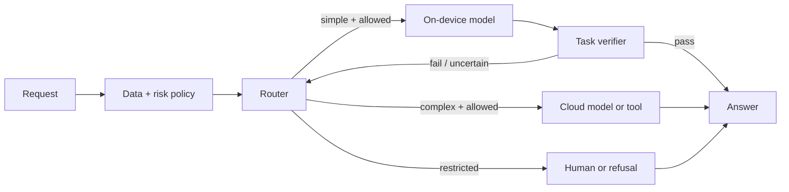

# 端侧小模型与本地智能：从一次路由决定开始

**学习导航**：[共享闭环](embodied-small-models.md) · [硬件与端侧](../systems/hardware-edge.md) ·
[推理优化](../systems/inference-optimization.md) · [PEFT/QLoRA](../training/peft-qlora-engineering.md) ·
[服务与可观测性](../systems/serving.md)
{ .doc-nav }

<!-- learning-contract -->
<div class="learning-contract" markdown="1">

**学习导航**

- **适合读者**：在笔记本、单卡、CPU、移动端或边缘设备部署模型的开发者。
- **先修**：推理生命周期、量化、基本评测和服务指标。
- **首次阅读**：跟随一次“本地回答还是升级”的决定，再学习蒸馏、压缩、推测解码和个性化。
- **完成信号**：能用目标硬件、工作负载和风险曲线定义“小”，并解释 router、verifier 与 fallback 的职责。
- **卡住时**：先只比较本地模型与云模型两条路径，暂时跳过联邦学习和 adapter 合并。

</div>

设想一个笔记本助手收到请求：“总结本地合同，并告诉我是否应该付款。”本地小模型延迟低，也不用先上传文档；但它可能
不擅长合同判断。云模型能力更强，却会增加网络延迟、费用和数据外发风险。

系统真正要做的不是简单选择“本地”或“云端”，而是完成一次可验证的路由决定：

```text
请求 + 数据敏感度 + 设备状态
    → Router 判断任务与风险
       ├─→ 本地模型 → Verifier ─┐
       ├─→ 云模型/工具 ─────────┼─→ 结果与执行记录
       └─→ 人工或拒绝 ──────────┘
                    ↑
              失败、超时或不确定时升级
```

## 1. “小模型”首先是一个系统预算

Small Language Model（SLM）没有统一参数阈值。一个 0.8B 模型对桌面 GPU 可能很轻，对移动端内存或实时任务仍可能太大。
判断模型是否足够小，要把它放进具体工作负载：

| 维度 | 至少记录什么 |
|---|---|
| 模型 | 总参数、active parameters、架构和 context 上限 |
| 数值格式 | Weight、KV Cache 与计算 dtype |
| 内存 | Weight bytes、KV bytes、临时 buffer 和 runtime reserve |
| 延迟 | TTFT、TPOT、端到端延迟和冷启动 |
| 容量 | 并发、输入/输出长度、吞吐与失败率 |
| 设备 | CPU/GPU/NPU、内存带宽、driver、runtime 与 kernel |
| 能耗 | 单请求能量、持续功耗和热降频 |
| 质量 | 目标任务、语言、长尾、拒答与高风险切片 |

参数更少通常能降低一部分计算和内存，但不会保证速度同比提高。小 batch 的 kernel launch、内存带宽、量化反量化、
长 context 的 KV Cache，以及不适配目标设备的算子，都可能成为瓶颈。

## 2. 一次本地请求依赖哪些组件



这些层解决不同问题：

- Tokenizer/processor 决定输入怎样变成 token 或多模态张量；
- 模型代码定义 attention、MLP、位置编码和输出 head；
- Runtime 负责 batching、KV Cache、调度、量化加载和设备执行；
- Kernel 把具体算子落到 CPU、GPU 或 NPU；
- Router 决定请求走哪条路径；
- Verifier 判断结果是否满足任务和风险要求；
- Policy 控制数据能否外发、工具能否调用和何时必须人工确认。

模型文件能够加载，只证明这些组件在当前版本和 dtype 下可以连接。它不等于质量达标，也不等于目标设备的延迟、内存和
能耗符合产品预算。

## 3. 怎样让小模型更有用

### 数据与任务边界

小模型容量有限，训练数据的任务匹配、去重、课程顺序和领域 mixture 更重要。比起让它处理所有请求，更实际的做法是
明确擅长范围，并训练 out-of-scope detection 和升级行为。

合成数据可以增加覆盖，却会复制 teacher 的错误、偏好和安全盲点。生成来源、Prompt、模型 revision、verifier 和许可
需要进入 lineage；详见[合成数据](../training/synthetic-data.md)。

### 蒸馏

蒸馏可以匹配 teacher 的不同信号：

| 方法 | 学生学习什么 | 容易忽略的问题 |
|---|---|---|
| Logit distillation | Teacher 输出分布 | Vocabulary、temperature 和未观察类别 |
| Response distillation | 最终文本或结构化结果 | Teacher 错误会变成训练标签 |
| Process distillation | 经过筛选的中间步骤或轨迹 | 轨迹真实性、泄漏和 verifier 偏差 |
| Feature distillation | 中间表示 | 层映射和架构兼容性 |
| Preference distillation | Pair、ranking 或 judge 选择 | Judge calibration 与共享盲点 |

Teacher 输出不是 ground truth。蒸馏报告应保存 teacher、Prompt、采样配置、过滤规则和失败样本，不能只展示学生在同源
测试集上的提升。

### PEFT 与压缩

LoRA 或 adapter 可以低成本学习领域格式和专用任务。部署前要绑定基础模型版本、目标模块、tokenizer、template
和量化方案。基础模型更新后，旧 adapter 需要重新验收。

量化、剪枝、低秩和架构优化可以降低内存或计算，实际收益取决于 runtime 和目标 kernel。权重变成 4-bit，并不保证
所有算子、KV Cache 和临时 buffer 都缩小到四分之一。

## 4. Router 怎样决定本地处理还是升级

令阈值 \(\tau\) 控制本地模型直接处理的范围。随着阈值放宽，本地 coverage 往往提高，同时错误风险也可能上升。
至少要一起报告：

- Coverage：多少请求由本地路径完成；
- Conditional error/risk：本地完成请求中的错误与高风险失败；
- Escalation rate：多少请求进入云端、工具或人工；
- High-risk miss：本应升级却被留在本地的请求；
- Cost、latency 与数据外发量。

不要只给 Router 一个总体 accuracy。不同语言、领域、攻击输入和高风险动作要分开画 risk–coverage 曲线。付款、医疗、
凭证和不可逆动作可以使用规则直接进入受控流程，而不是依赖小模型自报置信。

Router 的输出也不是最终决定。数据外发 policy 可能禁止云端路径；设备离线时，系统可能选择本地降级、排队、拒绝或人工，
而不是偷偷改变隐私边界。

## 5. Cascade 为什么要算完整成本

一种常见 cascade 是：小模型先回答，verifier 通过则返回，否则升级。总成本包括本地生成、验证、重复 Prompt、云端生成、
网络和失败重试。

只有在这些重复项都已计入时，才能把成本简化为“本地成本乘本地比例，加云端成本乘升级比例”。质量评测也要保留首次
错误和升级失败，不能只统计最终被大模型修好的结果。

训练 Router 时还会遇到 selection bias：高质量标签往往只出现在已升级请求上。需要抽样审计留在本地的流量，否则
Router 的盲区会长期没有标签。

## 6. Speculative decoding 不是普通的大小模型级联

Speculative decoding 让 draft model（草稿模型）一次提出多个 token，再由 target model（目标模型）并行验证。
它优化的是目标模型本身的解码速度，不是在两个答案之间做业务路由。

在保持 target sampling distribution 的算法中，proposal \(x\sim q\) 以

\[
\min\left(1,\frac{p(x)}{q(x)}\right)
\]

接受。拒绝时从归一化后的 \((p-q)_+\) 采样，并丢弃拒绝位置之后的草稿 token。只有整段都接受时，才发出额外的
目标模型 token。Greedy 变体则验证并保留与目标模型贪心输出一致的前缀。

“小模型先写、大模型挑”不一定满足这些概率规则。若只保留草稿模型的高分 token 或修改接受逻辑，输出分布就会变化。

实际加速取决于草稿延迟、接受率、一次提议的长度、目标模型验证 kernel、batch 和内存带宽。

仓库的 speculative sampling 实验验证概率和控制流，不代表目标 GPU kernel 已经提速。真实结论必须来自固定 workload、
相同 target 输出语义和目标设备测量。

## 7. 本地运行怎样影响隐私

本地处理可以减少原始数据上传，却不会自动解决隐私：设备备份、debug log、恶意应用、共享账户和模型抽取仍可能暴露数据。

本地 memory 或 adapter 应支持查看、删除、禁用和回滚。长期记忆需要 purpose、TTL、检索权限和加密存储；不要把全部
敏感记忆拼进每次 Prompt。升级到云端前，还要重新执行数据分类、最小化和用户授权。

## 8. Federated learning 解决哪一段

Federated learning 让设备计算 update，而不是直接上传 raw data。它仍会面对：

- Update 或 gradient 泄漏；
- 恶意 client 的 poisoning 与 backdoor；
- 参与设备和时间本身泄漏信息；
- 网络和 availability 造成的参与偏差；
- 删除、unlearning 和版本回滚困难。

| 机制 | 主要解决什么 |
|---|---|
| Secure aggregation | 限制服务器看到单个 client update |
| Differential privacy | 限制单个样本或用户对发布结果的影响 |
| Authentication | 确认参与客户端的身份 |
| Robust aggregation | 降低异常或恶意 update 的影响 |

这些机制不能互相替代。报告还应明确客户端采样、本地训练步数、聚合与掉线处理，以及 DP 的 adjacency、预算和会计方式。

## 9. 去中心化推理与本地 adapter 生态

把模型切分到多个边缘节点会增加不可信节点、网络抖动、版本不一致、Sybil、可用性和中间 activation 隐私问题。
Replication、spot-check 或密码学证明也有额外延迟和适用条件。“权重不在中心服务器”不是数据私密的充分条件。

多个 adapter 或模型 merge 也不是简单相加。它们需要兼容的基础模型版本、目标模块、shape、scaling、tokenizer
和 template。独立初始化模型不能直接逐权重平均；合并后必须重新测试每项能力、安全和量化行为。

本地插件式 adapter 还需要签名、权限、来源和冲突管理。

## 10. 一套可发布的本地—云端架构



Router、verifier、policy 和 fallback 各自需要版本、测试和观测。云端 fallback 不能无条件继承本地模型生成的上下文；
要区分原始用户数据、本地检索证据和模型猜测，并在外发前重新执行 policy。

## 11. 发布门禁

一个端侧模型方案至少要回答：

- 目标硬件、dtype、context、输入输出长度与并发是什么？
- 质量、TTFT、TPOT、内存、能耗和失败率怎样一起测量？
- Router 的 risk–coverage 曲线是否包含高风险和少数语言切片？
- Verifier 失败、设备离线、云端超时和预算耗尽时怎样降级？
- 哪些数据允许外发，日志、memory 和 cache 怎样删除？
- Base、adapter、tokenizer、runtime 和 kernel 版本怎样绑定？
- 模型或 adapter 更新失败后如何回滚？
- 训练数据、teacher 和评测集的 lineage 是否可追溯？

## 12. 常见错误结论

- **“0.8B 很小，所以任何设备都能流畅运行”**：必须给出设备、dtype、context 和实测延迟。
- **“本地模型准确率高，所以不需要升级”**：长尾和高风险 false negative 可能集中在少数切片。
- **“量化到 4-bit，内存和延迟都会变成四分之一”**：KV、buffer、算子和 kernel 不满足这个推断。
- **“蒸馏会把大模型能力完整复制过来”**：学生容量、训练覆盖和 teacher 错误都会限制结果。
- **“Federated learning 等于隐私”**：Update 泄漏、参与信息和恶意客户端仍需其他机制。
- **“所有 speculative decoding 都保持 target 分布”**：只有满足指定接受与残差规则的实现才保持。

## 13. 当前证据边界与实践

仓库的[推理优化](../systems/inference-optimization.md)、[硬件与端侧](../systems/hardware-edge.md)、
[PEFT/QLoRA](../training/peft-qlora-engineering.md)和[推理服务项目](../practice/projects/inference-serving.md)提供量化、
KV Cache、LoRA、speculative sampling 和目标硬件压测入口。

仓库尚未执行移动端 SLM、federated round、去中心化节点或生产路由流量。因此，本页建立的是组件职责和验收方法；
设备性能、数据外发、路由收益和用户质量仍需在目标环境中验证。

## 自测

1. 用参数、KV Cache、context、硬件和 TTFT/TPOT 定义“这个模型足够小”。
2. 为合同总结请求设计 local、cloud、human/refusal 四种终态。
3. Router 的总体 accuracy 很高，为什么仍要画 risk–coverage 曲线？
4. Distillation、PEFT 与 quantization 分别改变训练目标、可训练参数和数值表示中的哪一层？
5. Speculative sampling 拒绝 draft token 后，为什么需要 residual distribution？
6. Secure aggregation 与 differential privacy 分别防止谁看到什么？
