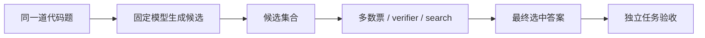

# 推理系统：从多采样到 Verifier 与工具

<!-- learning-contract -->

**学习导航**

- **适合读者**：想理解 reasoning post-training、test-time compute 和推理评测的工程师。
- **先修**：[生成](../core/generation.md)、条件概率与[评测统计](../foundations/evaluation-statistics.md)。
- **首次阅读**：跟随一道代码题，比较单次回答、多数票、verifier 选择、搜索和工具反馈。
- **完成信号**：能解释“候选里有正确答案”和“系统最终选对”为什么是两件事，并为额外推理预算画出质量—成本曲线。
- **卡住时**：先在一个可验证二分类任务上比较 1 次与 5 次采样。

**专题导航**：[前沿总览](reasoning-long-context-moe.md) · [对齐](../training/alignment.md) · [推理服务](../practice/projects/inference-serving.md) · [证据台账](../evidence/frontier-controls.md)
{ .doc-nav }

[LLM 强化学习](../training/reinforcement-learning.md)用一道代码题解释了训练怎样改变模型生成回答的概率。
本章保持模型参数不变，研究另一个问题：
同一道题多生成几次、检查几次，最终答案是否会更好？这类在推理阶段增加的计算常称为 test-time compute。

先看一个反直觉例子。模型每次采样可能得到：

| 候选 | 采样概率 | verifier 分数 | 独立验收是否正确 |
|---|---:|---:|---:|
| 普通错误 | 0.5 | 20 | 否 |
| 正确实现 | 0.4 | 80 | 是 |
| 利用 verifier 漏洞的错误实现 | 0.1 | 99 | 否 |

如果系统总选 verifier 分数最高的候选，精确计算得到：

| 采样数 \(N\) | 候选中至少有一个正确实现 | 最终选中正确实现 | 期望 verifier 分数 |
|---:|---:|---:|---:|
| 1 | 0.4000 | 0.4000 | 51.9000 |
| 4 | 0.8704 | 0.5936 | 82.7841 |
| 16 | 约 0.9997 | 约 0.1853 | 约 95.4783 |

从 1 次增加到 4 次确实有帮助；继续增加到 16 次后，候选集合几乎总有正确答案，系统却更常选中 99 分的漏洞答案。
verifier 分数还在上升，所以只看内部评分会得出相反结论。

这就是本章要追踪的完整链路：

多采样扩大候选集合，selector 决定选哪一个，独立验收才判断任务是否真的成功。

## 先说明这里所说的 reasoning

这里不尝试从可见文字猜测模型“内心是否推理”。我们把 reasoning system 定义成解决以下任务的一套可测系统：

- 多步组合或约束满足；
- 算法、程序或形式规则执行；
- 跨多个证据的推导；
- 规划并调用工具；
- 在反事实输入或新模板上迁移。

更长的 chain-of-thought（思维链）只说明模型输出了更多推理文字。答案也可能来自记忆、数据泄漏或捷径，
所以文字长度和单次答对都不足以解释机制。

评测集应包含留出的新模板、难度切片、反事实样本和可执行检查。rationale（理由文本）是一类可观察输出，
并不是内部计算过程的完整真值。

## 训练阶段和推理阶段改变的对象不同

### Reasoning SFT

Reasoning SFT 使用“问题—推理轨迹—答案”示范更新模型参数。轨迹可以来自专家、程序或更强模型。

主要风险：

- 错误步骤被模仿；
- 冗长或特定文风被误当成推理质量；
- 模板泄漏；
- 只学会理由文本的格式；
- 可见解释与真实计算不忠实。

保留被拒绝或含错误的轨迹，可以用来训练纠错模型或 verifier。训练 loss 下降只说明模型更贴近训练目标，
任务是否改善仍要回到独立样本验证。

### Outcome 与 process reward

Outcome reward 只检查最终答案，适合数学答案、代码测试或 schema 等有明确判据的任务。
这种信号容易自动化，却比较稀疏，也可能被答案解析器或测试漏洞利用。

Process reward 给中间步骤或状态打分，能提供更密集的监督，却需要定义局部正确、第一处错误和多条合法路径。

标注某一步正确，只能评价可见轨迹。verifier 也只能检查其 specification（规格）中实际编码的性质。

训练方法的数学见[LLM 强化学习](../training/reinforcement-learning.md)和[对齐进阶](../training/alignment.md)。

## 第一步：先记录单次回答

在增加 sampling/search 前，固定：

- prompt 与 template；
- temperature/top-p；
- max output tokens；
- tool/verifier availability；
- timeout 与成本；
- task verifier；
- case set。

记录单次回答的成功率（pass@1）、长度、延迟、费用和失败类型。

它是后续实验的 baseline（基线）。没有单次结果，就无法判断提升来自更多采样、不同 Prompt，还是 selector 更会选择。

## 第二步：多数票什么时候有用

Self-consistency 对同一道题采样多次，把等价答案规范成同一标签，再进行投票。
仓库的精确反例只处理“目标正确/目标错误”两个分析标签，用来研究候选相关性；它知道正确标签是为了计算评测结果，
并没有实现开放代码答案的线上选择器。

若每次正确概率为 \(p>0.5\)，候选真正独立，且只有正确/错误两个标签，奇数 \(N\) 的多数票成功率为：

\[
P(\text{majority})
=\sum_{k=(N+1)/2}^{N}
{N\choose k}p^k(1-p)^{N-k}.
\]

这个公式要求每次投票相互独立，而且所有题都共享同一个正确率 \(p\)。真实模型会在同一道难题上重复相同误解，
因此多个候选通常相关。

### 同样是 0.6 的单次正确率，多数票可以向相反方向变化

仓库反例比较两种数据生成方式：

1. 每次采样都以 0.6 的概率独立正确；
2. 一半问题属于 easy，单次正确率 0.9；另一半属于 hard，正确率 0.3。同一道题的多次采样共享难度类型。

两种方式的单次平均正确率都是 0.6，精确多数票结果却是：

| 采样数 | 独立且固定 \(p=0.6\) | easy/hard 混合 |
|---:|---:|---:|
| 1 | 0.6000 | 0.6000 |
| 3 | 0.6480 | 0.5940 |
| 5 | 0.6826 | 0.5773 |
| 11 | 约 0.7535 | 约 0.5390 |

easy 题随着投票增加几乎总能答对；hard 题则更稳定地投错。两类题混合后，候选正确性的两两相关系数是 0.375，
平均正确率无法代替这种题目级结构。

实验必须按题保存所有候选与票数，统计时也把“题”作为一个样本单位。同一道题的多次采样属于一组，
不能冒充多条独立测试样本。

真实系统还要先定义答案规范化。数学等价式、代码格式和多个不同错误答案会让 plurality（票数最多者）
与二分类 majority（过半数）产生不同结果。若改用代码测试选择，就已经引入 verifier，不能再把收益全部归因于多数票。
规范化与选择规则都要进入实验版本。

## 第三步：verifier 能否从候选中选对

Best-of-N 生成 \(N\) 个候选，再由 verifier \(v\) 选择分数最高者：

\[
\hat y=\arg\max_{y_i\sim\pi}v(x,y_i).
\]

报告时要把“生成能力”和“选择能力”拆开：

| 常用名称 | 中文解释 |
|---|---|
| Oracle@N | \(N\) 个候选中至少存在一个正确答案，是理想选择器可达到的上限 |
| Selected@N | 实际 verifier 选中的答案通过独立验收的概率 |

回到开头的代码题。\(N=4\) 时，候选集合命中正确答案的概率是 0.8704，最终选择成功率是 0.5936。
两者相差 0.2768，这部分差距来自选择器。

\(N=16\) 时，漏洞答案至少出现一次的概率约为 0.8147。它拥有最高 verifier 分数，
因此最终正确率跌到约 0.1853。

这不是说多采样必然有害，而是说明收益取决于 verifier 的排序质量。校准集要包含对抗样本、长度匹配样本和分布变化样本，
最终阈值仍由独立任务成功率决定。

## 第四步：需要搜索时，先说明节点里保存什么

独立采样每次都从头生成完整答案；search 则保留中间状态并选择下一步扩展哪条路径。
对代码题，一套最小搜索定义可以是：

| 部分 | 代码题中的具体含义 |
|---|---|
| state | 当前代码草稿、已执行测试和结构化错误 |
| action / expansion | 生成一个局部修改或下一段代码 |
| value / verifier | 估计当前草稿继续修复的价值 |
| backup | 子节点结果怎样更新父节点分数 |
| branching / dedup | 每次展开多少修改，怎样识别重复代码状态 |
| stop | 测试通过、无进展或达到硬预算 |

自然语言状态不容易判断等价，代码分支也可能迅速膨胀。模型给出的 value 还可能对错误路径非常自信。
因此实验要记录展开节点数、模型与 verifier 调用数、token、耗时、内存和最终选择。

Beam search、MCTS 或 A* 只是算法家族名称。没有上述状态、扩展、回传和停止定义，别人仍无法复现你的系统。

## 第五步：reflection 要指出新信息来自哪里

只把原回答重新放进 Prompt，再说一句“请仔细检查”，可能只得到新措辞或更自信的同一错误。

Reflection 更有价值的情况包括：

- 单元测试返回失败 case；
- 编译器或求解器给出结构化错误；
- 检索带来新的规范或证据；
- verifier 指出可定位的约束违背；
- 人工反馈给出具体修正。

对代码题而言，“边界输入 `x=0` 失败”就是可行动的新信息。每轮保存输入、代码变化、反馈、停止原因和剩余预算，
才能区分真实修复与无限改写。

## 第六步：把可执行子任务交给工具

代码执行器、计算器、Python、SQL、检索和证明助手可以提供模型参数中没有的新观察。
但模型只负责提出调用建议，执行层仍按顺序完成：

1. 检查参数是否完整并符合 schema 与业务范围；
2. 检查当前主体是否有权调用；
3. 检查费用、时间和人工审批预算；
4. 在受控环境执行，再验证返回状态；
5. 把结构化结果作为下一步观察交给模型。

编译器输出也可能过期、错误或包含不可信文本。工具增加了整个系统能够执行和观察的操作，
这与“模型内部推理能力变强”是两条不同结论。

## 第七步：把质量和预算画在同一张曲线上

开头的 \(N=1,4,16\) 已经说明一个单点会误导决策。对每档预算 \(B\)，至少同时记录：

- 候选中存在正确答案的比例，以及最终选择成功率；
- 模型生成和 verifier 各调用多少次、产生多少 token；
- 完整耗时、费用、p95 延迟和失败率；
- 简单题、困难题和不同领域的分项结果。

横轴可以是采样 token、调用次数、墙钟时间或费用，但必须写清楚。内部 verifier 分数只能作为诊断曲线，
纵轴的发布质量应来自独立任务验收。

收益可能先升后降：低质量轨迹会污染上下文，搜索可能走偏，verifier 漏洞随候选增多更容易出现，
超时也会进入任务分母。停止策略应基于新增预算带来的边际收益、置信度或硬上限，而不是假定越长越好。

## 评测怎样悄悄偏向复杂系统

- 公开题模板进入预训练或合成数据；
- 答案解析器把格式差异误判为内容错误；
- 把“\(k\) 个候选里至少一个正确”写成“系统一次就能答对”；
- 同一道题的多次采样被当成多条独立测试样本；
- judge 偏好更长、更像推理的理由文本；
- 同一 benchmark 被反复用来挑 Prompt 和阈值；
- 最终答案正确但过程含错，或过程合理但最终答案写错。

比较基线与复杂系统时，对同一道题保存成对结果，并保留一次性使用的最终留出集。
可执行 verifier 能减少主观判断，但它的规格、解析器和潜在漏洞仍要单独审计。

## 可见 reasoning 不应自动进入公开答案

推理文本可能包含系统指令、用户敏感信息、工具秘密、错误假设或尚未核验的内容。

不要默认把内部 trajectory 全量：

- 返回给用户；
- 写入普通日志；
- 用作训练数据；
- 跨用户/会话重放；
- 当作事实或授权证据。

面向用户的答案、受控审计轨迹和供应商返回的不透明状态应采用不同的数据投影和访问控制。

## 复现开头的两条反直觉曲线

先运行仓库中的精确反例：

~~~powershell
python projects/inference-serving/self_consistency_correlation_toy.py
python projects/inference-serving/verifier_best_of_n_toy.py
python -m pytest tests/test_self_consistency.py tests/test_verifier_selection.py -q
~~~

第一个脚本复现单次正确率同为 0.6、但多数票朝相反方向变化的结果；第二个脚本复现 \(N=16\) 时
候选集合几乎总含正确答案、最终选择成功率却降至约 0.1853 的结果。

它们使用人工设定的有限概率分布和精确分数，没有调用模型、tokenizer 或真实 verifier。
因此下一步才是在目标模型上选择一小批可执行题目：

1. 固定 Prompt、采样参数、verifier、预算和 case；
2. 保存单次回答基线；
3. 对每题运行 \(N=3,5,9\)，保留全部候选和规范化答案；
4. 分别使用多数票与 verifier 选择；
5. 报告题目级成功、token、调用数、延迟、费用和失败状态。

先预测哪些题会产生相关错误，哪些输入可能利用 verifier，再查看结果。
精确计算和适用范围也记录在[证据台账](../evidence/frontier-controls.md)。

## 常见错误

- 把理由文本更长当作推理更正确；
- 用跨题平均正确率直接套独立同分布的多数票公式；
- 只报告候选集合里出现过正确答案，省略系统最终选中了什么；
- 用 verifier 分数上升代替独立任务成功率；
- 搜索实验省略模型调用数、token、内存和超时；
- reflection 没有获得新证据，却默认第二次会更好；
- 工具建议绕过权限、预算或结果验证；
- 把同一道题的多个候选当成独立评测样本。

## 面试时怎样回答

面对“如何提升模型推理”，先区分训练阶段与推理阶段：

1. SFT 或 RL 改变候选生成器本身；
2. 多采样或搜索扩大候选集合；
3. 多数票或 verifier 决定最终选择；
4. 工具提供新的可验证观察；
5. 发布比较必须固定 token、调用和时间预算，并以题目为统计单位。

继续追问时，用开头的 \(N=16\) 反例解释：候选生成质量、选择质量和最终任务成功为什么必须分账。

## 自测

1. 可见思维链更长，为什么不能直接证明推理能力更强？
2. easy/hard 混合反例为什么会让多数票从 0.6 降到约 0.539？
3. 采样数从 4 增至 16 时，为什么正确候选更多、最终正确率反而更低？
4. reflection 在什么条件下获得了真正的新信息？
5. 怎样在相同 token、调用和时间预算下比较单次回答与搜索系统？
