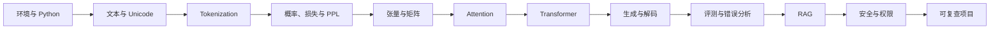

# 新手知识地图

如果你刚打开仓库，不知道该从 Tokenization、Transformer 还是 RAG 开始，这一页就是起点。
它只帮你决定三件事：今天先做什么，做完接哪一章，以及什么时候适合进入项目。
完整目录和实现状态留在[知识地图](knowledge-map.md)里，需要时再查。

**新手导航**：[30 分钟最小成功](#30-minutes) · [六周入门路径](learning-paths.md#beginner) · [环境配置](environment.md) · [术语表](../reference/glossary.md)
{ .doc-nav }

## 先做五项自检

把下面五项当作导航题，不是入学考试。某一行暂时做不到，就先读对应页面；已经熟悉的可以直接跳过。

| 如果你暂时做不到 | 先去哪里 | 达标信号 |
|---|---|---|
| 创建虚拟环境并运行 Python 脚本 | [环境与硬件矩阵](environment.md) | `python --version` 与最小脚本都成功 |
| 区分训练集、验证集和测试集 | [机器学习与深度学习](../foundations/ml-dl.md) | 能解释为什么不能用测试集调参 |
| 解释 logit、softmax、loss 和梯度 | [数学基础主线](../foundations/math.md) | 能手算一次三候选预测与更新 |
| 读懂 `[B,T,D]` 和矩阵乘法 | [线性代数](../foundations/math-linear-algebra.md) | 能标注 batch、序列和特征维 |
| 区分字符、byte、token id、logit | [NLP](../foundations/nlp.md)与 [Tokenization](../core/tokenization.md) | 能解释文本如何变成下一 token 概率 |

你只需回补眼前会用到的部分。例如看不懂 `[B,T,D]` 时，先学 shape 和矩阵乘法，没有必要先学完整套概率论；
概率或梯度卡住时，可分别直达[概率与信息论](../foundations/math-probability.md)和
[训练数学](../foundations/math-training.md)。

## 十二个节点形成主线

这条线回答的是“文本怎样进入模型，又怎样变成一个可评价的系统”。训练、微调、Agent 和推理优化会在后面
从不同位置分叉。第一次学习先走到一个带评测的小项目，再选择分叉，前后的知识会更容易接起来。

## 30 分钟最小成功 { #30-minutes }

先完成一个很小、但结果看得见的实验。它只使用 CPU 和仓库内文本，不下载模型，也不访问网络。

~~~powershell
python -m venv .venv
.venv\Scripts\Activate.ps1
python -m pip install -c constraints/ci.txt -e .
python projects/transformers-basics/train_byte_bpe.py
~~~

脚本结束后，花几分钟读输出。你应该能回答：

1. 当前中文和英文样例各用了多少 UTF-8 bytes，又各有多少 token？
2. `round_trip: true` 具体表示哪一步可以还原，和“这个 tokenizer 适合真实模型”有什么区别？
3. 在 BPE merge 记录里，哪一对 byte 先被合并？为什么是它？
4. 换一个 `--sample`。先猜 token 数会上升还是下降，再运行核对。

若出现模块导入失败，通常是因为命令不在仓库根目录执行，或者还没有安装 `-e .`。PowerShell 拒绝激活脚本时，
按[环境常见错误](environment.md#_5)处理，先让虚拟环境本身工作正常。

## 接下来怎样走

- **想理解模型内部**：按 [Tokenization](../core/tokenization.md) → [Transformer](../core/transformer.md) →
  [生成与解码入门](../core/generation-basics.md) 前进。走完后，你应能解释输入 token 怎样产生下一步概率。
- **想做应用**：从生成进入 [RAG](../applications/rag.md)，再补[评测](../quality/evaluation.md)和
  [安全与权限](../quality/safety.md)。错误分析是这条路线的一部分，不是项目结束后的附录。
- **已经有 ML 基础**：自检中熟悉的内容可以跳过，但仍建议跑一次最小实验，确认本地环境和仓库约定。
- **想做训练或系统**：完成[基础路线](learning-paths.md#beginner)的核心成果后，再选择
  [模型工程](learning-paths.md#model-engineering)或[系统工程](learning-paths.md#systems)。

准备进入工程项目时，留下一页短记录即可：你问了什么、运行前怎样预测、看到了什么、哪个反例改变了你的解释。
