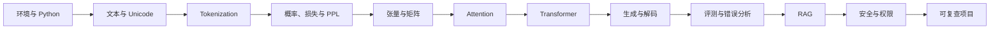

# 新手知识地图

这张图只回答三个问题：现在从哪里开始、下一步学什么、什么时候可以进入项目。它不是完整目录，也不要求一次掌握所有术语；需要查覆盖范围和实现成熟度时，再看[完整知识地图](knowledge-map.md)。

**新手导航**：[30 分钟最小成功](#30-minutes) · [六周入门路径](learning-paths.md#_2) · [环境配置](environment.md) · [术语表](../reference/glossary.md)
{ .doc-nav }

## 先做四项自检

| 如果你暂时做不到 | 先去哪里 | 达标信号 |
|---|---|---|
| 创建虚拟环境并运行 Python 脚本 | [环境与硬件矩阵](environment.md) | `python --version` 与最小脚本都成功 |
| 区分训练集、验证集和测试集 | [机器学习与深度学习](../foundations/ml-dl.md) | 能解释为什么不能用测试集调参 |
| 读懂 `[B,T,D]` 和矩阵乘法 | [数学基础](../foundations/math.md) | 能标注 batch、序列和特征维 |
| 区分字符、byte、token id、logit | [NLP](../foundations/nlp.md)与 [Tokenization](../core/tokenization.md) | 能解释文本如何变成下一 token 概率 |

自检不是入学考试。只回补当前任务需要的部分，不必先修完整本数学教材。

## 十二个节点形成主线

第一次只走实线顺序。训练、微调、Agent、推理优化和分布式系统都建立在这条主线之上，等完成一个带评测的小项目后再展开。

## 30 分钟最小成功 { #30-minutes }

这条路径只使用核心依赖、CPU 和仓库内置文本，不下载模型、不访问网络。

~~~powershell
python -m venv .venv
.venv\Scripts\Activate.ps1
python -m pip install -c constraints/ci.txt -e .
python projects/transformers-basics/train_byte_bpe.py
~~~

不要从 JSON 中挑一个“看起来正常”的值就结束。最低通过条件是：

1. 找到 `round_trip: true`，解释它只证明当前样例可逆。
2. 比较中文、英文样例的 `utf8_bytes` 与 `token_count`。
3. 指出 `evidence_boundary` 中至少两项当前实验没有证明的内容。
4. 修改一个 `--sample`，预测 token 数，再运行验证。

**常见失败**：模块导入失败通常表示没有在仓库根目录安装 `-e .`；PowerShell 禁止激活脚本时，先查看[环境常见错误](environment.md#_5)，不要改成全局安装来掩盖环境问题。

## 接下来怎样走

- 想理解模型内部：按 Tokenization → Attention → Transformer → Generation 前进。
- 想做应用：完成 Generation 后进入 RAG，再补评测、安全与权限。
- 已有 ML 基础：用自检跳过已掌握内容，但仍完成一次最小运行和反例。
- 想做训练或系统：先完成[入门路径](learning-paths.md#_2)，再选择工程或研究路径。

进入工程项目前，你至少应该能提交一份短记录：`问题 → 预测 → 命令 → 原始输出 → 反例 → 结论边界`。
