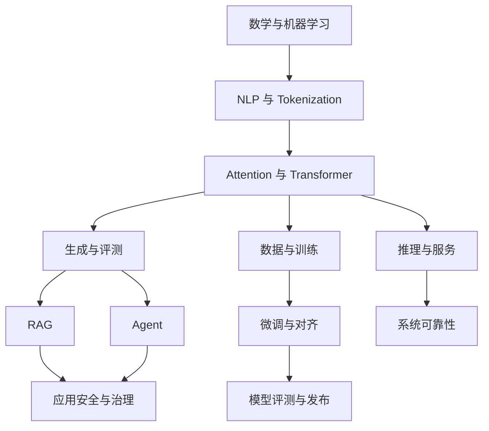

# 知识地图

这张地图描述章节之间的依赖关系。要查询单个学术术语、先修概念和易混淆关系，请使用[术语知识图谱](../reference/glossary.md)与[概念依赖地图](../reference/concept-map.md)。

项目成熟度、实验记录和版本信息分别放在[项目索引](../practice/project-index.md)、[实验目录](../practice/labs.md)和[参考资料](../reference/accuracy.md)中。

第一次学习时沿主干前进；遇到具体问题，再进入训练、应用或系统分支。

## 主干：先理解模型

| 阶段 | 主题 | 学完后应能做到 |
|---|---|---|
| 1 | [数学基础](../foundations/math.md)、[机器学习](../foundations/ml-dl.md) | 解释张量、概率、损失和梯度 |
| 2 | [NLP](../foundations/nlp.md)、[Tokenization](../core/tokenization.md) | 说明文本如何变成 token 与训练样本 |
| 3 | [Transformer](../core/transformer.md) | 写出注意力各张量形状并解释 causal mask |
| 4 | [生成入门](../core/generation-basics.md) | 区分 greedy、sampling、beam 和停止条件 |
| 5 | [评测](../quality/evaluation.md) | 为一个任务定义样例、指标和错误分类 |

完成主干后，你应该能够读懂常见模型的输入输出和训练目标，并知道一次输出为什么不能代表整体质量。

## 分支一：数据与模型训练

先修：主干 1–3。

1. [数据工程](../training/data.md)：数据来源、清洗、去重、切分和污染。
2. [预训练](../training/pretraining.md)：next-token objective、优化与训练稳定性。
3. [微调](../training/finetuning.md)：SFT、LoRA/QLoRA 与方法选择。
4. [对齐入门](../training/alignment-basics.md)：偏好数据、DPO/RLHF 的基本问题。
5. [分布式训练](../systems/distributed-training.md)：显存、并行策略和通信成本。

出口成果：一份包含数据契约、训练曲线、基线、失败样例和 held-out 评测的实验报告。

## 分支二：RAG 与 Agent 应用

先修：主干 2、4、5。

1. [Prompt](../applications/prompting.md)：任务契约和结构化输出。
2. [RAG 总览](../applications/rag.md)：检索、上下文、生成和引用。
3. [RAG 生产化](../applications/rag-production.md)：权限、索引生命周期和监控。
4. [Agent 总览](../applications/agents.md)：模型、工具、状态和停止条件。
5. [Agent 决策理论](../applications/agent-decision-theory.md)与 [Runtime](../applications/agent-runtime.md)：部分可观测决策、授权、幂等、恢复和人工确认。
6. [安全](../quality/safety.md)：提示注入、数据泄露和工具副作用。

出口成果：一个对无答案、冲突证据、越权请求和工具失败都有明确行为的应用。

## 分支三：推理与系统

先修：主干 3–4，并具备基本操作系统和网络知识。

1. [推理基础](../systems/inference.md)：prefill、decode 和 KV Cache。
2. [推理优化](../systems/inference-optimization.md)：量化、批处理和内存管理。
3. [vLLM 与单卡服务](../systems/vllm-serving.md)：服务启动、请求和容量实验。
4. [服务与可观测性](../systems/serving.md)：排队、限流、取消、SLO 和回滚。
5. [硬件与端侧](../systems/hardware-edge.md)：带宽、算力、显存和设备约束。

出口成果：一份区分 TTFT、TPOT、吞吐、错误率和资源占用的压测报告。

## 分支四：研究与前沿

先修取决于题目，至少应完成主干和对应工程分支。

- [架构与可解释性](../core/architectures-interpretability.md)
- [规模化规律](../core/scaling.md)
- [多模态](../frontier/multimodal.md)
- [推理、长上下文与 MoE](../frontier/reasoning-long-context-moe.md)
- [具身与小模型](../frontier/embodied-small-models.md)
- [近期论文解读](../papers/index.md)

出口成果：一个可证伪问题、明确基线、至少一项消融、重复实验和诚实的负结果。

## 怎样选择下一步

- 还不能解释 token、loss 或 attention：留在主干。
- 想尽快做产品：主干完成后进入 RAG，再学 Agent。
- 想训练模型：先学数据与评测，再学微调；不要从训练命令开始。
- 想优化服务：先建立正确的推理基线，再谈 kernel 或调度优化。
- 想读论文：先完成一个相关的最小复现，带着具体问题阅读。

更具体的周计划和成果要求见[学习路径](learning-paths.md)。
