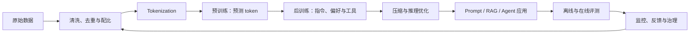

# About LLM

大语言模型不是一个孤立算法，而是一条从数据、表示、优化和分布式计算，到交互设计、评测、安全与治理的完整技术链。本手册帮助你同时回答三类问题：

- **它为什么有效？** 理解 token、Transformer、目标函数、规模化和涌现行为。
- **它怎样做出来？** 掌握数据处理、预训练、后训练、推理优化和服务系统。
- **怎样负责任地使用？** 学会评测事实性、鲁棒性、偏见、隐私和安全边界。

## 快速入口

| 你的目标 | 从这里开始 |
|---|---|
| 第一次使用这套手册 | [如何使用](guide/how-to-use.md) → [新手知识地图](guide/beginner-map.md) |
| 按主题查漏补缺 | [完整知识地图](guide/knowledge-map.md) |
| 理解文档、源码、Notebook 和项目的关系 | [仓库地图与实现契约](guide/repo-map.md) |
| 配置 Python、GPU 或云 API 环境 | [环境与硬件矩阵](guide/environment.md) |
| 直接动手做实验 | [实验与项目](practice/labs.md) → [工程项目索引](practice/project-index.md) |
| 跟进近期论文并核对证据边界 | [近期论文解读](papers/index.md) → [2026 年 8 月快照](papers/2026-08.md) |
| 核对事实来源和证据边界 | [内容准确性与核验台账](reference/accuracy.md) |

## 建议的第一小时

1. 用 5 分钟阅读[如何使用](guide/how-to-use.md)，再用[新手知识地图](guide/beginner-map.md)完成四项自检。
2. 基础薄弱时先读[机器学习与深度学习](foundations/ml-dl.md)、[NLP 与语言建模](foundations/nlp.md)的开头，再建立[文本到 token](core/tokenization.md)的心智模型。
3. 用 15 分钟完成[Byte-BPE 最小运行](guide/beginner-map.md#30-minutes)，得到第一个纯 CPU、无网络结果。
4. 按“解释机制 → 运行基线 → 制造反例 → 通过门禁”记录结果，不把“命令能跑”当作已经学会。
5. 最后浏览[知识地图](guide/knowledge-map.md)，只定位下一站，不要求一次读完全部主题。

## 一张图理解 LLM 生命周期

## 阅读层次

每个主题尽量区分四层，不要求一次全部掌握：

| 层次 | 你应该能做什么 |
|---|---|
| 直觉 | 用自己的话解释输入、输出和用途 |
| 机制 | 读懂关键公式、张量形状与算法步骤 |
| 实践 | 能运行实验、选择参数、分析失败案例 |
| 深入 | 能阅读论文、复现结果、质疑假设并设计改进 |

## 重要提醒

模型学习的是数据分布下的条件概率，不是可直接查询的事实数据库。它可能同时表现出强大的模式归纳能力和非常自信的错误。可靠系统依赖外部证据、约束、验证、权限控制和持续评测，而不只是“换一个更强的模型”。

下一步：先读[如何使用这套手册](guide/how-to-use.md)，或者直接选择一条[学习路径](guide/learning-paths.md)。
