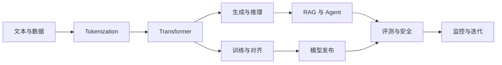

# About LLM

LLM 看起来像一个主题，真正学起来却很容易碎成许多互不相连的词：token、Attention、LoRA、RAG、Agent、
KV Cache……会解释其中一个词，并不代表能把一次请求从输入追到结果。

这套中文教材面向开发者和算法工程师。它沿着一条主线展开：文本怎样变成 token，模型怎样学习和生成，
RAG 与 Agent 怎样接入外部数据和工具，最后又怎样判断系统是否可靠。公式、代码和工程项目都围绕这条主线服务。

第一次来，请从[新手知识地图](guide/beginner-map.md)开始。它包含一次不下载模型、只使用 CPU 的 30 分钟实验。

## 你会获得什么

你不需要把整座站点读完。走完其中一条路线，至少应该能做四件事：

- 用张量形状和简单算例解释 Transformer，而不是只背结构图；
- 为 RAG、Agent 或微调任务建立可复现的基线与评测集；
- 分开判断模型能力、代码正确性和生产可靠性，知道一次 demo 到底说明了多少；
- 阅读论文和系统报告时，找出结论背后的数据、假设与适用范围。

## 选择学习方向

| 你的目标 | 建议入口 | 第一个成果 |
|---|---|---|
| 从零理解语言模型 | [基础路线](guide/learning-paths.md#beginner) | 手算注意力，并运行一个最小 tokenizer |
| 构建 RAG 或 Agent | [应用工程路线](guide/learning-paths.md#application) | 一个带引用、权限和错误分析的小系统 |
| 学习微调与训练 | [模型工程路线](guide/learning-paths.md#model-engineering) | 一次可解释的数据准备和训练实验 |
| 学习推理与部署 | [系统工程路线](guide/learning-paths.md#systems) | 一份延迟、吞吐、显存和失败路径报告 |
| 做论文复现 | [研究路线](guide/learning-paths.md#research) | 一项有基线、消融和负结果的复现实验 |

如果几条路线都感兴趣，先选最近要解决的那个问题。等做出第一个可运行成果，再补相邻路线会轻松得多。
[知识地图](guide/knowledge-map.md)适合用来查看它们之间的连接。

## 建议的第一小时

第一小时只做一件小事：看清一段文本怎样变成 token。

1. 打开[新手知识地图](guide/beginner-map.md)，确认本机能运行 Python。
2. 跑一次 Byte-BPE 小实验，把中文样例的 byte 数、token 数和 round trip 结果记下来。
3. 阅读 [Tokenization](core/tokenization.md) 的前半部分，为刚才的输出找到解释。
4. 换一段包含数字或 emoji 的文本。运行前先猜 token 数会怎样变化，再核对结果。

做到这里，你已经完成了一次“预测—观察—解释”的学习循环。之后每个主题都可以照这个方法推进。

## 一张图看完整主线

## 教材、实验和项目的关系

| 层次 | 用途 | 位置 |
|---|---|---|
| 教材 | 建立概念、公式和工程判断 | `docs/` |
| 实验 | 隔离一个机制，观察变量变化 | `notebooks/`、[实验目录](practice/labs.md) |
| 项目 | 把多个机制组合成完整工作流 | [项目索引](practice/project-index.md)、`projects/` |
| 参考 | 查询术语、来源和时效信息 | `docs/reference/` |

通常先读到能够提出预测，再做最小实验，最后才进入项目。仓库测试是维护者用来保护既有行为的，
它们全绿并不意味着你已经理解了结果。

## 阅读原则

阅读时可以反复问四个问题：

- 公式里的每个量，在当前例子中是什么形状、什么单位？
- 实验改变了哪个变量，又保留了哪些条件？
- 模型、API 和数据对应哪个版本、哪个时间点？
- “效果更好”具体好在哪个指标上，代价是什么，换一个场景还成立吗？

更具体的方法见[如何使用这套手册](guide/how-to-use.md)。环境配置、目录结构和贡献方式分别见[环境矩阵](guide/environment.md)、[仓库地图](guide/repo-map.md)与[贡献指南](https://github.com/NightLemon/about-llm/blob/main/CONTRIBUTING.md)。
