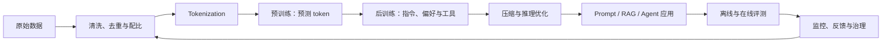

# About LLM

大语言模型不是一个孤立算法，而是一条从数据、表示、优化和分布式计算，到交互设计、评测、安全与治理的完整技术链。本手册帮助你同时回答三类问题：

- **它为什么有效？** 理解 token、Transformer、目标函数、规模化和涌现行为。
- **它怎样做出来？** 掌握数据处理、预训练、后训练、推理优化和服务系统。
- **怎样负责任地使用？** 学会评测事实性、鲁棒性、偏见、隐私和安全边界。

## 建议的第一小时

1. 用 10 分钟浏览[知识地图](guide/knowledge-map.md)，认识全貌。
2. 选择一条[学习路径](guide/learning-paths.md)，避免从论文海洋随机漫游。
3. 阅读 [Transformer](core/transformer.md) 与[生成](core/generation.md)，建立最小闭环。
4. 从[实验与项目](practice/labs.md)中的实验 0 开始，记录证据。

## 一张图理解 LLM 生命周期

## 阅读层次

每个主题尽量区分四层，不要求一次全部掌握：

| 层次 | 你应该能做什么 |
|---|---|
| 直觉 | 用自己的话解释输入、输出和用途 |
| 机制 | 读懂关键公式、张量形状与算法步骤 |
| 实践 | 能运行实验、选择参数、分析失败案例 |
| 深入 | 能阅读论文、复现结果、质疑假设并设计改进 |

## 重要提醒

模型学习的是数据分布下的条件概率，不是可直接查询的事实数据库。它可能同时表现出强大的模式归纳能力和非常自信的错误。可靠系统依赖外部证据、约束、验证、权限控制和持续评测，而不只是“换一个更强的模型”。
