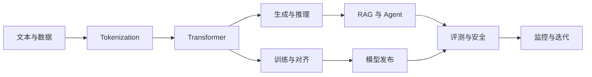

# About LLM

这是一套面向开发者和算法工程师的中文 LLM 教材。目标不是罗列术语，而是帮助你建立一条完整主线：文本怎样变成 token，模型怎样训练和生成，RAG 与 Agent 怎样接入外部世界，系统又怎样被评测、部署和治理。

第一次来，请从[新手知识地图](guide/beginner-map.md)开始。它包含一次不下载模型、只使用 CPU 的 30 分钟实验。

## 你会获得什么

学完一条完整路线后，你应该能够：

- 用张量形状和简单算例解释 Transformer，而不是只背结构图；
- 为 RAG、Agent 或微调任务建立可复现的基线与评测集；
- 区分模型能力、代码正确性和生产可靠性，不用一次 demo 代替结论；
- 阅读论文和系统报告时，判断证据支持了什么、遗漏了什么。

## 选择学习方向

| 你的目标 | 建议入口 | 第一个成果 |
|---|---|---|
| 从零理解语言模型 | [基础路线](guide/learning-paths.md#beginner) | 手算注意力，并运行一个最小 tokenizer |
| 构建 RAG 或 Agent | [应用工程路线](guide/learning-paths.md#application) | 一个带引用、权限和错误分析的小系统 |
| 学习微调与训练 | [模型工程路线](guide/learning-paths.md#model-engineering) | 一次可解释的数据准备和训练实验 |
| 学习推理与部署 | [系统工程路线](guide/learning-paths.md#systems) | 一份延迟、吞吐、显存和失败路径报告 |
| 做论文复现 | [研究路线](guide/learning-paths.md#research) | 一项有基线、消融和负结果的复现实验 |

还不确定方向时，先看[知识地图](guide/knowledge-map.md)，只选择一条主线，不必一次读完整站。

## 建议的第一小时

1. 用[新手知识地图](guide/beginner-map.md)完成四项自检。
2. 运行 Byte-BPE 最小实验，观察 byte、token 和 round trip 的关系。
3. 阅读 [Tokenization](core/tokenization.md) 的直觉与示例。
4. 修改一个输入，先预测输出变化，再重新运行。
5. 用三句话记录：我观察到了什么、为什么、还不能说明什么。

这套流程比从目录第一页顺序读到最后一页更有效。

## 一张图看完整主线

## 教材、实验和项目的关系

| 层次 | 用途 | 位置 |
|---|---|---|
| 教材 | 建立概念、公式和工程判断 | `docs/` |
| 实验 | 隔离一个机制，观察变量变化 | `notebooks/`、[实验目录](practice/labs.md) |
| 项目 | 把多个机制组合成完整工作流 | [项目索引](practice/project-index.md)、`projects/` |
| 参考 | 查询术语、来源和时效信息 | `docs/reference/` |

推荐顺序是“教材 → 最小实验 → 项目”，而不是先运行所有测试。测试用于保护代码回归，不是学习进度表。

## 阅读原则

- 看到公式时，先写出每个变量的形状和单位。
- 看到实验结果时，先找基线、控制变量和失败样例。
- 看到模型或 API 规格时，检查版本与查询日期。
- 看到“效果更好”时，追问指标、数据、预算和适用范围。

更具体的方法见[如何使用这套手册](guide/how-to-use.md)。环境配置、目录结构和贡献方式分别见[环境矩阵](guide/environment.md)、[仓库地图](guide/repo-map.md)与[贡献指南](https://github.com/NightLemon/about-llm/blob/main/CONTRIBUTING.md)。
