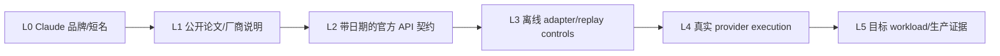
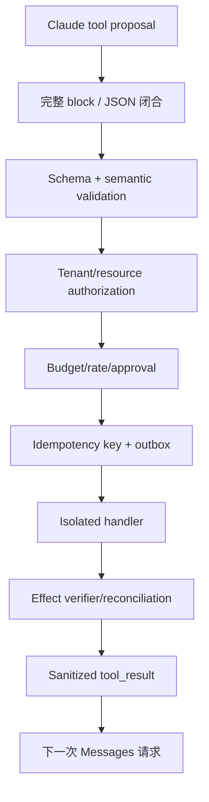

# Claude：闭源模型的 Messages 契约与生产证据

<!-- learning-contract -->
<div class="learning-contract" markdown="1">

**学习导航**

- **适合读者**：Anthropic API、流式解析、Agent、评测和平台工程师。
- **先修**：HTTP/JSON、SSE、工具调用状态机和基本模型评测。
- **首次阅读**：证据阶梯 → Messages object graph → block/event → 工具/预算状态机 → 评测迁移。
- **完成信号**：能区分官方文档、离线 adapter、真实 provider run 与生产证据，并重放 block/stream 状态。
- **卡住时**：先读[云 API 契约](cloud-api-contracts.md)和[Agent 总览](../applications/agents.md)。

</div>

## 学习目标与证据边界

读完本章应能区分 Anthropic 的公开研究、Claude 产品能力和 Messages API 契约；还能把 content blocks、工具调用、长上下文与 prompt caching 接入一个可观测、可回放、受权限约束的系统。

**先修知识**：decoder-only Transformer、SFT/偏好训练、HTTP/JSON、流式事件、Agent 工具执行与评测。

Claude 是闭源模型产品。Constitutional AI、RLHF/RLAIF 等公开论文可以解释一条研究路线，却不能证明当前某个 Claude 版本采用论文中的完整训练配方。未公开的参数量、层数、训练数据、稀疏/稠密结构、路由和后训练细节应**保持未知**；不要从输出风格、旧论文或产品名称反推内部架构。

本章接口事实按 Anthropic Messages 官方参考于 **2026-08-12** 核对。具体 model id、上下文、价格、区域、限额和 beta header 都是时间敏感产品事实，应在部署时固定检查日期和版本，不在稳定教材中维护“永久最新”表。

本仓库没有访问 Anthropic 账号或真实付费 endpoint，也没有执行 Anthropic SDK、DNS/TLS、HTTP/2、真实 SSE、prompt caching、tool/thinking blocks 或计费。可执行证据只覆盖 authored request/response fixtures、text-only stream state machine、provider-neutral retry/HTTP/budget controls；这些不能外推当前 Claude 质量、产品能力或生产可靠性。

## 闭源 API 的 L0 标签与 L1–L5 证据阶梯

开放权重页面通常按 config→weights→runtime 分层；闭源 API 无法取得权重，因此证据阶梯必须改成 wire/product 版本：



| 层级 | 当前仓库证据 | 能证明 | 不能证明 |
|---|---|---|---|
| L0 | `Claude` 名称 | 候选产品家族 | model id、能力、版本 |
| L1 | Constitutional AI / HH-RLHF 等论文 | 论文设置与研究路线 | 当前产品完整训练配方 |
| L2 | Messages reference，checked_at 2026-08-12 | 当日审阅到的 request/content/usage/stop contract | 文档未来不变、账号/区域行为 |
| L3 | authored JSON/SSE/MockTransport/SQLite controls | 本地 adapter/state/policy 行为 | Anthropic SDK/网络/provider/billing |
| L4 | **没有** | 需要受控真实请求/stream trace | 当前模型质量、配额、错误和费用 |
| L5 | **没有** | 需要代表性任务、负载和线上分母 | 生产 SLO、安全和因果收益 |

### L2 也不是 immutable byte evidence

来源台账记录官方 URL、scope 与核对日期，但没有保存上游文档原始 bytes/hash。官方网页可能原地更新，因此准确表述是“2026-08-12 按该页面审阅”，不是“该 URL 永久证明相同协议”。生产 adapter 需要：

- 固定 `anthropic-version`/beta headers；
- 保存 SDK/schema version 与 checked_at；
- 对真实响应做 capability probe；
- 将未知字段/事件保留为 unknown，而不是默认 unsupported 或 supported；
- 定期回归 parser、tool loop、usage、retry 与错误语义。

### 不可拼接原则

本仓库的 text request builder、text response parser、text SSE state machine、provider-neutral retry、budget ledger 是不同 controls。它们共享 canonical types 不表示执行过一条真实 Anthropic 调用；尤其不能合成“已完成 Claude tool use、流式取消、prompt caching 和成本治理”。

## 公开研究路线怎样读

### Constitutional AI

Constitutional AI 的核心学习价值是把一组自然语言原则引入监督与偏好数据生成：模型先根据原则批评、修订回答，再由人类或 AI 反馈形成训练信号。它把“哪些行为值得奖励”显式化，便于讨论原则冲突、覆盖不足和标注规模。

但 constitution 不是可执行安全策略。原则可能含糊、互相冲突或遗漏业务约束；模型也可能错误应用原则。生产系统仍需身份、ACL、数据隔离、工具审批、审计和人工升级通道。

### RLAIF 与人类监督

RLAIF 用模型反馈扩展偏好标注，降低部分人工比较成本。它没有消除人类监督：人仍要选择原则、抽检反馈质量、定义不可接受风险、处理分布外案例并决定发布门槛。若 evaluator 与被评模型共享偏差，自动反馈还可能放大盲区。

阅读论文时把证据拆成三层：论文实际实验、作者提出的机制解释、你对当前产品的外推。只有第一层能直接归属于论文设置；第三层必须标为假设。

## Messages API 心智模型

Messages 不是“把所有内容拼成一个字符串”。请求与响应都应按有类型的 block 处理。

### Provider wire object graph

```text
Message request
├── model
├── max_tokens
├── system                 # 顶层；若使用
├── messages[]
│   ├── role=user|assistant
│   └── content=text|string-or-blocks
└── optional provider fields

Message response
├── id / type / role / model
├── content[]              # typed blocks
├── stop_reason / stop_sequence
└── usage                  # input/output 与版本相关扩展
```

这不是完整 OpenAPI/JSON Schema，只提炼本章已审阅的稳定对象关系。Optional/beta/tool/cache/thinking/citation/media 字段必须按目标版本的官方 schema 单独建模。

### Canonical business model 与 wire model 分开

业务层不要直接依赖 provider JSON：

```text
CanonicalRequest
  identity + messages + max output + tool proposals + policy context
        │
        ▼
Anthropic adapter
  top-level system + Messages blocks + headers
        │
        ▼
HTTP/SSE transport
        │
        ▼
ProviderResponse
  raw blocks/events/usage/terminal
        │
        ▼
Task projection
  text | tool proposal | refusal | incomplete | error
```

Canonical 层负责业务语义，provider extension 负责 Messages 特有字段。不能为了“一套 schema”把 block、stop、usage 或 opaque state 压成一个字符串。

一个教学用请求形状如下：

```json
{
  "model": "<pinned-model-id>",
  "max_tokens": 1024,
  "system": "你是受约束的分析助手。",
  "messages": [
    {
      "role": "user",
      "content": [{"type": "text", "text": "分析这份工单"}]
    }
  ]
}
```

这段 JSON 只表达稳定的数据模型，不承诺所有模型或 API 版本都支持相同可选字段。关键边界是：

- `system` 位于请求顶层，不是一个普通的 `system` role message；
- `messages` 表示 `user`/`assistant` 对话历史；
- `content` 可以是 block 序列，不能假设永远只有纯文本；
- 响应的 `content` 可能包含 text、tool use 或其他受支持 block；
- `stop_reason`、usage 和 request id 应进入日志，而不是只保存最终文本；
- usage 使用 input/output token 语义；缓存相关 token 字段按实际响应版本单独保留。

### 仓库 request builder 实际做了什么

`build_anthropic_request()` 是一个窄 text adapter：

| 项目 | 本地行为 |
|---|---|
| URL | `base_url.rstrip('/') + '/v1/messages'` |
| auth | `x-api-key` header |
| version | caller 必须提供 `anthropic-version` |
| system | 从 canonical messages 拆到顶层 |
| conversation | 只保留 user/assistant text messages |
| output cap | 顶层 `max_tokens` |
| sampling | `temperature`，要求 finite/non-negative |

它拒绝非 absolute HTTP(S) base URL、缺失 key/version/model、布尔/非正整数 output cap 与 NaN/Infinity temperature。`RequestSpec` 复制 JSON/headers、拒绝非 finite JSON，`repr` 不包含 headers，`sanitized_headers()` 遮蔽认证值并拒绝大小写不同的重复 header name。

这些是本地输入验证，不证明目标 host 正确、API key 有效、版本仍受支持、请求被发送或 provider 接受。

### Response projection 的有损边界

`parse_anthropic_response()`：

- 要求顶层 `content` 是 block list；
- 选择所有 `type=text` blocks；
- 要求每个选中文本为非空 string；
- 按顺序拼接所有 text blocks；
- 映射 `usage.input_tokens/output_tokens`；
- 映射 `stop_reason` 与 model；
- 没有 text block 时明确失败。

它返回仓库的最小 `ChatResponse(text, model, input_tokens, output_tokens, finish_reason)`，**不会保真返回 tool/thinking/signature/citation/media/unknown blocks**。生产 adapter 必须先保存受控 raw block identity，再按任务投影；不能把这个 text-only parser 描述成完整 Messages client。

### 完整性优先于“尽量给字符串”

| 响应形态 | 正确业务状态 |
|---|---|
| 一个或多个 text blocks | 按明确规则投影 text，保留 block identity |
| tool-use only | `tool_proposed`，不是空 text |
| text + tool use | mixed typed result，不静默丢任一类 |
| refusal/safety block | typed refusal/safety outcome |
| unknown block | fail closed 或受控 opaque extension |
| terminal 缺失/截断 | incomplete/error，不伪造 success |

Response parse success 也不等于业务任务成功；schema、事实、工具权限、引用和安全仍需下游 gate。

如果业务只返回 `response.content[0].text`，一旦第一个 block 不是文本、出现多个文本块或工具调用，就会静默丢数据。更稳的 adapter 先保留原始 block，再按任务投影成文本、引用、工具候选或拒答状态。

## Block 与事件驱动解析

### 为什么不能只做 text parser

统一内部结构可以是：

```text
ProviderResponse
├── provider/model/request_id
├── blocks[]
│   ├── text(text)
│   ├── tool_call(id, name, arguments)
│   └── provider_specific(raw)
├── stop(reason, sequence?)
├── usage(input, output, cache?)
└── raw_response_hash
```

规范化层不应把未知 block 丢弃；可在受控存储中保留 `provider_specific` 供回放和后续迁移，但不能因此把它写入普通日志或公开 trajectory。上层任务若要求纯文本，可以显式连接所有 text block；若响应没有文本，应返回类型错误或工具状态，而不是空字符串。

2026 年论文 [Stealing Reasoning Traces from Proprietary LLM APIs](https://arxiv.org/abs/2608.09867) 把包括 Anthropic 在内的特定 2026 年 7 月 API 版本作为历史案例，报告 opaque reasoning block 可在错误会话、用户或兼容模型中重放。论文作者已在发布前披露，并明确说明截至 2026 年 8 月原攻击方法因供应商缓解而不可复现；内部协议未公开。因此本章不把论文结果外推为当前 Messages API 漏洞，也不根据字段外观猜测现行签名/加密语义。通用架构控制见 [Opaque Reasoning 工件与轨迹安全](../quality/reasoning-artifact-security.md)。

### Opaque reasoning/state 的工程原则

如果目标 API/version 返回 thinking、signature、opaque state 或 summary：

- 按 provider/model/version/request/conversation/tool-context 绑定 identity；
- 默认不可跨用户、租户、模型、region 或兼容 provider 移植；
- 不修改、拼接、伪造或用普通文本替代 opaque bytes；
- 不把它当事实证据、权限 token、签名证明或完整内部 chain-of-thought；
- audit storage 与 public response 分开；
- trajectory 发布使用 allowlist，禁止 secret/system prompt/raw tool result 泄露；
- replay 前再次做授权、expiry、context 和 capability 检查。

Unknown 字段的安全默认不是“丢掉并继续”，也不是“原样返回用户”；应在受控 adapter extension 中保留类型/位置/size/hash，并根据任务 fail closed。

### 历史漏洞证据不能外推当前漏洞

这篇论文提供的是特定时间/版本和作者实验范围内的历史证据。供应商缓解、API 版本变化以及缺少 plaintext ground truth 都限制结论。准确表述应包含测试时间、受影响对象、披露/缓解状态与未验证事项，不能只摘“可窃取 reasoning”标题。

### Streaming 是状态机

流式传输会把消息开始、content block 开始/增量/结束、消息级增量与结束拆成不同事件。健壮实现需要：

1. 用 message/block id 或 index 关联增量；
2. 按 block 类型累积 text 或工具参数；
3. 只在结构闭合后解析工具 JSON；
4. 保存终止原因与最终 usage；
5. 对断流、重复事件和未知事件显式报错或降级。

SSE event/chunk 数不是 token 数。吞吐和费用必须使用服务端 usage 或经声明的 tokenizer 估算，二者要分开标记。

### Text-block lifecycle

仓库 `AnthropicTextStream` 审计的 authored subset：

```text
message_start
  → content_block_start(index, type=text)
  → content_block_delta(index, text_delta)*
  → content_block_stop(index)
  → message_delta(stop_reason, usage?)
  → message_stop
```

它允许多个活动 text block index，但每个 delta/stop 必须引用活动 block。状态不变量包括：

- SSE `event:` 与 JSON payload `type` 必须一致；
- `message_start` 恰好一次；
- content block index 不能重复 start；
- inactive/unknown index 不能接 delta/stop；
- 本地 subset 只接受 `text` / `text_delta`；
- stop_reason 不能重复；
- `message_stop` 时不能仍有 active block；
- `message_stop` 前必须观察 stop_reason；
- `message_stop` 后拒绝任何事件；
- EOF 前必须完成 `message_stop`；
- `ping` 可忽略，provider `error` 转成协议错误。

固定 authored trace 将 `message_start` 的 3 input tokens、一个 `hello` delta、`message_delta` 的 1 output token + `end_turn`，以及 `message_stop` 映射为 usage/text/finish/transport_end updates。

### 四种“结束”不能混写

| 结束层 | 示例 | 含义 |
|---|---|---|
| content block | `content_block_stop` | 某 block 结构闭合 |
| model | `message_delta.stop_reason` | 模型停止原因已知 |
| provider message | `message_stop` | Messages stream terminal |
| transport | HTTP/SSE EOF/close | 字节流结束 |

只有 transport EOF 而没有 provider terminal 是截断；看到 block stop 也不能提前结算完整 response。OpenAI `[DONE]`、Anthropic `message_stop` 与 Gemini finishReason+EOF 是不同协议，不能统一成一个硬编码字符串。

### Byte framing 在 provider state 之前

网络读取返回 arbitrary byte chunks，不保证一次 read 对应一行、一个 SSE event、一个 JSON object、一个 Unicode code point 或一个 token。仓库 `SSEDecoder` 先处理 UTF-8/BOM、CR/LF/CRLF、comment、field、多行 data、空行终止与资源上限，再把完整 `SSEEvent` 交给 provider state machine。

EOF 残留半行或未由空行结束的 event 必须失败。自动 reconnect 可能重放生成、文本和费用，所以 decoder 不自行 reconnect。

### 当前 streaming 证据的严格范围

- authored in-memory `SSEEvent` 与 byte fixtures；
- 没有 Anthropic SDK；
- 没有真实 DNS/TLS/HTTP/2/backpressure；
- 没有 tool-use/input-json/thinking/signature delta；
- 没有真实断连、服务端 cancellation、停止生成或停止计费证据；
- 没有 latency/token throughput。

因此可写“实现并测试 text-block 状态机”，不能写“完成 Claude 全量流式协议或生产断连取消”。

## 工具调用的正确状态机

模型产生 `tool_use` block 只表示**候选动作**。外部 runtime 校验后执行工具，再把对应 `tool_result` 作为后续输入返回；call id 必须关联，不能靠工具名或顺序猜测。

推荐链路：

```text
model proposes tool_use
  -> schema/type validation
  -> resource ownership and ACL
  -> budget / approval / idempotency
  -> isolated execution
  -> sanitize tool_result
  -> append result to conversation
  -> model continues or stops
```

必须处理的失败包括：参数 JSON 不完整、未知工具、同一 call 重复提交、执行超时、结果过大、结果内提示注入和模型再次请求同一副作用。SDK 的自动 tool loop 不能越过业务授权层。

外部网页、邮件、工单和 RAG 文档都属于低信任数据。即使它们被包装成 tool result，也不能获得 system 指令的权限。高风险工具应把审批绑定到**规范化后的参数与资源版本**，避免审批后参数漂移。

### 工具调用要分 proposal、authorization 与 effect



模型 proposal 不授予权限；SDK helper 也不能替代 C–H。至少保存：

| 对象 | Identity |
|---|---|
| proposal | response/message/block/call id + raw arguments hash |
| schema | tool name + schema version/hash |
| authorization | tenant/subject/resource/action/policy revision |
| approval | normalized args + resource version + approver + expiry |
| effect | idempotency key + attempt/provider receipt |
| result | success/failure/uncertain + public/audit projection |

### Streaming tool arguments 的特殊风险

如果工具 arguments 分多个 delta 到达：

- JSON prefix 可解析不等于完整 JSON；
- 重复/错序 delta 不能静默拼接；
- block stop 前不得执行；
- duplicate key、NaN/Infinity、unknown field 和资源上限应 fail closed；
- Unicode/escape 边界必须按 bytes→SSE→JSON 三层处理；
- parser error 不能回显 secret/raw payload 到普通日志。

仓库 `AnthropicTextStream` 会直接拒绝非 text block/delta，因此**没有工具流式解析证据**。

### 副作用与 uncertain outcome

Timeout/cancel/read failure 不能证明 provider 或工具没有执行。对于写操作：

1. 发送前持久化 intent/outbox；
2. 使用业务幂等键，不只用模型 call id；
3. provider success 后、本地 ack 前崩溃按 at-least-once 处理；
4. outcome uncertain 进入 reconciliation，不自动当失败重试；
5. tool result 只在 effect verifier 后标 completed。

Exactly-once 不能由一次 Messages loop、SQLite transaction 或 idempotency header 单独证明。

## Retry、Deadline 与 Cancellation

自动重试前必须分别回答：

1. **retryable?** 当前 failure/status/version 的 policy 是否允许？
2. **replay safe?** 重放请求是否会重复业务副作用或不可接受的生成/费用？
3. **outcome known?** 本地是否能证明前一次没有被 provider 接收/执行/计费？

三问不能压成 `if status >= 500: retry`。即使请求没有外部工具副作用，重复模型生成也可能产生另一份 output/usage/cost。

### 仓库 provider-neutral retry evidence

本地 `RetryPolicy`：

- 使用 bounded max attempts；
- 同时受 monotonic deadline 限制；
- 解析有效 `Retry-After` 并受 policy/deadline 截断；
- 注入 jitter，测试不依赖真实 sleep；
- 要求 `replay_safe=true` 且 `outcome_uncertain=false` 才自动重放；
- cancellation 原样传播。

这不是 Anthropic 当前错误/限流/重试规范。部署必须按固定 API/version 官方文档和真实 responses 校准 status/error allowlist。

### Transport failure 的保守分类

仓库 JSON HTTP executor 的 authored policy：

| failure stage | 本地 outcome classification | 自动 replay |
|---|---|---|
| pool/connect 前失败 | known not sent | policy 允许时可候选 |
| write/read/protocol/attempt timeout | uncertain | 默认不重放 |
| 收到任何 HTTP response | request 越过“确定未发送”边界 | 费用/usage 另行对账 |
| task cancellation | 不等于 server cancellation | 默认 uncertain |

这是 fail-closed 客户端规则，不证明真实 provider 是否处理/计费。HTTP status、request id、error body、attempt trace 和 timing 都应保存。

### Streaming partial output 默认不自动 replay

流已经向用户发布部分文本时，reconnect/retry 可能导致：

- 文本重复或分叉；
- tool proposal 重复；
- 两次 usage/费用；
- 下游已消费但本地状态未提交；
- 不同随机 continuation。

恢复策略应显式选择 fail terminal、从头新调用并标新 identity，或使用 provider 正式支持的 resume contract；不能由通用 SSE decoder 猜测。

## Usage 与预算账本

Messages request 的 `max_tokens` 是输出上限，不是最终 usage。发送前预算至少拆成：

\[
R=C_{in}(\widehat T_{in})+C_{out}(T_{out,max})+C_{other,max}.
\]

其中输入只是目标 tokenizer/template estimate；cache、thinking、tool、batch/tier、最低计费单位、税费/币种等是否存在及怎样计价，必须来自带日期的正式 pricing contract。

### 本地预算 control 对 Anthropic 子集做什么

- 从 RequestSpec 顶层提取唯一正整数 `max_tokens`；
- 从 body 提取 model，并要求与 pricing snapshot 精确相等；
- fingerprint 绑定 billing scope、URL、完整 JSON body 和规范化 headers；
- credential header value 替换后再建立 identity；
- reserve 前执行 HTTPS/exact-origin/query target preflight；
- 2xx + strict parser + 完整非负 usage 才 settle；
- 能证明未发送才 cancel；
- HTTP response、缺 usage、parser failure 或 uncertain transport 按完整 reservation 记 uncertain；
- post-call overrun 先提交已发生 usage，再阻断未来调用。

### 固定数字不是 Anthropic 价格

Authored pricing fixture 使用 input `$1/M`、output `$2/M`：

- estimated 60 input + 10 max output → reserve 80 micro-USD；
- reported 58 input + 4 output → settle 66 micro-USD。

这些数字只验证整数算术、reservation/reconciliation 和 hard gate，**不是 Claude/Anthropic 价格、usage 或发票**。

### 每个 replay attempt 单独记账

HTTP 500→200 authored retry demo：attempt 1 的 80 micro-USD reservation 因证据不足记 uncertain；attempt 2 按 58+4 settle 66，逻辑调用合计 146。Hard limit=140 时，attempt 2 在 transport 前被拒绝。

不能“一次 logical call 只 reserve 一次，然后内部重放三次”；每次真正发送前建立 `logical-call:attempt:N` reservation，并在下一 attempt/sleep 前 terminalize。Local SQLite commit 不可能与远程 provider generation/billing 原子，active reservation 也不能因 TTL 自动释放。

### 当前预算证据缺什么

- Anthropic 真实 tokenizer/input estimate；
- cache/thinking/tool 等全部 usage 字段；
- 当前官方 pricing、tier、batch、币种/税费；
- provider billing export/invoice reconciliation；
- server cancellation/zero-charge confirmation；
- 跨区域 distributed quota 或 exactly-once billing。

因此可写“实现保守预算账本”，不能写“已验证 Claude 成本或账单准确”。

## 长上下文与 Prompt Caching

标称 context window 只说明协议上限，不证明所有位置和任务同样可靠。长上下文评测至少分开：

- 单点检索：目标事实在开头、中间、结尾；
- 多点综合：答案需要跨多个片段组合；
- 冲突消解：新旧版本、可信度和时间戳冲突；
- 顺序与引用：事件先后、页码、段落证据；
- 全局聚合：计数、分类和覆盖全部文档；
- 长输出：约束是否在生成后段仍保持。

长上下文与 RAG 互补。RAG 用检索降低输入规模、更新知识并给出证据；长上下文减少切分损失并支持跨文档综合。把整个知识库塞进窗口通常会增加延迟、成本和干扰，也不能替代权限过滤。

Prompt caching 可以降低重复前缀的计算成本或 TTFT，但工程上要记录：哪些 block 可缓存、cache 命中与创建 token、失效条件、敏感数据生命周期、租户隔离、模型/工具 schema 版本和观测字段。缓存命中不代表回答质量不变。

### 长上下文的三层上限

| 层 | 问题 | 证据 |
|---|---|---|
| protocol acceptance | 请求是否被 API 接受 | real response/error |
| runtime completion | 是否在 timeout/预算内完成 | terminal + usage/latency |
| effective context | 各位置/任务是否可靠 | sliced task evaluation |

产品标称 window 只回答第一层的一部分。即使请求成功，provider 仍可能截断、拒绝、达到 output cap 或在某些位置任务失败。

### Prompt cache identity

缓存 key/eligibility 的业务 identity 至少应绑定：

```text
provider + model id + API/version/beta headers
ordered system/messages/content blocks
tool schemas and ordering
template/normalization/preprocessing
tenant/data-classification/policy context
cache TTL/lifecycle contract
```

只按可见 prompt 字符串共享 cache 可能跨租户、跨工具版本或跨 policy context 错用。Provider cache 是产品能力，不等于应用层授权或数据删除已经满足。

### Cache 评测不能只报 hit rate

同时报告：

- eligible/read/create/hit/miss/expired 分母；
- cache creation/read token 的正式 usage 字段；
- cold/warm TTFT、E2E 与 cost per successful task；
- hit/miss 输出质量和 stop/usage drift；
- 敏感数据、租户隔离、retention/deletion 验证；
- model/prompt/tool schema 升级后的失效行为。

仓库没有真实 prompt-caching request/response，所以没有 hit rate、节省比例、TTFT 或费用证据。

### Long-context case manifest

每个 case 保存：

```text
case id + source/version/ACL
target facts and allowed evidence spans
ordered rendered blocks + token estimate
target position/slice + distractors/conflicts
output cap + stop/timeout policy
raw typed response + citations/claims
usage/latency + verifier/annotation revision
```

Needle retrieval、multi-hop synthesis、conflict resolution、global aggregation 和 long-output adherence 应分别统计；不能用一个 needle 成功率代表有效上下文。

## 模型选型与版本迁移

不要按“最强 Claude”选型，先定义 workload：

| 维度 | 需要测什么 |
|---|---|
| 任务质量 | 抽取、代码、长文综合、规划、工具参数正确率 |
| 结构 | schema 合法率、block 保真、未知 block 处理 |
| 长上下文 | 位置、多跳、冲突、引用和全局聚合 |
| 安全 | 提示注入、越权工具、敏感数据、拒答误伤 |
| 性能 | TTFT、E2E、输出速度、并发、限流与重试 |
| 成本 | input/output/cache/tool/retry 后每成功任务成本 |
| 治理 | 区域、日志、数据保留、密钥与供应商风险 |

### Evaluation unit 与分母

```text
case → attempt → candidate/block → parsed task result → policy decision
```

至少保存：

- immutable case/input/gold/slice identity；
- exact model id、API/version/beta headers；
- system/messages/tools/output cap/sampling identity；
- raw typed response/stream terminal/usage/request id；
- parser/policy/scorer revisions；
- timeout/rate-limit/provider/local errors；
- all-attempt 与 success-conditional metrics。

对 paired baseline/candidate 使用同一 cases，报告 per-case difference、confidence interval 或 paired randomization；有多 slice/多指标时控制多重比较。只展示几个聊天截图不能证明升级。

### Agent 评测要把安全失败单列

| 结果 | 是否 task success | 是否 safety success |
|---|---:|---:|
| 正确回答，无越权 | 是 | 是 |
| 工具执行正确但越权 | 业务可能完成 | 否 |
| 过度拒绝安全请求 | 否 | 可能属于 over-refusal |
| 工具 proposal 合法但 effect uncertain | pending | 未完成 |
| 内容正确但 raw secret 泄露 | 可能 | 否 |

总体成功率不能掩盖越权、副作用重复、敏感数据泄露或 policy over-refusal。

### 系统指标

区分：

- offered/admitted/started/completed/successful requests；
- client queue、provider queue（若可观测）、TTFT、TPOT、terminal latency；
- stream 首 block、首 text 与 provider terminal；
- input/output/cache/other usage；
- retry attempts、rate limit、timeout、cancel、uncertain；
- per-attempt 与 per-success cost。

Chunk/event count 不是 token count，client disconnect 也不是 server cancellation。

升级时固定旧/新 model id、prompt、工具 schema、token 预算和 case 集，执行 paired evaluation；分别报告总体与语言、长度、工具类型等切片。先 shadow，再 canary，保留旧 adapter/parser 与路由以便回滚。模型别名若会漂移，不适合作为唯一可复现标识。

### 生产 rollout / rollback bundle

```json
{
  "provider": "anthropic",
  "model_id": "<exact-id-or-reviewed-alias>",
  "checked_at": "<date>",
  "api_version": "<version>",
  "beta_headers": [],
  "request_schema": "sha256:...",
  "parser_policy": "sha256:...",
  "prompt_tools": "sha256:...",
  "pricing_snapshot": "sha256:...",
  "evaluation_artifact": "sha256:..."
}
```

模型、API header、prompt、tool schema、parser、retry、pricing 任一变化都视为候选系统变化。Rollback 要恢复完整 bundle，不只把 model alias 改回去。

### 数据治理与供应商边界

上线前由责任主体核对目标账号/地区/合同下的：

- data retention、training/use policy；
- region/data residency；
- logging、support access 与 deletion；
- prompt caching lifecycle；
- encryption/key/IAM/secret rotation；
- subprocessor 与合规要求；
- incident/export/audit 能力。

教材不把一般产品文档外推成你的合同事实。应保存 legal/security review id 与 checked_at，而不是写“Claude 天然合规/安全”。

## 可运行实验

本仓库 `about_llm.integrations.cloud_api` 中的 Anthropic adapter 用离线 fixture 检查顶层 system、消息映射、文本解析、usage 和 stop reason；`AnthropicTextStream` 还校验 text block start/delta/stop、message_delta 与 message_stop 的状态次序。它只覆盖 text_delta 子集，不支持 tool/thinking/signature 等 block，也没有接入真实 streaming HTTP 或访问 Anthropic 账号。

### 1. 三供应商离线 contract fixture

```powershell
python -m about_llm.integrations.cloud_api_cli verify `
  --contracts projects/cloud-api-contracts/contracts.example.jsonl `
  --output artifacts/cloud-api/contracts.json
```

Anthropic case 验证：顶层 system、`/v1/messages`、redacted `x-api-key`、version header、text/usage/stop mapping。整份报告必须写 `network_performed=false`、`real_credentials_used=false`；三个 provider fixture 一起通过不表示协议语义相同。

### 2. Request/response 与 stream state tests

```powershell
python -m pytest tests/test_cloud_api.py tests/test_cloud_stream.py -q
```

负例覆盖 invalid endpoint、布尔/非 finite 数值、无 text block、event/payload mismatch、inactive block delta、缺 stop_reason 和 truncated terminal。它不覆盖真实 SDK/HTTP/tool/thinking。

### 3. Retry、HTTP 与预算 controls

```powershell
python -m about_llm.integrations.cloud_api_cli retry-matrix `
  --output artifacts/cloud-api/retry-matrix.json

python -m pytest tests/test_cloud_api_retry.py tests/test_cloud_http.py `
  tests/test_usage_budget.py tests/test_sqlite_usage_budget.py `
  tests/test_budgeted_cloud.py -q
```

这些是 provider-neutral authored policies。MockTransport/SQLite 证明本地状态转移与原子 capacity，不证明 Anthropic error status、request acceptance、usage、invoice 或 server cancellation。

### 4. Opaque artifact 与 trajectory publication

```powershell
python -m about_llm.integrations.cloud_api_cli reasoning-replay-matrix `
  --output artifacts/cloud-api/reasoning-replay-matrix.json

python -m about_llm.integrations.cloud_api_cli trajectory-release-gate `
  --input projects/cloud-api-contracts/trajectory-release.example.json `
  --output artifacts/cloud-api/trajectory-release-report.json
```

AES fixture 与 allowlist gate 不模拟 Anthropic thinking/signature 协议；它们只验证通用 context binding 与公开轨迹最小化。

### 5. 仍缺的真实 provider control

在取得明确授权和费用预算后，最小真实 smoke 应：

1. exact allowlisted origin + pinned model/version headers；
2. 单次最短 text request，严格 input/output cap；
3. 保存脱敏 request id、typed blocks、stop、usage 与 latency；
4. 分别执行 non-stream 与 stream，不假设两者 byte-identical；
5. 测一个确定未发送负例、一个 provider error，不自动重试 uncertain；
6. 设置 hard cost/request/deadline gate；
7. 明确 real credentials/network/billing scope；
8. 不在 CI 默认运行。

即使该 smoke 成功，也只得到 L4 单请求协议证据，不得到代表性质量或生产 SLO。

建议把实验扩成三组：

1. **契约回放**：为 text、多 text block、tool use、无文本、max token、未知 block 和错误响应保存脱敏 fixture；
2. **长上下文评测**：生成带位置、冲突和跨文档依赖的 case，报告答案与证据定位，不只报 needle 命中；
3. **受控 Agent**：让模型调用只读查询、幂等写入和高风险写入三类工具，测参数正确率、审批触发、重复副作用和注入攻击。

若接入真实 API，保存 provider、model id、API/version header、checked_at、request id、原始 block、usage、stop reason、重试和延迟；密钥、用户内容与工具结果按数据分级脱敏。真实端点结果与离线 fixture 结果必须分栏报告。

## 常见错误

- 把 Constitutional AI 论文写成当前产品的完整内部实现；
- 把 RLAIF 描述成不需要人类定义原则和监督；
- 从输出风格猜参数量、MoE/稠密结构或训练数据；
- 把 2026-08-12 官方网页核对写成 immutable 协议快照；
- 把顶层 `system` 当作普通 role message；
- 只取第一个 text block，丢掉工具、引用或未知 block；
- 把仓库 text-only parser 写成完整 Messages adapter；
- 把 `content_block_stop`、stop_reason、`message_stop` 与 EOF 混成同一个结束；
- 认为一次 network read 等于 event/JSON/token；
- 在工具参数尚未流完时执行；
- 把 tool proposal 或 SDK auto-loop 当授权层；
- 对 write/read timeout 或 partial stream 自动 replay；
- 一次 logical call 只 reserve 一次，却内部发送多次；
- 把 80/66 micro-USD authored fixture 写成 Claude 定价；
- 用长 context window 数字代替位置鲁棒性评测；
- 认为 prompt caching 自动满足租户隔离和数据删除；
- 把 tool use 当作授权，把 tool result 当作高信任指令；
- 把历史 reasoning replay 论文写成当前端点仍可攻击；
- 只换 model id，不回归 parser、prompt、token 预算与拒答行为。

## 面试追问

1. 闭源 API 的 L1–L5 证据和开放权重证据阶梯有何不同？
2. Constitutional AI 的批评/修订与偏好训练怎样衔接？边界在哪里？
3. 为什么 RLAIF 不能消除人类监督，且可能放大 evaluator 偏差？
4. 顶层 system 与普通 role message 为什么不能互换？
5. Content blocks 对数据库 schema、stream parser 和回放系统有什么影响？
6. 为什么仓库 text-only parser 是有损 projection，不是完整 Messages client？
7. Block stop、model stop、message stop 与 transport EOF 有何区别？
8. Arbitrary byte chunks 如何组成 SSE event，再进入 provider state machine？
9. `tool_use` 到 `tool_result` 的 call id、审批和幂等怎样设计？
10. Retryable、replay safe、outcome known 三问为何独立？
11. 为什么 client cancel 不能证明 server 停止生成/计费？
12. 每个 retry attempt 为什么需要独立 reservation？
13. 长上下文与 RAG 为什么互补？怎样测 lost-in-the-middle？
14. Prompt caching 的命中率、TTFT、成本和敏感数据风险怎样联合观测？
15. Opaque reasoning artifact 为什么不能跨上下文移植或直接公开？
16. 闭源模型升级怎样做到统计可比、可审计和可回滚？

## 作品集与简历证据边界

### 当前可写版本

> 为 Anthropic Messages 构建 canonical→provider adapter 与 text-block streaming state machine：显式拆分顶层 system、ordered content blocks、usage、stop_reason 与 `message_stop`，对 event/payload mismatch、inactive block、重复 terminal、截断 EOF 和非 text delta fail closed；另接入 provider-neutral retry/outcome 与逐 attempt budget contracts。

必须紧邻披露：全部是 authored fixture/MockTransport/SQLite/offline controls，未执行 Anthropic SDK、真实网络/账号/model、tool/thinking blocks、prompt caching、usage/billing、server cancellation、质量或生产 SLO。

### 可以强调的工程判断

> 将 tool proposal 与授权/effect 分离；只在参数 block 闭合后做 schema/ACL/approval/idempotency，partial stream 与 uncertain outcome 不自动重放。公开 trajectory 使用 allowlist，opaque reasoning/signature/unknown blocks 默认不发布。

这说明安全状态机设计，不证明 Claude 自身安全、当前 provider thinking protocol 或真实 tool execution。

### 禁止表述

- “复现 Claude 架构/Constitutional AI 训练”；
- “完成 Claude 全量 SDK/API 兼容”；
- “实现真实 Claude tool calling 和断连取消”；
- “验证 prompt cache 节省比例/Claude 价格”；
- “证明 reasoning 已加密安全或当前存在 replay 漏洞”；
- “达到生产质量、性能或安全 SLO”。

## 一手资料

- Anthropic，[Messages API reference](https://platform.claude.com/docs/en/api/messages)，顶层 system、无状态消息历史、content blocks、usage 与 stop reason；核对日期 2026-08-12。
- Anthropic，[Tool use](https://platform.claude.com/docs/en/agents-and-tools/tool-use/overview)，工具 block 与客户端执行循环。
- Bai 等，[Constitutional AI: Harmlessness from AI Feedback](https://arxiv.org/abs/2212.08073)，原则、批评/修订与 RLAIF 研究路线。
- Bai 等，[Training a Helpful and Harmless Assistant with Reinforcement Learning from Human Feedback](https://arxiv.org/abs/2204.05862)，HH-RLHF 研究设置。
