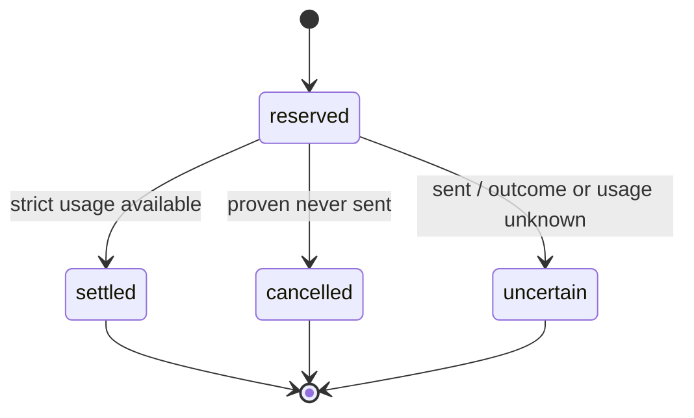

# 云模型 API 契约：Canonical Core 与 Provider-specific Extensions

<!-- learning-contract -->
<div class="learning-contract" markdown="1">

**学习导航**

- **适合读者**：多供应商 SDK、模型网关、Agent runtime、SRE 与费用治理工程师。
- **先修**：HTTP、strict JSON、SSE、异步取消、重试、幂等与基本安全边界。
- **首次阅读**：协议分层 → provider 对象图 → canonical core → 错误与重试 → 流式终止 → reserve/reconcile → 生产 adapter。
- **完成信号**：能保留供应商差异，解释 outcome unknown，并为每次 attempt 建立独立预算与证据账本。
- **卡住时**：先读[模型选型](landscape.md)和[GPT Responses](gpt.md)，再做[实验 0C](../practice/labs/lab-0c-cloud-budget.md)。

</div>

## 学习目标与证据边界

读完本章，你应能：

1. 区分 canonical business model、provider wire protocol 与 transport 三层；
2. 解释为什么 OpenAI-compatible 不等于完整语义兼容；
3. 为 text、refusal、tool、reasoning、citation 和 media 建立 typed representation；
4. 分开判断错误是否瞬时、请求能否重放、远端 outcome 是否确定；
5. 正确处理 SSE framing、provider terminal 与应用 stop string；
6. 在发送前 reserve token/费用，在每个 attempt 后 settle/cancel/mark uncertain；
7. 设计不泄露密钥、Prompt、reasoning 或被拒绝输入的审计工件。

本页结合三类证据：

- **官方接口文档**说明某个检查日期的公开对象与产品状态；
- **本仓库代码与测试**说明固定 authored/MockTransport/SQLite 输入上的本地行为；
- **生产 runbook**说明真实接入还需要收集什么证据。

离线契约不能证明真实账号、网络、模型、usage 或账单。文中出现的教学 allowlist、价格与 token 数只属于明确 fixture，不能外推成跨 provider 事实。

## 先画清三层协议

“调用一个大模型 API”至少跨过三层：

```mermaid
flowchart LR
    A["业务层 canonical request"] --> B["Provider adapter"]
    B --> C["Provider wire request / typed events"]
    C --> D["HTTP + TLS + proxy + DNS"]
    D --> E["Provider service"]
    E --> F["Provider response / event stream"]
    F --> G["Typed state machine"]
    G --> H["Canonical result + provider extensions"]
    H --> I["Policy / verifier / publication gate"]
```



每层回答不同问题：

| 层 | 主要责任 | 不应承担的责任 |
|---|---|---|
| Canonical business model | 统一业务需要的最小概念 | 假装所有 provider 能力相同 |
| Provider adapter | 字段、typed block、terminal、usage、error 映射 | 工具权限与业务真值 |
| Transport | origin、deadline、连接、framing、取消 | 猜测 provider 语义 |
| Runtime/gate | ACL、审批、幂等、验证、发布 | 静默修复 wire protocol |

最危险的设计不是“没有统一接口”，而是统一接口吞掉了无法统一的信息。

## 不要把 messages 当成统一标准

不同供应商都能完成对话，但 system 位置、role、content graph、tool schema、流式事件、usage、缓存和错误语义不同。业务层可以统一最小概念，adapter 必须保留能力差异。

| 维度 | OpenAI-compatible Chat 子集 | Anthropic Messages | 本仓库 Gemini `generateContent` adapter |
|---|---|---|---|
| system | messages 中常见 | 顶层 `system` | `systemInstruction` |
| assistant role | `assistant` | `assistant` | `model` |
| 内容 | string 或多段结构 | content blocks | `parts` |
| usage | prompt/completion tokens | input/output tokens | `usageMetadata` |
| 结束 | `finish_reason` | `stop_reason` | `finishReason` |

这张表只描述仓库 reviewed subset，不是所有版本的共同标准。实际字段必须绑定 provider、endpoint、API version、model 与 `checked_at`。

### OpenAI：Chat Completions 与 Responses 分开建模

截至 2026-08-14，OpenAI 官方 model catalog 把当前模型入口指向 Responses API 与 SDK。这是时间敏感产品事实，不是账号可用性、价格或内部架构保证。

Chat Completions 常以 `messages → choices` 为主要对象图；Responses 则是 `response → output item → content part`，function call 等能力可以表现为独立 typed item。迁移不能只替换 URL：

```text
Chat-like subset                     Responses subset
messages[]                           response
  └── role/content                     ├── status / usage
choices[]                              └── output[]
  └── message/content                      ├── message/content[]
                                              ├── output_text
                                              └── refusal
                                          └── function_call
```

旧的 `OpenAICompatibleTextStream` 只处理单 choice text delta、usage、finish reason 与 `[DONE]`。独立 `OpenAIResponsesEventReplay` 处理一组 SDK-shaped typed events；二者不能互借“完整 OpenAI API 兼容”结论。

### DeepSeek 与 Qwen：兼容端点不是模型身份

DeepSeek/Qwen 的某些云服务或自托管服务可能提供 OpenAI-compatible 形状，但“compatible”只应理解为已验证字段的兼容。下面各项都要逐项测试：

- model id 与 revision；
- system/developer role；
- tool schema、并行调用与 tool result；
- JSON/structured-output 子集；
- reasoning 字段与是否应回传；
- stream usage、terminal 与 error body；
- cache、限流、幂等与计费语义。

开放权重 checkpoint、云产品和第三方托管 endpoint 是三种不同身份。API 响应中的自报 model 字符串也不是权重来源认证。

### Anthropic Messages：顶层 system 与 content blocks

Anthropic Messages 将 system 与对话分开，content 是 block 数组。普通 text、tool use/result、thinking/其他 block 不能用同一字符串解析假设。只需要可见文本时也应显式选择 text block，并保存非文本 block 的类型、位置与受控审计信息。

本页只把官方 Messages 页面在 2026-08-12 核对到的 request、content、input/output usage 与 stop fields 当作产品事实；不从字段名推断模型内部结构或安全属性。

### Gemini：Interactions 与 `generateContent` 是两套接口

截至 2026-08-15，Gemini 官方文档说明 Interactions API 已 GA 并推荐新项目使用；`generateContent` 仍受支持但已标为 legacy。本仓库 adapter 为教学与兼容性实现 `generateContent`，使用 `contents/parts`、`user/model` role、`systemInstruction` 与 `usageMetadata`。

Interactions 的可选状态、steps、后台执行与存储选择，不能映射成 `generateContent` 的别名。Gemini API 与 Vertex AI 的身份、区域、治理和 endpoint 也应分别配置。

## Canonical core：只统一稳定交集

一个合理的 canonical core 可以很小：

```python
@dataclass(frozen=True)
class CanonicalRequest:
    provider: str
    api_surface: str
    model: str
    messages: tuple[CanonicalMessage, ...]
    maximum_output_tokens: int
    provider_options: Mapping[str, JSONValue]

@dataclass(frozen=True)
class CanonicalResult:
    terminal: TerminalState
    items: tuple[CanonicalItem, ...]
    usage: Usage | None
    provider_receipt: ProviderReceipt
```

`provider_options` 不是任意透传垃圾桶。每个 adapter 应 closed-schema 校验允许字段，并把其 revision 纳入 request identity。未知字段默认失败，避免拼写错误或新 SDK 行为静默进入生产。

### Typed extension，而不是 lowest-common-denominator string

Canonical item 至少需要区分：

```text
TextItem
RefusalItem
FunctionCallItem
FunctionResultItem
CitationItem
MediaItem
OpaqueProviderItem
```

`OpaqueProviderItem` 的存在不等于应用可以解释或发布其内容。它只允许 adapter 保存未解释的 typed bytes、provider/type/version 与访问控制信息，等待明确策略处理。

如果业务只支持 text，遇到 tool/refusal/thinking/media/unknown block 时应 fail closed；不能丢掉非文本 item 后返回“成功文本”。

### RequestSpec 是 wire identity，不是业务权限

本仓库 `RequestSpec` 复制 JSON body 与 headers，拒绝非有限 number，并在 repr/report 中遮蔽常见认证 header。一个可审计 request identity 至少绑定：

- exact scheme/host/port/path 与 API surface；
- provider、model、API revision；
- canonical JSON body；
- 非敏感 headers 与 billing scope；
- prompt/tool schema/config revision；
- adapter/parser revision。

SHA-256 fingerprint 只能证明给定 canonical bytes 的身份。它不认证 caller、provider、pricing 或 transport，也不为低熵 Prompt 提供保密性。

## Response 不是一个字符串

生产 adapter 应把 response 分为四个维度：

1. **identity**：provider、response/request id、model、API version；
2. **typed output**：text、refusal、function call、citation、media、opaque item；
3. **terminal**：completed/stopped/incomplete/failed 与原因；
4. **usage**：input/output/cache/reasoning 等 provider 实际提供的字段。

这四者不能互相推导。拿到 text 不表示到达 terminal；到达 provider completed 不表示业务任务成功；拿到 usage 不表示发票已经认证。

### Structured output 仍需要业务验证

JSON mode 只保证有效 JSON。OpenAI Structured Outputs 在支持的 schema 子集内约束结构，但不保证值真实、引用存在、金额合理、身份正确或动作已授权。

推荐控制链：

```text
provider terminal
→ refusal/incomplete/error 分流
→ strict JSON/schema
→ domain invariant
→ trusted identity + ACL
→ budget + idempotency + approval
→ handler
→ effect verifier
```

### Tool call 是 proposal

模型生成的 tool name/arguments/call id 是候选动作。Provider adapter 负责忠实解析；Agent runtime 才负责：

- schema 与 domain validation；
- subject/resource/tool policy；
- approval grant；
- idempotency 与重复 call conflict；
- step/token/cost/time budget；
- effect verification 与 reconciliation。

参数是合法 JSON object，也不等于它已获授权。自动 tool loop 不能绕过业务 runtime。

## Opaque reasoning block 是状态工件

部分 reasoning API 会把客户端不能解释的 reasoning/thinking block 交给客户端保存或回传。它既不是普通 visible text，也不会因为字段名像 signature/encryption 就自动具备安全上下文。

至少分开验证：

- content integrity 与 provider provenance；
- authenticated tenant/subject；
- session/branch/conversation position；
- model/endpoint audience；
- expiry、revocation 与 replay identity；
- publication policy。

2026 年论文 [Stealing Reasoning Traces from Proprietary LLM APIs](https://arxiv.org/abs/2608.09867) 报告特定历史 API 版本中的跨会话、跨用户和跨模型重放；作者同时说明截至 2026 年 8 月，原攻击流程已因供应商缓解而不可复现。本仓库将它作为历史架构案例，不声称当前 endpoint 仍有漏洞。

完整 context-bound envelope 与发布门禁见 [Opaque Reasoning 工件与轨迹安全](../quality/reasoning-artifact-security.md)。

## 失败后先回答三个独立问题

不要先写 `if status >= 400: retry()`。一次 attempt 失败后，应按顺序回答：

1. **retryable**：该错误在此 provider/endpoint/API version 下是否被确认是瞬时的？
2. **replay safe**：业务请求能否安全重放？
3. **outcome known**：远端是否确定没有执行或已经返回明确结果？

三个判断互相独立：

即使 Prompt 调用在业务上没有副作用，第二次生成仍可能产生另一份 usage 与费用；“可以重复读”不等于“可以免费重放”。

| 场景 | retryable 候选 | replay safe | outcome known | 默认动作 |
|---|---:|---:|---:|---|
| 本地 schema/preflight 失败 | 否 | 无关 | 是，未发送 | 修配置 |
| 本仓库 Pool/Connect 前失败 | 可能 | 需判断 | 本地策略视为未发送 | 有界重试 |
| HTTP 429/5xx response | 需按版本校准 | 需判断 | 收到 response，但费用未必已知 | 记录后决策 |
| write/read/protocol 或执行器 attempt timeout | 可能 | 需判断 | 否 | 停止并 reconciliation |
| 2xx stream 中途截断 | 不自动 | 即使无副作用也会重复生成 | 否 | 保存 partial，停止 |
| 工具副作用后响应丢失 | 可能 | 通常否，除非有外部幂等证据 | 否 | 查询 effect ledger |

### 教学 RetryPolicy 不是真实 provider 规范

本仓库默认 allowlist 为 `408/429/500/502/503/504`。它明确排除普通 `400/401/403/404`，也不把 `501/505` 仅因属于 5xx 就自动重试。**不要对所有 4xx/5xx 自动重试**。

`max_attempts` 包含首次请求。本地 exponential backoff 可写成：

\[
b_n=\min(b_{\max}, b_0\,2^{n-1}),
\qquad
d_n=b_n(1+j\,u_n),\;u_n\in[0,1].
\]

这只是 caller-controlled policy。Jitter 随机源、seed 与 delay 需要进入测试证据，不能只断言“用了指数退避”。

### `Retry-After` 与 deadline

本仓库严格接受非负 delta-seconds 或 HTTP-date，并区分 absent/valid/malformed：

- valid：尊重服务端时间，不再叠加本地 jitter；
- malformed：才回退本地 backoff；
- 等待超过 policy cap 或 logical deadline：停止。

有效值若超过 policy/deadline 就停止，不能为了赶 deadline 提前重试。

这套矩阵只证明本地策略对固定输入自洽，**不证明真实 provider 的当前错误、配额、幂等、计费或 endpoint 语义**。

## Deadline、timeout 与 cancellation

至少区分：

- pool acquire timeout；
- connect timeout；
- write timeout；
- read/idle timeout；
- 单 attempt timeout；
- 整个 logical call deadline；
- caller cancellation。

本仓库 `execute_json_request` 使用 monotonic clock 计算 attempt/sleep 的共同 deadline。Cancellation 原样传播，但调用方仍须 terminalize reservation 并判断远端 outcome。

Client task 被取消只说明本地协程停止等待。关闭 socket/response 也不是服务端取消确认。

## HTTP target 与严格响应解析

Transport preflight 应在 reserve 和发送前完成：

- exact origin allowlist；
- 默认 HTTPS-only；
- 禁止 userinfo、fragment 与非预期 query；
- `follow_redirects=False`；
- 认证信息放 header/secret manager，不放 URL；
- 显式 proxy、证书、DNS 与 egress 策略。

本仓库成功响应要求 2xx、正确 Content-Type 和 object JSON，并拒绝 duplicate key、`NaN/Infinity`、数组顶层与超限 body。

当前非流式 `max_response_bytes` 是完整 body 已缓冲后的 acceptance cap，**不是下载过程的 ingress/memory 上限**。真正限制内存必须 streaming 读取、逐 chunk 累加并在超限时关闭。

Attempt trace 只保存稳定 error category、status、相对时间、request id 和 retry decision；不保存认证 header、request body、response body 或原始异常字符串。

## 流式协议要拆成三层

```text
arbitrary network byte chunk
→ SSE framing event
→ provider typed event / state transition
→ application update
```

网络读取不等于一行、一个 UTF-8 字符、一个 SSE event 或一个 token。SSE decoder 应处理 BOM、LF/CRLF/CR、多行 `data:`、comment、跨 chunk UTF-8 与 line/event/total byte gate。

### Provider terminal 不可互换

本仓库三个 text-only state machine 的终止方式是：

| 子集 | 应用层内容 | Provider terminal |
|---|---|---|
| OpenAI-compatible Chat | 单 choice string delta | finish reason + 独立 `[DONE]` |
| Anthropic Messages | text content-block lifecycle | `message_stop` |
| Gemini `streamGenerateContent` | 单 candidate text parts | `finishReason` + 底层 EOF |

OpenAI `[DONE]`、Anthropic `message_stop` 与 Gemini finishReason+EOF 是不同契约，不能互换。Responses typed terminal 又是另一条独立状态机。

EOF 只有在 provider 协议明确允许、且前置 terminal 条件满足时才能结束。残留半行、未完成 event/item/content 或缺 terminal 必须失败。

### 应用 stop string 是第四个概念

应用 stop string 在已拼接的 Unicode text stream 上匹配，可能跨 event 和 token。客户端命中 stop 后可以截断展示，但不能：

- 伪造 provider `finish_reason=stop`；
- 修改 provider usage；
- 宣称 server 已停止生成或计费；
- 自动把 partial output 变成 completed。

### 2xx stream 一旦开始

本仓库 executor **仅在非 2xx headers 阶段允许重试**。2xx body 一旦开始，截断、超限、idle timeout、parser error 或取消都视为 partial/outcome-uncertain，不自动重放。

已经通过 callback 交付的 fragment 无法撤回。`bytes_received` 只是 `httpx.aiter_bytes` 交给 parser 的 bytes，不是 token，也不保证等于 wire bytes。

该测试仍不执行真实 DNS/TLS/TCP/HTTP2。关闭 client response 不证明服务端已收到取消、停止生成或停止计费。

## Token 与费用为什么要 reserve/reconcile

只在响应后累加 usage 会产生并发超支。若 (K) 个请求同时看到剩余预算 (B)，每个都可能发送上限 (B)，最终暴露接近 (K B)。

对 attempt (i)，发送前预留：

\[
R_i=\widehat{T}^{(i)}_{\text{in}}+T^{(i)}_{\text{out,max}},
\]

费用估值为：

\[
\widehat{C}_i=
\left\lceil
\frac{
\widehat{T}^{(i)}_{\text{in}}p_{\text{in}}+
T^{(i)}_{\text{out,max}}p_{\text{out}}
}{10^6}
\right\rceil,
\]

其中费率单位是 micro-USD per million tokens。公式只是给定 pricing snapshot 的 policy estimate，不是发票。

### Terminal transition

每个 reservation 只能进入一个 terminal state：



- **cancelled**：有结构化证据证明从未发送；
- **settled**：严格解析到可信的 input/output usage；
- **uncertain**：可能已发送，但 usage/outcome 不足。

若 actual usage 超过 reservation，调用已发生；账本必须先记录真实值，再触发 post-call breach，不能为了保持 cap 而丢弃超额 usage。

### 每个 retry attempt 独立记账

一个 logical call 不能只 reserve 一次后内部重放多次。生产 retry 必须给每个 attempt 独立 reservation/tombstone，例如：

```text
logical-call:attempt:1 → uncertain 80
logical-call:attempt:2 → settled 66
logical total          → committed 146 micro-USD
```

固定 MockTransport fixture 的 authored price 为 `$1/M input + $2/M output`：60+10 cap 预留 80，58+4 实际 usage 结算 66。HTTP 500→200 两次 attempt 合计 146；这不表示真实 HTTP 500 一定计费，只表示本地证据不能证明第一 attempt 为零费用。

旧单-attempt helper 强制 `max_attempts=1`，避免一个 reservation 覆盖多次 replay。

### Local durable quota 的边界

`SQLiteUsageBudgetLedger` 以 `BEGIN IMMEDIATE` 串行化同一文件的 writer，并保存 config、reservation tombstone 与 event timeline。Crash 后 active reservation 继续占额度，不能按 TTL 自动释放，因为 worker 消失不等于 provider 未收到请求。

SQLite commit 不可能与远程 HTTP/provider billing 原子。单文件也不是跨机器/跨区域 quota；无密钥 fingerprint 不抵抗能改库并重算 hash 的攻击者。Reconciliation 仍需 provider request id、usage/billing export 与人工处置。

## 成本指标要有正确分母

只报平均 request cost 会奖励大量廉价失败。更有意义的是：

\[
\text{cost per successful task}
=\frac{\sum_i C_i}{\sum_i \mathbb{1}[\text{task}_i\text{ verified success}]},
\]

同时报告：

- all-attempt cost；
- success-conditional cost；
- retry amplification；
- uncertain reservation 比例；
- cache/reasoning/tool 等 provider-specific usage；
- currency、tax、tier、credit 与价格检查日期。

没有 billing export 对账时只能称为估算，不能称为发票成本。

## 安全与治理

### 密钥与网络边界

- 密钥来自 secret manager/environment injection，不写进 repo、Prompt 或 URL；
- exact origin 与 egress policy 在发送前校验；
- redirect 默认关闭；
- 日志不保存认证 header 或 raw provider body；
- 错误消息使用稳定分类，不拼接任意远端字符串。

### 不可信内容与高权限指令

RAG 文档、网页、tool result 与用户输入都属于不可信数据，不能提升为系统/开发者指令。Provider adapter 只保留来源和类型；Prompt builder 与 Agent policy 决定隔离方式。

### Publication projection

内部 trajectory 可以包含 tool arguments、tool result、citation、reasoning 或 secret/PII。公开输出必须经过 closed-schema allowlist projection；即使字段类型允许，也还要独立做 secret/PII、版权、consent 和用途审查。

## 生产 adapter 的推荐结构

```text
integrations/
├── canonical.py          # stable business types
├── provider_a.py         # request/response mapping
├── provider_b.py
├── strict_json.py        # duplicate/non-finite/size gates
├── sse.py                # byte framing only
├── provider_stream.py    # typed state machine
├── retry.py              # pure decision policy
├── http.py               # transport/deadline/cancel
├── budget.py             # reserve/reconcile ledger
└── receipts.py           # sanitized evidence projection
```

### 依赖方向

Canonical types 不依赖 SDK。Provider adapter 可以依赖 canonical types，但业务 runtime 不应直接依赖 SDK response class。这样可以：

- 用 authored fixture 回放 parser；
- 固定 SDK/API 升级前后的 mapping；
- 在无密钥环境测试错误与边界；
- 为真实 network smoke test 单独设置 marker、预算和 allowlist。

### Capability negotiation

不要用一个布尔值 `supports_tools=True`。Capability record 应绑定 provider/model/API revision，并分别描述：

- input/output modalities；
- tool/function、并行调用和 tool result；
- structured-output schema 子集；
- streaming item/event 类型；
- usage/cache/reasoning 字段；
- state/storage/background behavior；
- max input/output 与治理限制。

未知能力是 `unknown`，不能自动当作支持。

## 本仓库可运行证据

### 三类 strict offline adapter

`about_llm.integrations.cloud_api_cli verify` 对固定 JSONL 构建三类 request 并解析 response，证明字段映射、严格 JSON 与认证 header 脱敏；不导入 HTTP client，不访问网络。

### Responses typed-event replay

固定 3,208-byte JSONL（`sha256:f2947212…5a54686`）含 15 events/2 output items，重建 `天气：晴。`、`lookup_weather({"city":"上海"})` 和 12+9=21 usage。Event projection 是 `sha256:9cc5964d…bd713e`，receipt 是 `sha256:c4829c19…42579`。

它没有执行 OpenAI SDK、HTTP/SSE/WebSocket、真实模型或 billing，不认证 authored model/response id/usage，也不证明完整 Responses API。

### Retry、HTTP 与 SSE

- `retry-matrix`：纯策略，不发送请求；
- JSON executor：`httpx.MockTransport`；
- SSE executor：MockTransport + authored AsyncByteStream；
- 三类 text state machine：只覆盖 reviewed text-only subset；
- Responses replay：只覆盖 reviewed SDK-shaped event subset。

### Budget 与逐 attempt orchestration

内存/SQLite ledger、单-attempt helper 与逐-attempt orchestrator证明固定本地状态迁移。Hard limit=140 的 fixture 在第一 attempt uncertain 80 后，于第二次 transport 前拒绝新的 80 reservation。

这些 controls 适合锁定 adapter/策略/状态机回归，不是 network smoke test。

## 从离线证据走向真实接入

真实 provider smoke test 必须显式 opt-in，并至少限制：

1. 允许的 exact origin；
2. 请求数与并发；
3. input/max-output token；
4. 总费用与每 attempt 费用；
5. overall/idle/attempt timeout；
6. 固定 model/API revision；
7. 禁止真实副作用 tool；
8. 日志与 artifact 脱敏；
9. provider usage/billing reconciliation；
10. 测试结束后的 secret 与 artifact 生命周期。

真实测试应分层报告：

- DNS/TLS/HTTP 建连成功；
- 认证与账号访问成功；
- 非流式字段/usage 对账；
- stream event/terminal 对账；
- cancel 后本地观察与 provider receipt；
- 限流/错误行为；
- 账单导出核对。

其中任一层通过，都不能代替其他层。

## 故障定位顺序

### 解析错误

先保存受控 raw artifact identity，再检查 Content-Type、strict JSON、schema revision 和未知 field。不要直接 `str(response)` 后继续业务流程。

### 流式重复或缺字

依次检查 byte framing、event id/type、item/content index、delta/done reconciliation、terminal 与 reconnect policy。Chunk 边界不稳定是正常现象。

### 重试风暴

检查 retryable allowlist、`Retry-After`、logical deadline、outcome-uncertain gate 与全局并发限制。不要只调大 backoff。

### 预算与账单不一致

按 logical call → attempt → reservation → provider request id → usage/billing export 追踪。区分 estimation error、隐藏 usage、失败 attempt、currency/tier 与 ledger crash window。

### 工具重复执行

Provider call id 不是业务幂等充分条件。查询业务 effect ledger，并核对 subject/resource/tool/arguments/policy version 的完整 identity。

## 面试与作品集验收

### 面试追问

1. 为什么 OpenAI-compatible 不能等价为 Responses/Anthropic/Gemini 全兼容？
2. Canonical core 应统一什么，哪些字段必须作为 typed extension 保留？
3. Retryable、replay safe、outcome known 为什么是三个问题？
4. 为什么 read timeout 后不能直接重试？
5. Network chunk、SSE event、provider typed event 与 token 有什么区别？
6. 为什么 provider completed 不等于业务 success？
7. 如何给每个 retry attempt 建立独立 token/费用 reservation？
8. SQLite ledger 为什么仍不能提供 exactly-once billing？
9. Structured output 为什么不能直接执行 tool？
10. 如何设计一个不泄露 Prompt/密钥/reasoning 的 receipt？

### 可写进简历的诚实版本

> 设计多供应商云模型 adapter：以 canonical core + typed extensions 保留三类 request/response/terminal 差异；实现 strict JSON、SSE framing、retry/outcome policy、逐 attempt reserve/reconcile 与脱敏 receipt，并用 authored Responses events、MockTransport 和 SQLite fault cases 验证 fail-closed 状态迁移。

紧邻位置必须披露：仓库 controls 没有访问真实付费 endpoint，不证明 provider 当前错误/配额/idempotency/usage/billing、模型质量或生产 SLO。若只展示固定 fixture，不应写“生产级统一网关”或“支持所有 OpenAI-compatible 模型”。

## 一手资料与运行入口

- OpenAI，[Model catalog](https://developers.openai.com/api/docs/models)，当前模型与 Responses 入口；核对日期 2026-08-14。
- OpenAI，[Create a response](https://developers.openai.com/api/reference/resources/responses/methods/create)，Responses 对象；核对日期 2026-08-14。
- OpenAI，[Streaming API responses](https://developers.openai.com/api/docs/guides/streaming-responses)，typed streaming 指南；核对日期 2026-08-14。
- OpenAI，[Streaming events](https://developers.openai.com/api/reference/resources/responses/streaming-events)，Responses event reference；核对日期 2026-08-14。
- OpenAI，[Structured Outputs](https://developers.openai.com/api/docs/guides/structured-outputs)，JSON/Schema/refusal/incomplete 边界；核对日期 2026-08-12。
- Anthropic，[Messages API](https://platform.claude.com/docs/en/api/messages)，Messages request/content/usage/stop；核对日期 2026-08-12。
- Google，[Gemini Interactions API](https://ai.google.dev/gemini-api/docs/interactions-overview)，Interactions lifecycle；核对日期 2026-08-15。
- Google，[GenerateContent reference](https://ai.google.dev/api/generate-content)，`generateContent` 字段；核对日期 2026-08-15。
- 可运行项目：[Cloud API Contracts](../practice/projects/cloud-api-contracts.md)。
