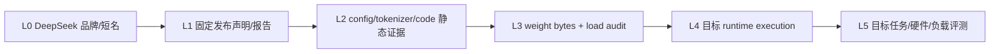

# DeepSeek：从 MLA/MoE 配置到推理系统证据

<!-- learning-contract -->
<div class="learning-contract" markdown="1">

**学习导航**

- **适合读者**：MoE/MLA、训练系统、长推理与推理部署研究者和工程师。
- **先修**：GQA、KV Cache、MoE、强化学习和量化基础。
- **首次阅读**：证据阶梯 → 固定 V3 config → MLA → DeepSeekMoE → FP8/MTP → R1 → 部署评测。
- **完成信号**：能分开 config markers、论文机制、真实权重/runtime 和产品能力，不误套标准 KV 公式。
- **卡住时**：回到[Transformer](../core/transformer.md)和[前沿专题](../frontier/reasoning-long-context-moe.md)。

</div>

## 学习目标与证据边界

读完本章应能区分 DeepSeek 的 MoE 训练/服务问题、Multi-head Latent Attention（MLA）的 KV 压缩思路，以及推理模型的后训练与 test-time compute；还能判断一个蒸馏 checkpoint 是否真的使用 DeepSeek-V3 架构。

**先修知识**：MHA/GQA、KV Cache、MoE routing、SFT/偏好优化、强化学习、量化与服务基准。

“DeepSeek”同时指研究路线、开放 checkpoint 和云产品。具体 checkpoint 是否包含 MLA、MoE、Multi-Token Prediction 或某种后训练机制，必须看其技术报告、config、代码与 model card，不能因品牌相同就默认。

本章唯一固定的模型级 artifact 是 `deepseek-ai/DeepSeek-V3` revision `e815299b0bcbac849fa540c768ef21845365c9eb` 的 1,660-byte `config.json`。仓库没有下载 DeepSeek 权重/tokenizer、没有执行声明的 remote code、forward、MLA cache、MoE routing、FP8 kernel、R1 推理或云 API；通用 NumPy/PyTorch/Gloo fixtures 也不能借给 DeepSeek checkpoint。

## L0 标签与 L1–L5 证据阶梯



L0 不是实质证据；L1–L5 才是五级证据强度：

| 层级 | 当前仓库的 DeepSeek 证据 | 可以写 | 不可以写 |
|---|---|---|---|
| L1 | 固定 revision/source URL 与官方报告链接 | 审阅对象和论文主张来源 | 当前云产品或所有衍生模型事实 |
| L2 | immutable V3 config raw bytes + semantic snapshot | 字段出现、保守 marker classification、公式拒绝 | 实际 tensor layout、参数量、显存 |
| L3 | **没有** | — | 已下载/校验/加载 V3 权重 |
| L4 | **没有 DeepSeek target runtime** | authored fixtures 只能证明通用机制 | 已执行 MLA/MoE/FP8/R1 |
| L5 | **没有** | — | 质量、长上下文、GPU 性能或生产 SLO |

### 通用机制证据是旁路，不是升级台阶

仓库确实执行了：

- strict decoder-config inspector；
- NumPy/PyTorch top-k、capacity、reroute/dropless 和 gradient fixtures；
- two-process CPU/Gloo capacity、all-to-all forward/backward controls；
- pass@k、self-consistency、verifier-selection 与 PPO/RM teaching controls。

它们没有读取 DeepSeek config/weights，输入、专家、路由、loss、collective 和硬件都是 authored contract。因此这些证据不能把 DeepSeek 从 L2 提升到 L3/L4，也不能拼成“复现 DeepSeekMoE/R1”。

## 对象识别：研究、Checkpoint、蒸馏与 API 分行

| 对象 | 必须固定 | 常见误写 |
|---|---|---|
| V2/V3 研究机制 | report revision、公式、实验设置 | 把论文全部机制套给任意 checkpoint |
| V3 开放 checkpoint | model revision、config/code/weights/tokenizer/license | 只用“DeepSeek-V3”短名 |
| R1 checkpoint | exact model card、base architecture、post-training identity | 自动继承 V3 MLA/MoE |
| R1 Distill | teacher/data claim + 实际 Qwen/Llama base config | 把蒸馏行为当 teacher 架构复制 |
| DeepSeek cloud API | model id、catalog date、endpoint/contract/usage | 用开放权重 config 推断 provider runtime |
| 第三方量化 | upstream base + converter + calibration + file manifest | 把第三方文件当官方原始权重 |

发布/实验 manifest 至少包括：

```text
model id + immutable revision
raw config/code/tokenizer/weight files + bytes/hash
trust_remote_code / reviewed code identity
base / instruct / reasoning / distill identity
dtype/quantization + runtime/kernel/device
template/special tokens/generation protocol
adapter/data/evaluation identities
license/AUP/redistribution review
```

无密钥 SHA-256 只能绑定 bytes，不能认证 DeepSeek、模型发布者或实验执行者。

## 先分开三条技术线

1. **训练与架构效率**：稀疏专家、路由、负载均衡和并行通信；
2. **推理内存效率**：MLA 等潜在表示压缩怎样改变 KV Cache；
3. **推理行为后训练**：可验证奖励、强化学习、SFT/冷启动数据、蒸馏和 test-time compute。

三条线可能出现在同一技术报告中，但解决的问题不同。MoE 不自动带来推理能力，MLA 不等于量化，强化学习也不改变 checkpoint 的基础 attention 结构。

## 固定 DeepSeek-V3 config 证据

仓库 release-evidence manifest 固定：

| 字段 | 值 |
|---|---|
| model/repository | `deepseek-ai/DeepSeek-V3` |
| revision | `e815299b0bcbac849fa540c768ef21845365c9eb` |
| upstream config bytes | 1,660 |
| upstream SHA-256 | `cbf0b95dc614de208a109bb5fd4e7eed11385e9c68411d2c17db5319443035d9` |
| local semantic fingerprint | `sha256:fed8c13b4637058cd68e600bd4bf7dc734bda4594dd583e3b49fa27c6e123cc6` |
| manifest checked_at | `2026-08-13` |

执行：

```powershell
python projects/transformers-basics/verify_release_evidence.py
```

默认输出完全离线，`upstream_verified=false`。共享 manifest fingerprint 为 `sha256:74166133716bfebddb444587e9f9a012b4beada923f5209482308ff61194953b`，默认 projection fingerprint 为 `sha256:40b3fe7b2a9c054ea6aa17e9e747d1831b8ae41ee3d55130c916f818acbe4638`。它们绑定整个 Llama/Qwen/DeepSeek release-evidence manifest/projection，不是 DeepSeek 单记录签名。

### Core 与供应链字段

| 类别 | config observation |
|---|---|
| loader | `model_type=deepseek_v3`、`architectures=[DeepseekV3ForCausalLM]` |
| custom mapping | `auto_map` 指向 `configuration_deepseek` / `modeling_deepseek` |
| residual width/layers | `hidden_size=7168`、`num_hidden_layers=61` |
| dense MLP width | `intermediate_size=18432` |
| activation/norm | `hidden_act=silu`、`rms_norm_eps=1e-6` |
| vocabulary | `vocab_size=129280`、`tie_word_embeddings=false` |
| tokens | `bos_token_id=0`、`eos_token_id=1` |
| metadata/default | `torch_dtype=bfloat16`、`transformers_version=4.33.1` |

`auto_map` 只说明 config 声明了自定义 module mapping。仓库没有审阅或执行该 revision 的 remote code，因此不能声称 `trust_remote_code=True` 路径安全、可复现或与某个已安装 Transformers 实现等价。

加载前应先：

1. 固定所有 Python/config/tokenizer/weight bytes；
2. 在 import/反序列化前检查路径、size/hash 和资源上限；
3. 审阅动态 import、native extension、网络/文件/进程副作用；
4. 在隔离环境以最低权限执行；
5. 保存实际 imported module/class/file identity；
6. 加载后核对 state-dict names/shapes/dtypes/device placement。

### MLA marker 字段

| 字段 | 固定值 |
|---|---:|
| `num_attention_heads` | 128 |
| `num_key_value_heads` | 128 |
| `q_lora_rank` | 1536 |
| `kv_lora_rank` | 512 |
| `qk_nope_head_dim` | 128 |
| `qk_rope_head_dim` | 64 |
| `v_head_dim` | 128 |

这些字段触发 `known_mla_markers_present=true`。检查器必须返回：

```text
attention_kind: null
head_dim: null
standard_kv_applicable: false
estimate_refused: true
standard_kv_estimates: []
```

关键点：虽然 config 同时有 128 query heads 和 128 KV heads，也不能分类为标准 MHA。`hidden_size/num_attention_heads=7168/128=56` 更不能当作 Q/K head dim；config 已显式给出 128-d non-RoPE、64-d RoPE 与 128-d value 相关维度，结构不是标准 `d/H` contract。

### MoE marker 字段

| 字段 | 固定值 |
|---|---:|
| `n_routed_experts` | 256 |
| `n_shared_experts` | 1 |
| `num_experts_per_tok` | 8 |
| `moe_intermediate_size` | 2048 |
| `first_k_dense_replace` | 3 |
| `moe_layer_freq` | 1 |
| `n_group` / `topk_group` | 8 / 4 |
| `scoring_func` | `sigmoid` |
| `topk_method` | `noaux_tc` |
| `norm_topk_prob` | `true` |
| `routed_scaling_factor` | 2.5 |
| `ep_size` | 1 |

这些字段触发 `known_moe_markers_present=true`，但字段名本身不证明：

- 实际 state-dict 是否完整匹配；
- dense/MoE layer schedule 的代码语义；
- shared expert combine 顺序；
- group-limited routing、score correction 或 load-balance 的实现；
- capacity/drop/reroute/dropless policy；
- expert ownership、all-to-all layout 或并行规模；
- 总参数、激活参数或真实 FLOPs。

所有这些都需要固定 code、weight inventory 和 runtime tensor/collective trace。

### FP8 与位置/MTP markers

固定 config 还出现：

```text
quantization_config.quant_method = fp8
quantization_config.fmt = e4m3
quantization_config.activation_scheme = dynamic
quantization_config.weight_block_size = [128,128]
max_position_embeddings = 163840
rope_scaling.type = yarn
rope_scaling.factor = 40
rope_scaling.original_max_position_embeddings = 4096
num_nextn_predict_layers = 1
```

正确结论只是“固定 config 含这些字段”。它不证明：

- 权重文件实际每层/每 tensor 的 dtype、scale 和 block layout；
- 目标 runtime 执行过 E4M3、动态 activation scaling 或对应 kernel；
- 163,840 tokens 可加载、可生成或任务有效；
- YaRN 配置与当前实现完全兼容；
- Multi-Token Prediction head/训练目标/推理路径已加载或执行。

FP8 不是 INT8；E4M3 的数值范围、scale granularity、累加 dtype、异常值处理和硬件 kernel 都会影响误差与性能。`torch_dtype=bfloat16` 与 `quant_method=fp8` 字段共存也不能由 config alone 解释成唯一 runtime dtype policy。

## DeepSeekMoE 的系统视角

MoE 层把 token 路由到少数专家。若总专家参数为 \(P_{total}\)，每 token 只激活其中 \(P_{active}\)，前向 FLOPs 可能接近较小 dense 模型；但单卡加载通常仍要容纳或访问大量总权重。

公平报告至少包括：

- 总参数、激活参数与非专家共享参数；
- experts 数、top-k 与是否有 shared experts；
- 每 token FLOPs 和实际 tokens/s；
- router 分布、expert utilization 与 dropped/overflow token；
- expert parallel 拓扑和 all-to-all 时间；
- 权重驻留、通信 buffer 与峰值显存。

### 条件式参数账本

若一个 routed expert 采用无 bias 的 SwiGLU-style 三矩阵 MLP：

\[
E_i(x)=W_{d,i}\left(\operatorname{SiLU}(W_{g,i}x)\odot W_{u,i}x\right),
\]

则单 expert 主要权重为：

\[
P_{expert}=3dm.
\]

把固定 config 的 \(d=7168\)、`moe_intermediate_size=2048` 代入：

\[
P_{expert}=3\times7168\times2048=44{,}040{,}192.
\]

若 256 个 routed experts 全部采用该 shape，则每个 MoE layer 的 routed-expert 主矩阵条件式总量为：

\[
256\times44{,}040{,}192=11{,}274{,}289{,}152.
\]

每 token 选择 8 个时，对应的 routed-expert 主矩阵选择量为 352,321,536 parameters。以上只是**基于字段与 canonical gated MLP 的公式练习**，不是 state-dict inventory：它没有加入 shared expert、router、bias、norm、attention，也没有证明每层 schedule、weight tying、实际 shape 或运行 FLOPs。

真实总参数与 active parameters 必须从加载后的唯一 storage/name/shape 账本重算，并明确：

- tied alias 是按 logical entry 还是 unique storage 计；
- shared expert 是否每 token 总是执行；
- attention、embedding、MTP 和 dense replacement 如何计入；
- “active”按参数集合、MAC/FLOPs 还是实际 kernel work 定义。

### Routing 是一条状态机

概念流程：

```text
hidden
  → router logits/scores
  → group candidate selection
  → expert top-k
  → probability normalization/scaling
  → capacity/drop/reroute policy
  → token-to-owner dispatch
  → expert grouped GEMM
  → owner-to-source return
  → weighted combine + shared path
```

固定 config 的 `scoring_func=sigmoid`、`topk_method=noaux_tc`、`norm_topk_prob=true`、`routed_scaling_factor=2.5`、`n_group=8` 与 `topk_group=4` 只是字段。仓库没有执行目标 code，不能由字符串自行补出 score correction、tie-break、group selection 顺序、训练梯度、auxiliary loss 或 capacity policy。

尤其不能把 `noaux_tc` 字面扩写成“训练全程绝对没有任何辅助/均衡机制”；需要技术报告和固定实现共同证明它在该版本中的语义。

### Expert parallel 的通信账本

理想 token activation payload 的主项可写成：

\[
M_{dispatch,logical}
\approx N_{assignments}\times d\times bytes(dtype),
\]

返回路径还有同量级 hidden payload，并附带 source/token/expert metadata 与 gate weights。但这不是网络 wire bytes；真实系统还包含 collective framing、padding/alignment、bucket、同步、重试/容错和拓扑开销。

报告 EP 性能至少保存：

- 每 rank send/receive split；
- 每 expert assignments、tokens 与 padding；
- dropped/rerouted token 双分母；
- dispatch/return/compute/idle 时间；
- grouped-GEMM shape 与利用率；
- straggler rank/expert；
- NVLink/PCIe/IB 拓扑和 NCCL/runtime 版本；
- quality 与 routing drift。

“逻辑 payload 更小”不证明通信更快；CPU/Gloo 小 fixture 的 bytes 也不能外推 NCCL/GPU wire traffic。

路由不均会让少数专家成为 straggler；小 batch 下每个专家收到的 token 太少，矩阵乘效率也可能很差。辅助负载均衡损失或其他路由策略会影响训练信号，不能只看最终 perplexity。

仓库的通用 NumPy MoE fixture 可用于练习 top-k、per-expert capacity、assignment overflow、gate combine 与线性 expert dispatch；PyTorch fixture 进一步在同一训练图真实执行 trainable router/三组 MLP experts、score-priority capacity/drop、sparse—dense forward/backward 对账、detached-gate 负例与 stop-gradient count/可微 probability 的 balance step。它还区分 post-drop 重归一化/保留丢失 mass、验证全丢 token 为零，并以 padding mask/两个 CPU-local groups 执行逐组 capacity 与 active-token-weighted aux diagnostics。v3 的独立拥塞 fixture 再真实执行 authored deterministic full-ranking reroute 和 dropless nominal-capacity-excess contract：相同 `[4,0,0]` pre-policy counts 分别变为 reroute 的 `[2,0,2]`/零 excess 与 dropless 的 `[4,0,0]`/expert-0 excess=2，并对齐 sparse—dense forward/backward。

这些 capacity 公式、priority、group weighting、`E*sum(f_e*p_e)`、top-2 gradient graph、reroute 与 dropless 都只是明确的教学契约，不是 DeepSeekMoE 的实现声明；int64 group label 不是分布式通信证据。独立的 two-process CPU/Gloo control 确实用 `all_gather` 建立 replicated global routing batch、用 `all_reduce` 对账 active/selected counts，并证明 local-only kept=2 与 global kept=1 的 competition 差异；但它复制 router/experts，不执行 expert `all_to_all` 或 backward。仓库仍没有实现 DeepSeekMoE 的细粒度/共享专家、特定无辅助损失策略、真实 expert-parallel 通信布局、GPU kernel 或目标 checkpoint config/weight，也无收敛、质量或性能证据，不能把结果标成 DeepSeek-V2/V3/R1 架构复现。

新的独立 dispatch fixture 在 rank 0/1 各实例化 owner-only expert-0/expert-1，用 variable-split `all_to_all_single` 真正发送 token/gate/metadata、执行 owner forward 并返回 source；metadata scatter 后与单进程 oracle 对账。它不是 DeepSeek checkpoint，也没有读取其 config/weights，不含 capacity/drop 或 backward、shared/fine-grained experts、DeepSeek 路由策略、CUDA/NCCL、性能或质量；因此只补通用通信机制证据，不能填补上一段的模型级缺口。

随后增加的训练 control 用 authored reverse-split autograd 执行 all-to-all backward、router-gradient SUM all-reduce 和 owner expert SGD，并与单进程 global-MSE oracle 对齐。这仍不是 DeepSeekMoE training：不含 capacity 或目标 checkpoint，也没有细粒度/shared expert、DeepSeek 路由/负载策略、混合精度、CUDA/NCCL、并行拓扑、优化器状态、收敛或性能证据。

第四条 capacity-aware all-to-all training control 又在另一张图中执行全局 score-priority drop、kept-only owner dispatch、zero-assignment source 的 reverse collective 与一步 SGD，固定 keep mask `[F,T,T,F]`，并对齐单进程 capacity oracle。它仍不是 DeepSeekMoE training：没有读取 DeepSeek config/weights，也没有细粒度/共享专家、DeepSeek 的真实 routing/auxiliary-loss 策略、reroute/dropless、CUDA/NCCL、目标并行拓扑、收敛、质量或性能证据。

## MLA：为什么能改变 KV Cache

标准 MHA 在每层、每 token 缓存各 KV head 的 key 与 value：

\[
M_{MHA}\propto 2\,L\,H_{kv}\,d_h\,T\,bytes(dtype)
\]

MLA 的核心学习视角是：先把与 K/V 相关的表示压到更低维 latent，再缓存该 latent 与必要的位置相关分量，在注意力计算时通过投影恢复所需表示。于是缓存维度不再简单等于 `num_kv_heads × head_dim`。

### Paper-style 概念分解

为建立直觉，可把一类 MLA 写成下列简化形式。对 token hidden state \(h_t\)：

\[
c_t^{KV}=W^{DKV}h_t,
\]

\[
k_{t,i}^{C}=W_{i}^{UK}c_t^{KV},
\qquad
v_{t,i}^{C}=W_{i}^{UV}c_t^{KV},
\]

并把位置相关部分分开：

\[
k_t^{R}=\operatorname{RoPE}(W^{KR}h_t),
\qquad
q_{t,i}^{R}=\operatorname{RoPE}(W_i^{QR}h_t).
\]

一个 head 的 score 可抽象为 content 与 position 两项：

\[
s_{t,j,i}
=\left(q_{t,i}^{C}\right)^\top k_{j,i}^{C}
+\left(q_{t,i}^{R}\right)^\top k_j^{R}.
\]

这里的上/下投影、query compression、共享方式和矩阵 shape 是教学抽象；实际 DeepSeek-V3 必须以固定技术报告、该 revision code 和运行 tensor 为准，不能把这些符号当作仓库已执行的 implementation。

### 为什么 projection absorption 重要

若 \(k_{j,i}^{C}=W_i^{UK}c_j^{KV}\)，则 content score 可改写为：

\[
\left(q_{t,i}^{C}\right)^\top W_i^{UK}c_j^{KV}
=\left((W_i^{UK})^\top q_{t,i}^{C}\right)^\top c_j^{KV}.
\]

推理实现可在合适路径吸收部分上投影，避免为所有历史 token 物化完整 K/V；但 prefill/decode、训练/推理、kernel fusion 与量化路径可能不同。数学可重排不自动等于某 runtime 已采用更快 kernel。

### 不发布“576 elements”捷径

看到 `kv_lora_rank=512` 与 `qk_rope_head_dim=64`，很容易直接写：

\[
M_{tempting}=LBT(512+64)s.
\]

仓库刻意不接受这个数作为 DeepSeek-V3 cache estimate。仅凭 config 还不知道：

- 哪些 latent/RoPE tensor 实际跨 token 保留；
- 是否按 head 共享、复制或重排；
- dtype/FP8 scale、block/page alignment 与 metadata；
- runtime 是否缓存额外 transformed state；
- prefix sharing、speculative、beam、MTP 或 graph reserve；
- 实现版本是否改变 layout。

因此正确产物是 `estimate_refused: true` 加待验证字段清单，而不是一个看似精确的显存数字。

这带来三个重要结论：

1. 不能把标准 GQA/MHA 公式直接用于 MLA checkpoint；
2. cache 更小不代表所有计算更少，恢复投影和 kernel 实现仍有成本；
3. 理论字节减少只有被 runtime 的专用 kernel 利用时才转化为吞吐或并发收益。

精确容量必须按对应技术报告/config/runtime 的实际 cache layout 计算。本仓库通用 `estimate_kv_cache_bytes` 明确只适用于理想化 dense K/V，不适用于 MLA。

### 目标 runtime 的 cache 审计方法

要把 L2 config 提升到 L4 runtime，至少需要：

1. 固定并审阅 model code 与 kernel revision；
2. 在 prefill 后枚举每层 cache object/tensor name、shape、dtype、stride、device；
3. 逐 token decode，验证哪些维度随 sequence length 增长；
4. 对比无 cache full recompute 的 logits/argmax 与明确 tolerance；
5. 分开统计 raw tensor payload、allocator reserved、workspace 和进程/device peak；
6. 覆盖 batch、并发、prefix sharing、beam/speculative 和取消释放；
7. 保存 OOM/timeout/unsupported kernel 的完整失败分母。

只有这些证据才能回答“该 runtime 实际缓存什么”；技术报告公式与 config markers 不能代替内存 trace。

可以用以下本地反例检查这条边界：

```powershell
python projects/transformers-basics/inspect_config.py `
  projects/transformers-basics/configs/mla-moe.example.json --tokens 4096
```

输出必须给出 `estimate_refused: true`。该文件的 `AuthoredMLAMoECausalLM`、层数、head 与 expert 数完全是本仓库自编 fixture，不是 DeepSeek-V2/V3/R1 配置快照；它只证明检查器看到一组已知 MLA marker 后不会误套标准 GQA/MHA 公式。反过来，没有这些 marker 也不能证明某个未知自定义架构一定适用标准公式。

发布证据 control 进一步固定 `deepseek-ai/DeepSeek-V3` revision `e815299…c9eb` 的真实 `config.json`：原始 1,660 bytes 的 SHA-256 为 `cbf0b95d…35d9`，strict semantic snapshot 为 `fed8c13b…3cc6`。该配置同时出现 128 attention/KV heads 和 `kv_lora_rank=512`、`q_lora_rank=1536`、`qk_nope_head_dim=128`、`qk_rope_head_dim=64`、`v_head_dim=128` 等 MLA markers，并出现 256 routed experts、1 shared expert、每 token 8 experts 等 MoE markers。检查器因此必须拒绝标准 KV 估算；不能因为 `num_key_value_heads=128` 存在就绕过 MLA 分支：

```powershell
python projects/transformers-basics/verify_release_evidence.py
python projects/transformers-basics/verify_release_evidence.py --verify-upstream
```

这条 control 只把固定官方发布仓库的 config bytes 绑定到保守字段投影。它没有执行仓库声明的 remote code、权重、MLA cache tensor 或 kernel，也不从 marker 反推出 DeepSeek-V3 的真实显存、吞吐、激活参数、质量、许可或服务端 API 实现。即便上游验证通过，结论仍是“该 revision 的配置包含这些字段，标准公式不适用”，不是“已复现 DeepSeek-V3”。

## V2/V3 报告怎样阅读

公开 V2/V3 工作把 MoE、MLA 和训练系统优化放在一起讨论。学习时应建立“论文主张—实现配置—可复现实验”三列表，而不是把技术报告中的全部机制套到每个衍生模型。

例如，技术报告可能描述特定训练精度、负载均衡策略、并行通信或 Multi-Token Prediction；下载的蒸馏模型、API 模型或第三方量化文件不一定保留同样结构和训练过程。检查：

```text
architectures / model_type
num_hidden_layers / hidden_size / attention fields
MoE expert and routing fields
MLA latent and RoPE-related fields
tokenizer / chat template / generation config
base architecture declared by model card
weight hash / quantization method / license
```

这三类 JSON 不能各看各的：tokenizer、model config 与 generation config 的 BOS/EOS/PAD 可能不完全相同。EOS superset 可能有意加入 turn-end token，disjoint 或越界 ID 则至少需要人工复核。仓库 `inspect_generation_protocol.py` 只做显式快照对账；它不证明蒸馏 Qwen/Llama checkpoint、DeepSeek-V3 或云 API 最终采用相同停止协议。

## FP8：格式字段不是端到端精度证明

固定 config 声明 `fp8/e4m3`、dynamic activation scheme 与 `[128,128]` weight block。一个抽象的 scaled FP8 路径可写成：

\[
q=Q_{E4M3}(x/s),
\qquad
\hat{x}=s\cdot\operatorname{decode}(q),
\]

其中 scale \(s\) 的 granularity、更新时机与存储 dtype 会改变误差和开销。E4M3 是浮点格式，不是把整数 INT8 公式换个名字。

### 必须拆开的四层

| 层 | 要记录 | config 能否证明 |
|---|---|---|
| artifact | 每 tensor dtype、shape、block、scale/metadata、file bytes | 否，需 weight inventory |
| dequant/compute | input/weight/accumulation/output dtype 与 kernel | 否，需 runtime trace |
| resident/peak | packed weights、scale、workspace、allocator、KV | 否，需目标硬件实测 |
| quality | logits error、task/safety/long-context regression | 否，需评测 |

### FP8 验收矩阵

1. 固定 BF16/FP16/FP32 reference；
2. 保存 layer allowlist、block/axis、scale/amax policy；
3. 对固定 hidden/input 比较 selected layer output 与最终 logits；
4. 覆盖 outlier、全零、极小/极大、NaN/Inf policy；
5. 测 artifact bytes、resident/peak、prefill/decode throughput；
6. 在同一 task/safety cases 上做 paired regression；
7. 保存 unsupported/fallback kernel，禁止静默回退后仍报告“FP8 加速”。

仓库当前没有 DeepSeek weight bytes 或 FP8 execution，因此不能报告任何压缩比、显存、速度、误差或质量数字。

## Multi-Token Prediction：训练目标、Head 与推理解耦

标准 next-token objective 预测 offset 1。一个教学化 MTP objective 可写为：

\[
\mathcal{L}_{MTP}
=\sum_{k=1}^{K}\lambda_k
\operatorname{CE}\left(p_k(x_{t+k}\mid x_{\le t}),x_{t+k}\right).
\]

它可能提供更密的训练信号，也可能为 speculative-style decoding 提供候选；但训练时存在 MTP head，不等于服务 runtime 会暴露或使用该 head。

固定 config 只有 `num_nextn_predict_layers=1` observation。要证明 MTP，需要：

- state-dict 中对应 head/module identity 与 shape；
- code 中 hidden-state connection、loss target/mask/weight；
- training report 中该 loss 真正参与 backward；
- inference 中 draft/verify/acceptance 状态机；
- 输出与 baseline 的 exact/quality comparison；
- target hardware acceptance rate、wasted work 与 speedup。

仓库没有这些 DeepSeek target evidence，所以不能把一个 config 数字写成“已实现多 token 解码加速”。

## R1 与推理后训练

DeepSeek-R1 公开工作讨论通过强化学习、可验证奖励、冷启动/SFT 数据与蒸馏提升推理行为。这里要区分：

- **结果可验证任务**：数学、代码等可用规则、编译器或测试给奖励；
- **开放任务**：写作、事实综合与价值判断没有单一可靠 verifier；
- **训练时 RL**：更新参数分布；
- **推理时采样/搜索**：不更新参数，用更多计算产生候选；
- **蒸馏**：让另一个基座学习 teacher 产生的数据/行为。

### Group-relative policy optimization 的直觉

对同一 prompt \(x\) 采样一组 responses \(y_1,\ldots,y_G\)，给出 rewards \(r_i\)。一种 group-relative advantage 是：

\[
A_i=\frac{r_i-\bar r}{\operatorname{std}(r)+\epsilon}.
\]

再用 old policy importance ratio：

\[
\rho_{i,t}(\theta)
=\frac{\pi_\theta(y_{i,t}\mid x,y_{i,<t})}
{\pi_{old}(y_{i,t}\mid x,y_{i,<t})},
\]

构造 clipped policy objective，并可加入 reference-policy KL regularization。这个公式用于理解 GRPO-style 方法；具体 R1 版本的 reward、normalization、clip、KL、token mask 与训练阶段必须以固定技术报告/实现为准。

重要边界：

- 同组 rewards 全相等时，relative advantage 几乎没有排序信号；
- verifier 只覆盖可判定属性，模型可能优化 proxy 而非真实目标；
- length、format、position、sampling 和 answer leakage 会形成 shortcut；
- sampled KL、exact KL 与训练 loss 中的 estimator 不能混写；
- rollout policy、old log-probs、reference 和 optimizer checkpoint 必须绑定；
- 单 batch reward/loss 改善不证明 held-out reasoning。

### 可验证奖励不是“绝对正确奖励”

数学 exact answer、代码 tests、编译器与格式 parser 都可能有盲区：

| verifier | 可检查 | 常见漏洞 |
|---|---|---|
| exact answer | 规范化终值 | 等价表达、单位、过程错误 |
| unit tests | 已覆盖行为 | hidden cases、硬编码、资源/安全副作用 |
| compiler | 语法/类型部分正确 | 语义、性能、运行时错误 |
| format/schema | 结构合法 | 字段含义和事实错误 |
| model judge | rubric proxy | calibration、偏置、提示敏感、同源偏好 |

训练证据必须保存 reward components、失败 taxonomy、candidate 原文、verifier revision 和独立 held-out；只报平均 reward 会隐藏 reward hacking。

R1 Distill 类 checkpoint 可能建立在 Qwen 或 Llama 架构之上。它们学习了推理数据/行为，不因此变成 DeepSeek-V3 的 MLA/MoE 架构；显存公式、LoRA target 和 runtime 支持应按实际 base config 判断。

蒸馏实验还要固定 teacher 输出来源、采样预算、过滤器、dedup、train/held-out lineage、学生 base revision 和训练模板。即使学生输出风格像 teacher，也不证明内部计算、知识、MLA/MoE 或 RL trajectory 被复制。

可见 reasoning 文本可能冗余、错误、事后合理化或含敏感内容，不是内部机制的完美解释。生产系统可保留简短可审计 rationale、验证器结果和工具证据，不应把未经校验的长轨迹当作事实来源。

Reasoning artifact 还需要独立安全策略：默认不把隐藏轨迹、tool secrets、系统提示、原始敏感 context 或内部审计字段直接发布；public projection 与内部 trace 分开，保存 release allowlist 和泄露负例。

## Test-time compute 的公平评测

生成更长轨迹、增加候选或使用 verifier 有时提升可验证任务质量，但收益不保证单调。比较至少固定或报告：

| 轴 | 必须记录 |
|---|---|
| 输出预算 | max tokens、实际 tokens、停止原因 |
| 采样 | temperature/top-p、seed、候选数 |
| 验证 | verifier 版本、工具调用、选择规则 |
| 性能 | TTFT、E2E、tokens/s、并发 |
| 成本 | 每请求与每成功任务成本 |
| 质量 | final answer、pass@1/pass@k、失败 taxonomy |

不能把给模型 8 次机会的 pass@8 与另一个模型单次成功率直接比较，也不能忽略被截断的 reasoning 输出。

### pass@k、self-consistency 与 verifier selection

若单次独立成功率为 \(p\)，至少一次成功的理想公式是：

\[
P(\text{at least one success})=1-(1-p)^k.
\]

真实 samples 往往共享 prompt、checkpoint、解码模式和系统性错误，相关性会让独立公式过于乐观。若最终系统靠 verifier 选择，还必须分开：

```text
oracle coverage: k 个候选中是否存在正确答案
selection accuracy: verifier 是否选中正确候选
system success: 最终被选答案是否正确
compute/cost: 全部候选 + verifier 的总开销
```

更大的 \(k\) 可能提高 oracle coverage，同时放大 verifier proxy exploitation。仓库的 self-consistency/verifier-selection controls 是 authored probability oracle，不是 DeepSeek/R1 实测。

### 公平比较协议

1. 固定 case manifest、gold/verifier 与 slicing；
2. 固定最大总生成 tokens，而不只固定每 candidate cap；
3. 同时报 pass@1、oracle@k、selected@k；
4. 记录 candidate correlation、duplicate rate 与 truncated rate；
5. latency 使用 offered workload，保留失败/timeout/OOM；
6. quality、safety、latency、cost 采用明确 all-attempt/success-conditional 分母；
7. 对 paired cases 给 confidence interval/randomization test；
8. 把 verifier calibration 与 target task score 分开。

## API 与开放权重

DeepSeek 云 API 可能提供 OpenAI-compatible 请求形状，但 provider 端模型、量化、路由、上下文、缓存、内容政策和模型更新与开放 checkpoint 不同。兼容只说明部分字段相似，不保证 reasoning 字段、tool calling、stream usage、错误或限额相同。

API 实验记录 provider、base URL、model id、checked_at、请求字段、usage、finish reason、request id 与重试；本地实验记录 checkpoint hash、tokenizer/template、runtime、量化和硬件。两类结果不能共用一个含糊的“DeepSeek 分数”。

### Compatible adapter 的最低契约

即使请求形状接近 OpenAI Chat，也要通过官方文档/真实 capability probe 分别确认：

- exact scheme/host/path 与认证 header；
- model catalog/alias 与 checked_at；
- system/messages、tools、structured output 字段；
- reasoning/opaque state 的输入、输出与续接规则；
- streaming event、usage 与 terminal 语义；
- timeout/cancel、rate limit、错误码和 `Retry-After`；
- idempotency/replay、重复生成与计费；
- data retention、region、privacy 与 content policy。

Unknown capability 必须保持 unknown，不能因为 compatible SDK 能发出 JSON 就自动标为 supported。

### Reasoning 字段按不透明状态处理

若某 API 返回 reasoning summary/content/state：

- 不假设它等于完整内部 chain-of-thought；
- 不把它当事实证据或授权依据；
- 不跨 model/revision/request context 重用未声明可移植的 opaque state；
- public response 使用 allowlist，避免泄露内部提示、tool secrets 或审计字段；
- usage/cost 按 provider 的正式口径记录，不从字符串 tokenization 自算账单。

仓库没有访问真实 DeepSeek 付费 endpoint，因此没有当前 API、账号配额、usage、账单、错误、SSE、tool calling 或质量证据。

## 单卡与服务实践

大型 MoE checkpoint 即使每 token 激活参数较少，也可能因总权重无法在单张消费 GPU 上运行。选择小尺寸 dense、蒸馏 checkpoint 或可靠量化时，先确认它们的真实 base architecture 与许可。

单卡路线：

1. 固定 revision 并运行 config inspection；
2. 确认 dense/MoE、MHA/GQA/MLA 和 tokenizer/template；
3. 计算权重与实际 cache layout 的容量；
4. 建立 Transformers 正确性基线；
5. 检查目标 runtime 是否有该架构/量化的原生 kernel；
6. 在相同 token budget 下比较普通/推理模式；
7. 分开报告质量、显存、TTFT、TPOT 与每成功任务成本。

### 单卡预检必须 fail closed

在下载大权重前先产生机器可读 preflight：

```text
exact checkpoint / revision
base architecture / remote-code requirement
weight file inventory + total artifact bytes
parameter/storage estimate with stated assumptions
attention/cache formula status: standard or REFUSED
quantization/runtime/kernel support
tokenizer/template/license availability
target GPU VRAM + host RAM/disk/network budget
```

对当前固定 V3 config，cache estimate 状态必须是 `REFUSED`；没有 weight inventory 时参数/加载内存也保持 unknown。不能为了给容量表填数而回退到标准 MHA 或按品牌搜索到的第三方参数标签。

### 从 L2 提升到 L3/L4 的最小目标 control

1. 选择许可和本地资源允许的 exact DeepSeek/Distill checkpoint；
2. 固定 config、custom code、tokenizer、template、generation config 与所有 weight shards；
3. 在任何 import/load 前逐文件校验实际 bytes；
4. 审阅 remote code/native kernel，隔离执行；
5. 加载后保存 class、state-dict inventory、dtype/device 与唯一 storage parameter count；
6. 执行 fixed prefill、cache/full recompute、greedy generate；
7. 对 MLA cache tensor 做 shape/dtype/增长审计；
8. 对 MoE 保存 router/expert assignment 与 collective trace；
9. 保存 unsupported/fallback/OOM/timeout 负例；
10. 再进入 target GPU 和代表性 task evaluation。

Recorded report verifier 只能证明报告内部契约；若不重放 weight load/forward，就不能把旧报告写成“本轮重新执行”。

### 服务运行时验收

目标 runtime 必须分别验证：

| 层 | 关键检查 |
|---|---|
| model load | code/weight/quantization identity、fallback、OOM |
| correctness | template/token IDs、cache/full logits、stop/usage |
| MLA | 实际 cache layout、prefix/beam/speculative/cancel |
| MoE | owner placement、all-to-all、imbalance/drop、failure |
| streaming | content-before-completion、disconnect cancellation |
| load | burst/constant/Poisson offered workload、queue/TTFT/TPOT |
| safety | auth、ACL、tool proposal、reasoning/public projection |
| operations | health/readiness、canary、rollback、observability |

“服务能启动”只证明一个进程进入 ready；不证明正确模型、正确模板、增量 decode、取消释放、容量、质量或生产 SLO。

若使用蒸馏 Qwen/Llama checkpoint 做 LoRA，target modules 与 cache 公式服从它的 base architecture，不服从 teacher 品牌。

蒸馏 checkpoint 的 LoRA/QLoRA 发布还要绑定 teacher-data lineage、student base、tokenizer/template、adapter target modules、训练/held-out identity 和许可。只有 target GPU 实测后才能报告峰值显存、吞吐和量化收益。

## 可运行实验

### 1. 固定 V3 config 与 fail-closed projection

```powershell
python projects/transformers-basics/verify_release_evidence.py
python -m pytest tests/test_model_release_evidence.py -q
```

验收：DeepSeek record revision/raw hash/semantic fingerprint 精确匹配，`known_mla_markers_present=true`、`known_moe_markers_present=true`、`standard_kv_applicable=false`、`estimate_refused=true`、`standard_kv_estimates=[]`。

这些测试不加载 DeepSeek 权重或 remote code。

### 2. Authored MLA 公式拒绝负例

```powershell
python projects/transformers-basics/inspect_config.py `
  projects/transformers-basics/configs/mla-moe.example.json --tokens 4096
```

验收：返回 `estimate_refused: true`。`AuthoredMLAMoECausalLM` 不是任何 DeepSeek-V2/V3/R1 配置快照。

### 3. 通用 MoE mechanism controls

```powershell
python -m pytest tests/test_moe_routing.py tests/test_moe_training.py -q
python projects/transformers-basics/moe_all_to_all_control.py
python projects/transformers-basics/moe_all_to_all_training_control.py
python projects/transformers-basics/moe_all_to_all_capacity_training_control.py
```

它们用于理解 routing/capacity/dispatch/backward，不是 DeepSeek target tests；CPU/Gloo 也不证明 CUDA/NCCL 或 expert-parallel 性能。

### 4. 尚缺的 DeepSeek target experiment

选择一个可在本机运行的 DeepSeek 蒸馏或小尺寸开放 checkpoint：

1. 导出 config，证明其 base architecture、attention 与是否 MoE；
2. 对同一组数学/代码/事实题设置短、中、长三档输出预算；
3. 保存 final answer、实际 token、截断、wall time 和 verifier 结果；
4. 比较 greedy、多个候选 + verifier，以及非推理基线；
5. 检查 pass@k 的收益是否抵得上成本；
6. 用错误 taxonomy 区分推理错、知识错、格式错、截断和 verifier 错。

这比展示几个“长思考过程”更能说明系统价值。

Target report 必须明确 base architecture；如果是 Qwen/Llama distill，就不得在 artifact 或简历中把其 attention/cache/LoRA modules 标成 DeepSeek-V3 MLA/MoE。

## 常见错误

- 把 DeepSeek 品牌下所有 checkpoint 都写成 MLA + MoE；
- 把 `7168/128=56` 当成 DeepSeek-V3 的 Q/K head dim；
- 看到 `num_key_value_heads=128` 就套标准 MHA KV 公式；
- 用 `kv_lora_rank+qk_rope_head_dim=576` 直接发布 cache 显存；
- 把激活参数当成加载显存或实际吞吐；
- 从 config 字段推断 state-dict 总参数和 active FLOPs；
- 把 `noaux_tc` 字符串扩写成完整训练路由算法；
- 用标准 KV 公式估 MLA cache；
- 把 config 的 FP8/MTP/163,840 字段写成已执行 kernel/加速/有效上下文；
- 未审阅 `auto_map` remote code 就直接执行；
- 把蒸馏行为当作 teacher 架构复制；
- 比较推理模型时不控制输出 token、候选数和 verifier；
- 认为可见 reasoning 文本天然真实、安全或可作为审计结论；
- 把 OpenAI-compatible 当作云 API 与开放权重完全等价。

## 面试追问

1. 当前仓库对 DeepSeek 到了 L2 还是 L4？证据是什么？
2. 为什么 128 query/KV heads 仍不能按标准 MHA 估 cache？
3. `qk_nope_head_dim`、`qk_rope_head_dim` 与 `kv_lora_rank` 分别提示什么检查问题？
4. Projection absorption 怎样改变 decode 计算与 cache 物化？
5. 为什么仓库拒绝直接使用 512+64 的 cache 公式？
6. 条件式单 routed expert 44,040,192 参数是怎样算的，为何不是 state-dict 事实？
7. MoE 为什么可能被通信、grouped-GEMM shape 和负载不均限制？
8. 总参数、激活参数、每 token FLOPs 和加载内存分别影响什么？
9. `noaux_tc` 与 config MoE markers 为什么不足以复现 routing？
10. FP8 config、FP8 artifact、FP8 kernel 与 FP8 speedup 如何分层？
11. MTP training head 为什么不自动带来推理解码加速？
12. R1 Distill checkpoint 为什么不必使用 DeepSeek-V3 架构？
13. GRPO-style group advantage 在 reward 同分时会怎样？
14. oracle@k、selected@k 和 system success 有何区别？
15. verifier 有哪些 reward hacking 和分布外风险？
16. API 模型与开放权重怎样建立可复现的对比协议？

## 作品集与简历证据边界

### 当前可以诚实写的版本

> 构建 DeepSeek-V3 config release-evidence gate：固定 revision `e815299…c9eb` 的 1,660-byte raw config/SHA-256 与 strict semantic snapshot，识别 MLA、MoE、FP8、YaRN/MTP markers；当 `num_key_value_heads=128` 与 latent/dimension markers 共存时 fail closed，返回 `standard_kv_applicable=false`、`estimate_refused=true`，阻止标准 MHA/GQA 公式误用。

紧邻位置必须披露：没有下载或执行 DeepSeek weights/tokenizer/remote code，没有测量 MLA cache、MoE routing、FP8/MTP、163,840 effective context、参数量、GPU、质量、性能、许可或生产安全。

### 通用 MoE 控制可以怎样写

> 另以 authored NumPy/PyTorch/two-process Gloo fixtures 验证 capacity/drop/reroute/dropless、sparse/dense gradient 与 variable-split all-to-all 的机制契约。

必须明确这些 fixtures 不是 DeepSeek config/weight/runtime，不能与上一句合并成“复现 DeepSeekMoE”。逻辑 payload、CPU/Gloo 单步和 loss 也不是 NCCL/GPU、收敛或吞吐证据。

### 禁止表述

- “复现 DeepSeek-V3/R1 架构与训练”；
- “MLA cache 已降低到 576 elements/token/layer”；
- “完成 FP8/MTP 加速和 163k 长上下文”；
- “单卡部署 DeepSeek-V3”；
- “GRPO/蒸馏提升了推理质量”；
- “OpenAI-compatible API 与开放权重等价”。

## 一手资料

- DeepSeek-AI，[DeepSeek-V3 official repository](https://github.com/deepseek-ai/DeepSeek-V3)，技术报告、模型卡与运行入口。
- DeepSeek-AI，[DeepSeek-R1 official repository](https://github.com/deepseek-ai/DeepSeek-R1)，推理后训练与蒸馏 checkpoint 说明。
- DeepSeek-AI，[DeepSeek-V2](https://arxiv.org/abs/2405.04434)，DeepSeekMoE 与 MLA 公开描述。
- 目标 checkpoint 的 config、tokenizer、model card 和 runtime 支持矩阵；具体部署的最高优先级证据。
